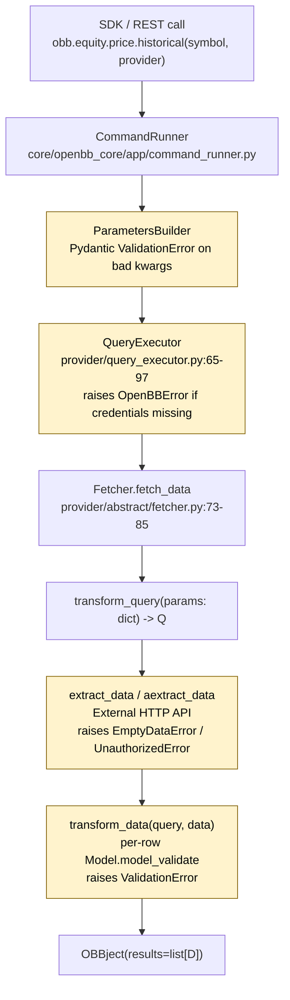
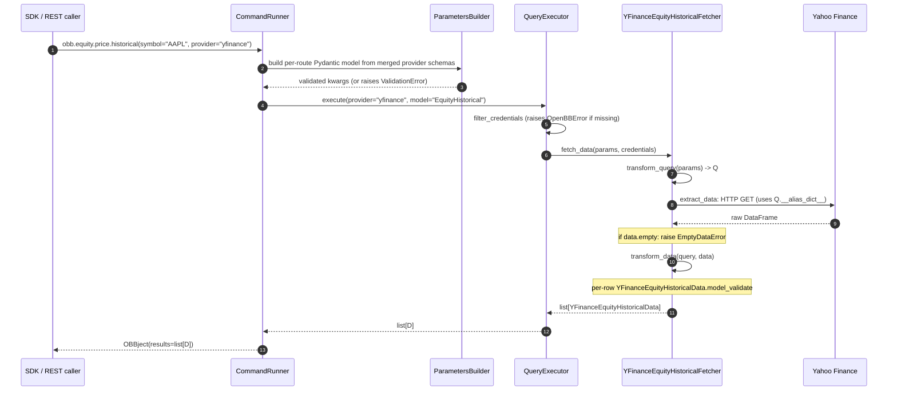
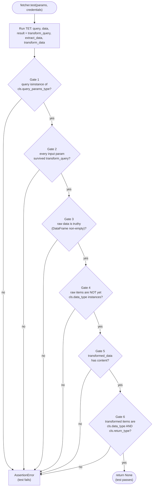
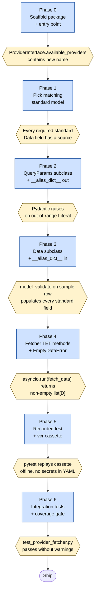

# OpenBB Platform Data Pipeline Specification

## 1. Overview and Purpose

This document describes how the OpenBB Platform moves an SDK or REST call into validated, typed data from an external API. It serves two readers: someone diagnosing whether data is loading correctly, and someone building a new provider. The first part is an architectural reference of the layers; the second is a step-by-step replication recipe.

Every concrete example uses `yfinance equity_historical`, that is `obb.equity.price.historical(symbol="AAPL", provider="yfinance")`. The pipeline is summarized as the following layered call graph:

```text
SDK / REST call
  -> CommandRunner
  -> ParametersBuilder (Pydantic validation)
  -> Query / QueryExecutor (credential check)
  -> Provider Fetcher (transform_query -> extract_data -> transform_data)
  -> OBBject(results=[...])
```



Each arrow is a contract enforced by either Pydantic, a `Fetcher` classmethod, or an `assert` in `Fetcher.test()`. Highlighted nodes are the four points where data can be rejected. The remainder of this document anchors each contract to a file and line range, then shows how to preserve them when adding a new provider.

## 2. End-to-End Request Flow

The call `obb.equity.price.historical(symbol="AAPL", provider="yfinance")` traverses four layers before any HTTP traffic.

The entry layer is `CommandRunner` in `openbb_platform/core/openbb_core/app/command_runner.py`. Together with `ParametersBuilder` it constructs a per-route Pydantic model that `ProviderInterface` has generated from the union of all provider query schemas for `EquityHistorical`. Invalid kwargs (wrong type, unsupported provider, missing required field) raise a Pydantic `ValidationError` here, before any provider code runs.

The validated call is dispatched to `QueryExecutor.execute` at `openbb_platform/core/openbb_core/provider/query_executor.py` lines 65-97. It resolves the provider from the registry, looks up the fetcher class, and runs `QueryExecutor.filter_credentials` at lines 36-63. That static method walks each declared credential; if a required one is missing or empty it raises `OpenBBError` at lines 52-59 with a message pointing the user at the provider website. `yfinance` declares no credentials, but the same code path enforces API keys for `fmp`, `intrinio`, and others.

Once credentials are filtered, the executor calls `fetcher.fetch_data(params, filtered_credentials, **kwargs)`. That classmethod is defined at `openbb_platform/core/openbb_core/provider/abstract/fetcher.py` lines 73-85 and is the orchestrator of the Transform-Extract-Transform pipeline:

```python
@classmethod
async def fetch_data(cls, params, credentials=None, **kwargs):
    query = cls.transform_query(params=params)
    data = await maybe_coroutine(
        cls.extract_data, query=query, credentials=credentials, **kwargs
    )
    return cls.transform_data(query=query, data=data, **kwargs)
```

The return value is a list of `Data` subclass instances (here, `list[YFinanceEquityHistoricalData]`), which `CommandRunner` wraps in an `OBBject` and returns. Every input/output boundary above is Pydantic-enforced; the next section walks through each enforcement point.



## 3. Validation Layers

The validation surface is two parallel inheritance chains — one inbound (`QueryParams`) and one outbound (`Data`) — meeting at the provider's concrete classes. Standard models in the middle define the route contract; provider classes add backend-specific knobs and aliases.

```mermaid
classDiagram
    direction LR
    class QueryParams {
        +__alias_dict__
        +__json_schema_extra__
        +model_config: extra=allow
        +model_dump: applies outbound aliases
    }
    class EquityHistoricalQueryParams {
        +symbol: str
        +start_date: date | None
        +end_date: date | None
        +to_upper validator (mode=before)
    }
    class YFinanceEquityHistoricalQueryParams {
        +interval: Literal[13 choices]
        +extended_hours: bool
        +include_actions: bool
        +adjustment: Literal[2 choices]
        +_period, _ignore_tz, ...: PrivateAttr
    }
    QueryParams <|-- EquityHistoricalQueryParams
    EquityHistoricalQueryParams <|-- YFinanceEquityHistoricalQueryParams

    class Data {
        +__alias_dict__
        +model_config: extra=allow, strict=False
        +AliasGenerator: to_camel / to_snake
        +ForceInt: BeforeValidator(check_int)
        +_use_alias: model_validator(mode=before)
    }
    class EquityHistoricalData {
        +date: date | datetime
        +open, high, low, close: float
        +volume, vwap: optional
        +date_validate (dateutil.parser)
    }
    class YFinanceEquityHistoricalData {
        +__alias_dict__: {split_ratio:stock_splits, dividend:dividends}
        +split_ratio: float | None
        +dividend: float | None
    }
    Data <|-- EquityHistoricalData
    EquityHistoricalData <|-- YFinanceEquityHistoricalData
```

### 3.1 QueryParams base class

File: `openbb_platform/core/openbb_core/provider/abstract/query_params.py` lines 8-72.

`QueryParams` is the Pydantic base class for everything that flows into a provider. Three features matter.

First, `__alias_dict__` (line 54) maps OpenBB-standard field names to the names the provider's HTTP API expects. The mapping is applied on outbound serialization only: the `model_dump` override at lines 63-71 swaps each key for its alias before returning, so `start_date` can be sent as `from` without consuming code knowing the difference.

Second, `__json_schema_extra__` (line 55, documented at lines 17-40) is merged across providers by `ProviderInterface` when the unified per-route model is generated. The docstring shows an FMP-Intrinio example: each provider attaches metadata under its own key, so `multiple_items_allowed` can differ per provider without colliding.

Third, `model_config = ConfigDict(extra="allow", populate_by_name=True)` at line 61 preserves unknown inbound fields rather than rejecting them. This is the seam that lets provider-specific extras flow through the same plumbing.

### 3.2 Standard model contracts

File: `openbb_platform/core/openbb_core/provider/standard_models/equity_historical.py`.

Each route has a standard model file in `provider/standard_models/`. It declares two classes: the query contract (`EquityHistoricalQueryParams`) and the data contract (`EquityHistoricalData`). Every provider that serves that route subclasses both. The shared contract is what makes a single SDK call usable against many backends.

The query contract uppercases its symbol on the way in:

```python
@field_validator("symbol", mode="before", check_fields=False)
@classmethod
def to_upper(cls, v: str) -> str:
    """Convert field to uppercase."""
    return v.upper()
```

Lines 30-34. `mode="before"` runs it ahead of type coercion; `check_fields=False` lets it bind to subclasses that may or may not redeclare `symbol`.

The data contract parses dates loosely:

```python
@field_validator("date", mode="before", check_fields=False)
@classmethod
def date_validate(cls, v):
    """Return formatted datetime."""
    from dateutil import parser
    if ":" in str(v):
        return parser.isoparse(str(v))
    return parser.parse(str(v)).date()
```

Lines 52-61. A bare date string yields a `date`; a timestamp with a colon yields a `datetime`. Both forms satisfy the field annotation `dateType | datetime` at line 40, which is why providers can hand back either intraday or daily bars without changing the model.

The required fields on `EquityHistoricalData` are `date`, `open`, `high`, `low`, `close`, with optional `volume` and `vwap`. Every provider on this route must populate these; anything else is provider-specific and rides on `extra="allow"`.

### 3.3 Data base class and alias resolution

File: `openbb_platform/core/openbb_core/provider/abstract/data.py`.

`Data` is the symmetric base for everything flowing out of a provider. Lines 15-23 declare a coercing `ForceInt` annotated type wrapping `BeforeValidator(check_int)`; non-castable values raise `TypeError`. Row models use it to coerce string integer responses.

The model config at lines 77-85 is the load-bearing piece:

```python
model_config = ConfigDict(
    extra="allow",
    populate_by_name=True,
    strict=False,
    alias_generator=AliasGenerator(
        validation_alias=alias_generators.to_camel,
        serialization_alias=alias_generators.to_snake,
    ),
)
```

`validation_alias=to_camel` is why a provider can return `marketCap` and Pydantic routes it into `market_cap`. `serialization_alias=to_snake` is the inverse on dump. `extra="allow"` keeps undeclared fields. `strict=False` allows lossy coercion (string-to-float) for providers that return inconsistent types.

The `_use_alias` model validator at lines 87-96 closes the last gap:

```python
@model_validator(mode="before")
@classmethod
def _use_alias(cls, values):
    """Use alias for error locs."""
    aliases = {orig: alias for alias, orig in cls.__alias_dict__.items()}
    if aliases and isinstance(values, dict):
        return {aliases.get(k, k): v for k, v in values.items()}
    return values
```

It inverts the per-class `__alias_dict__` and rewrites incoming keys to the standard field name BEFORE validation. The yfinance example below shows why: yfinance's `stock_splits` column must end up in the standard field `split_ratio`, and this validator does the rewrite per row.

### 3.4 Provider-specific extensions

File: `openbb_platform/providers/yfinance/openbb_yfinance/models/equity_historical.py`.

`YFinanceEquityHistoricalQueryParams` extends `EquityHistoricalQueryParams` and adds yfinance-specific knobs. The `interval` field at lines 50-67 is a `Literal[...]` of the thirteen interval strings yfinance accepts; the literal itself is the validation, with non-matching values raising `pydantic.ValidationError` at instantiation.

The class also adds `extended_hours: bool`, `include_actions: bool`, and `adjustment: Literal["splits_only", "splits_and_dividends"]`, all with defaults. These provider-only fields ride into the unified SDK signature via `ProviderInterface` merging but never appear in requests to a different backend.

Lines 81-87 declare seven `PrivateAttr` fields (`_ignore_tz`, `_progress`, `_keepna`, `_period`, `_rounding`, `_repair`, `_group_by`). These are runtime knobs for `yfinance.download()` that must not surface in the JSON schema or SDK signature. `PrivateAttr` is the supported way to carry per-call state without polluting the public API.

`YFinanceEquityHistoricalData` extends `EquityHistoricalData` at lines 93-96 with its alias dict:

```python
__alias_dict__ = {
    "split_ratio": "stock_splits",
    "dividend": "dividends",
}
```

Combined with `_use_alias` from 3.3, a row from yfinance with keys `stock_splits` and `dividends` is rewritten to `split_ratio` and `dividend` before validation. The class declares both as optional floats since they extend the standard contract.

### 3.5 Error taxonomy

File: `openbb_platform/core/openbb_core/provider/utils/errors.py`.

The pipeline raises three error types. `EmptyDataError` at lines 6-14 carries the default message `"No results found. Try adjusting the query parameters."` Providers raise it when an API returns 200 with no rows, so callers can distinguish empty-but-successful from a hard failure.

`UnauthorizedError` at lines 17-37 templates the provider name into the message. Lines 29-35 substitute the `<provider name>` placeholders when a `provider_name` argument is supplied. Providers raise this for 401 and 403 responses.

The third error is `pydantic.ValidationError`, raised automatically by `model_validate` when a row is missing a required field, fails a `Literal` check, or cannot be coerced. Because every provider's `transform_data` ends in per-row `model_validate`, this is where bad data surfaces.

For the worked example, the empty-data check is at `openbb_platform/providers/yfinance/openbb_yfinance/models/equity_historical.py` lines 164-165:

```python
if data.empty:
    raise EmptyDataError()
```

That is the only error path in the yfinance fetcher; everything else surfaces as `ValidationError` from `model_validate`.

## 4. The Fetcher TET Pipeline

File: `openbb_platform/core/openbb_core/provider/abstract/fetcher.py`.

The pipeline is named for the three data-shape transitions: a raw `dict` becomes a typed query, a typed query becomes a raw response, a raw response becomes a list of validated `Data` instances.

```mermaid
flowchart LR
    A["params: dict[str, Any]<br/>{symbol: 'AAPL', interval: '1d',<br/>start_date: ..., end_date: ...}"]
    B["transform_query<br/>fetcher.py:42-45<br/>yfinance:117-131"]
    C["Q: YFinanceEquityHistoricalQueryParams<br/>typed, defaults filled,<br/>Literals validated"]
    D["extract_data / aextract_data<br/>fetcher.py:47-54<br/>yfinance:133-167"]
    E["raw: pandas.DataFrame<br/>(or list[dict] for JSON APIs)<br/>EmptyDataError on empty"]
    F["transform_data<br/>fetcher.py:55-58<br/>yfinance:169-193"]
    G["list[YFinanceEquityHistoricalData]<br/>each row through Model.model_validate<br/>ValidationError on bad row"]

    A --> B --> C --> D --> E --> F --> G

    classDef typed fill:#d4edda,stroke:#155724,color:#000
    classDef raw fill:#f8d7da,stroke:#721c24,color:#000
    class C,G typed
    class A,E raw
```



Green nodes are typed and validated; red nodes are untyped. The pipeline's job is to move from red to green in two steps, with the boundary in the middle being where the external API speaks.

Every concrete provider implements `Fetcher[Q, R]` where `Q` is its `QueryParams` subclass and `R` is typically `list[D]`. The class declares three required staticmethods.

`transform_query(params: dict) -> Q` at lines 42-45 is the input validation gate. It accepts a raw dict and returns a typed query object; the default raises `NotImplementedError`. Implementations call `Q(**params)` (running every Pydantic validator from 3.1, 3.2, 3.4) and may fill dynamic defaults. yfinance does both at lines 122-131, defaulting `start_date` to `now - relativedelta(years=1)` and `end_date` to `now`.

`extract_data` or `aextract_data` at lines 47-54 is the external-API stage. Either form works; `__init_subclass__` at lines 60-71 picks the async one when both are present and raises `NotImplementedError` at subclass-creation time if neither is implemented. The method takes the typed query plus credentials and returns the raw response in whatever shape the provider naturally produces. For yfinance that is `pandas.DataFrame`; for an HTTP JSON provider it is usually `list[dict]`.

`transform_data(query, data, **kwargs) -> R | AnnotatedResult[R]` at lines 55-58 is the output validation gate. It must return a list of validated `Data` subclass instances. This is where every invariant from section 3 is actually enforced, because this is where each row is fed through `model_validate`.

`fetch_data` at lines 73-85 stitches all three together and is the only entry point `QueryExecutor` calls.

The worked-example `transform_data` at `openbb_platform/providers/yfinance/openbb_yfinance/models/equity_historical.py` lines 169-193 shows the canonical shape:

```python
@staticmethod
def transform_data(query, data, **kwargs):
    if "capital_gains" in data.columns:
        data = (
            data.drop(columns=["capital_gains"])
            if query.include_actions is False
            else data
        )
    query_symbols = query.symbol.upper().split(",")
    if len(query_symbols) > 1:
        symbols = data.symbol.unique().tolist()
        for symbol in query_symbols:
            if symbol not in symbols:
                warn(f"Data for '{symbol}' was not found.")
    return [
        YFinanceEquityHistoricalData.model_validate(d)
        for d in data.to_dict("records")
    ]
```

Three things happen. First, a conditional drop of `capital_gains` enforces the `include_actions` flag at the column level. Second, a multi-symbol warn loop surfaces partial success without raising. Third, every row goes through `model_validate`, which runs the `_use_alias` rewrite (3.3), then `to_camel` validation aliasing (3.3), then `date_validate` (3.2), then every type check. Any failure raises `ValidationError`. The pipeline's correctness rests on this loop.

## 5. Testing Strategy

### 5.1 Recorded HTTP cassettes

Each provider has a test directory at `openbb_platform/providers/<provider>/tests/`. Cassettes live in `record/http/` or `record/curl/` under `test_<provider>_fetchers/`. For yfinance: `openbb_platform/providers/yfinance/tests/record/curl/test_yfinance_fetchers/test_y_finance_equity_historical_fetcher_curl.yaml`.

Cassettes are captured on first run with `--record-mode=once` and replayed offline thereafter. This is provided by `pytest-recording`, which wraps `vcrpy`.

### 5.2 The vcr_config fixture

The fixture at `openbb_platform/providers/yfinance/tests/test_yfinance_fetchers.py` lines 69-116 is module-scoped and controls what is and is not written to the cassette:

```python
@pytest.fixture(scope="module")
def vcr_config():
    return {
        "allow_playback_repeats": True,
        "match_on": ["method", "uri"],
        "filter_headers": [
            ("User-Agent", None),
            ("Cookie", "MOCK_COOKIE"),
            ("crumb", "MOCK_CRUMB"),
            ...
        ],
        "filter_query_parameters": [
            ("period1", "MOCK_PERIOD_1"),
            ("period2", "MOCK_PERIOD_2"),
            ("crumb", "MOCK_CRUMB"),
            ("date", "MOCK_DATE"),
            ...
        ],
        "before_record_response": [
            scrub_string("set-cookie", "MOCK_COOKIE"),
            scrub_string("<!doctype html>", "MOCK_RESPONSE"),
            ...
        ],
        "decode_compressed_response": True,
    }
```

`match_on: ["method", "uri"]` means replay matches on HTTP verb and URL only, so a re-run with a different User-Agent still matches. `filter_headers` and `filter_query_parameters` redact secrets at write time. `before_record_response` runs the `scrub_string` closure at lines 49-66, which replaces sensitive response bits (set-cookie, internal Yahoo HTML, x-envoy headers) with mock strings. No API key, cookie, or crumb should ever land in a committed cassette.

### 5.3 Fetcher.test - the six validation gates

`Fetcher.test()` at `openbb_platform/core/openbb_core/provider/abstract/fetcher.py` lines 115-233 is the test harness every fetcher inherits. It runs the full TET pipeline and asserts on six conditions:

| Gate | Lines | What it asserts |
| ---- | ----- | --------------- |
| Query type | 154-156 | `query` is instance of `cls.query_params_type` |
| Query values | 157-159 | every input param survived `transform_query` |
| Raw data non-empty | 162-165 | `data` is truthy / DataFrame not empty |
| Raw data NOT pre-transformed | 176-178, 183-185 | items in raw `data` are NOT yet `cls.data_type` |
| Transformed non-empty | 194, 211 | `transformed_data` has content |
| Transformed type | 215-233 | items ARE instances of `cls.data_type` AND `cls.return_type` |

The fourth gate is the subtle one. It asserts that `transform_data` actually did work; if `extract_data` already returned typed objects, line 177 catches the shortcut. This forces each TET stage to have a distinct shape.



### 5.4 The recorded test pattern

The minimal test for the worked example is at `openbb_platform/providers/yfinance/tests/test_yfinance_fetchers.py` lines 162-174:

```python
@pytest.mark.record_curl
def test_y_finance_equity_historical_fetcher(credentials=test_credentials):
    """Test YFinanceEquityHistoricalFetcher."""
    params = {
        "symbol": "AAPL",
        "start_date": date(2023, 1, 1),
        "end_date": date(2023, 1, 10),
        "interval": "1d",
    }
    fetcher = YFinanceEquityHistoricalFetcher()
    result = fetcher.test(params, credentials)
    assert result is None
```

`@pytest.mark.record_curl` tells pytest-recording to load the cassette from `record/curl/`. The `credentials=test_credentials` default pulls from `UserService().default_user_settings.credentials.model_dump(mode="json")` at line 44. The three-line body (build params, construct fetcher, call `fetcher.test`) is used by nearly every provider test. The final `assert result is None` is a tautology since `Fetcher.test()` returns nothing, but it documents intent.

### 5.5 Integration tests, scaffolding, and CI

Integration tests live one level up at `openbb_platform/extensions/<ext>/integration/test_<ext>_python.py` and `test_<ext>_api.py`. They use `@pytest.mark.integration` and `@pytest.mark.parametrize` to drive each router endpoint against every registered provider, asserting `isinstance(result, OBBject)` and `len(result.results) > 0`. For the worked example, see `openbb_platform/extensions/equity/integration/test_equity_python.py` and `test_equity_api.py`.

Auto-scaffolding is provided by `openbb_platform/providers/tests/utils/unit_tests_generator.py`, which emits test stubs from the registered provider's interface schemas. The coverage gate is `openbb_platform/providers/tests/test_provider_fetcher.py`, which asserts a corresponding test exists for every provider fetcher.

`pytest.ini` lines 3-5 declares two markers: `linux` (tests unstable on Windows) and `integration` (the platform integration marker). CI lives at `.github/workflows/test-unit-platform.yml` and runs `nox` sessions across Python 3.10-3.14 with `-m "not integration"`, so cassette tests run on every push and integration tests run on a separate schedule with real credentials.

## 6. Replication Recipe

Each phase has an explicit Gate. Do not proceed until the gate passes.



### Phase 0 - Scaffold the provider package

Create the package directory layout under `openbb_platform/providers/<newp>/`:

```text
openbb_platform/providers/<newp>/
  openbb_<newp>/
    __init__.py
    models/__init__.py
  pyproject.toml
  tests/
```

Register the entry point in `pyproject.toml`:

```toml
[project.entry-points."openbb_provider_extension"]
<newp> = "openbb_<newp>:<newp>_provider"
```

The string after `=` must point at a `Provider` instance importable from the top-level `__init__.py`. `RegistryLoader.from_extensions()` iterates this entry-point group at SDK import time.

Gate:

```bash
python -c "from openbb_core.app.provider_interface import ProviderInterface; print('<newp>' in ProviderInterface().available_providers)"
```

The command must print `True`.

### Phase 1 - Pick the matching standard model

Browse `openbb_platform/core/openbb_core/provider/standard_models/` for the closest existing model (here, `equity_historical.py`). Note the required fields on the `Data` subclass.

Gate: map each upstream API field to either a standard field, a provider-extra field, or an alias-dict entry. Confirm every required field on the standard `Data` subclass has a source.

### Phase 2 - Implement the QueryParams subclass

In `openbb_platform/providers/<newp>/openbb_<newp>/models/equity_historical.py`, subclass `EquityHistoricalQueryParams`. Add provider-specific fields with typed defaults; use `Literal[...]` for closed sets. Set `__alias_dict__` for outbound field-name differences, e.g. `{"start_date": "from", "end_date": "to"}`. Set `__json_schema_extra__` for cross-provider metadata, e.g. `{"symbol": {"multiple_items_allowed": True}}`.

Gate: instantiate the class with a sample dict in a REPL. Pass an out-of-range `Literal` and confirm Pydantic raises `ValidationError`.

### Phase 3 - Implement the Data subclass

Subclass `EquityHistoricalData`. Add extras with explicit types and defaults. Set `__alias_dict__` for inbound field-name differences, mirroring `{"split_ratio": "stock_splits", "dividend": "dividends"}`.

Gate: `YourData.model_validate(sample_raw_row)` succeeds in a REPL and the result has every standard field populated. If a standard field comes back `None`, the alias dict or upstream key name is wrong.

### Phase 4 - Implement the Fetcher

Declare `class YourFetcher(Fetcher[YourQueryParams, list[YourData]])` and implement the three TET methods:

- `transform_query`: fill defaults (mirror yfinance lines 122-131), then return `YourQueryParams(**params)`.
- `extract_data` or `aextract_data`: call the upstream API; raise `EmptyDataError()` from `openbb_core.provider.utils.errors` on empty response.
- `transform_data`: end with `[YourData.model_validate(d) for d in rows]` (yfinance line 191).

Gate: `asyncio.run(YourFetcher.fetch_data(params, credentials))` in a REPL returns a non-empty list of `YourData` instances.

### Phase 5 - Write the recorded test

Create `openbb_platform/providers/<newp>/tests/test_<newp>_fetchers.py`. Copy the module-scoped `vcr_config` fixture from the yfinance file, adjusting the header, query-param, and response-scrub lists for the upstream API's secret surfaces. Write the test in the same shape as `test_y_finance_equity_historical_fetcher` with `@pytest.mark.record_http` (or `record_curl` for `pycurl` transports).

Generate the cassette:

```bash
pytest openbb_platform/providers/<newp>/tests/test_<newp>_fetchers.py --record-mode=once
```

Inspect the YAML under `tests/record/http/test_<newp>_fetchers/`. Confirm no API keys, cookies, or PII are visible.

Gate: replay offline:

```bash
pytest openbb_platform/providers/<newp>/tests/test_<newp>_fetchers.py
```

It must pass with network disabled.

### Phase 6 - Integration parametrization and coverage

Add your provider to the relevant `@pytest.mark.parametrize` blocks in `openbb_platform/extensions/<ext>/integration/test_<ext>_python.py` and `test_<ext>_api.py`. Each block lists the providers for one route; add yours to every block whose route it implements.

Gate:

```bash
pytest openbb_platform/providers/tests/test_provider_fetcher.py
```

Must pass without warning of missing tests. This confirms `RegistryLoader` discovers your fetcher and that the test file is bound to it.

## 7. Verification Plan

To confirm this specification matches reality:

1. Line-anchor check. For every `file:lines` citation in sections 2-5, open the file and confirm the cited content. If lines have drifted, re-anchor against the named class, method, or field.
2. Test discovery. `pytest openbb_platform/providers/yfinance/tests/test_yfinance_fetchers.py --collect-only` must list `test_y_finance_equity_historical_fetcher`.
3. Cassette replay. `pytest openbb_platform/providers/yfinance/tests/test_yfinance_fetchers.py::test_y_finance_equity_historical_fetcher` passes offline.
4. Cross-provider sanity. Open `openbb_platform/providers/fmp/openbb_fmp/models/equity_historical.py` and confirm it follows the same TET-plus-`__alias_dict__` pattern.
5. Recipe dry-run. Read Phase 0-5 top to bottom; every gate command must be runnable verbatim with `<newp>` substituted.

## Appendix A - Skeleton template

Minimum scaffold for a new provider's `equity_historical.py`:

```python
"""<Newp> Equity Historical Price Model."""

from datetime import datetime
from typing import Any, Literal

from openbb_core.provider.abstract.fetcher import Fetcher
from openbb_core.provider.standard_models.equity_historical import (
    EquityHistoricalData,
    EquityHistoricalQueryParams,
)
from openbb_core.provider.utils.errors import EmptyDataError
from pydantic import Field


class NewpEquityHistoricalQueryParams(EquityHistoricalQueryParams):
    """<Newp> Equity Historical Price Query."""

    __alias_dict__ = {
        # TODO: map standard field name -> upstream API field name
        # "start_date": "from",
        # "end_date": "to",
    }
    __json_schema_extra__ = {
        # TODO: cross-provider metadata, e.g. multiple_items_allowed
    }

    interval: Literal["1d", "1W", "1M"] = Field(
        default="1d",
        description="The time interval of the data.",
    )


class NewpEquityHistoricalData(EquityHistoricalData):
    """<Newp> Equity Historical Price Data."""

    __alias_dict__ = {
        # TODO: map standard field name -> upstream raw key
    }
    # TODO: declare any provider-extra fields with explicit types


class NewpEquityHistoricalFetcher(
    Fetcher[
        NewpEquityHistoricalQueryParams,
        list[NewpEquityHistoricalData],
    ]
):
    """<Newp> equity historical fetcher."""

    @staticmethod
    def transform_query(params: dict[str, Any]) -> NewpEquityHistoricalQueryParams:
        # TODO: fill defaults (start_date, end_date)
        return NewpEquityHistoricalQueryParams(**params)

    @staticmethod
    async def aextract_data(
        query: NewpEquityHistoricalQueryParams,
        credentials: dict[str, str] | None,
        **kwargs: Any,
    ) -> list[dict]:
        # TODO: call the upstream API and return raw rows
        rows: list[dict] = []
        if not rows:
            raise EmptyDataError()
        return rows

    @staticmethod
    def transform_data(
        query: NewpEquityHistoricalQueryParams,
        data: list[dict],
        **kwargs: Any,
    ) -> list[NewpEquityHistoricalData]:
        return [NewpEquityHistoricalData.model_validate(d) for d in data]
```

## Appendix B - Common pitfalls

- Forgetting `__alias_dict__` when upstream field names differ. With `extra="allow"`, Pydantic silently parks the unrecognized key on `model_extra` and the standard field stays `None`. Read the raw row and confirm every standard field has a source.
- Date parsing edge cases. Stick with the standard model's `date_validate` or `dateutil.parser.parse`. Do not write a custom strptime unless the upstream format is genuinely fixed and non-standard.
- Returning dicts instead of `Data` instances from `transform_data`. `Fetcher.test()` fails at the transformed-type gate (lines 215-233 of `openbb_platform/core/openbb_core/provider/abstract/fetcher.py`).
- Forgetting `EmptyDataError` on empty extract. The pipeline returns an empty list instead of surfacing the failure; downstream callers see `len(result.results) == 0` with no explanation.
- Missing `[project.entry-points."openbb_provider_extension"]` in `pyproject.toml`. `RegistryLoader.from_extensions()` discovers providers only through this entry-point group; without it, the provider is unreachable.
- Not running `--record-mode=once` first. Without a cassette, the test fails with `CannotOverwriteExistingCassetteException`. Record once, commit the YAML, then run normal pytest.
- Committing a cassette with unfiltered API keys. After the first record run, grep the YAML for known secret prefixes and confirm `filter_headers`, `filter_query_parameters`, and `before_record_response` covered every leakage surface. If a key leaked, rotate it, expand the fixture, and re-record.
