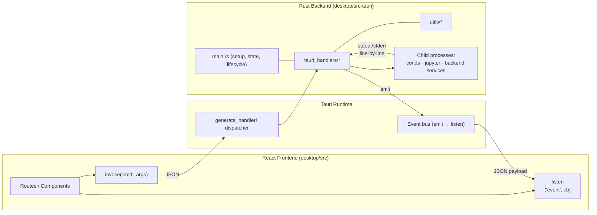
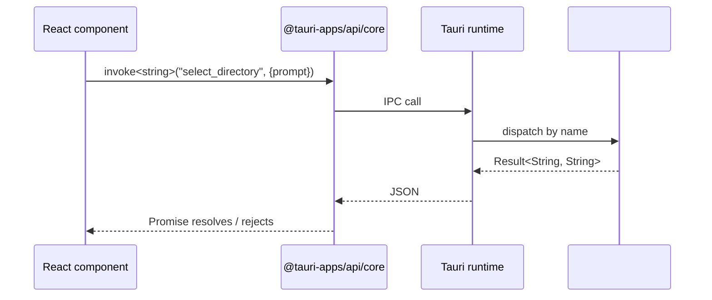
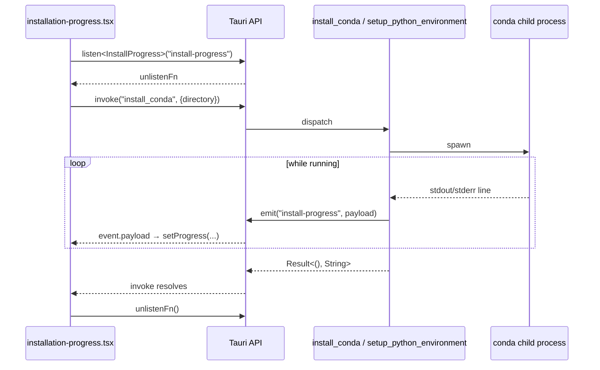
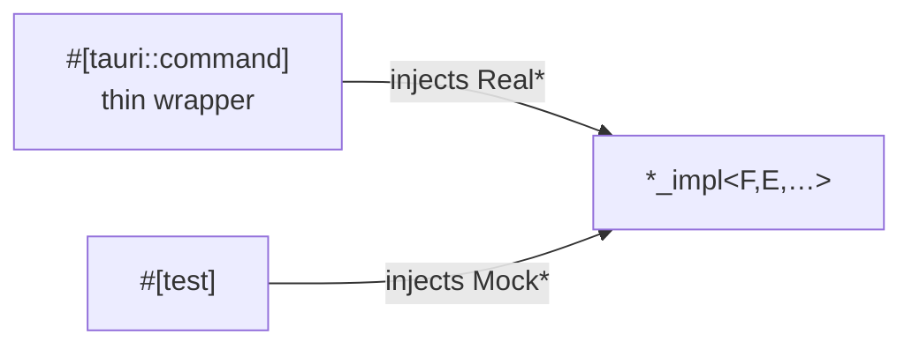

# Tauri ↔ TypeScript IPC — Reference Manual

A catalog-style deep dive into how the Rust (Tauri 2) backend communicates
with the React/TypeScript frontend in OpenBBPort.

This document is a **reference**, not a tutorial. It enumerates every
`#[tauri::command]`, every event emitted from Rust, every frontend
listener, the type-bridge conventions, and the plugins / capabilities
that govern the surface. Use it to look things up, not to learn IPC
from scratch.

> Scope: the desktop app under `desktop/`. There is no mobile or web
> embedding.

---

## 1. Overview

| Layer | Technology | Version |
|---|---|---|
| Shell | Tauri | 2.10.3 |
| Rust edition / toolchain | 2024 / Rust 1.90 | — |
| Frontend framework | React | 18.3.1 |
| Build tool | Vite | 7 |
| Router | TanStack React Router | 1.131 |
| Validation | Zod (UI inputs only) | — |
| UI kit | `@openbb/ui-pro` | — |

The Rust side exposes **56 commands** (counted from
`tauri::generate_handler![…]` in `desktop/src-tauri/src/main.rs`)
organized into six handler modules plus a set of commands defined in
`main.rs` itself. The frontend invokes them via `@tauri-apps/api/core`'s
`invoke()` and listens to event streams via `@tauri-apps/api/event`'s
`listen()`. There is **no codegen**: Rust structs derive
`Serialize`/`Deserialize`, and matching TypeScript `interface`s are
hand-maintained inline in route files.



---

## 2. Repository Layout

### Rust (`desktop/src-tauri/`)

```
src-tauri/
├── src/
│   ├── main.rs                       # Tauri app setup, plugin config,
│   │                                 # state injection, generate_handler!,
│   │                                 # 9 commands (process monitoring,
│   │                                 # lifecycle, cert)
│   ├── uninstall.rs                  # Uninstall flow (emits uninstall_progress)
│   ├── tauri_handlers/
│   │   ├── mod.rs                    # Module re-exports
│   │   ├── startup.rs                # 6 commands — install / configure
│   │   ├── environments.rs           # 12 commands — conda envs & extensions
│   │   ├── jupyter.rs                # 7 commands — Jupyter lifecycle
│   │   ├── backends.rs               # 7 commands — backend services
│   │   ├── credentials.rs            # 3 commands — API credentials
│   │   └── helpers.rs                # 13 commands — fs / dialogs / dirs
│   └── utils/
│       ├── mod.rs
│       ├── process_monitor.rs        # Log-history store + process-output
│       │                             # emission helper
│       ├── command_sanitizer.rs      # Input validation
│       ├── certs.rs                  # Self-signed cert generation
│       ├── app_termination.rs        # macOS termination hook
│       └── autostart/                # Per-OS autostart (macos/windows/linux)
├── Cargo.toml
├── tauri.conf.json                   # Base config
├── tauri.linux.conf.json             # Linux overrides
├── tauri.macos.conf.json             # macOS overrides
├── tauri.windows.conf.json           # Windows overrides
└── capabilities/
    ├── default.json
    └── desktop.json                  # Per-OS capability bundle
```

### Frontend (`desktop/src/`)

```
src/
├── main.tsx                          # React + router bootstrap
├── routes/                           # TanStack file-based routes
│   ├── __root.tsx
│   ├── index.tsx                     # Listens: installation-status,
│   │                                 # installation-directory
│   ├── setup.tsx                     # invoke: select_directory,
│   │                                 # check_directory_exists, install_to_directory…
│   ├── installation-progress.tsx     # Listens: install-progress
│   ├── environments.tsx              # Hybrid: env CRUD + process-output stream
│   ├── jupyter-logs.tsx              # Process monitoring view
│   ├── backends.tsx                  # Backend-service CRUD + process-output stream
│   ├── backend-logs.tsx              # Backend log viewer
│   ├── api-keys.tsx                  # credentials commands
│   └── uninstall.tsx                 # Listens: uninstall_progress
└── components/
    ├── JupyterLogsPage.tsx           # Listens: process-output
    ├── BackendLogsPage.tsx           # Listens: process-output
    ├── InstallComponents.tsx
    └── …
```

Platform-specific Tauri config is split into three sibling files
(`tauri.{linux,macos,windows}.conf.json`) that Tauri merges over the
base `tauri.conf.json` at build time.

---

## 3. IPC Mechanics

### 3.1 Request / response — `invoke`

Convention:

- All commands return `Result<T, String>` (a few `fn`-only commands
  return `T` directly — see catalog below).
- On the wire, `Ok(T)` resolves the promise with `T`, `Err(String)`
  rejects with that string.
- Parameters are sent as a JSON object. **Tauri converts snake_case
  Rust parameter names to camelCase on the JS side automatically** —
  except where a param name is already mixed-case (e.g.
  `userDataDirectory` is declared in Rust as-is and called as-is in TS).

```ts
// desktop/src/routes/setup.tsx
import { invoke } from "@tauri-apps/api/core";

const homeDir = await invoke<string>("get_home_directory");

const exists = await invoke<boolean>("check_directory_exists", {
  path: data.installDir.trim(),
});

await invoke("install_to_directory", {
  directory: data.installDir,
  userDataDirectory: data.userDataDir, // matches Rust param name verbatim
});
```



### 3.2 Events — `emit` → `listen`

Convention:

- Rust emits with `app_handle.emit("event-name", payload)` (or
  `window.emit(...)` when called inside a `Window` context, e.g.
  uninstall).
- Frontend subscribes with `listen<P>("event-name", cb)` which returns
  `Promise<UnlistenFn>`.
- Cleanup pattern in route effects:

```ts
useEffect(() => {
  let unlisten: (() => void) | undefined;
  listen<Payload>("event-name", (e) => { /* … */ })
    .then((fn) => { unlisten = fn; });
  return () => { unlisten?.(); };
}, []);
```

### 3.3 Hybrid: invoke kicks off, events stream progress

The installation, jupyter-start, and backend-service flows all follow
this shape:



---

## 4. Command Catalog

Each table lists the commands a module registers. Column meanings:

- **Command** — name as passed to `invoke()`.
- **Async?** — `true` if Rust signature is `async fn`.
- **Params** — Rust parameter names. Pass via the JS args object using
  the exact name shown (Tauri's snake/camel mapping applies to plain
  snake_case names; mixed-case names are kept verbatim).
- **Returns** — TS-equivalent type the promise resolves with.
- **Emits** — events the command may emit (empty = pure request/response).
- **Primary TS callers** — representative paths under `desktop/src`.

### 4.1 `startup.rs` — install & configure (6)

| Command | Async? | Params | Returns | Emits | Primary TS callers |
|---|---|---|---|---|---|
| `get_installation_status` | ✓ | — | `{ phase, isDownloading, isInstalling, isConfiguring, isComplete, message }` | — | `installation-progress.tsx`, `index.tsx` |
| `install_to_directory` | ✓ | `directory`, `userDataDirectory` | `void` | `install-progress`, `installation-directory` | `setup.tsx` |
| `install_conda` | ✓ | `directory` | `void` | `install-progress` | `installation-progress.tsx` |
| `setup_python_environment` | ✓ | `directory`, `userDataDirectory` | `void` | `install-progress` | `installation-progress.tsx` |
| `abort_installation` | ✓ | — | `void` | — | `installation-progress.tsx` |
| `create_default_backend_services` | — | — | `void` | — | called from Rust setup |

### 4.2 `environments.rs` — conda envs & extensions (12)

| Command | Async? | Params | Returns | Emits | Primary TS callers |
|---|---|---|---|---|---|
| `create_environment` | ✓ | `name`, `python_version` | `{ name, path, … }` | `process-output` | `environments.tsx` |
| `create_environment_from_requirements` | ✓ | `name`, `file_path` | `{ … }` | `process-output` | `environments.tsx` |
| `list_conda_environments` | ✓ | `directory?` | `CondaEnvironment[]` | — | `environments.tsx`, `setup.tsx` |
| `select_requirements_file` | ✓ | — | `string` (path) | — | `environments.tsx` |
| `get_environment_extensions` | ✓ | `name` | `{ installed, available, … }` | — | `environments.tsx` |
| `install_extensions` | ✓ | `environment`, `extensions` | `void` | `process-output` | `environments.tsx`, `AddExtensionSelector.tsx` |
| `update_extension` | ✓ | `package`, `environment` | `void` | `process-output` | `environments.tsx` |
| `remove_extension` | ✓ | `package`, `environment` | `void` | `process-output` | `environments.tsx` |
| `update_environment` | ✓ | `environment`, `directory` | `boolean` | `process-output` | `environments.tsx` |
| `remove_environment` | ✓ | `name` | `boolean` | — | `environments.tsx` |
| `execute_in_environment` | ✓ | `command`, `environment` | `void` | `process-output` | `environments.tsx` |
| `update_installation_error` | ✓ | `error` | `void` | — | `installation-progress.tsx` |

### 4.3 `jupyter.rs` — Jupyter server lifecycle (7)

| Command | Async? | Params | Returns | Emits | Primary TS callers |
|---|---|---|---|---|---|
| `start_jupyter_server` | ✓ | `environment`, `directory`, `working` | `{ url, already_running, status }` | `process-output`, `jupyter-status-update` | `environments.tsx` |
| `stop_jupyter_server` | ✓ | `environment` | `void` | `process-output`, `jupyter-status-update` | `environments.tsx` |
| `stop_all_jupyter_servers` | ✓ | — | `void` | `jupyter-status-update` | quit flow |
| `check_jupyter_server` | ✓ | `environment` | `{ running, url, … }` | — | `environments.tsx` |
| `list_jupyter_servers` | ✓ | — | `{ [env]: { url, pid, … } }` | — | `environments.tsx` |
| `update_jupyter_status` | ✓ | `environment` | `{ … }` | `jupyter-status-update` | `environments.tsx` |
| `open_jupyter_logs_window` | ✓ | `id` | `void` | — | `environments.tsx` |

The `app_handle: AppHandle<R>` parameter on the four commands that
need it is **not** passed from JS — Tauri injects it.

### 4.4 `backends.rs` — backend services (7)

| Command | Async? | Params | Returns | Emits | Primary TS callers |
|---|---|---|---|---|---|
| `list_backend_services` | — | — | `BackendService[]` | — | `backends.tsx` |
| `create_backend_service` | — | `backend: BackendService` | `BackendService` | — | `backends.tsx` |
| `update_backend_service` | ✓ | `backend: BackendService` | `BackendService` | — | `backends.tsx` |
| `delete_backend_service` | ✓ | `id` | `void` | — | `backends.tsx` |
| `start_backend_service` | ✓ | `id` | `void` | `process-output` | `backends.tsx` |
| `stop_backend_service` | ✓ | `id` | `void` | `process-output` | `backends.tsx` |
| `open_backend_logs_window` | ✓ | `id` | `void` | — | `backends.tsx` |

### 4.5 `credentials.rs` — API credentials (3)

| Command | Async? | Params | Returns | Emits | Primary TS callers |
|---|---|---|---|---|---|
| `get_user_credentials` | ✓ | — | `Record<string, unknown>` | — | `api-keys.tsx` |
| `update_user_credentials` | ✓ | `credentials` | `void` | — | `api-keys.tsx` |
| `open_credentials_file` | ✓ | `fileName` | `void` | — | `api-keys.tsx` |

### 4.6 `helpers.rs` — fs / dialogs / dirs / theme (13)

| Command | Async? | Params | Returns | Primary TS callers |
|---|---|---|---|---|
| `check_file_exists` | — | `path` | `boolean` | many |
| `check_directory_exists` | — | `path` | `boolean` | `setup.tsx`, `environments.tsx` |
| `select_directory` | — | `prompt` | `string` | `setup.tsx`, `backends.tsx` |
| `select_file` | — | — | `string` | `setup.tsx` |
| `get_home_directory` | — | — | `string` | `setup.tsx` |
| `get_installation_directory` | — | — | `string` | many |
| `get_userdata_directory` | — | — | `string` | many |
| `get_settings_directory` | — | — | `string` | `api-keys.tsx` |
| `save_working_directory` | — | `path` | `boolean` | `environments.tsx` |
| `get_working_directory` | — | `default_dir` | `string` | `environments.tsx` |
| `toggle_theme` | ✓ | `theme` | `boolean` | theme toggle UI |
| `update_openbb_settings` | ✓ | `conda_dir`, `environment` | `void` | called from Rust setup |
| `open_url_in_window` | ✓ | `url`, `title` | `void` | many |

None of these emit events.

### 4.7 `main.rs` — process monitoring & lifecycle (9)

| Command | Async? | Params | Returns | Emits | Primary TS callers |
|---|---|---|---|---|---|
| `register_process_monitoring` | — | `process_id` (+ `State<ProcessLogState>`) | `boolean` | — | `JupyterLogsPage.tsx`, `BackendLogsPage.tsx` |
| `unregister_process_monitoring` | — | `process_id` | `boolean` | — | logs pages |
| `get_process_logs_history` | — | `process_id`, `count?` | `LogEntry[]` | — | logs pages |
| `clear_process_logs_history` | — | `process_id` | `boolean` | — | logs pages |
| `get_installation_state` | — | — | `InstallationState` | — | `index.tsx` |
| `navigate_to_page` | — | `page` | `void` | — | tray menu |
| `quit_application` | ✓ | — | `void` | (triggers cleanup) | tray menu |
| `uninstall_application` | ✓ | `remove_user_data`, `remove_settings` | `string?` | `uninstall_progress` | `uninstall.tsx` |
| `generate_self_signed_cert` | — | — | `{ cert, key, … }` | — | `backends.tsx` |

`State<…>`, `AppHandle`, and `Window` parameters are injected by Tauri
and not passed from JS.

---

## 5. Event Catalog

Every event name that appears in an `app_handle.emit(...)` /
`window.emit(...)` call somewhere under `desktop/src-tauri/src`.

| Event | Payload shape | Emitted by | Listened in |
|---|---|---|---|
| `install-progress` | `{ step: string, message: string, percent?: number, … }` | `tauri_handlers/startup.rs` (3 sites) | `installation-progress.tsx` |
| `installation-directory` | `string` (path) | `tauri_handlers/startup.rs` | `index.tsx` |
| `process-output` | `{ processId: string, output: string, timestamp?: number }` | `jupyter.rs`, `backends.rs`, `environments.rs` | `JupyterLogsPage.tsx`, `BackendLogsPage.tsx`, `environments.tsx`, `backends.tsx` |
| `jupyter-status-update` | `{ environment, status, url?, … }` | `jupyter.rs` | `environments.tsx`, `backends.tsx` |
| `uninstall_progress` | `string` (status line) | `uninstall.rs` (multiple sites) | `uninstall.tsx` |

### Listener-only events

The frontend also subscribes to `installation-status`
(`desktop/src/routes/index.tsx:15`) but **no Rust code currently emits
this name**. It appears in tests
(`desktop/src/tests/routes/index.test.tsx`) as a mocked event. Treat
the production listener as dormant.

---

## 6. Type Bridge

There is no codegen layer. Types are duplicated by convention:

- **Rust side** — shared structs derive `Serialize` /
  `Deserialize` and are used both inside Rust and on the wire. Examples:
  - `BackendService` (`tauri_handlers/backends.rs`) — `id`, `name`,
    `command`, `host?`, `port?`, `environment`, `status`, …
  - `CondaEnvironment` (`tauri_handlers/environments.rs`)
  - `LogEntry` (`utils/process_monitor.rs`)
  - `InstallationState` (`main.rs`)

- **TypeScript side** — matching `interface`s declared **inline** in
  the route file that owns the screen. For example, `BackendService`
  is declared in `desktop/src/routes/backends.tsx`, not exported from
  a shared types module.

- **UI-boundary validation** — Zod is used only at the form layer to
  validate user input *before* it crosses into `invoke()`. It does
  not validate Rust responses.

```ts
// desktop/src/routes/setup.tsx
const formSchema = z.object({
  installDir: z.string().min(1).refine(
    (v) => !/\s/.test(v),
    { message: "Path cannot contain spaces" },
  ),
});
```

### Drift risk

Adding a field to a Rust struct does not break TypeScript compilation;
the unknown field is simply present in the resolved object and ignored
by the `interface`. Removing or renaming a field on the Rust side
fails silently at runtime. There is no enforcement — reviewers should
grep both sides when changing a shared struct.

A future codegen step (e.g. `ts-rs`, `specta`, or wiring up the
already-installed `taurpc`) would close this gap. None is configured
today.

---

## 7. State & Lifecycle

### Rust state

| Mechanism | Location | Purpose |
|---|---|---|
| `Lazy<Mutex<InstallationState>>` (`INSTALLATION_STATE`) | `main.rs` | Cross-handler installation state |
| `Lazy<Mutex<HashMap<...>>>` (`ACTIVE_JUPYTER_SERVERS`) | `tauri_handlers/jupyter.rs` | Running Jupyter server registry |
| `RunningProcesses` (managed) | `main.rs` via `.manage(...)` | Currently-running backend processes |
| `ProcessLogState` (managed) | `main.rs` via `.manage(...)` | Ring-buffer of process log lines by `process_id` |

Managed state is injected into a command by adding a
`state: State<MyState>` parameter; Tauri resolves it at dispatch time
and the parameter is **not** passed from JS.

### Frontend state

- Local React `useState`/`useEffect` per route — no Redux/Zustand.
- TanStack Router search params for cross-page identifiers
  (`useSearch({ from: '/jupyter-logs' })`).
- `localStorage` for caches (e.g. `env-extensions-cache`,
  `environments-first-load-done`).

### Shutdown path

On `quit_application`, Rust runs `cleanup_all_processes(app_handle)`
which stops Jupyter servers and backend services with per-process
timeouts before letting the runtime exit. Each shutdown emits a
trailing `process-output` line so the log windows can show a clean
"shutdown complete" marker.

---

## 8. Plugins & Capabilities

### Rust plugins (`desktop/src-tauri/Cargo.toml`)

| Crate | Version | Used for |
|---|---|---|
| `tauri-plugin-log` | 2.8.0 | Log routing (file + console) |
| `tauri-plugin-shell` | 2 | Spawning child processes |
| `tauri-plugin-dialog` | 2 | Native confirm / open dialogs |
| `tauri-plugin-fs` | 2 | Filesystem operations |
| `tauri-plugin-persisted-scope` | 2 | Persisting fs scope across runs |
| `tauri-plugin-opener` | 2 | Opening URLs / paths in OS |
| `tauri-plugin-single-instance` | 2 (non-mobile only) | Prevent duplicate processes |
| `tauri-plugin-updater` | 2 (non-mobile only) | Auto-update |

No `tauri-plugin-app` crate — version info comes from the JS-side
plugin reading Tauri core APIs.

### Frontend plugins (`desktop/package.json`)

`@tauri-apps/plugin-{app, dialog, fs, http, log, opener, process,
updater, shell, window}` plus core `@tauri-apps/api` and the build
`@tauri-apps/cli`. `taurpc` is declared in `dependencies` but is not
imported anywhere in `desktop/src` — vestigial.

### Capabilities

Permissions are granted via `desktop/src-tauri/capabilities/*.json`.
The `tauri.conf.json` `app.security.capabilities` array is empty —
that is **not** a permission denial; Tauri auto-loads files in the
`capabilities/` directory.

- `default.json` — base permissions (core, dialog, opener, shell,
  fs, log).
- `desktop.json` — adds `shell:allow-execute`, `shell:allow-spawn`,
  `opener:allow-open-path` (with `path: "**"`), updater, etc.,
  scoped to `macOS`, `windows`, `linux`.

`csp` is set to `null` in `tauri.conf.json` — the app relies on
running its own bundled `dist/` and uses `window.eval` for
navigation in a couple of places (e.g. `navigate_to_page`).

---

## 9. Error Handling

### Rust convention

```rust
#[tauri::command]
async fn do_thing(arg: String) -> Result<Value, String> {
    inner(arg).await.map_err(|e| format!("Failed: {e}"))
}
```

Errors are always `String`. There is no error-type hierarchy on the
wire; the frontend receives a single rejection string and must parse
it if structure is needed.

### Frontend convention

```ts
try {
  const r = await invoke<T>("cmd", { … });
} catch (err) {
  const msg = extractStderr(err);   // pulls Stderr/Stdout portion
  if (!isFutureWarningOnly(msg)) {  // ignore Python FutureWarning
    setError(msg);
  }
}
```

Helpers `extractStderr` and `isFutureWarningOnly` live alongside the
caller (search `desktop/src/routes/environments.tsx` for the canonical
implementations). They exist because spawned-process errors arrive
embedded in long combined stdout/stderr strings, and many "errors"
from Python are merely deprecation warnings on stderr.

---

## 10. Testability

### Rust — trait-based DI

Implementation functions are generic over filesystem / env-system /
file-extension traits; the `#[tauri::command]` wrapper is a thin
adapter that injects production implementations.

```rust
#[cfg_attr(test, mockall::automock)]
pub trait FileSystem { /* … */ }

pub async fn toggle_theme_impl<F: FileSystem, E: EnvSystem, FE: FileExtTrait>(
    theme: String, fs: &F, env_sys: &E, file_ext: &FE,
) -> Result<bool, String> { /* … */ }

#[tauri::command]
pub async fn toggle_theme(theme: String) -> Result<bool, String> {
    toggle_theme_impl(theme, &RealFileSystem, &RealEnvSystem, &RealFileExtTrait).await
}
```

`mockall = "^0.14.0"` is in `Cargo.toml` and `automock` is applied via
`#[cfg_attr(test, mockall::automock)]` on the traits.



### Frontend — `vi.mock`

```ts
vi.mock('@tauri-apps/api/core', () => ({ invoke: vi.fn() }));
vi.mocked(invoke).mockImplementation((cmd) => {
  if (cmd === 'get_home_directory') return Promise.resolve('/mock/home');
  return Promise.reject(new Error(`Unhandled cmd: ${String(cmd)}`));
});
```

`@tauri-apps/api/event` can be mocked the same way when a route under
test subscribes to events.

---

## 11. Configuration

Base config: `desktop/src-tauri/tauri.conf.json`.

| Key | Value | Notes |
|---|---|---|
| `productName` | `"Open Data Platform by OpenBB"` | |
| `identifier` | `"co.openbb.platform"` | Bundle ID |
| `build.frontendDist` | `"../dist"` | Vite output |
| `build.devUrl` | `"http://localhost:1470"` | |
| `build.beforeDevCommand` | `"npm run dev"` | |
| `build.beforeBuildCommand` | `"npm run build"` | |
| `app.windows[0].visible` | `false` | Window stays hidden until install state is verified, then shown by Rust setup hook |
| `app.windows[0].titleBarStyle` | `"Transparent"` | |
| `app.windows[0].windowEffects.effects` | `["titlebar", "mica"]` | Windows acrylic / macOS vibrancy |
| `app.security.csp` | `null` | Permits `eval` for `navigate_to_page` |
| `app.security.capabilities` | `[]` | Permissions loaded from `capabilities/` dir instead |
| `bundle.createUpdaterArtifacts` | `true` | |
| `plugins.updater.endpoints` | GitHub `latest.json` | |

Per-OS overrides live in `tauri.{linux,macos,windows}.conf.json` and
are merged at build time.

---

## 12. Adding a New Command (Checklist)

1. **Implement** the logic as a generic `*_impl` function in the
   appropriate `tauri_handlers/*.rs` module, accepting trait deps
   (`FileSystem`, `EnvSystem`, …) by reference so tests can inject
   mocks.
2. **Wrap** with a `#[tauri::command]` thin adapter that injects the
   `Real*` implementations and forwards the call.
3. **Register** the wrapper name in the `tauri::generate_handler![…]`
   list inside `desktop/src-tauri/src/main.rs`. Forgetting this step
   results in a runtime "command not found" error, not a compile-time
   error.
4. **Emit events** (if streaming progress) via `app_handle.emit(...)`.
   Add the event name and payload shape to Section 5 of this document.
5. **Declare TS types** as an `interface` next to the calling
   component. Match Rust serde field names exactly (Tauri does not
   rename serde fields).
6. **Invoke** from React via `invoke<T>("name", { … })`. Use the same
   key names as the Rust parameter list (snake_case or as-declared).
7. **Validate** user-supplied inputs with Zod *before* `invoke()` if
   they cross the boundary unmodified.
8. **Update tests**: add a `mockall` test on the `*_impl` side and a
   `vi.mock('@tauri-apps/api/core')` test on the TS side.

---

## Appendix A — File index

Quick map of every file cited above.

| Path | Role |
|---|---|
| `desktop/src-tauri/src/main.rs` | Setup, state, handler registry, 9 commands |
| `desktop/src-tauri/src/uninstall.rs` | Uninstall flow + `uninstall_progress` |
| `desktop/src-tauri/src/tauri_handlers/startup.rs` | Install / configure commands |
| `desktop/src-tauri/src/tauri_handlers/environments.rs` | Env / extension commands |
| `desktop/src-tauri/src/tauri_handlers/jupyter.rs` | Jupyter lifecycle |
| `desktop/src-tauri/src/tauri_handlers/backends.rs` | Backend services |
| `desktop/src-tauri/src/tauri_handlers/credentials.rs` | API credentials |
| `desktop/src-tauri/src/tauri_handlers/helpers.rs` | fs / dialogs / dirs / theme |
| `desktop/src-tauri/src/utils/process_monitor.rs` | Log storage + emit helper |
| `desktop/src-tauri/tauri.conf.json` (+ per-OS) | Tauri config |
| `desktop/src-tauri/capabilities/{default,desktop}.json` | Permissions |
| `desktop/src-tauri/Cargo.toml` | Rust deps |
| `desktop/package.json` | JS deps |
| `desktop/src/routes/setup.tsx` | invoke + Zod entry flow |
| `desktop/src/routes/installation-progress.tsx` | `install-progress` listener |
| `desktop/src/routes/environments.tsx` | Hybrid invoke + event-stream |
| `desktop/src/routes/backends.tsx` | Backend CRUD + `process-output` |
| `desktop/src/routes/api-keys.tsx` | Credentials commands |
| `desktop/src/routes/uninstall.tsx` | `uninstall_progress` listener |
| `desktop/src/routes/index.tsx` | `installation-status` (dormant) / `installation-directory` listeners |
| `desktop/src/components/JupyterLogsPage.tsx` | `process-output` viewer |
| `desktop/src/components/BackendLogsPage.tsx` | `process-output` viewer |
