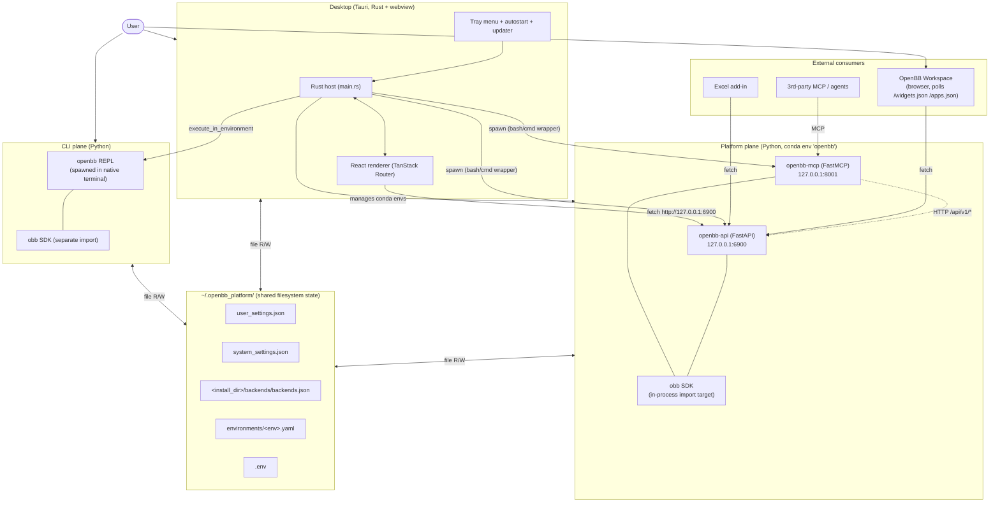

# Architecture Overview

Synthesis of the eleven Wave-2 feature docs. The OpenBBPort desktop product is
**three independently-runnable layers** glued together by a single on-disk
settings tree. The Tauri desktop is the only orchestrator: it installs the
Python runtime, it spawns the data plane as subprocesses, it streams their logs
back to the renderer. Neither the Python REST server nor the CLI know the
desktop exists.

## The three layers

### 1. Desktop (Tauri + React + TypeScript)

A Rust+webview app whose **only persistent job** is to make the Python plane
runnable on the user's machine: installer wizard, conda env CRUD, extension
install/update/remove, backend-service start/stop, log streaming, API-key
editor, tray + autostart, updater, uninstaller. It is the only layer with a
GUI. It owns no domain data — every piece of state it cares about lives in a
file on disk (`feature-installation.md`, `feature-environments.md`,
`feature-backend-services.md`, `feature-tray-and-autostart.md`,
`feature-uninstall.md`).

### 2. Platform (Python `openbb-api` REST + `openbb-mcp`)

Two FastAPI processes inside one conda env that expose the OBBject pipeline to
HTTP clients (`feature-platform-rest-api.md`). `openbb-api` (default port
`127.0.0.1:6900`) serves `/api/v1/...`, `/widgets.json`, `/apps.json`,
`/openapi.json` — consumed by OpenBB Workspace iframes, the desktop renderer's
direct `fetch()` calls, third-party MCP clients, and the embedded Excel
add-in. `openbb-mcp` (default port `127.0.0.1:8001`) wraps the **same**
FastAPI app via `FastMCP.from_fastapi(...)` for LLM tool consumption — the
two processes don't share memory and re-do all entry-point discovery
independently. Auth defaults to None; HTTP Basic and extension auth are
opt-in via env vars (`feature-platform-rest-api.md:222-242`). The server is
file-backed: it re-reads `~/.openbb_platform/user_settings.json` on **every
request** (`feature-platform-rest-api.md:179-184`, `feature-api-keys.md:84-89`).

### 3. CLI (Python `openbb` REPL)

A bash-style menu shell that wraps the **in-process** `obb` SDK
(`feature-cli-repl.md`). Spawned by the desktop via `execute_in_environment`
into a native terminal; thereafter unobserved. No HTTP, no IPC — the same
`CommandRunner` that powers the REST server runs in-process here. Reads
the same `user_settings.json` for credentials, writes a CLI-only overlay at
`~/.openbb_platform/.cli.env` and a history at `~/.openbb_platform/.cli.his`.
The TS port question is whether to ship a REPL at all; a Strategy-B REST-shim
is viable but a no-op v1 (keep spawning the Python CLI) is the cheapest path
(`feature-cli-repl.md:200-211`).

## System architecture

Three observations the diagram encodes:

1. **The desktop is the only thing that spawns Python.** Workspace, Excel, and
   third-party agents talk to the REST server directly over HTTP — they don't
   know or care that the desktop is what launched it.
2. **MCP → REST is an out-of-process call.** Every MCP tool invocation HTTP-GETs
   `127.0.0.1:6900`. If REST is stopped or its port has drifted (silent
   auto-increment, `feature-platform-rest-api.md:405-410`), every MCP tool
   returns 502. The desktop UI shows them as independent.
3. **`~/.openbb_platform/` is the rendezvous point.** Every layer reads it;
   every layer (except the CLI) writes parts of it. See
   `state-and-storage.md` for the precise read/write matrix.

## Lifecycle: fresh machine to first data call

Walk-through of a green-field install (cross-references the per-feature
sequence diagrams):

1. **Boot, no install detected.** `main.rs` calls `check_installation_on_startup`
   (`feature-installation.md:153-154`) which parses `system_settings.json` (not
   present) and verifies `<install_dir>/conda/{bin/conda|Scripts/conda.exe}`
   (not present). `InstallationState { is_installed: false }` is `tauri::manage`-d.
   Rust evals `localStorage.clear()` + `window.location.href = '/setup'`
   (`feature-tray-and-autostart.md:226-228`).
2. **Setup form.** User enters install + user-data paths. Zod blocks paths
   containing whitespace (load-bearing — conda activation scripts embed paths
   unquoted, `feature-installation.md:186`). `install_to_directory` writes
   permission-probe files, then the skeleton `user_settings.json` (`{credentials:
   {}, preferences:{data_directory}, defaults:{}}`) and `system_settings.json`
   (`{install_settings:{installation_directory, user_data_directory,
   installation_date}}`) — `feature-installation.md:128-131`.
3. **Conda install.** `install_conda` downloads Miniforge into
   `<TEMP>/openbb_installer/`, runs it into `<install_dir>/conda/`, writes
   `<install_dir>/conda/.condarc`. Progress streams via the `install-progress`
   event with phase markers (`download`, `install`, `config`, `complete`) —
   `feature-installation.md:53-60`.
4. **Python env + extensions.** `setup_python_environment` writes
   `~/.openbb_platform/environments/openbb.yaml`, runs `conda env create -f`,
   then the user picks the default extension set (`fred, bls, us-eia, nasdaq,
   fmp, econdb, cftc, congress-gov` + `openbb-platform-api` +
   `openbb-mcp-server`). `install_extensions` pip-installs them into the
   `openbb` env. `update_openbb_settings` spawns Python in the env to merge
   the dynamic per-provider credentials schema into the two JSON files
   (`feature-installation.md:80-90`).
5. **Seed default backends.** `create_default_backend_services` appends two
   entries to `<install_dir>/backends/backends.json`: `OpenBB API` on
   `127.0.0.1:6900` and `OpenBB MCP` on `127.0.0.1:8001`, both with
   `auto_start: false` (`feature-installation.md:135-136`,
   `feature-backend-services.md:158-176`).
6. **First boot from `/environments`.** `installation-progress.tsx` sets
   `localStorage["environments-first-load-done"] = "true"` and full-reloads to
   `/environments?directory=...&userDataDir=...`. The reload re-runs
   `check_installation_on_startup` — now `is_installed = true`
   (`feature-installation.md:155-156`).
7. **Start the REST server.** User opens `/backends`, clicks Start on `OpenBB
   API`. Rust writes `<TEMP>/backend_start_<id>.{sh,bat}` containing the conda
   activation prelude + the command, spawns it, opens stdout/stderr pipes,
   registers a `LogBuffer` under the key `backend-<uuid>`. Log reader threads
   tail the pipes, emit `process-output` per line, and a debounced URL scanner
   updates `backends.json` with the bound port and best URL when uvicorn says
   "Started server process [N]" (`feature-backend-services.md:67-110`,
   `feature-logs-streaming.md:48-69`).
8. **Cold start: 8-15 s in the dark.** uvicorn binds the socket only after
   eager `ProviderInterface()` walk, `app.openapi()`, and `get_widgets_json()`
   (`feature-platform-rest-api.md:332-353`). The desktop's spinner is the only
   signal; nothing reaches the port yet.
9. **First request.** Renderer (or Workspace iframe) GETs
   `/api/v1/equity/price/historical?symbol=AAPL&provider=yfinance`. Python
   re-reads `user_settings.json` to construct `UserSettings`, filters
   credentials by provider, runs the Fetcher T-E-T pipeline, returns an
   `OBBject` JSON (`feature-platform-rest-api.md:60-100`).

## Communication channels

The desktop layer is built on **three orthogonal transports**, and the port has
to pick replacements for each.

- **Tauri IPC** — in-app, synchronous-style command invocations (`invoke`) and
  fire-and-forget events (`emit`/`listen`). Used for every renderer↔Rust
  exchange: form submits, settings reads, process control, log streaming.
  Catalogued in `raw-deep-dives/ipc-bridge.md`. TS port replacement: Electron
  `ipcRenderer/ipcMain` or HTTP+WebSocket against a localhost agent.
- **HTTP REST** — out-of-app, between any consumer (Workspace, Excel, renderer,
  MCP, agents) and `openbb-api` / `openbb-mcp`. Unchanged in the port — these
  contracts belong to the Python plane.
- **Filesystem (cross-process)** — the rendezvous channel between
  desktop-Rust, Python REST, Python CLI, and (via uninstall) the OS shell.
  Every credential change, every env mutation, and every backend
  configuration round-trips through a JSON or YAML file. Cache invalidation
  is mtime + per-request re-read; there is no atomic-file-update contract
  (`feature-api-keys.md:222-230`, `feature-installation.md:206-211`).

## Major subsystems

The eleven Wave-2 features mapped onto the three layers:

### Desktop-layer features

- **`feature-installation.md`** — first-launch wizard; materializes Miniforge,
  the `openbb` conda env, `~/.openbb_platform/`, and the seed backends. Until
  this completes, `/` redirects to `/setup`.
- **`feature-environments.md`** — conda env CRUD: create, update, remove,
  import from `requirements.txt` / `pyproject.toml` / `environment.yml`. Owns
  `<env>.yaml` and the `localStorage["env-extensions-cache"]` mirror.
- **`feature-extensions.md`** — pip/conda glue for installing OpenBB extension
  packages into an env. Owns the `openbb` package's `--no-deps + openbb-build`
  special path. Shares `<env>.yaml` with environments.
- **`feature-jupyter.md`** — spawn `jupyter lab` inside a conda env via
  `conda run`, scrape the URL from stdout, open in a webview window, stop by
  port (not PID — `conda run` adds a wrapper layer).
- **`feature-backend-services.md`** — long-lived HTTP server lifecycle:
  start/stop/edit/delete; UVICORN→`--flag` translation for `openbb-api`;
  three-path kill convergence (port-kill + tracked-child + PID fallback);
  per-row log streaming. Owns `<install_dir>/backends/backends.json`.
- **`feature-logs-streaming.md`** — the **shared subprocess-output plumbing**
  every spawning feature uses: `process-output` event, `LogStorage` ring
  buffer (10k lines per process), dedicated logs windows. In-memory only.
- **`feature-api-keys.md`** — credentials editor; thin wrapper over the
  `credentials` block of `user_settings.json`. The Python server consumes this
  on every request without restart.
- **`feature-tray-and-autostart.md`** — tray menu, OS-specific autostart
  (osascript / `.lnk` / XDG `.desktop`), updater (signed GitHub releases),
  close-to-tray, graceful-shutdown cascade.
- **`feature-uninstall.md`** — 13-step inverse of installation, plus
  defensive legacy cleanup. Conditional removal of user data and settings;
  OS-specific post-mortem (`/tmp/.sh` on macOS, `.bat` on Windows).

### Platform-layer features

- **`feature-platform-rest-api.md`** — the `openbb-api` server: FastAPI app,
  per-provider Fetcher pipeline, `widgets.json` / `apps.json` generation,
  auth modes, MCP sidecar.

### CLI-layer features

- **`feature-cli-repl.md`** — `openbb` Python REPL: menu shell, argparse
  command translation, OBBject LIFO registry, `.openbb` routine record/replay.
  In-process SDK consumer; no IPC.

## Key invariants

Things the architecture depends on. The port must preserve each, or
consciously decide to break it.

1. **`~/.openbb_platform/system_settings.json` existence + `install_settings.installation_directory` parseable + `<install_dir>/conda/{bin/conda|Scripts/conda.exe}` extant = "installed".** The boot redirect, the tray Uninstall handler, every backend spawn, and every env operation use this triple as their truth (`feature-installation.md:138`,
   `feature-tray-and-autostart.md:87-92`).
2. **`process-output` is the multiplexed log channel.** Single Tauri event
   name, three slightly-different payload shapes per producer (jupyter,
   backends, environments). Every webview window receives every emit and
   filters client-side by `processId` (`feature-logs-streaming.md:80-94`).
3. **Conda env activation happens via a generated shell script.** Each spawn
   writes `<TEMP>/backend_start_<id>.sh` (or `.bat`) that sources
   `<conda>/etc/profile.d/conda.sh` and runs `conda activate <env>` before
   `exec`-ing the command. `child_process.spawn` cannot inherit a conda
   activation — the script is mandatory (`feature-backend-services.md:354-355`,
   `feature-environments.md:218-238`).
4. **`update_openbb_settings_impl` spawns Python inside the env to merge JSON.**
   The Rust handlers don't know the per-provider credential schema; only
   `ProviderInterface` does. Reimplementing the merge in Node loses the
   dynamic schema population — keep the Python-spawn or recreate the schema
   from a shared source (`feature-installation.md:174-176`).
5. **`UserSettings` is re-read on every REST request.** Even with auth off,
   the default of the hidden `__authenticated_user_settings` dep is
   `UserSettings()` whose `__init__` `json.load`s `user_settings.json`
   (`feature-platform-rest-api.md:179-184`). Writes via the API Keys UI take
   effect without restart, but a non-atomic write opens a transient-400
   race window (`feature-api-keys.md:224-228`).
6. **`backgroundThrottling: "disabled"` is load-bearing.** Tray-only operation
   relies on the renderer staying responsive while hidden. With the default 1
   Hz throttle, `installation-progress.tsx` / `environments.tsx` /
   `backends.tsx` polling goes tens of seconds stale
   (`feature-tray-and-autostart.md:219-220`).
7. **`localStorage["environments-first-load-done"]` gates tray navigation.**
   Set by `main.rs:799` (cold-boot on installed) and the install wizard's
   "Continue" handler. Tray menu items except Open Window / Open Workspace /
   Quit / Uninstall check this flag before `window.eval`-ing a hard
   navigation. A ~100 ms dead zone exists right after install completion
   (`feature-tray-and-autostart.md:111-128`).

> ⚠️ BUG: invariant #1 is not enforced atomically. `system_settings.json` can
> exist with `install_settings` while the conda binary is missing (deleted
> externally) — `is_installed` returns false and the user is routed to setup,
> but `install_settings` lingers and an in-progress install reuses the stale
> directory.

> ⚠️ BUG: invariant #2 has a 1-line dup race at the backlog/live boundary —
> `get_process_logs_history` resolves before `listen('process-output')`
> attaches; lines emitted in the gap can be re-listed
> (`feature-logs-streaming.md:160-164`). Port: add `?since=<ts>` to the
> history endpoint.

> ⚠️ BUG: invariant #5 means every Python plane request hits the disk for a
> JSON parse on hot paths. Port should cache `UserSettings` with an mtime
> check (`feature-platform-rest-api.md:413-415`).
