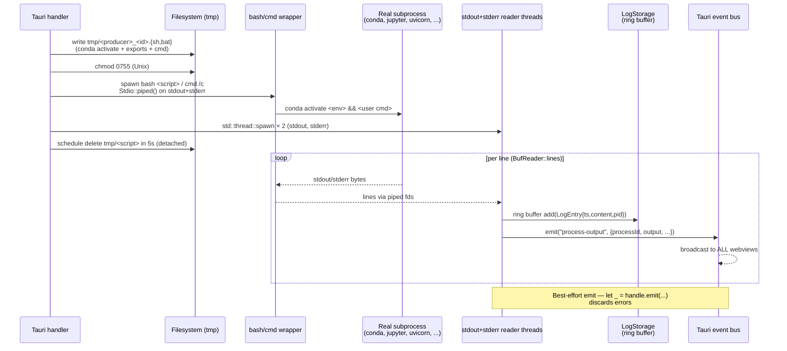

# Architecture: Process Lifecycle

How subprocesses are spawned, tracked, observed, and killed. Subprocess
management is the most operationally complex piece of the system: five
producers, three PID-tracking stores, four kill strategies, one cleanup
cascade, and several known leaks. Source material lives in the
[raw deep-dives](../raw-deep-dives/) (`logs-streaming.md`,
`backend-services.md`, `environments.md`, `app-shell.md`) and the
[per-feature docs](../20-features/).

## What gets spawned

Five distinct producers, each with its own command pattern and parent.

| Producer | Spawn pattern | Parent process | Lifetime | Tracked? |
|---|---|---|---|---|
| **Miniforge installer** | `bash <miniforge-installer>.sh -b -p <dir>` / `cmd /c <installer>.exe` | `install_conda` command (`startup.rs:436`) | Awaited to completion (seconds–minutes) | No — installer is awaited, no kill handle |
| **Conda env CRUD** | Generated `bash <script>` / `cmd /c <script>` with `conda activate` + `conda env create/remove/update` | `create_environment`, `remove_environment`, `create_environment_from_requirements` (`environments.rs`) | Awaited to completion | No — wrapper is awaited |
| **Conda extension install** | `pip install <pkg>` / `pip uninstall` via `conda run -n <env> ...` (buffered `.output()`, no streaming) | `install_extensions`, `update_extension`, `remove_extension` | Awaited to completion | No |
| **Jupyter server** | `conda run -n <env> --no-capture-output jupyter lab --no-browser --notebook-dir <wd>` | `start_jupyter_server` (`jupyter.rs:36-261`) | Long-lived (until user stops or app quits) | Yes — `ACTIVE_JUPYTER_SERVERS` (env → (url, wrapper-pid)) |
| **Backend service** | Generated `bash <script>` / `cmd /c <script>` with conda activate + env exports + user command | `start_backend_service` (`backends.rs:639-657`) | Long-lived | Yes — `RunningProcesses` (id → `Child`) |

The Miniforge installer is **not** part of the `process-output` log infra — it
uses a separate `install-progress` event with `{step, progress, message}`
payload (raw v2 §A of logs-streaming.v2). Extension installs do not stream:
`std::process::Command::output()` blocks and surfaces stdout/stderr in the return
value (raw logs-streaming §1.5 producer table).

## Spawn pattern

Every streaming producer follows the same five-step pattern:



**Threads, not async.** Each reader is an OS thread running
`BufReader::lines().map_while(Result::ok)`. Two threads per process (one per
pipe). The Rust handler returning early does not stop the threads — they live
until the pipes close (i.e. the child dies). This matters for the TS port: in
Node, the equivalent is `readline.createInterface({input: child.stdout})` per
stream, which is fine because Node's `child_process` already buffers asynchronously.

**Best-effort emit.** Event emit failures are discarded (`let _ = handle.emit(...)`).
There is no flow control; kernel pipe buffers (~64KB on Linux) provide
backpressure if React falls behind. The 10,000-line ring buffer caps memory
but **silently drops oldest** — there is no UI truncation indicator
(raw logs-streaming.v2 §A).

> ⚠️ BUG: `run_command_with_logging` (`environments.rs:53-95`) emits
> `process-output` events but **does not call `LogStorage.add()`**. The
> `register_process_monitoring` calls in `environments.tsx` create empty
> buffers that stay empty. `get_process_logs_history` returns `[]` for any
> `create-env-*` or `requirements-*` processId; lines emitted before a listener
> attaches are lost (raw logs-streaming.v2 §B).

## Why wrapper scripts (and the wrapper-PID problem)

Conda activation is **a shell function, not a binary**. Running `python` or
`jupyter` "in env X" requires sourcing `<install>/etc/profile.d/conda.sh` first
to define the `conda` function, then `conda activate X`, then the user command.
Two ways to do this:

1. **Generated temp script + `bash <script>`** — what backends and env CRUD do
   (`backends.rs`, `environments.rs`). Writes a `.sh`/`.bat` to `temp_dir()` and
   spawns it. Filename is keyed by backend id (NOT per-invocation random) — rapid
   restarts can have their script deleted mid-execution by a stale 5-s timer.
2. **`bash -c '. conda.sh && conda activate <env> && <cmd>'`** — what Jupyter
   does via `conda run -n <env> --no-capture-output jupyter lab ...`
   (`jupyter.rs:75-85`).

Either way, **the spawned process is the wrapper, not the real server**. The
`Child` returned by `Command::spawn()` has the wrapper's PID. The real server
(uvicorn, jupyter-lab, pip) is a grandchild.

Consequences:

- For backends, the log reader scrapes `Started server process [N]` from uvicorn's
  output and **overwrites `backend.pid` from WRAPPER_PID → SERVER_PID**
  (`backends.rs:1040-1047`). A race exists if uvicorn boots in <100 ms before
  the start-flow rewrites `pid = WRAPPER_PID` at `backends.rs:1184`.
- For Jupyter, the stored PID is **always the conda wrapper**, never the real
  server. Stop kills by **port**, not PID (see §Kill strategies).
- `Child::kill()` only kills the wrapper. The real server can survive as an
  orphan reparented to init — which is why redundant kill paths exist.

## PID tracking

**Three independent stores, three different key conventions.** A footgun the
TS port should consolidate behind typed helpers.

| Store | File:line | Key | Value | Used by |
|---|---|---|---|---|
| `RunningProcesses` | `process_monitor.rs:106` — `Arc<Mutex<HashMap<String, Child>>>` | Bare backend UUID (no prefix) | `std::process::Child` | Backends only |
| `ACTIVE_JUPYTER_SERVERS` | `jupyter.rs:9` — `Lazy<Mutex<HashMap<String, (String, u32)>>>` | Env name | `(url, wrapper_pid)` | Jupyter only |
| `LOG_STORAGE` | `process_monitor.rs:9` — `Lazy<Arc<Mutex<HashMap<String, LogBuffer>>>>` | `backend-<uuid>` or `jupyter-<env>` or `create-env-*` etc. | 10k-line ring buffer | All streaming producers |

| Producer | Tracks PID in… | Logs ID format |
|---|---|---|
| Miniforge installer | (none — awaited) | n/a (uses `install-progress`) |
| Conda env CRUD | (none — awaited) | `create-env-<env>-<ts>`, `requirements-<env>-<ts>` |
| Extension install | (none — awaited) | n/a (buffered, no streaming) |
| Jupyter | `ACTIVE_JUPYTER_SERVERS` | `jupyter-<env>` |
| Backend service | `RunningProcesses` (key = bare UUID) | `backend-<uuid>` (LogStorage key has prefix; `RunningProcesses` does not) |

> ⚠️ BUG: `RunningProcesses` and `LOG_STORAGE` use **different keys for the same
> backend** — bare UUID vs `backend-<uuid>` (raw logs-streaming.v2 §6). Wrap in
> `processIdForLogs(uuid)` / `processIdForKill(uuid)` helpers in the port.

> ⚠️ BUG: `unregister_process_monitoring` is registered but has zero callers
> (raw v2 §F). `LOG_STORAGE` grows monotonically — deleted backends and removed
> environments leave stale buffers (~24 MB worst case for 30 long-lived
> processes). Port should unregister on `delete_backend_service`,
> `remove_environment`, and shutdown.

## Kill strategies

Four mechanisms, combined differently by each stop path.

| # | Strategy | How | Used by |
|---|---|---|---|
| 1 | **Port-based** | macOS: `lsof -ti tcp:<port> -sTCP:LISTEN` → `kill -9`. Linux: `fuser -k <port>/tcp` + `lsof` backup. Windows: `netstat -ano \| findstr LISTENING` → `taskkill /F /PID`. | `stop_backend_service` (when port known) + `stop_jupyter_server` (always — port extracted from stored URL). Most reliable: kills the real server regardless of wrapper/grandchild structure. |
| 2 | **PID-based** | `kill -9 <pid>` / `taskkill /F /PID` on stored `backend.pid` (may be wrapper or server depending on race). | `stop_backend_service` fallback. |
| 3 | **Tracked-child** | `Child::kill()` + `Child::wait()` on the `RunningProcesses` entry. SIGKILL only. | `stop_backend_service` — but kills only the wrapper bash/cmd; uvicorn survives as init-reparented orphan. |
| 4 | **Brute-force pattern** | Unix: `pkill -f <pattern>` matching install dir/conda binary. Windows: `taskkill /F /FI "WINDOWTITLE eq ..."` + `taskkill /F /IM`. | `abort_installation` only (`startup.rs:1097`). |

`stop_backend_service` (`backends.rs:561-573`) runs strategies **1, 2, and 3
in sequence** — redundancy is load-bearing. `stop_jupyter_server`
(`jupyter.rs:291-485`) uses only strategy 1.

> ⚠️ BUG: backend port-kill omits `-sTCP:LISTEN` on macOS/Linux
> (`backends.rs:362-407`) — kills any process with a TCP connection to that
> port, not just listeners. Jupyter has the filter (`jupyter.rs:380-386`); the
> divergence is an oversight.

> ⚠️ BUG: for a non-uvicorn backend whose logs lack `Started server process [N]`
> AND has no IPv4/localhost URL (so `backend.port` is unknown), **none of the
> three paths kills the actual server.** Wrapper dies, server orphans, UI shows
> `stopped` while the process keeps running. Port should kill the process tree
> (`pkill -P <wrapper>` on Unix; `taskkill /T /PID` on Windows).

## Cleanup cascade on quit

```mermaid
sequenceDiagram
    participant U as User / OS
    participant T as Tray Quit handler<br/>(or ctrlc / applicationWillTerminate)
    participant Rt as Fresh tokio Runtime
    participant C as cleanup_all_processes
    participant J as stop_all_jupyter_servers
    participant B as stop_all_backend_services
    participant A as App

    U->>T: Quit / Ctrl-C / SIGTERM
    T->>Rt: build new tokio runtime (single-threaded)
    Rt->>C: rt.block_on(cleanup_all_processes(handle))
    C->>C: tokio::time::timeout(10s, async { ... })  -- OUTER WALL
    C->>J: tokio::time::timeout(3s, stop_all_jupyter_servers)
    J->>J: for each env in ACTIVE_JUPYTER_SERVERS: port-kill
    J-->>C: Ok / Err / timed-out
    C->>B: tokio::time::timeout(3s, stop_all_backend_services)
    B->>B: for each backend: port-kill + tracked-kill + pid-kill
    B-->>C: Ok / Err / timed-out
    C-->>T: returns (or 10s outer timeout)
    Note over T: Windows only: tokio::sleep(500ms) for GDI cleanup
    T->>A: app.exit(0)
    A->>A: RunEvent::ExitRequested fires; cleanup runs *again* defensively
```

Implementation lives in `main.rs:419-467` (the cascade) and `main.rs:642-651`
(the tray handler). Notes:

- Inner timeouts are **3 s each, sequential**. Combined inner budget = 6 s; outer
  wall = 10 s; the 4 s slack is unused in practice.
- Each backend stop sleeps **2 s after port-kill + 1 s after tracked-kill**.
  Three seconds per backend, sequential — the 3 s inner timeout covers **exactly
  one backend**. Subsequent backends are interrupted mid-stop and uvicorn
  children get reparented to init (raw backend-services.md "Cleanup budget").
- The macOS `applicationWillTerminate` Obj-C observer
  (`utils/app_termination.rs:33-37`) and `ctrlc::set_handler` (`main.rs:762-771`)
  both route through the same `cleanup_all_processes` function. If tray Quit
  already drained `RunningProcesses`, the re-run is a no-op.

> ⚠️ BUG: the cleanup budget covers exactly one backend due to the 2 s + 1 s
> serial sleeps. Port should `Promise.all` the per-process stops, not sequence
> them; the per-process sleeps can disappear (use `Promise.race` against a 2 s
> sleep instead).

## Crash detection: there isn't any

**There is no proactive crash detection** for any spawned process. No
`Child::try_wait()` polling loop, no `SIGCHLD` handler, no exit-event listener
on the wrapper Child. A backend that dies silently stays `status=running`
forever in the UI.

What *does* exist:

- **Log-text heuristics in the frontend per-row monitor** (`backends.tsx:656-801`):
  - `ERROR:` substring → flip status to `error`
  - `address already in use` → flip + stop
  - `: command not found` → flip + stop (also Rust-side at `backends.rs:1008-1026`)
  - `Traceback (most recent call last):` → buffer until blank/`>`/`$` or 2 s timeout
- **Startup PID liveness check** — see §Stale process recovery below.

> ⚠️ BUG: a silently-crashing backend stays `status=running` forever. The port
> should attach a `child.on('exit', code => { if (code !== 0 && !userInitiated)
> setError(...) })` listener on every spawn.

## Stale process recovery at boot

At startup, `initialize_backends` (`backends.rs`, called from `main.rs:575`)
iterates every `backends.json` entry where `status == "running"` and calls
`is_process_running(pid)` (`process_monitor.rs:131-154`):

- Unix: `kill(pid, 0)` (signal 0 = liveness test, doesn't actually signal)
- Windows: `tasklist /FI "PID eq <pid>"` parse

Dead entries are downgraded to `status = "stopped"` and persisted. This is the
only mechanism by which the UI ever sees a backend transition out of `running`
without an explicit user stop.

Jupyter has **no equivalent boot-time check** — `ACTIVE_JUPYTER_SERVERS` is
in-memory and starts empty after every restart, so dead servers leak no state.
But a Jupyter process that survived an unclean app shutdown (e.g. SIGKILL of the
desktop app) keeps running until the user finds it via `ps` and kills it.

## Signal semantics

| Producer | Signal sequence | Reason |
|---|---|---|
| Backend service | **SIGKILL only** (`Child::kill()` is SIGKILL on Unix; `taskkill /F` on Windows; `kill -9` everywhere in the port-kill path) | No graceful-shutdown attempt. Port-kill is the dominant path and uses `kill -9` directly. |
| Jupyter | **SIGTERM → 2 s wait → check `kill -0` → SIGKILL** (`jupyter.rs:379-426` for Unix) | Jupyter's REST endpoint sends `SIGINT`-equivalent on shutdown anyway; the 2 s grace lets it flush state. |

The discrepancy is historical: backends predate the graceful-stop conventions.
A TS port should adopt the Jupyter pattern uniformly:

1. SIGTERM the target PID (or the listener PID set).
2. Poll `process.kill(pid, 0)` every 200 ms up to 2 s.
3. If still alive, SIGKILL.

This gives backends time to flush in-flight DB writes, close WebSocket peers,
etc., at a cost of ~2 s per stop (manageable if stops run in parallel via
`Promise.all`).

## TS port mapping

| Concern | Tauri/Rust | TS / Node equivalent |
|---|---|---|
| Spawn with piped stdio | `Command::new(...).stdio(piped).spawn()` | `child_process.spawn(cmd, args, { stdio: ['ignore', 'pipe', 'pipe'] })` or `Bun.spawn` |
| Wrapper script | `fs::write` + `chmod 0755` + `spawn('bash', [path])` | Same. **Use a per-invocation random suffix** to fix the rapid-restart deletion race. |
| Line-by-line read | Two threads + `BufReader::lines()` | `readline.createInterface({input: child.stdout})` per stream — async, no threads |
| Port-based kill | `lsof -ti -sTCP:LISTEN tcp:<port>` / `netstat -ano \| findstr LISTENING` then `kill -9` / `taskkill /F` | [`fkill`](https://www.npmjs.com/package/fkill) npm, or shell-out via `execFile`. **Always include the LISTEN filter** — backends omit it today (bug). |
| PID liveness | `kill(pid, 0)` / `tasklist /FI` | `try { process.kill(pid, 0); return true } catch { return false }` |
| Tracked-child kill | `child.kill()` + `child.wait()` (SIGKILL) | `child.kill('SIGTERM')`, wait 2 s with `process.kill(pid, 0)` polling, then SIGKILL |
| Pattern kill (install abort) | `pkill -f <pattern>` / `taskkill /F /FI` | Same shell-out, or [`tree-kill`](https://www.npmjs.com/package/tree-kill) for process trees |
| `RunningProcesses` / `LOG_STORAGE` maps | `Arc<Mutex<HashMap<...>>>` managed state | `new Map<string, ChildProcess>()` / `new Map<string, LogBuffer>()` — module singletons, no mutex (single-threaded JS) |
| Bounded cleanup | `tokio::time::timeout(10s, async {...})` | `Promise.race([Promise.allSettled([stopJupyter(), stopBackends()]), wait(10_000)])` then `app.exit(0)` |
| Parallel cleanup | Sequential loop with 2 s + 1 s sleeps per backend | `await Promise.all(backends.map(stopBackend))` — drop the sleeps |
| Crash detection | (none) | `child.on('exit', (code, sig) => { if (!userInitiated && code !== 0) markError(...) })` on every spawn |
| Boot-time stale recovery | `kill(pid, 0)` per `status=running` | `for (const b of backends) if (b.status === 'running' && !pidAlive(b.pid)) markStopped(b)` |
| Cancellation | None (three ad-hoc mechanisms) | `AbortController` end-to-end; abort propagates to subprocess kill |

## Cross-feature touchpoints

Per-feature docs that own producer-specific logic:
[`feature-backend-services.md`](../20-features/feature-backend-services.md),
[`feature-jupyter.md`](../20-features/feature-jupyter.md),
[`feature-logs-streaming.md`](../20-features/feature-logs-streaming.md),
[`feature-environments.md`](../20-features/feature-environments.md),
[`feature-installation.md`](../20-features/feature-installation.md),
[`feature-tray-and-autostart.md`](../20-features/feature-tray-and-autostart.md),
[`feature-uninstall.md`](../20-features/feature-uninstall.md).
