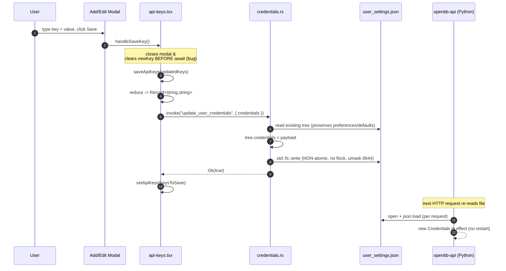

# Feature: API Keys (Credential Vault)

## Purpose

Let the user view, add, edit, delete, and bulk-import the upstream-provider
credentials (Polygon, FMP, Benzinga, etc.) that the local Python `openbb-api`
server reads on every request. The page is a thin editor for the
`credentials` block of `~/.openbb_platform/user_settings.json`, plus a
"settings files" launcher that opens five well-known config files in an
external editor.

The page is local-disk-only and assumes single-user mode — it is unaware of
`OPENBB_API_AUTH_EXTENSION` setups where credentials live elsewhere. See
[`feature-platform-rest-api.md`](./feature-platform-rest-api.md) for the
consumer-side behaviour.

## User flows

1. **Golden path — add a key.** Navigate to `/api-keys` (or use tray "API Keys"
   item, `main.rs:606,:660`). Click "Add New Key", type a key name and value,
   click Save. The row appears at the top of the list; on next mount the
   server re-sorts by disk-insertion order.
2. **Edit a key.** Click the pencil icon. Modal opens prefilled. Rename
   collisions silently dedup-merge (last-write-wins).
3. **Delete a key.** Open the edit modal; click delete inside the modal.
   There is no inline-row delete affordance.
4. **Bulk import from `.env` / `.json`.** Click "Import Keys", choose a file.
   Parser runs in the renderer. Confirmation modal lists every parsed key
   with a checkbox; user picks which to merge.
5. **Open a settings file.** Click the file/settings icon, choose one of
   `user_settings.json`, `system_settings.json`, `mcp_settings.json`, `.env`,
   `.condarc`. Handler creates the file with default content if missing,
   then spawns the platform-native editor.
6. **Edge: external edit lost-update.** User edits `user_settings.json`
   externally and saves. The desktop page never reloads. The next in-app
   save silently overwrites the external edit.
7. **Edge: env-var shadowing.** A `POLYGON_API_KEY` in the shell or in
   `~/.openbb_platform/.env` overrides the disk value at request time
   (api-keys.v2.md §1d), but the page only ever shows the disk value.

## UI surface

| Component | File:line | Notes |
|---|---|---|
| Page root, `loadData` | `api-keys.tsx:176-206` | Empty-deps `useEffect`; no focus/file-watcher reload. |
| Search box + filter | `:209-214`, `:550-557` | `useMemo`, case-insensitive on key name. |
| Add modal trigger | `:585-598` | Clears `newKey`, sets `modalMode='add'`. |
| Edit modal trigger | `:248-254`, `:696` | Sets `editingKeyIndex` from row's original index. |
| Modal form | `:757-889` | `<input type="password">` vs `<textarea>` toggle (`:835-861`). |
| Delete (in modal only) | `:868-877` | No inline-row delete. |
| `handleSaveKey` | `:217-245` | Closes modal **before** await — see bugs. |
| Shared write `saveApiKeys` | `:331-371` | Re-validates, builds `Record<string,string>`, invokes. |
| Import trigger + input | `:603-618` | Accepts `.json,.env`. |
| Parser `parseImportedFile` | `:46-145` | Pure browser; reads via `file.text()`. |
| Import confirm modal | `:1040-1134` | Row checkbox, visibility toggle, select-all. |
| Settings/file modal | `:624-632`, `:967-998`, `:1004-1027` | Five-way radio + Open File dispatch. |
| Error dialog effect | `:466-472` | All errors → native `message(...)` dialog. |
| Row visibility | `:493-503`, `:686-690` | Masked as 20 stars; "Undefined" when empty. |
| Row + modal Copy | `:148-174` | `navigator.clipboard.writeText`. |
| Docs button | `:425-436` | `invoke("open_url_in_window", ...)`. |
| Scrollbar header sync | `:505-531` | `ResizeObserver`. |

## Data flow



## IPC contract

| Direction | Name | Payload | Returns | Used by |
|---|---|---|---|---|
| FE → Rust | `get_user_credentials` | none | full `user_settings.json` tree | mount `loadData` (`api-keys.tsx:182`) |
| FE → Rust | `update_user_credentials` | `{ credentials: Record<string,string> }` | `bool` | add/edit/delete/import save (`:364`) |
| FE → Rust | `open_credentials_file` | `{ fileName: string }` | `bool` | five-way settings launcher (`:373-423`) |
| FE → Rust | `open_url_in_window` | `{ url, title? }` | `void` | docs button (`:428`) |

Registered in `main.rs:528-531`. Clipboard copy and `.env`/`.json` parsing
are renderer-only — they never cross the IPC boundary.

## State surfaces

- **React state** (`api-keys.tsx:22-39`): `apiKeys`, `searchQuery`,
  `isAddKeyModalOpen`, `editingKeyIndex`, `modalMode`, `newKey`,
  `isModalValueVisible`, `modalCopied`, `visibleKeys`, `copiedKey`, `error`,
  `loading`, plus import-modal state (`importedKeys`, `selectedKeys`,
  `importVisibleKeys`).
- **Rust state**: none. Every invoke is a fresh read-or-write.
- **Disk**: `~/.openbb_platform/user_settings.json` (R/W);
  `system_settings.json` (R, for `installation_directory`);
  `mcp_settings.json`, `.env`, `<installation_dir>/conda/.condarc` (editor only).

## Persistence

### `user_settings.json` — the file this feature owns

```json
{
  "credentials": {
    "polygon_api_key": "abc...",
    "fmp_api_key": null,
    "tradier_api_key": "...",
    "tradier_account_type": "sandbox"
  },
  "preferences": {
    "data_directory": "...",
    "chart_style": "dark",
    "output_type": "OBBject",
    "...": "..."
  },
  "defaults": {
    "commands": {
      "/equity/price/historical": { "provider": "yfinance" }
    },
    "...": "..."
  },
  "id": "<uuid7str>"
}
```

The api-keys page mutates only the `credentials` subtree. The Rust handler
reads-modify-writes so `preferences`, `defaults`, and `id` are preserved.
[`feature-installation.md`](./feature-installation.md) writes the initial
`{"credentials": {}}` at install time; theme-toggle mutates `preferences`
with an exclusive flock (`helpers.rs:177-286`) — this feature takes no lock.

Disk casing is preserved end-to-end; lowercasing only happens inside
Python's `_normalize_credential_map` (`credentials.py:44-58`). The disk can
contain `POLYGON_API_KEY` and `polygon_api_key` simultaneously, which Python
silently merges (api-keys.v2.md §1e). `null` vs `""` round-trip asymmetry:
load maps `null → ""`, save writes `""` instead of `null`, so each save
erases all on-disk nulls (api-keys.v2.md §18).

## Error handling

All paths converge on `setError(string)`; `useEffect([error])`
(`api-keys.tsx:466-472`) surfaces them as native dialogs. Notable cases:

- `loadData` failure leaves `apiKeys` empty.
- `saveApiKeys` failure keeps the in-memory list at pre-write state, but the
  modal has already closed and `newKey` was cleared — typed input is lost.
- `open_credentials_file` failure (headless Linux, no editor) shows the raw
  Rust error verbatim.
- `.condarc` resolution can fail pre-install if `system_settings.json` lacks
  `install_settings.installation_directory` (api-keys.v2.md §3c).

## ▸ Interfaces with

- **depends-on** [`feature-installation.md`](./feature-installation.md) for
  the initial `{"credentials": {}}` seed and the `installation_directory`
  used to resolve `.condarc`.
- **depends-on** [`feature-environments.md`](./feature-environments.md) —
  the `.condarc` opened by this UI is read by conda on every subprocess.
- **depended-on-by** [`feature-platform-rest-api.md`](./feature-platform-rest-api.md)
  — Python re-reads `user_settings.json` on every HTTP request
  (`platform-rest-api.md:249`, v2 §L.1). Writes here take effect without
  restart, but a non-atomic write opens a transient-400 race window.
- **depended-on-by** [`feature-app-shell.md`](./feature-app-shell.md) — tray
  "API Keys" item navigates to `/api-keys` (`main.rs:606`, `:660`).
- **shares-state-with** theme-toggle (in `feature-app-shell.md`) via the
  `preferences` block of the same file — theme takes a flock, credentials
  do not.
- **independent-of** [`feature-backend-services.md`](./feature-backend-services.md).

## TS port mapping

| Tauri call | TS equivalent | Notes |
|---|---|---|
| `get_user_credentials` | `JSON.parse(await fs.readFile(USER_SETTINGS, 'utf8'))` (ENOENT → `{credentials:{}}`) | Return whole tree so writes can read-modify-write; preserve insertion order via plain `JSON.parse`/`JSON.stringify`. |
| `update_user_credentials` | Read tree → `tree.credentials = payload` → write `*.tmp` → `fs.rename` → `fs.chmod(0o600)` on Unix | Hold exclusive file lock for the read-modify-write window. Lowercase keys at this boundary. |
| `open_credentials_file` | Strict allow-list check; ensure-exists with default content **only** if filename is allow-listed; spawn editor by platform | Honor `$VISUAL`/`$EDITOR` before falling back to GUI editors on Linux (api-keys.v2.md §9). |
| `open_url_in_window` | `new BrowserWindow(...).loadURL(url)` (Electron) or `import('open')` (headless) | Validate `http`/`https` scheme. Never put secrets in `title` or window label. |
| `navigator.clipboard.writeText` | Same — keep in renderer | Browser clipboard, **not** main-process clipboard. No Tauri/Electron clipboard plugin needed. |
| File parsing | Same — keep in renderer | Port `.env` regex `/^([^=]+)=(.*)$/` and quote-strip verbatim. |

### Path constants

```ts
const HOME = process.env.HOME ?? process.env.USERPROFILE!;
const PLATFORM_DIR = path.join(HOME, '.openbb_platform');
const USER_SETTINGS = path.join(PLATFORM_DIR, 'user_settings.json');
const ALLOWED_FILES = new Set([
  'user_settings.json', 'system_settings.json',
  'mcp_settings.json', '.env', '.condarc',
]);
```

## Known bugs and port-time fixes

Ported from `raw-deep-dives/api-keys.md` §11. Read that section before
touching the port.

### Security

- **Path-traversal in `open_credentials_file`** (`credentials.rs:93-181`).
  Rust trusts the `fileName` argument and joins it under `~/.openbb_platform`
  with no validation; combined with the auto-create fallback
  `_ => "{}"` (`credentials.rs:127`), a hostile call can write `{}` over an
  arbitrary missing path or open arbitrary files in an editor.
  **Fix:** strict backend allow-list of the five literal filenames.
- **Non-atomic write to `user_settings.json`.** `std::fs::write`
  (`helpers.rs:84-86`) is open→`O_TRUNC`→write→close. A crash or kill
  mid-write truncates the file to zero bytes, silently destroying
  `preferences` and `defaults` along with credentials.
  **Fix:** write `*.tmp` then `fs.rename` (atomic on POSIX;
  `MoveFileExW(MOVEFILE_REPLACE_EXISTING)` on Windows).
- **No `chmod 0o600` after write.** File inherits umask (usually `0644` on
  Linux — world-readable secrets). **Fix:** `fs.chmod(USER_SETTINGS, 0o600)`
  on Unix; document the NTFS-ACL limitation on Windows.
- **No file lock for the read-modify-write cycle.** Theme toggle takes
  `fs2::FileExt::try_lock_exclusive` (`helpers.rs:211-216`); credentials
  writes don't. Concurrent writes from Python, the UI, and theme toggle can
  race and corrupt JSON. **Fix:** acquire an exclusive flock /
  `LockFileEx` for the read-modify-write window.
- **Clipboard exfiltration risk.** Row Copy and modal Copy use
  `navigator.clipboard.writeText`; macOS Universal Clipboard syncs via
  iCloud and Windows clipboard history retains entries for ~24 h. There is
  no native clear hook (`tauri-plugin-clipboard-manager` is not in
  `capabilities/default.json`). **Fix:** keep using the browser clipboard
  API (don't add a main-process clipboard plugin). Optionally offer
  "Copy and clear in N seconds" via `setTimeout(() => clipboard.writeText(''))`.
- **No secrets in event payloads, window titles, labels, or logs.**
  `open_url_in_window` builds labels like `url_<timestamp>` — OS-level
  enumeration (Spotlight, AltTab, accessibility APIs) reads titles. If the
  port adds a "credentials updated" event, send key **names** only.

### UX correctness

- **Modal closes before await.** `handleSaveKey` (`api-keys.tsx:238-244`)
  resets `newKey` and closes the modal before awaiting `saveApiKeys`. On
  rejection the user has lost their typed input (potentially a long JWT).
  **Fix:** keep the modal open and disabled until the await resolves; show
  inline retry on failure.
- **Inconsistent dedup semantics.** Add-time is case-insensitive
  (`:230`); import-merge is case-sensitive (`:285`); save-time `reduce` is
  case-sensitive last-write-wins (`:353-361`). Python lower-cases everything
  at load (`credentials.py:54-57`). **Fix:** lower-case all keys at the IPC
  boundary in the port; reject mixed-case duplicates at validation.
- **No FS watcher / no focus reload.** External edits via "Open File" are
  silently overwritten by the next in-app save (api-keys.v2.md §19).
  **Fix:** `fs.watchFile` and either re-read or show a "file changed
  externally" banner.
- **`.condarc` default-content mismatch.** The handler writes a 4-line stub;
  the installer writes a much richer file with `envs_dirs`, `pkgs_dirs`,
  timeouts (api-keys.v2.md §3b). **Fix:** refuse to auto-create `.condarc`
  from this page — the installer owns it.
- **`mcp_settings.json` default-content mismatch.** Handler writes `{}`;
  Python `MCPService` writes ~30 default fields on first launch
  (api-keys.v2.md §4b). **Fix:** skip auto-creation.
- **Inconsistent home-dir resolution** (api-keys.v2.md §17). Three methods
  across handlers. **Fix:** standardize on `os.homedir()`.

## Open questions

1. **Provider-required indicators.** Should the port fetch the
   `provider.json` manifest (already used by `installation-progress.tsx`)
   and show grouping, sign-up links, required/optional badges, and
   deprecated-credential rename hints (api-keys.v2.md §6)? This turns the
   page into a "provider credentials manager" but requires a network fetch
   and a manifest cache.
2. **"Copy and clear in N seconds" affordance.** Should the port offer an
   opt-in that calls `clipboard.writeText('')` after a configurable timeout?
   Protects against clipboard sync / exfiltration but may surprise users
   who haven't pasted yet.
3. **Env-var shadowing UX.** Surface a banner when a `*_API_KEY` env var
   shadows a disk credential? Requires either `OPENBB_DEV_MODE=true` (so
   `/api/v1/user/me` returns the effective set) or re-implementing
   precedence in TS.
4. **Multi-credential providers** (Tradier needs `tradier_api_key` +
   `tradier_account_type`, the latter an enum not a secret). Render
   grouped sub-forms with appropriate input widgets per field?
5. **Auth-extension mode.** When `OPENBB_API_AUTH_EXTENSION` is set, the
   credentials this page edits are irrelevant to the server. Detect and
   disable the page, or require extensions to expose a credentials API
   (api-keys.v2.md §20)?

## Cross-feature dependencies

- **shares-state-with** `feature-installation.md` via
  `~/.openbb_platform/user_settings.json` (initial seed) and
  `system_settings.json` (`installation_directory` for `.condarc`).
- **shares-state-with** `feature-platform-rest-api.md` — Python reads
  `credentials` on every request; UI writes invalidate the server's view
  without restart, but a non-atomic write opens a transient-400 race.
- **shares-state-with** `feature-environments.md` via `.condarc`.
- **shares-state-with** theme-toggle (in `feature-app-shell.md`) via the
  `preferences` block.
- **depended-on-by** `feature-app-shell.md` — tray "API Keys" item.
- **independent-of** `feature-backend-services.md`.
