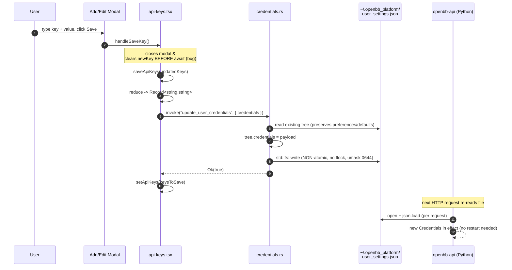

# Feature: API Keys (Credential Vault)

## Purpose

Let the user view, add, edit, delete, and bulk-import the upstream-provider
credentials (Polygon, FMP, Benzinga, etc.) that the local Python `openbb-api`
server reads on every request. The page is a thin editor for the
`credentials` block of `~/.openbb_platform/user_settings.json`, plus a
"settings files" launcher that opens five well-known config files in an
external editor.

The page is **local-disk-only** and assumes single-user mode — it is unaware
of `OPENBB_API_AUTH_EXTENSION` setups where credentials live elsewhere. See
[`feature-platform-rest-api.md`](./feature-platform-rest-api.md) for the
consumer-side behaviour.

## User flows

1. **Golden path — add a key.** Navigate to `/api-keys` (or use tray "API Keys"
   item, `main.rs:606,:660`). Click "Add New Key". Type a key name and value.
   Click Save. The row appears at the top of the list; on next mount the
   server re-sorts by disk-insertion order.
2. **Edit a key.** Click the pencil icon on a row. The modal opens prefilled.
   Save overwrites the existing entry; rename collisions are silently
   dedup-merged into a single key (last-write-wins).
3. **Delete a key.** Open the edit modal for the row; click the delete button
   inside the modal. (There is no inline-row delete affordance.)
4. **Bulk import from `.env` / `.json`.** Click "Import Keys", choose a file.
   The parser runs entirely in the renderer. A confirmation modal shows each
   parsed key with a row checkbox; user picks which to merge.
5. **Open a settings file in an external editor.** Click the file/settings
   icon, choose one of `user_settings.json`, `system_settings.json`,
   `mcp_settings.json`, `.env`, `.condarc`. The handler creates the file with
   default content if missing, then spawns the platform-native editor.
6. **Edge: external edit lost-update.** User opens `user_settings.json` in
   their editor, adds a key, saves. The desktop page never reloads. The next
   in-app save silently overwrites the external edit. See "Known bugs".
7. **Edge: env-var shadowing.** User has `POLYGON_API_KEY=...` in their shell
   environment or in `~/.openbb_platform/.env`. The Python server reads the
   env value, not the disk value (api-keys.v2.md §1d). The desktop page has
   no UI cue for this.

## UI surface

| Component | File:line | Notes |
|---|---|---|
| Page root, `loadData` | `api-keys.tsx:176-206` | Empty-deps `useEffect`; no focus/file-watcher reload. |
| Search box + filter | `:209-214`, `:550-557` | `useMemo` filter, case-insensitive on key name. |
| Add modal trigger | `:585-598` | Clears `newKey`, sets `modalMode='add'`. |
| Edit modal trigger | `:248-254`, `:696` | Sets `editingKeyIndex` from row's original index. |
| Modal form | `:757-889` | `<input type="password">` vs `<textarea>` toggle (`:835-861`). |
| Delete button (in modal only) | `:868-877` | No inline-row delete. |
| Save handler `handleSaveKey` | `:217-245` | **Closes modal before await** — see bugs. |
| Shared write `saveApiKeys` | `:331-371` | Re-validates, builds `Record<string,string>`, invokes. |
| Import trigger + hidden input | `:603-618` | Accepts `.json,.env`. |
| Parser `parseImportedFile` | `:46-145` | Pure browser; reads via `file.text()`. |
| Import confirmation modal | `:1040-1134` | Per-row checkbox, visibility toggle, select-all. |
| Settings/file modal | `:624-632`, `:967-998`, `:1004-1027` | Five-way radio + "Open File" dispatch. |
| Error dialog effect | `:466-472` | All errors → native `message(...)` dialog. |
| Row visibility toggle | `:493-503`, `:686-690` | Masked as 20 stars; "Undefined" when empty. |
| Row + modal Copy | `:148-174` | `navigator.clipboard.writeText`. |
| Docs button | `:425-436` | `invoke("open_url_in_window", ...)`. |
| Scrollbar-aware header | `:505-531` | `ResizeObserver` syncs `padding-right`. |

## Data flow



## IPC contract

| Direction | Name | Payload | Returns | Used by |
|---|---|---|---|---|
| FE → Rust | `get_user_credentials` | none | `serde_json::Value` (entire `user_settings.json` tree) | mount, `loadData` (`api-keys.tsx:182`) |
| FE → Rust | `update_user_credentials` | `{ credentials: Record<string, string> }` | `bool` | add/edit/delete/import save (`api-keys.tsx:364`) |
| FE → Rust | `open_credentials_file` | `{ fileName: string }` | `bool` | five-way settings launcher (`api-keys.tsx:373-423`) |
| FE → Rust | `open_url_in_window` | `{ url: string, title?: string }` | `void` | docs button (`api-keys.tsx:428`) |
| Rust commands registered | `main.rs:528-531` | — | — | `tauri::generate_handler!` macro |

Note: clipboard copy and `.env`/`.json` parsing are **renderer-only** — they
never cross the IPC boundary.

## State surfaces

- **React state** (`api-keys.tsx:22-39`): `apiKeys: ApiKey[]`, `searchQuery`,
  `isAddKeyModalOpen`, `editingKeyIndex`, `modalMode`, `newKey`,
  `isModalValueVisible`, `modalCopied`, `visibleKeys: Set<string>`,
  `copiedKey`, `error`, `loading`, plus import-modal state
  (`importedKeys`, `selectedKeys`, `importVisibleKeys`).
- **Rust state**: none. Every invoke does a fresh read-or-write.
- **Disk files**: `~/.openbb_platform/user_settings.json` (R/W);
  `~/.openbb_platform/system_settings.json` (R only, for resolving
  `installation_directory`); `~/.openbb_platform/mcp_settings.json`,
  `~/.openbb_platform/.env`, `<installation_dir>/conda/.condarc` (open in
  editor only).

## Persistence

### `user_settings.json` — the file this feature owns

```json
{
  "credentials": {
    "polygon_api_key": "abc...",
    "fmp_api_key": null,
    "benzinga_api_key": "xyz...",
    "tradier_api_key": "...",
    "tradier_account_type": "sandbox"
  },
  "preferences": {
    "data_directory": "...",
    "chart_style": "dark",
    "output_type": "OBBject",
    "...": "..."
  },
  "defaults": {
    "commands": {
      "/equity/price/historical": { "provider": "yfinance" }
    },
    "..." : "..."
  },
  "id": "<uuid7str>"
}
```

The api-keys page mutates **only** the `credentials` subtree. The Rust handler
reads-modify-writes so `preferences`, `defaults`, and `id` are preserved.
Multiple features share this file:
[`feature-installation.md`](./feature-installation.md) writes the initial
empty `{"credentials": {}}` at install time; theme-toggle mutates
`preferences.chart_style` with an exclusive flock
(`helpers.rs:177-286` — contrast with this feature, which takes no lock).

Disk casing is **preserved** by both Rust and the desktop UI; case
normalization happens only inside Python's `_normalize_credential_map`
(`credentials.py:44-58`). The disk can therefore contain `POLYGON_API_KEY`
and `polygon_api_key` simultaneously, which Python silently merges at
runtime (api-keys.v2.md §1e).

`null` vs `""` round-trip asymmetry: load maps `null → ""`, save writes
`""` back instead of `null`. Each save erases all on-disk nulls
(api-keys.v2.md §18).

## Error handling

- All error paths converge on `setError(string)`. The
  `useEffect([error])` at `api-keys.tsx:466-472` surfaces them as native
  `@tauri-apps/plugin-dialog` `message()` dialogs.
- `loadData` failure shows `"Failed to load API keys: <err>"` and leaves
  `apiKeys` empty.
- `saveApiKeys` failure keeps the in-memory list at its pre-write state but
  **the modal has already closed and `newKey` has been cleared** — typed
  input is lost.
- `open_credentials_file` failure (e.g. no editor on a headless Linux box)
  shows the raw Rust error message (e.g. `"No such file or directory (os
  error 2)"`).
- `.condarc` resolution can fail pre-install if `system_settings.json` lacks
  `install_settings.installation_directory`; the dialog message is the
  unhelpful raw inner error (api-keys.v2.md §3c).

## ▸ Interfaces with

- **depends-on** [`feature-installation.md`](./feature-installation.md) for
  the initial `{"credentials": {}}` write to `user_settings.json` and for the
  `install_settings.installation_directory` value that resolves the
  `.condarc` path.
- **depends-on** [`feature-environments.md`](./feature-environments.md) — the
  "Open File" launcher's `.condarc` option targets a file conda reads on
  every subprocess invocation.
- **depended-on-by** [`feature-platform-rest-api.md`](./feature-platform-rest-api.md)
  — the Python server **re-reads `user_settings.json` on every HTTP request**
  (`platform-rest-api.md:249`, v2 §L.1). Writes from this UI take effect
  without restart, but a non-atomic write can cause a transient
  `JSONDecodeError` that the server falls back from with empty
  `Credentials` → 400 "Missing credential 'X'".
- **depended-on-by** [`feature-tray-and-autostart.md`](./feature-tray-and-autostart.md)
  — tray menu navigates to `/api-keys` (`main.rs:606`, `:660`).
- **shares-state-with** [`feature-installation.md`](./feature-installation.md)
  and theme-toggle via `user_settings.json` — the file is multi-writer with
  no shared lock for this feature's writes.
- **independent-of** [`feature-backend-services.md`](./feature-backend-services.md)
  (does not consult service definitions; backend processes consume
  credentials but don't tell this page they do).

## TS port mapping

| Tauri call | TS equivalent | Notes |
|---|---|---|
| `invoke("get_user_credentials")` | `await fs.readFile(USER_SETTINGS, 'utf8').then(JSON.parse).catch(enoent → {credentials:{}})` | Return the whole tree so writes can read-modify-write; preserve insertion order (use plain `JSON.parse`/`JSON.stringify`). |
| `invoke("update_user_credentials", { credentials })` | Read tree → `tree.credentials = payload` → write `*.tmp` → `fs.rename` → `fs.chmod(0o600)` on Unix. | **Must take an exclusive file lock** for the read-modify-write window. Lowercase keys at this boundary (see bugs §inconsistent dedup). |
| `invoke("open_credentials_file", { fileName })` | Strict allow-list check; ensure-exists with default content **only** if file in allow-list; spawn editor by platform. | See `.condarc` defaults caveat. Honor `$VISUAL`/`$EDITOR` before falling back to GUI editors on Linux (api-keys.v2.md §9). |
| `invoke("open_url_in_window", { url, title })` | `new BrowserWindow(...).loadURL(url)` (Electron) or `import('open')` (headless). | Validate scheme is http/https. Never put secrets in `title` or window label. |
| `navigator.clipboard.writeText(value)` | Same — keep in renderer. | Do NOT route through main-process clipboard (browser API only; no Tauri/Electron clipboard plugin). |
| File parsing (`.env`/`.json`) | Same — keep in renderer. | `.env` regex `/^([^=]+)=(.*)$/`, quote-strip, no escape interpretation. Port verbatim from `api-keys.tsx:46-145`. |

### Path constants

```ts
const HOME = process.env.HOME ?? process.env.USERPROFILE!;
const PLATFORM_DIR = path.join(HOME, '.openbb_platform');
const USER_SETTINGS = path.join(PLATFORM_DIR, 'user_settings.json');
const ALLOWED_FILES = new Set([
  'user_settings.json', 'system_settings.json',
  'mcp_settings.json', '.env', '.condarc',
]);
```

## Known bugs and port-time fixes

These are ported verbatim from `raw-deep-dives/api-keys.md` §11 — read that
section before touching the port code.

### Security: path-traversal in `open_credentials_file`

Rust handler trusts the `fileName` argument and joins it under
`~/.openbb_platform` with no validation (`credentials.rs:93-181`). A
malicious frontend or external `invoke` caller could pass `../something` or
absolute paths and exfiltrate / open arbitrary files. The missing-file
auto-create combined with the fallback `_ => "{}"` (`credentials.rs:127`)
means it would also write `{}` over an arbitrary missing path.

> **Port fix:** strict allow-list of the five literal filenames on the
> backend. Frontend allow-list is defence-in-depth only.

### Security: non-atomic write to `user_settings.json`

`std::fs::write` (`helpers.rs:84-86`) is open→`O_TRUNC`→write→close. A power
loss or kill mid-write truncates the file to zero bytes, **silently
destroying `preferences` and `defaults`** as well as credentials. Python's
per-request reader will hit a `JSONDecodeError` and fall back to empty
defaults until the write completes.

> **Port fix:** write `user_settings.json.tmp` then `fs.rename` (atomic on
> POSIX; `MoveFileExW(MOVEFILE_REPLACE_EXISTING)` on Windows).

### Security: no `chmod 0o600` after write

File inherits umask, usually `0644` on Linux — world-readable secrets file.

> **Port fix:** `fs.chmod(USER_SETTINGS, 0o600)` after every write on Unix.
> Document the NTFS-ACL limitation on Windows.

### Security: no file lock for the read-modify-write cycle

Theme toggle takes `fs2::FileExt::try_lock_exclusive` (`helpers.rs:211-216`).
Credentials write does not. Concurrent writes from the Python server, the
desktop UI, and theme toggle can race — last writer wins, possibly
corrupting JSON.

> **Port fix:** acquire an exclusive flock (Unix) / `LockFileEx`
> (Windows) for the read-modify-write window. Match the pattern
> `toggle_theme_impl` uses.

### UX: modal closes before await

`handleSaveKey` (`api-keys.tsx:238-244`) closes the modal and clears
`newKey` **before** awaiting `saveApiKeys`. If the IPC rejects, the user has
lost their typed input (potentially hundreds of chars for a JWT).

> **Port fix:** keep the modal open and disable the form until the await
> resolves. On rejection, show inline error inside the modal and let the
> user retry without re-typing.

### UX: inconsistent dedup semantics

Add-time check is case-insensitive (`api-keys.tsx:230`); import-merge is
case-sensitive (`api-keys.tsx:285`); save-time `reduce` is case-sensitive
last-write-wins (`api-keys.tsx:353-361`). Python's
`_normalize_credential_map` lower-cases everything at load time
(`credentials.py:54-57`), so disk duplicates get silently merged at
runtime.

> **Port fix:** lower-case all keys at the IPC boundary
> (`update_user_credentials`) to match Python's expectations and eliminate
> ambiguity. Reject mixed-case duplicates at validation.

### Security: clipboard exfiltration risk

Row Copy and modal Copy use `navigator.clipboard.writeText`. macOS Universal
Clipboard syncs across iCloud devices; Windows clipboard history (Win+V)
retains entries for ~24 h. There is no native-side clear hook (the
`tauri-plugin-clipboard-manager` is **not** in `capabilities/default.json`).

> **Port fix:** keep using the browser clipboard API (don't add a main-
> process clipboard plugin). Optionally offer a "Copy and clear in N
> seconds" affordance that calls `clipboard.writeText('')` after a
> `setTimeout`.

### Other bugs from v1 §11 / v2

- **No FS watcher / no focus reload.** External edits via "Open File" are
  silently overwritten by the next in-app save (v2 §19). Port should
  `fs.watchFile` and either re-read or show a "file changed externally"
  banner with diff/reload.
- **No secrets in window titles or labels.** `open_url_in_window` builds
  labels like `url_<timestamp>`. Never put a key value in a label, title, or
  URL fragment — OS-level enumeration (Spotlight, AltTab, accessibility
  APIs) can read titles.
- **No secrets in event payloads.** If the port adds a "credentials updated"
  notification, send key **names** only, never values.
- **No secrets in logs.** Do not interpolate `credentials` or key counts
  into `tauri-plugin-log` targets.
- **`.condarc` default-content mismatch.** The handler writes a 4-line stub
  when missing; the installer writes a much richer file with `envs_dirs`,
  `pkgs_dirs`, timeouts (api-keys.v2.md §3b). Port should refuse to
  auto-create `.condarc` from this page (the installer owns it).
- **`mcp_settings.json` default-content mismatch.** Similar — the handler
  writes `{}`, but Python `MCPService` writes ~30 default fields on first
  launch (api-keys.v2.md §4b). Skip auto-creation.
- **Inconsistent home-dir resolution.** Three different methods across
  handlers (api-keys.v2.md §17). Standardize on `os.homedir()` in TS.

## Open questions

1. **Provider-required indicators.** Should the port fetch the
   `provider.json` manifest (already used by `installation-progress.tsx`
   during install) and show grouping, sign-up links, required/optional
   badges, and deprecated-credential rename hints (api-keys.v2.md §6)? This
   would transform the page from "raw key/value editor" to "provider
   credentials manager" but requires a network fetch and a manifest cache.
2. **"Copy and clear in N seconds" affordance.** Should the port offer an
   opt-in setting that calls `clipboard.writeText('')` after a configurable
   timeout? Tradeoff: protects against clipboard exfiltration / sync, but
   may surprise users who haven't pasted yet.
3. **Env-var shadowing UX.** Should the page surface a warning banner when a
   `POLYGON_API_KEY`-style env var (in `os.environ` or
   `~/.openbb_platform/.env`) would shadow a disk credential (api-keys.v2.md
   §1d)? The effective credential set is available from `/api/v1/user/me`
   only when `OPENBB_DEV_MODE=true`; otherwise the port would have to
   re-implement the precedence check.
4. **Multi-credential providers as grouped sub-forms.** Tradier needs both
   `tradier_api_key` and `tradier_account_type` (the latter is an enum, not
   a secret). Should the port render multi-credential providers as a single
   grouped form with appropriate input widgets per field (api-keys.v2.md
   §12)?
5. **Auth-extension mode.** When `OPENBB_API_AUTH_EXTENSION` is set the
   credentials this page edits are irrelevant to the server. Should the
   port detect this and disable / hide the page, or require auth extensions
   to expose a credentials API (api-keys.v2.md §20)?

## Cross-feature dependencies

- **shares-state-with** `feature-installation.md` via
  `~/.openbb_platform/user_settings.json` (initial seed + same file used
  forever after) and `system_settings.json` (`installation_directory` for
  resolving `.condarc`).
- **shares-state-with** `feature-platform-rest-api.md` — Python server reads
  `credentials` from the same file on every request; writes here
  invalidate the server's view immediately (no restart needed) but a
  non-atomic write opens a transient-400 race window.
- **shares-state-with** `feature-environments.md` via `.condarc` (conda
  reads on each subprocess).
- **shares-state-with** theme-toggle (in `feature-app-shell.md`) via the
  `preferences` block of the same file — theme takes a flock, credentials
  do not.
- **depended-on-by** `feature-tray-and-autostart.md` — tray "API Keys" item
  navigates here.
- **independent-of** `feature-backend-services.md` (does not read service
  definitions).
