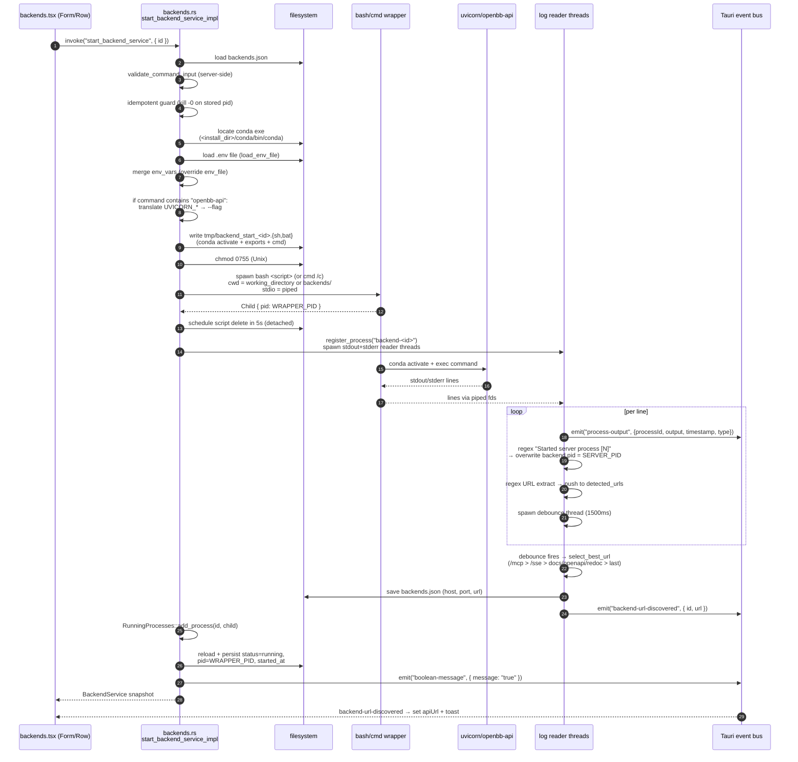

# Feature: Backend Services

## Purpose

Users need to run long-lived HTTP servers — primarily `openbb-api` (Platform REST API)
and `openbb-mcp` (MCP server), but also any user-defined process — out of a chosen
conda environment, with their lifecycle (start, stop, auto-start at app launch, log
streaming, URL discovery) managed by the desktop app. The Backends page is the CRUD
surface plus the start/stop controls; the actual process management is heavyweight
because every spawn goes through a generated shell wrapper that activates conda,
exports `.env` files, and special-cases `openbb-api`/`openbb-mcp` argument
translation. Log streaming is a sibling concern delegated to
`feature-logs-streaming.md`.

## User flows

1. **Golden path — start the seed `OpenBB API` backend.** User opens `/backends`,
   sees the two seed entries (created post-install — see
   `feature-installation.md`), clicks Start. The row optimistically flips to
   "starting"; ~2-5 s later the URL pill appears with `http://127.0.0.1:6900`.
   A toast offers to open Workspace.
2. **Create a custom backend.** Click "New Backend", fill the form (name, command,
   environment, optional env_file/env_vars/host/port/working_directory), submit.
   Page reloads. New row appears with status `stopped`.
3. **Edit while stopped.** Open per-row config panel, edit fields, save. Update is
   non-restarting — changes apply on next manual start.
4. **Toggle auto-start.** Per-row config has Auto-Start toggle. Persists to
   `backends.json`; next app launch will spawn it 100 ms after Tauri setup completes.
5. **View live logs.** Click Logs button → opens dedicated webview window
   `/backend-logs?id=<uuid>` (one per backend; reusable across hide/show; see
   `feature-logs-streaming.md`).
6. **Stop.** Click Stop. Frontend marks `stopping`; Rust kills via three converging
   paths (port-kill → tracked-child kill → PID fallback kill); ~3 s later status =
   `stopped`.
7. **Delete.** Trash icon (only visible when stopped). If still running, Rust calls
   `stop_backend_service` first, then removes the entry.
8. **Generate a self-signed cert.** "Generate Certificate" button → modal → produces
   `private.key`, `certificate.pem`, `certificate.p12` in chosen dir; optionally
   adds to OS trust store. Independent of any backend service — user must wire the
   cert into a backend command themselves (`--ssl-keyfile`/`--ssl-certfile`).

Edges:

- **Command fails sanitiser:** server-side validation rejects (`sudo`, `eval`,
  `$(...)`, backticks, more than 2 `;`/`&&`, ANY `|`). Backend persists with
  `status=error`; no spawn.
- **Conda missing:** explicit error before spawn.
- **Port already bound (non-`openbb-api`):** uvicorn emits "address already in use";
  log-listener flips status to `error` and stops.
- **Port already bound (`openbb-api` specifically):** Python `check_port` silently
  increments to next free port — frontend records the actual bound port from the log
  banner. No error surfaced. ⚠️ asymmetry with other servers.
- **Auto-start race with manual start:** if user clicks Start within the 100 ms +
  N×500 ms init window, both spawns may race; `RunningProcesses.add_process` rejects
  the duplicate, the loser's bash wrapper is orphaned and untracked.

## UI surface

Frontend page: `/home/user/OpenBBPort/desktop/src/routes/backends.tsx` (2741 lines).

- **`BackendsPage`** (`backends.tsx:2351-2741`): mounts, fetches services, renders
  list, owns create/edit modals.
- **`BackendServiceItem`** (`backends.tsx:577-1300`): per-row card. Status pill,
  start/stop, logs, edit, delete buttons. Inline config panel. Local log listener
  for PID/error/URL heuristics (`:656-801`).
- **`BackendForm`** (`backends.tsx:1380-2200`): create/edit form. Client regex
  blacklist `validateCommandInput` (`:1302-1377`). Debounced
  `check_directory_exists` (`:1440-1461`) and `check_file_exists` validation.
- **`DeleteConfirmationModal`** (`backends.tsx:217-280`).
- **`CertificateGenerationModal`** (`backends.tsx:284-559`): CN, org, SAN CSV,
  output dir, days valid, password, "add to trust store" checkbox.
- **Logs window**: `/home/user/OpenBBPort/desktop/src/components/BackendLogsPage.tsx`
  (266 lines), route `/home/user/OpenBBPort/desktop/src/routes/backend-logs.tsx`.

Validation:

- Client `validateCommandInput` (`backends.tsx:1302-1377`) bans dangerous patterns;
  matches the Rust `validate_command_input` (`command_sanitizer.rs:369-420`) — but
  client can be bypassed; server enforces.
- Env file existence: `check_file_exists` paints input red but does NOT block submit.
- Working dir existence: `check_directory_exists` same — informational only.

## Data flow

### Start lifecycle



### Stop lifecycle

```mermaid
sequenceDiagram
    autonumber
    participant UI as backends.tsx (Row)
    participant Rust as backends.rs<br/>stop_backend_service_impl
    participant FS as filesystem
    participant OS as OS process table
    participant Wrap as bash wrapper (WRAPPER_PID)
    participant Srv as uvicorn (SERVER_PID)
    participant Bus as Tauri event bus

    UI->>Rust: invoke("stop_backend_service", { id })
    Rust->>FS: load backends.json → find backend
    Rust->>Bus: emit "🎯 Killing all processes on port <port>" (type:"system")
    alt backend.port set
        alt macOS
            Rust->>OS: lsof -ti tcp:<port>  (no -sTCP:LISTEN — kills clients too)
            Rust->>OS: kill -9 <each PID>
        else Linux
            Rust->>OS: fuser -k <port>/tcp
            Rust->>OS: lsof -ti tcp:<port>; kill -9 backup
        else Windows
            Rust->>OS: netstat -ano | parse :<port>+LISTENING
            Rust->>OS: taskkill /F /PID <pid>
        end
        Rust->>Rust: sleep 2s
    end
    Rust->>Bus: emit "🛑 Stopping backend service '<name>'"
    Rust->>OS: RunningProcesses.kill_process(id)<br/>(child.kill + child.wait)
    OS->>Wrap: SIGKILL — wrapper bash dies<br/>(uvicorn may survive as orphan)
    Rust->>Bus: emit "💀 Terminating process PID <pid>"
    Rust->>OS: kill -9 <backend.pid><br/>(now = SERVER_PID if log reader overwrote it)
    OS->>Srv: SIGKILL — uvicorn dies
    Rust->>Rust: sleep 1s
    Rust->>FS: save status=stopped, pid=None,<br/>url=None, host=None, port=None, started_at=None
    Rust->>Bus: emit "🟢 Backend service '<name>' stopped successfully"
    Rust-->>UI: ()
    UI->>UI: fetchBackends() → refresh list
```

## IPC contract

| Direction | Name | Payload | Returns | Used by |
|-----------|------|---------|---------|---------|
| JS → Rust | `list_backend_services` | – | `BackendService[]` | page mount, refresh |
| JS → Rust | `create_backend_service` | `{ backend: BackendService }` (id ignored — Rust assigns UUID) | `BackendService` | form submit |
| JS → Rust | `update_backend_service` | `{ backend: BackendService }` (partial: only `Some` fields overwrite) | `BackendService` | edit, auto-start toggle, status writes |
| JS → Rust | `delete_backend_service` | `{ id }` | `()` (cascades to stop) | delete confirm |
| JS → Rust | `start_backend_service` | `{ id }` | `BackendService` | row Start |
| JS → Rust | `stop_backend_service` | `{ id }` | `()` | row Stop |
| JS → Rust | `open_backend_logs_window` | `{ id }` | `()` | row Logs |
| JS → Rust | `register_process_monitoring` | `{ processId: "backend-<id>" }` | `bool` | pre-open of logs window |
| JS → Rust | `get_process_logs_history` | `{ processId, count? }` | `LogEntry[]` | logs window backlog |
| JS → Rust | `clear_process_logs_history` | `{ processId }` | `bool` | logs window clear |
| JS → Rust | `generate_self_signed_cert` | `{ commonName, orgName, altNames, outputDir, daysValid, password, installInTrustStore }` | `{ key_path, cert_path, pkcs12_path, expires }` | cert modal |
| JS → Rust | `create_default_backend_services` | – | `()` | install completion |
| Rust → JS | `process-output` | `{ processId, output, timestamp, type: "stdout"\|"stderr"\|"system" }` | – | logs window + per-row monitor; see `feature-logs-streaming.md` |
| Rust → JS | `backend-url-discovered` | `{ id, url }` | – | page-level listener (`:2218-2293`) — sets apiUrl, fires toast |
| Rust → JS | `boolean-message` | `{ message: "true" }` | – | vestigial start-success signal |

## State surfaces

### TS interface (frontend, `backends.tsx:23-64`)

```ts
interface BackendService {
  id: string;                                 // UUID v4, assigned by Rust on create
  name: string;
  command: string;                            // free-form shell command
  host?: string;                              // populated by URL discovery
  port?: number;                              // populated by URL discovery
  envFile?: string;                           // path to .env; on wire as "envFile" (camelCase)
  env_file?: string;                          // legacy alias — frontend tolerates both
  envVars?: Record<string, string>;           // inline env, applied AFTER envFile
  environment: string;                        // conda env name
  autoStart: boolean;                         // UI shape
  auto_start: boolean;                        // wire shape (snake_case from Rust)
  status: "running" | "stopped" | "starting" | "stopping" | "error";
  pid?: number;                               // WRAPPER PID initially; overwritten with SERVER PID if uvicorn
  startedAt?: string;                         // ISO-8601 (Rust calls it started_at)
  error?: string;
  apiUrl?: string;                            // UI alias for `url`
  url?: string;                               // best URL chosen by debounced log scan
  working_directory?: string;
}
```

### Serialized JSON shape on disk (sparse — `#[serde(skip_serializing_if = "Option::is_none")]`)

A freshly created entry:

```json
{
  "id": "01963f7a-7f8c-7c84-bff2-...",
  "name": "OpenBB API",
  "command": "openbb-api --host 127.0.0.1 --port 6900",
  "environment": "openbb",
  "auto_start": false,
  "status": "stopped"
}
```

After a successful start with URL discovery:

```json
{
  "id": "...",
  "name": "OpenBB API",
  "command": "openbb-api --host 127.0.0.1 --port 6900",
  "environment": "openbb",
  "auto_start": false,
  "status": "running",
  "host": "127.0.0.1",
  "port": 6900,
  "url": "http://127.0.0.1:6900",
  "pid": 12345,
  "started_at": "2026-05-15T..."
}
```

After stop, all runtime fields (`host`, `port`, `url`, `pid`, `started_at`) are reset
to `None` and therefore omitted from output (`backends.rs:524-529`).

**Wire-casing asymmetry:** `envFile`/`envVars` are camelCase via
`#[serde(rename = ...)]` (alias lets reads accept legacy `env_file`); all other
snake_case fields stay snake_case. The frontend normalises both casings on receipt
(`backends.tsx:2365-2372`). A TS port should pick one convention and migrate.

### Rust managed state (`main.rs:489-491`)

- `ProcessLogState(LogStorage)` — `Arc<Mutex<HashMap<String, LogBuffer>>>`, keyed by
  `"backend-<id>"` for log entries. Capped at 10k lines per buffer
  (`process_monitor.rs:68`). Singleton via `Lazy`. Shared with Jupyter/conda streams.
- `RunningProcesses` — `Arc<Mutex<HashMap<String, std::process::Child>>>`, keyed by
  **bare backend id** (no prefix). See finding 6 in
  `raw-deep-dives/logs-streaming.v2.md`: this key/prefix divergence is a footgun —
  wrap in `processIdForLogs(uuid)` and `processIdForKill(uuid)` helpers in the port.
- `InstallationState` — read once at boot.

## Persistence

- **File:** `<install_dir>/backends/backends.json` — pretty JSON array.
- **`<install_dir>`** read from
  `~/.openbb_platform/system_settings.json → install_settings.installation_directory`
  (`helpers.rs:627-650`).
- **Directory auto-created** if missing (`backends.rs:197-207`).
- **Writes** (`backends.rs:243-286`): open → `try_lock_exclusive` advisory file lock
  → seek 0 → set_len 0 → write_all → flush → unlock. If another writer holds the
  lock, write **fails immediately** (non-blocking try).
- **Reads** (`backends.rs:215-240`): NO locking. Last-writer-wins. ⚠️ BUG: read path
  can observe a torn write under heavy concurrency (rare in practice; one writer
  thread per save, no contention from the log reader's read+write).
- **Tmp wrapper scripts**: `temp_dir()/backend_start_<id>.{sh,bat}`. Filename keyed
  by backend id (NOT per-invocation random) — rapid restarts can have their script
  deleted by a stale 5-second cleanup timer from the previous start. See known bugs.

## Error handling

| Failure | Detection | Reaction |
|---|---|---|
| Dangerous command (client) | regex blacklist `backends.tsx:1302-1377` | submit blocked, inline error |
| Dangerous command (server) | `validate_command_input` `command_sanitizer.rs:369-420` | spawn refused, backend persisted `status=error` |
| Conda exe missing | path probe `backends.rs:712-717` | Tauri command Err → frontend toast |
| Missing executable inside conda env | bash emits `: command not found` → log reader regex `backends.rs:1008` | clean_error_message, persist error, kill wrapper |
| Port collision (non-openbb-api) | log heuristic `"address already in use"` (`backends.tsx:669`) | frontend stops + persists `status=error` |
| Port collision (openbb-api) | NOT detected — `check_port` auto-increments silently (`utils/api.py:82-93`) | log reader records the new port; user sees URL change |
| Python traceback | frontend buffers from `Traceback` line until blank/`>`/`$` or 2 s timeout | persist error + stop |
| Bad env_file path | `load_env_file` Err | logged warning, start CONTINUES (`backends.rs:741-744`) |
| Bad working_directory | not pre-checked Rust-side | `cmd.spawn()` fails |
| File-lock contention on save | `try_lock_exclusive` Err | command returns Err to frontend |
| URL never discovered | 45 s frontend failsafe (`backends.tsx:804-813`) | hide spinner; status stays `running` |
| Stale `running` after app crash | startup re-scan `is_process_running(pid)` (`backends.rs:1455-1475`) | downgrade to `stopped`, clear runtime fields |

## Wrapper-PID vs server-PID divergence (the central edge case)

This is the source of MOST stop-path bugs. Read carefully:

1. `cmd.spawn()` returns `Child { id: WRAPPER_PID }` — the bash/cmd PID.
2. The wrapper does `conda activate <env> && <command>` — uvicorn runs as a **child
   of bash**, NOT via `exec`. So bash is alive and uvicorn is a separate PID.
3. The log reader watches stdout, sees `Started server process [N]` (uvicorn's
   standard log line), and **overwrites `backend.pid` from WRAPPER_PID → SERVER_PID**
   (`backends.rs:1040-1047`).
4. Immediately after, `start_backend_service_impl` reloads and writes
   `pid = WRAPPER_PID` (`backends.rs:1184`). **Race:** if uvicorn boots in <100 ms
   on a fast machine, step 3 happens before step 4, and the wrapper PID wins. On
   stop, `kill -9 <backend.pid>` then kills bash — not uvicorn — and only the port
   fallback rescues the cleanup.
5. On stop, **three independent kill paths converge**:
   - port-based kill (kills any listener on `backend.port`),
   - `RunningProcesses.kill_process(id)` (kills bash wrapper),
   - PID-fallback `kill -9 <backend.pid>` (kills whatever PID is stored).

Redundancy is load-bearing. For a non-uvicorn backend whose logs lack
`Started server process [N]` AND whose banner doesn't contain a matching
IPv4/localhost URL (so `backend.port` is unknown), **none of the three paths kills
the actual server**. The frontend shows `stopped`; the process keeps running.

> ⚠️ BUG: For backends that are neither uvicorn nor URL-identifiable, the Stop
> button doesn't actually stop the server. Add a generic "kill process tree" path
> in the port (e.g. `pid` of wrapper + every descendant).

## `UVICORN_*` → `--<flag>` translation and the openbb-api/openbb-mcp special case

At `backends.rs:774-807`, the start path runs:

```rust
if command_to_run.contains("openbb-api") {
    if env_file is set { command_to_run += format!(" --env_file \"{path}\"") }
    for (key, value) in env_file_vars ∪ env_vars {
        if let Some(rest) = key.strip_prefix("UVICORN_") {
            let arg = "--" + rest.to_lowercase();
            if !command_to_run.contains(&arg) {
                command_to_run += format!(" {arg} \"{value}\"");
            }
        }
    }
}
```

- **Substring match against the WHOLE command** — not argv[0]. So
  `bash -c "openbb-api ..."` matches; `python -m openbb_platform_api.main` does NOT
  match (false negative); a stray "openbb-api" in a comment matches (harmless false
  positive).
- **openbb-mcp uses a different protocol entirely** (`OPENBB_MCP_UVICORN_CONFIG`
  JSON string, see `extensions/mcp_server/openbb_mcp_server/models/settings.py:192`).
  The translation does NOT fire for `openbb-mcp`, AND would not work even if it did
  — wrong env-var name. A user who puts `UVICORN_HOST=0.0.0.0` in the MCP env_file
  sees no effect.
- **Skip-if-flag-already-present rule:** if the seed command already has
  `--port 6900`, `UVICORN_PORT=7000` in the env_file is silently ignored. The
  precedence chain (highest first): `--port` literal > `UVICORN_PORT` (only if
  command lacks `--port` AND command contains `openbb-api`) > `OPENBB_API_PORT` env >
  `system_settings.python_settings.uvicorn.port` > default 6900.
- **No value escaping**: the format string is `format!(" {arg} \"{value}\"")` — a
  bare double-quote interpolation with no escape. `UVICORN_HOST="$(rm -rf ~)"`
  is shell-evaluated by the wrapper script. ⚠️ command-injection via env_file
  values; see known bugs.

## ▸ Interfaces with

- **depends-on** `feature-environments.md` — backends spawn inside a conda env;
  `list_conda_environments` populates the env dropdown; conda exe is located via
  the install dir. The env must exist before the backend can start.
- **depends-on** `feature-platform-rest-api.md` — the canonical thing started here
  is `openbb-api` (and `openbb-mcp`). The `UVICORN_*` translation only makes sense
  in that context. The Python `check_port` auto-increment behaviour interacts with
  the URL-discovery debounce.
- **depends-on** `feature-logs-streaming.md` — uses the `LOG_STORAGE` singleton, the
  `process-output` event channel, `register_process_monitoring`. The shell-wrapper
  PID divergence story and the log channel are shared infrastructure.
- **depends-on** `feature-installation.md` — `create_default_backend_services`
  seeds `OpenBB API` and `OpenBB MCP` at install completion (`startup.rs:1432-1469`).
  `<install_dir>` resolution comes from `system_settings.json` written during
  install.
- **shares-state-with** `feature-api-keys.md` — `openbb-api` instances inherit
  credentials from `user_settings.json` at request time (not at spawn).
- **depended-on-by** `feature-tray-and-autostart.md` — tray's app-level
  "Start at Login in Background" is the precondition for backend `auto_start: true`
  to actually run on system boot. Two layers of autostart.
- **depended-on-by** `feature-uninstall.md` — uninstall calls
  `stop_all_backend_services` before removing files (bounded by the same 3 s budget;
  see known bugs).

## TS port mapping

| Concern | Tauri/Rust today | TS port equivalent |
|---|---|---|
| Process spawn | `std::process::Command` via `EnvSystem::new_command` | `child_process.spawn` (Node) with `stdio: ['ignore', 'pipe', 'pipe']` |
| Shell wrapper script | write `temp_dir()/backend_start_<id>.{sh,bat}` then `bash <script>` / `cmd /c <script>` | Keep the pattern (conda activation requires sourcing `conda.sh` — cannot just `spawn('conda', ['activate'])`). Alternative: single `bash -c '. <conda>/etc/profile.d/conda.sh && conda activate <env> && <cmd>'`. **Use a per-invocation random suffix** (not just backend id) to avoid the rapid-restart deletion race. |
| chmod 0755 (Unix) | `fs.set_permissions` mode 0o755 | `fs.chmodSync(path, 0o755)` |
| Stdin/out capture | `Stdio::piped()` + two `BufReader::lines()` OS threads | `readline.createInterface({ input: child.stdout })` + same for stderr; or `child.stdout.on('data', ...)` with line-splitting |
| File lock on `backends.json` | `fs2::FileExt::try_lock_exclusive` | `proper-lockfile` npm — non-blocking try with the same semantics. Without it, expect corruption under log-reader-vs-user-edit races. |
| Env-file parse | hand-rolled `load_env_file` (quote strip + comment skip) | `dotenv` npm — verify it strips matching surrounding quotes the same way; otherwise inline the parser |
| Env-merge order | env_file first, env_vars override | `{ ...fileVars, ...explicitVars }` |
| Env value escaping in shell exports | bash single-quote rule `v.replace('\'', "'\\''")` | `shell-quote` npm `.quote([v])` — or replicate the exact bash transform |
| `UVICORN_*` translation | conditional on `command.contains("openbb-api")`, regex `/^UVICORN_(.+)$/i`, append ` --<lower(rest)> "<value>"` if not already in command | Same condition, same regex. **Run env value through `shell-quote`** before interpolation to plug the injection hole. Consider generalising to a per-command translation table so `openbb-mcp` can be handled too. |
| Port-based kill (macOS) | `lsof -ti tcp:<port>` (NO `-sTCP:LISTEN`) + `kill -9` | `execFile('lsof', ['-ti', 'tcp:<port>', '-sTCP:LISTEN'])` — **add the listen filter** (jupyter does; backends doesn't — this is a bug; see known bugs) |
| Port-based kill (Linux) | `fuser -k <port>/tcp` then `lsof -ti` backup | Same; filter to listeners via `ss -ltnp` parse or `lsof -sTCP:LISTEN` |
| Port-based kill (Windows) | `netstat -ano` parse `:<port>` AND `LISTENING`, `taskkill /F /PID <pid>` | Same; use Node `execFile`. Or `fkill` npm. |
| PID liveness | Unix `kill -0 <pid>`, Win `tasklist /FI "PID eq N" /NH` | Node: `try { process.kill(pid, 0); return true } catch { return false }`; Win fallback to `tasklist` exec |
| Tracked-child kill | `Child::kill()` + `Child::wait()` | `child.kill('SIGKILL')` (currently SIGKILL only; see open questions) |
| URL extract regex | `(https?://(?:localhost\|\d{1,3}(?:\.\d{1,3}){3})(?::\d+)?(?:[^\s]*)?)` | Port verbatim. Consider extending to accept `0.0.0.0` distinctly and rewrite to `localhost` for browser-routability. |
| Best-URL selection | `/mcp` ending > `/sse` ending > contains `/mcp\|/sse` > contains `docs\|openapi\|redoc` > last URL | Pure function port; fix the "MCP server" suffix-append to track the line that contained "MCP server" (not last URL line). |
| URL debounce (1500ms) | `Mutex<Option<JoinHandle>>` + `thread::sleep` + `unpark` (which **doesn't interrupt sleep** — multiple threads pile up) | `setTimeout` + `clearTimeout` on each new URL line. ONE timer at a time. |
| URL parse → host+port | `url::Url::parse` → `host_str()` / `port()` | `new URL(s)` — note `.port` returns `""` for default 80/443 |
| ANSI strip | regex `\x1B\[[0-9;]*[a-zA-Z]` (server) / `\[[0-9;]*m` (per-row monitor) / `\[[0-9;]*m` + `[\x00-\x1F\x7F-\x9F]` (logs window) | `strip-ansi` npm — or inline; **be consistent across paths** (the current Rust has three different regexes, see logs-streaming.v2 §E) |
| Self-signed cert generation | `openssl` crate: RSA-2048, X509 v3, PKCS#8 PEM key, PKCS#12 bundle | `node-forge` (pure JS, ships PKCS#12) or `node:crypto` X509 helpers; or shell out to `openssl` binary |
| Trust-store install (Win) | `certutil -user -addstore Root <pem>` | Same shell-out |
| Trust-store install (mac) | `security add-trusted-cert -d -r trustRoot -k ~/Library/Keychains/login.keychain-db <pem>` | Same shell-out |
| Trust-store install (Linux) | `which certutil`, create `~/.pki/nssdb` if missing (`certutil -N`), then `certutil -A -n "..." -t TC,, -i <pem> -d sql:<dir>` | Same shell-out; **pre-check `~/.pki` parent dir exists** to surface a clearer error than the confusing `SEC_ERROR_LEGACY_DATABASE` |
| Default seed | `create_default_backend_services` at install completion (`startup.rs:1432-1469`) | Same — call at install hook; idempotent on existing names |
| App-quit cleanup budget | 10 s outer wall, 3 s for `stop_all_backend_services` | Parallelise stops (`Promise.all`) instead of sequential; or remove the 2 s + 1 s sleeps and poll for death |

## Known bugs and port-time fixes

- ⚠️ **SIGKILL only, no SIGTERM.** Stop sends `kill -9` directly with no
  graceful-shutdown attempt. Backends can't flush state, close sockets cleanly, or
  finish in-flight requests. Port: send SIGTERM, wait up to 2 s polling for exit,
  then SIGKILL.
- ⚠️ **Port-collision detection via log heuristic only.** Frontend regex
  `address already in use` (`backends.tsx:669`) misses `openbb-api`'s
  silent auto-increment (`utils/api.py:82-93` emits `"Port X is already in use.
  Using port Y."` which does NOT contain the matched substring). Port: emit a
  structured `port-rebind` event from the launcher; or pre-bind a probe socket in
  Rust before spawn.
- ⚠️ **No proactive crash detection.** Rust never polls the wrapper child for
  unexpected exit. "Running → error" transitions happen only via log-text
  heuristics in the frontend (`ERROR:`, `Traceback`, `command not found`). A
  silently-crashing backend stays `status=running` in the UI indefinitely. Port:
  spawn a `child.on('exit', ...)` listener that flips status to `error` if exit
  was unexpected.
- ⚠️ **`backends.json` read has no file lock.** Last-writer-wins; the log reader
  thread races the user's edit. Port: take an advisory shared lock on read AND
  exclusive on write.
- ⚠️ **`unpark` doesn't interrupt `thread::sleep` — URL debounce is N parallel
  threads, not a real debounce.** Each URL-bearing log line spawns a new 1500 ms
  thread; the old ones keep running and all fire. Save calls pile up on the file
  lock; some fail silently. Port: real `setTimeout`/`clearTimeout`.
- ⚠️ **macOS/Linux port-kill lacks `-sTCP:LISTEN` filter** (`backends.rs:362-407`).
  Compare with Jupyter (`jupyter.rs:380-386`) which DOES filter — same codebase,
  inconsistent. Backend stop SIGKILLs any client process with an active TCP
  connection to that port (browsers, curl, etc.). Port: add `-sTCP:LISTEN`.
- ⚠️ **Wrapper-PID vs server-PID race.** If uvicorn boots faster than the
  start-flow's pid-overwrite, the wrapper PID wins and stop's PID-fallback kills
  bash, not uvicorn. Port: stop overwriting from the spawn-flow side; trust the log
  reader's PID extraction.
- ⚠️ **Servers without `Started server process [N]` AND without an IPv4/localhost
  banner URL have no reliable stop.** No PID extraction, no port-based kill, no
  fallback. The wrapper dies; the server orphans. Port: add `pkill -P <wrapper>`
  / `taskkill /T /PID` to kill the whole process tree.
- ⚠️ **Cleanup budget exceeded for >1 backend.** Each stop sleeps 2 s + 1 s; 3 s
  total budget covers exactly one. Subsequent backends are interrupted mid-stop;
  uvicorn children get reparented to init and persist. Port: parallelise or drop
  the sleeps.
- ⚠️ **Env-value command injection.** `UVICORN_*` translation interpolates env
  values into the shell command with bare double quotes and NO escaping. Port: run
  every env value through `shell-quote` or reject values containing `$`, `` ` ``,
  `"`, `\`.
- ⚠️ **Shell-wrapper script filename keyed by backend id, not per-invocation.**
  Rapid restarts can have the script deleted mid-execution by a stale 5 s timer
  from the previous start. OS-dependent: Linux/macOS tolerant via FD semantics;
  Windows lossy.
- ⚠️ **`select_best_url` suffix-append checks the wrong line.** The "if log line
  contained 'MCP server', append `/mcp`" check uses `last_line_with_url`, which is
  usually NOT the line that mentioned "MCP server" (those come on separate uvicorn
  INFO lines). MCP toast often shows bare URL instead of `.../mcp`.
- ⚠️ **`pid` overwritten on every start to wrapper PID** (`backends.rs:1184`),
  clobbering the log-reader's correct SERVER_PID if it landed first. Race.
- ⚠️ **`type` discriminator is dead bytes on the wire.** All consumers
  destructure-away the `type` field; system messages are differentiated only by
  emoji prefix in `output`. Port: drop the field, or actually render system lines
  with a distinct style.
- ⚠️ **Logs window log content goes through `dangerouslySetInnerHTML` with no HTML
  escape.** A malicious backend can inject DOM nodes via stdout. Port: use JSX
  interpolation; never innerHTML log content. (Mostly a logs-streaming concern;
  noted here because backends are a vector.)
- ⚠️ **`<install_dir>/backends/` is the default cwd for all backends.** Accidental
  relative-path writes by backend code can collide. Port: use
  `<install_dir>/backends/<id>/` per-backend cwd.
- ⚠️ **No UI feedback during `initialize_backends`.** 100 ms + N × 500 ms delay
  with no progress event. User clicks during the window can spawn duplicates. Port:
  emit `backends-initializing-start/complete`; disable Start during it.
- ⚠️ **Private key (`private.key`) is NEVER password-protected** even when the
  user provides a cert password (which only covers the `.p12`). Misleading.
- ⚠️ **`unregister_process_monitoring` is dead code.** Log buffers grow
  monotonically; deleted backends leave behind a stale buffer until app shutdown.
  Port: call on delete.

## Open questions

1. **Should stop use SIGTERM-then-SIGKILL?** Friendly to backends that own
   in-flight state (DB writes, WebSocket peers). Cost: ~2 s extra delay per stop —
   manageable if we parallelise stops at quit time. **Recommendation: yes.**
2. **Should backends know about each other's ports?** Currently two configured
   backends on port 6900 will silently auto-increment one of them
   (`openbb-api`-only) or one will fail (others). No cross-config validation. A
   "Port X is used by backend Y" pre-flight check would catch the obvious cases
   without intrusive coordination. **Recommendation: yes for openbb-api; warn on
   form save.**
3. **Should the `UVICORN_*` translation be generalised?** Today it's a
   substring check for `openbb-api` only. Options:
   - (a) document the limitation; tell MCP users to set
     `OPENBB_MCP_UVICORN_CONFIG` themselves.
   - (b) per-command translation table:
     `{ "openbb-api": uvicornToFlags, "openbb-mcp": mcpToConfig, ... }`.
   - (c) drop the translation entirely; require users to write the flags in the
     command field.
   **Recommendation: (b) — explicit table, escaped values, server side validates the
   final command.**
4. **Per-backend cwd or shared `<install_dir>/backends/`?** Shared cwd has
   collision risks; per-backend `<install_dir>/backends/<id>/` isolates them at
   the cost of an extra directory per backend. **Recommendation: per-backend.**
5. **Should the cert-gen flow be coupled to a backend?** Today it produces files
   the user must wire in manually. A one-click "Apply to <backend>" that appends
   `--ssl-keyfile`/`--ssl-certfile` to the command would dramatically improve UX
   for the openbb-api HTTPS case.
6. **Drop the `apiUrl`/`url`, `autoStart`/`auto_start`, `envFile`/`env_file` dual
   casing.** Pick one (camelCase recommended) and migrate `backends.json` on read.

---

## Cross-feature dependencies

- **depends-on** `feature-logs-streaming.md` for the `LOG_STORAGE` ring buffer,
  the `process-output` event, and `register_process_monitoring` — same
  infrastructure shared with Jupyter and conda installs.
- **depends-on** `feature-environments.md` — the conda env must exist; conda exe is
  located via the install dir.
- **depends-on** `feature-platform-rest-api.md` — primary spawn target;
  `check_port` interaction; UVICORN translation context.
- **depends-on** `feature-installation.md` — seed services, `<install_dir>`
  resolution.
- **shares-state-with** `feature-api-keys.md` via `user_settings.json` (credentials
  inherited by openbb-api at request time).
- **depended-on-by** `feature-tray-and-autostart.md` — app-level autostart is the
  precondition for backend `auto_start`.
- **depended-on-by** `feature-uninstall.md` — stops all backends before file
  removal.
