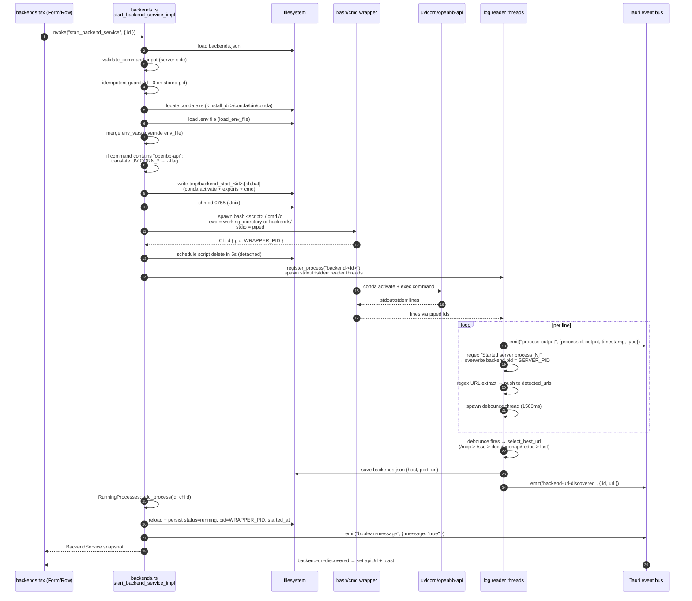

# Feature: Backend Services

## Purpose

Users need to run long-lived HTTP servers — primarily `openbb-api` (Platform REST API)
and `openbb-mcp` (MCP server), and any user-defined process — out of a chosen conda
environment, with lifecycle (start, stop, auto-start, log streaming, URL discovery)
managed by the desktop app. The Backends page is the CRUD surface plus start/stop
controls; every spawn goes through a generated shell wrapper that activates conda,
exports `.env` files, and special-cases `openbb-api` argument translation. Log
streaming itself is delegated to `feature-logs-streaming.md`.

## User flows

1. **Golden path — start the seed `OpenBB API`.** Open `/backends`, see two seed
   entries (post-install — see `feature-installation.md`), click Start. Row flips to
   "starting"; ~2-5 s later the URL pill appears with `http://127.0.0.1:6900`.
2. **Create a custom backend.** "New Backend" → form (name, command, environment,
   optional env_file/env_vars/host/port/working_directory) → submit → page reloads.
3. **Edit while stopped.** Per-row config panel; non-restarting (changes apply on
   next manual start).
4. **Toggle auto-start.** Persists to `backends.json`; spawned 100 ms after Tauri
   setup on next launch.
5. **View live logs.** Logs button → dedicated webview window
   `/backend-logs?id=<uuid>` (one per backend, hide-on-close, reusable).
6. **Stop.** Frontend marks `stopping`; Rust kills via three converging paths
   (port-kill → tracked-child kill → PID fallback); ~3 s later `stopped`.
7. **Delete.** Trash icon (only when stopped). If running, cascades to stop first.
8. **Generate self-signed cert.** "Generate Certificate" modal → produces
   `private.key`, `certificate.pem`, `certificate.p12`; optionally adds to OS trust
   store. Independent of any backend — user must wire it into a backend command
   manually (`--ssl-keyfile`/`--ssl-certfile`).

Edges:

- **Command fails sanitiser** (`sudo`, `eval`, `$(...)`, backticks, more than 2
  `;`/`&&`, ANY `|`): backend persists with `status=error`; no spawn.
- **Port already bound (`openbb-api`):** Python `check_port` silently auto-increments
  to next free port — log reader records the new port; no error. ⚠️ asymmetric with
  other servers (which emit "address already in use" and flip to error).
- **Auto-start race with manual start:** during the 100 ms + N×500 ms init window,
  `RunningProcesses.add_process` rejects duplicates; loser's bash wrapper is orphaned
  and untracked.

## UI surface

Frontend: `/home/user/OpenBBPort/desktop/src/routes/backends.tsx` (2741 lines).

- `BackendsPage` (`:2351-2741`): page mount, fetches services, owns modals.
- `BackendServiceItem` (`:577-1300`): per-row card; local log listener for
  PID/error/URL heuristics (`:656-801`).
- `BackendForm` (`:1380-2200`): client regex blacklist `validateCommandInput`
  (`:1302-1377`); debounced `check_directory_exists` / `check_file_exists`.
- `DeleteConfirmationModal` (`:217-280`).
- `CertificateGenerationModal` (`:284-559`).
- Logs window: `/home/user/OpenBBPort/desktop/src/components/BackendLogsPage.tsx`
  (266 lines) at route `/home/user/OpenBBPort/desktop/src/routes/backend-logs.tsx`.

Validation: client regex blacklist matches server-side
`validate_command_input` (`command_sanitizer.rs:369-420`). Client can be bypassed;
server enforces. Env-file / working-dir existence checks paint inputs red but do NOT
block submit.

## Data flow

### Start lifecycle



### Stop lifecycle

```mermaid
sequenceDiagram
    autonumber
    participant UI as backends.tsx (Row)
    participant Rust as backends.rs<br/>stop_backend_service_impl
    participant FS as filesystem
    participant OS as OS process table
    participant Wrap as bash wrapper (WRAPPER_PID)
    participant Srv as uvicorn (SERVER_PID)
    participant Bus as Tauri event bus

    UI->>Rust: invoke("stop_backend_service", { id })
    Rust->>FS: load backends.json → find backend
    Rust->>Bus: emit "🎯 Killing all processes on port <port>" (type:"system")
    alt backend.port set
        alt macOS
            Rust->>OS: lsof -ti tcp:<port>  (no -sTCP:LISTEN — kills clients too)
            Rust->>OS: kill -9 <each PID>
        else Linux
            Rust->>OS: fuser -k <port>/tcp
            Rust->>OS: lsof -ti tcp:<port>; kill -9 backup
        else Windows
            Rust->>OS: netstat -ano | parse :<port>+LISTENING
            Rust->>OS: taskkill /F /PID <pid>
        end
        Rust->>Rust: sleep 2s
    end
    Rust->>Bus: emit "🛑 Stopping backend service '<name>'"
    Rust->>OS: RunningProcesses.kill_process(id)<br/>(child.kill + child.wait)
    OS->>Wrap: SIGKILL — wrapper bash dies<br/>(uvicorn may survive as orphan)
    Rust->>Bus: emit "💀 Terminating process PID <pid>"
    Rust->>OS: kill -9 <backend.pid><br/>(now = SERVER_PID if log reader overwrote it)
    OS->>Srv: SIGKILL — uvicorn dies
    Rust->>Rust: sleep 1s
    Rust->>FS: save status=stopped, pid=None, url=None,<br/>host=None, port=None, started_at=None
    Rust->>Bus: emit "🟢 Backend service '<name>' stopped successfully"
    Rust-->>UI: ()
```

## IPC contract

| Direction | Name | Payload | Returns | Used by |
|-----------|------|---------|---------|---------|
| JS → Rust | `list_backend_services` | – | `BackendService[]` | mount, refresh |
| JS → Rust | `create_backend_service` | `{ backend }` (id ignored — Rust assigns UUID) | `BackendService` | form submit |
| JS → Rust | `update_backend_service` | `{ backend }` (partial: only `Some` fields overwrite) | `BackendService` | edit, status writes |
| JS → Rust | `delete_backend_service` | `{ id }` | `()` (cascades to stop if running) | delete confirm |
| JS → Rust | `start_backend_service` | `{ id }` | `BackendService` | row Start |
| JS → Rust | `stop_backend_service` | `{ id }` | `()` | row Stop |
| JS → Rust | `open_backend_logs_window` | `{ id }` | `()` | row Logs |
| JS → Rust | `register_process_monitoring` | `{ processId: "backend-<id>" }` | `bool` | pre-open of logs window |
| JS → Rust | `get_process_logs_history` | `{ processId, count? }` | `LogEntry[]` | logs backlog |
| JS → Rust | `clear_process_logs_history` | `{ processId }` | `bool` | logs clear |
| JS → Rust | `generate_self_signed_cert` | `{ commonName, orgName, altNames, outputDir, daysValid, password, installInTrustStore }` | `{ key_path, cert_path, pkcs12_path, expires }` | cert modal |
| JS → Rust | `create_default_backend_services` | – | `()` | install completion |
| Rust → JS | `process-output` | `{ processId, output, timestamp, type: "stdout"\|"stderr"\|"system" }` | – | logs window + per-row monitor (see `feature-logs-streaming.md`) |
| Rust → JS | `backend-url-discovered` | `{ id, url }` | – | page listener `:2218-2293` — sets apiUrl + toast |
| Rust → JS | `boolean-message` | `{ message: "true" }` | – | vestigial start-success signal |

## State surfaces

### TS interface (frontend, `backends.tsx:23-64`)

```ts
interface BackendService {
  id: string;                                 // UUID v4, assigned by Rust on create
  name: string;
  command: string;                            // free-form shell command
  host?: string;                              // populated by URL discovery
  port?: number;                              // populated by URL discovery
  envFile?: string;                           // on wire as "envFile" (camelCase)
  env_file?: string;                          // legacy alias — frontend tolerates both
  envVars?: Record<string, string>;           // inline env, applied AFTER envFile
  environment: string;                        // conda env name
  autoStart: boolean;                         // UI shape
  auto_start: boolean;                        // wire shape (snake_case from Rust)
  status: "running" | "stopped" | "starting" | "stopping" | "error";
  pid?: number;                               // WRAPPER PID initially; overwritten with SERVER PID if uvicorn
  startedAt?: string;                         // Rust calls it started_at
  error?: string;
  apiUrl?: string;                            // UI alias for `url`
  url?: string;                               // best URL from debounced log scan
  working_directory?: string;
}
```

### Serialized JSON shape on disk (sparse — `skip_serializing_if = Option::is_none`)

Freshly created:

```json
{
  "id": "01963f7a-7f8c-7c84-bff2-...",
  "name": "OpenBB API",
  "command": "openbb-api --host 127.0.0.1 --port 6900",
  "environment": "openbb",
  "auto_start": false,
  "status": "stopped"
}
```

After successful start with URL discovery:

```json
{
  "id": "...", "name": "OpenBB API",
  "command": "openbb-api --host 127.0.0.1 --port 6900",
  "environment": "openbb", "auto_start": false,
  "status": "running",
  "host": "127.0.0.1", "port": 6900, "url": "http://127.0.0.1:6900",
  "pid": 12345, "started_at": "2026-05-15T..."
}
```

After stop, all runtime fields are reset to `None` and omitted
(`backends.rs:524-529`).

**Wire-casing asymmetry:** only `envFile`/`envVars` use `#[serde(rename = ...)]` to
camelCase; all other snake_case fields stay snake_case. Frontend normalises both
casings (`backends.tsx:2365-2372`). Pick one in the port.

### Rust managed state (`main.rs:489-491`)

- `ProcessLogState(LogStorage)` — `Arc<Mutex<HashMap<String, LogBuffer>>>`, keyed by
  `"backend-<id>"`, 10k cap. Shared singleton (see `feature-logs-streaming.md`).
- `RunningProcesses` — `Arc<Mutex<HashMap<String, std::process::Child>>>`, keyed by
  **bare backend id** (no prefix). ⚠️ Key-prefix divergence between LogStorage and
  RunningProcesses is a footgun — wrap in helpers in the port.
- `InstallationState` — read once at boot.

## Persistence

- **File:** `<install_dir>/backends/backends.json` (pretty JSON array).
- **`<install_dir>`** from
  `~/.openbb_platform/system_settings.json → install_settings.installation_directory`.
- **Writes** (`backends.rs:243-286`): open → `try_lock_exclusive` (non-blocking) →
  seek/truncate/write/flush → unlock. Lock failure surfaces as command Err.
- **Reads** (`backends.rs:215-240`): NO locking. ⚠️ Last-writer-wins.
- **Tmp wrapper scripts**: `temp_dir()/backend_start_<id>.{sh,bat}`. Filename keyed
  by backend id (NOT per-invocation random) — rapid restarts can have their script
  deleted mid-execution by a stale 5 s timer.

## Error handling

| Failure | Detection | Reaction |
|---|---|---|
| Dangerous command (client/server) | regex blacklist | submit blocked / spawn refused, persisted `status=error` |
| Conda exe missing | path probe | Tauri Err → frontend toast |
| Missing exe in conda env | log regex `: command not found` | persist error, kill wrapper |
| Port collision (non-openbb-api) | log regex `address already in use` | frontend stops + persists `status=error` |
| Port collision (openbb-api) | NOT detected — silent auto-increment | log reader records new port; user sees URL change |
| Python traceback | frontend buffer from `Traceback` until blank/`>`/`$` or 2 s | persist error + stop |
| Bad env_file path | `load_env_file` Err | logged warning; start CONTINUES |
| Bad working_directory | not pre-checked | `cmd.spawn()` fails |
| URL never discovered | 45 s frontend failsafe | hide spinner; status stays `running` |
| Stale `running` after crash | startup `is_process_running(pid)` scan | downgrade to `stopped` |

## Wrapper-PID vs server-PID divergence (the central edge case)

This is the source of MOST stop-path bugs:

1. `cmd.spawn()` returns `Child { id: WRAPPER_PID }` — the bash/cmd PID.
2. Wrapper does `conda activate <env> && <command>` — uvicorn runs as a **child of
   bash**, NOT via `exec`. Bash is alive AND uvicorn is a separate PID.
3. Log reader sees `Started server process [N]` (uvicorn's standard line) and
   **overwrites `backend.pid` from WRAPPER_PID → SERVER_PID** (`backends.rs:1040-47`).
4. Immediately after, `start_backend_service_impl` reloads and writes
   `pid = WRAPPER_PID` (`backends.rs:1184`). **Race:** if uvicorn boots in <100 ms,
   step 3 happens BEFORE step 4 and the wrapper PID wins — stop's PID-fallback then
   kills bash, not uvicorn. Only the port-kill rescues the cleanup.
5. On stop, **three independent kill paths converge** by design:
   - port-based kill (any listener on `backend.port`),
   - `RunningProcesses.kill_process(id)` (bash wrapper),
   - PID-fallback `kill -9 <backend.pid>` (whatever PID is currently stored).
   Redundancy is load-bearing — any single path can fail.

⚠️ For a non-uvicorn backend whose logs lack `Started server process [N]` AND whose
banner doesn't contain a matching IPv4/localhost URL (so `backend.port` is unknown),
NONE of the three paths kills the actual server. Frontend shows `stopped`; process
keeps running. Port: add `pkill -P <wrapper>` / `taskkill /T /PID` to kill the whole
process tree.

## `UVICORN_*` → `--<flag>` translation and the openbb-api/openbb-mcp special case

At `backends.rs:774-807` (paraphrased):

```rust
if command_to_run.contains("openbb-api") {                  // SUBSTRING — not argv[0]
    if env_file is set { command_to_run += format!(" --env_file \"{path}\""); }
    for (key, value) in env_file_vars ∪ env_vars {
        if let Some(rest) = key.strip_prefix("UVICORN_") {
            let arg = "--".to_string() + &rest.to_lowercase();
            if !command_to_run.contains(&arg) {              // skip if flag already present
                command_to_run += format!(" {arg} \"{value}\"");   // NO ESCAPING
            }
        }
    }
}
```

Implications:

- **Substring match** — `bash -c "openbb-api ..."` matches; `python -m
  openbb_platform_api.main` does NOT (false negative); a stray "openbb-api" in a
  comment matches (harmless).
- **openbb-mcp uses a different protocol** (`OPENBB_MCP_UVICORN_CONFIG` JSON, see
  `extensions/mcp_server/openbb_mcp_server/models/settings.py:192`). Translation
  doesn't fire AND would use wrong env-var name even if it did. `UVICORN_HOST` in
  the MCP env_file has no effect.
- **Skip-if-flag-present**: seed command already has `--port 6900`, so
  `UVICORN_PORT=7000` is silently ignored. Precedence (highest first): `--port`
  literal > `UVICORN_PORT` (only if command lacks `--port` AND contains
  `openbb-api`) > `OPENBB_API_PORT` env > `system_settings.python_settings.uvicorn`
  > default 6900.
- **No value escaping**: `format!(" {arg} \"{value}\"")` is a bare double-quote
  interpolation. `UVICORN_HOST="$(rm -rf ~)"` is shell-evaluated by the wrapper.
  ⚠️ command injection via env_file values.

## ▸ Interfaces with

- **depends-on** `feature-environments.md` — env must exist; `list_conda_environments`
  populates dropdown; conda exe located via install dir.
- **depends-on** `feature-platform-rest-api.md` — canonical spawn target is
  `openbb-api`; `check_port` auto-increment interacts with URL discovery; UVICORN
  translation is server-specific.
- **depends-on** `feature-logs-streaming.md` — shared `LOG_STORAGE` singleton,
  `process-output` event channel, `register_process_monitoring`. Wrapper-PID story
  and log channel are joint infrastructure.
- **depends-on** `feature-installation.md` — `create_default_backend_services` seeds
  `OpenBB API` / `OpenBB MCP` at install; `<install_dir>` from `system_settings.json`.
- **shares-state-with** `feature-api-keys.md` — `openbb-api` reads credentials from
  `user_settings.json` at request time (not at spawn).
- **depended-on-by** `feature-tray-and-autostart.md` — app-level
  "Start at Login in Background" is the precondition for backend `auto_start`.
- **depended-on-by** `feature-uninstall.md` — stops all backends before file removal.

## TS port mapping

| Concern | Tauri/Rust today | TS port equivalent |
|---|---|---|
| Process spawn | `std::process::Command` | Node `child_process.spawn` with `stdio: ['ignore','pipe','pipe']` |
| Shell wrapper script | write `temp_dir()/backend_start_<id>.{sh,bat}` + `bash <script>` / `cmd /c` | Keep the pattern (conda activation requires sourcing `conda.sh`). Alternative: `bash -c '. <conda>/etc/profile.d/conda.sh && conda activate <env> && <cmd>'`. **Use per-invocation random suffix** to avoid rapid-restart deletion race. |
| chmod 0755 | `fs.set_permissions` mode 0o755 | `fs.chmodSync(path, 0o755)` |
| Stdio capture | `Stdio::piped()` + two `BufReader::lines()` OS threads | `readline.createInterface({ input: child.stdout })` per stream |
| File lock on backends.json | `fs2::FileExt::try_lock_exclusive` | `proper-lockfile` npm; non-blocking try; without it, expect corruption |
| Env-file parse | hand-rolled `load_env_file` (quote strip + comment skip) | `dotenv` npm — verify quote-strip parity |
| Env value escaping in shell exports | bash `value.replace('\'', "'\\''")` | `shell-quote` npm `.quote([v])` |
| `UVICORN_*` translation | substring check on `command.contains("openbb-api")`, append ` --<lower(rest)> "<value>"` if not present | Same rule; **escape values via `shell-quote`**. Consider a per-command translation table to also handle `openbb-mcp` → `OPENBB_MCP_UVICORN_CONFIG`. |
| Port-based kill (macOS) | `lsof -ti tcp:<port>` (NO `-sTCP:LISTEN`) + `kill -9` | `execFile('lsof', ['-ti', 'tcp:<port>', '-sTCP:LISTEN'])` — **add the listen filter** |
| Port-based kill (Linux) | `fuser -k <port>/tcp` + `lsof -ti` backup | Same; filter to listeners via `ss -ltnp` or `lsof -sTCP:LISTEN` |
| Port-based kill (Windows) | `netstat -ano` parse, `taskkill /F /PID` | Same; or `fkill` npm |
| PID liveness | Unix `kill -0`, Win `tasklist /FI` | Node `try { process.kill(pid, 0); true } catch { false }`; Win fallback to `tasklist` exec |
| Tracked-child kill | `Child::kill()` + `Child::wait()` (SIGKILL only) | `child.kill('SIGKILL')` — but **consider SIGTERM-then-SIGKILL** in the port |
| URL extract regex | `(https?://(?:localhost\|\d{1,3}(?:\.\d{1,3}){3})(?::\d+)?(?:[^\s]*)?)` | Port verbatim |
| Best-URL selection | `/mcp` > `/sse` > contains `/mcp\|/sse` > contains `docs\|openapi\|redoc` > last | Pure function port; fix MCP-suffix-append to track the line that mentioned "MCP server", not last URL line |
| URL debounce | `Mutex<Option<JoinHandle>>` + `thread::sleep` + `unpark` (which **doesn't interrupt sleep** — N threads pile up) | Real `setTimeout` + `clearTimeout` |
| URL parse → host+port | `url::Url::parse` → `host_str()` / `port()` | `new URL(s)` — note `.port` is `""` for default 80/443 |
| ANSI strip | three different regexes across paths (`\x1B\[[0-9;]*[a-zA-Z]`, `\[[0-9;]*m`, etc.) | `strip-ansi` npm; **be consistent** |
| Self-signed cert generation | `openssl` crate: RSA-2048, X509 v3, PKCS#8 PEM, PKCS#12 | `node-forge` (pure JS, PKCS#12 support) or `node:crypto` X509; or shell out to `openssl` |
| Trust-store install (Win) | `certutil -user -addstore Root <pem>` | Same shell-out |
| Trust-store install (mac) | `security add-trusted-cert -d -r trustRoot -k ~/Library/Keychains/login.keychain-db` | Same shell-out |
| Trust-store install (Linux) | `which certutil`, create `~/.pki/nssdb` if missing, `certutil -A` | Same; **pre-check `~/.pki` exists** to surface clearer error than `SEC_ERROR_LEGACY_DATABASE` |
| Default seed | `create_default_backend_services` at install completion | Call at install hook; idempotent on name collision |
| App-quit cleanup budget | 10 s outer wall, 3 s for stop_all (sequential; sleeps add up) | Parallelise via `Promise.all`; drop the 2 s + 1 s sleeps |

## Known bugs and port-time fixes

- ⚠️ **SIGKILL only, no SIGTERM.** Stop sends `kill -9` directly with no
  graceful-shutdown attempt. Port: SIGTERM, poll up to 2 s for exit, then SIGKILL.
- ⚠️ **Port-collision detection via log heuristic only.** The
  `address already in use` substring (`backends.tsx:669`) misses `openbb-api`'s
  silent auto-increment. Port: emit a structured rebind event from the launcher; or
  pre-bind a probe socket in Rust before spawn.
- ⚠️ **No proactive crash detection.** Rust never polls the wrapper child for
  unexpected exit. "Running → error" transitions happen only via frontend log-text
  heuristics. A silently-crashing backend stays `status=running` forever. Port:
  `child.on('exit', ...)` listener that flips to `error` on unexpected exit.
- ⚠️ **`backends.json` read has no file lock.** Log reader thread races user edits.
  Port: shared lock on read, exclusive on write.
- ⚠️ **`unpark` doesn't interrupt `thread::sleep`.** Each URL log line spawns a new
  1500 ms thread; old ones keep running and all fire. Saves pile up on the file
  lock; some fail silently. Port: real `setTimeout`/`clearTimeout`.
- ⚠️ **macOS/Linux port-kill lacks `-sTCP:LISTEN` filter** (`backends.rs:362-407`).
  Jupyter does it right (`jupyter.rs:380-386`); backends doesn't. Backend stop
  SIGKILLs any client process with an active TCP connection to that port. Port:
  add `-sTCP:LISTEN`.
- ⚠️ **Wrapper-PID vs server-PID race.** If uvicorn boots faster than the
  start-flow's pid-overwrite, wrapper PID wins; stop's PID-fallback kills bash,
  not uvicorn. Port: don't overwrite from the spawn side; trust the log reader.
- ⚠️ **Servers without uvicorn-style logs AND without an IPv4/localhost URL have
  no reliable stop.** Wrapper dies; server orphans. Port: kill process tree.
- ⚠️ **Cleanup budget exceeded for >1 backend.** Each stop sleeps 2 s + 1 s; 3 s
  total budget covers exactly one. Subsequent backends are interrupted mid-stop;
  uvicorn children get reparented to init. Port: parallelise or drop sleeps.
- ⚠️ **Env-value command injection.** `UVICORN_*` translation interpolates env
  values with bare double quotes and NO escaping. Port: `shell-quote` or reject
  values containing `$`, `` ` ``, `"`, `\`.
- ⚠️ **Shell-wrapper script filename keyed by backend id, not per-invocation.**
  Rapid restarts can have the script deleted mid-execution by a stale 5 s timer.
- ⚠️ **`select_best_url` suffix-append checks the wrong line.** MCP `/mcp`-append
  uses `last_line_with_url`, usually NOT the line that mentioned "MCP server" (those
  come on separate uvicorn INFO lines). MCP toast often shows bare URL.
- ⚠️ **`pid` overwritten on every start to wrapper PID** (`backends.rs:1184`),
  clobbering the log-reader's correct SERVER_PID if it landed first.
- ⚠️ **`type` discriminator is dead bytes on the wire.** All consumers
  destructure-away `type`; system messages differentiated only by emoji prefix.
- ⚠️ **`<install_dir>/backends/` is shared default cwd for all backends.**
  Accidental relative-path writes by backend code can collide. Port: per-backend
  `<install_dir>/backends/<id>/`.
- ⚠️ **No UI feedback during `initialize_backends`** (100 ms + N × 500 ms). User
  clicks during the window can spawn duplicates. Port: emit
  `backends-initializing-start/complete`.
- ⚠️ **Private key (`private.key`) is NEVER password-protected** even when the user
  provides a cert password (which only covers the `.p12`). Misleading UX.
- ⚠️ **`unregister_process_monitoring` is dead code.** Buffers grow monotonically;
  deleted backends leave behind stale buffers until app shutdown. Port: call on
  delete.

## Open questions

1. **Should stop use SIGTERM-then-SIGKILL?** Friendly to backends owning in-flight
   state (DB writes, WebSocket peers). Cost: ~2 s extra per stop, manageable if
   stops are parallelised at quit. **Recommendation: yes.**
2. **Should backends know about each other's ports?** Two configured backends on
   port 6900 either silently auto-increment (`openbb-api`) or one fails. A "Port X
   is used by backend Y" pre-flight check at form save would catch obvious cases
   without intrusive coordination. **Recommendation: yes, warn at form save.**
3. **Should the `UVICORN_*` translation be generalised?** Options:
   (a) document the limitation; tell MCP users to set `OPENBB_MCP_UVICORN_CONFIG`
       themselves;
   (b) per-command translation table:
       `{ "openbb-api": uvicornToFlags, "openbb-mcp": mcpToConfig, ... }`;
   (c) drop translation entirely; require users to write flags directly.
   **Recommendation: (b) — explicit table with escaped values.**
4. **Per-backend cwd or shared `<install_dir>/backends/`?** Per-backend isolates
   relative-path writes at the cost of an extra directory.
   **Recommendation: per-backend.**
5. **Couple cert-gen to a backend?** A one-click "Apply to <backend>" that appends
   `--ssl-keyfile`/`--ssl-certfile` to the command would dramatically improve UX.
6. **Drop the dual casings** (`apiUrl`/`url`, `autoStart`/`auto_start`,
   `envFile`/`env_file`). Pick camelCase; migrate `backends.json` on read.

---

## Cross-feature dependencies

- **depends-on** `feature-logs-streaming.md` (LOG_STORAGE, process-output channel,
  register_process_monitoring).
- **depends-on** `feature-environments.md` (conda env must exist).
- **depends-on** `feature-platform-rest-api.md` (canonical spawn target;
  `check_port` interaction; UVICORN translation).
- **depends-on** `feature-installation.md` (seed services; `<install_dir>` resolution).
- **shares-state-with** `feature-api-keys.md` (credentials inherited at request time).
- **depended-on-by** `feature-tray-and-autostart.md` (app-level autostart precondes
  backend autostart).
- **depended-on-by** `feature-uninstall.md` (stops all backends before file removal).
