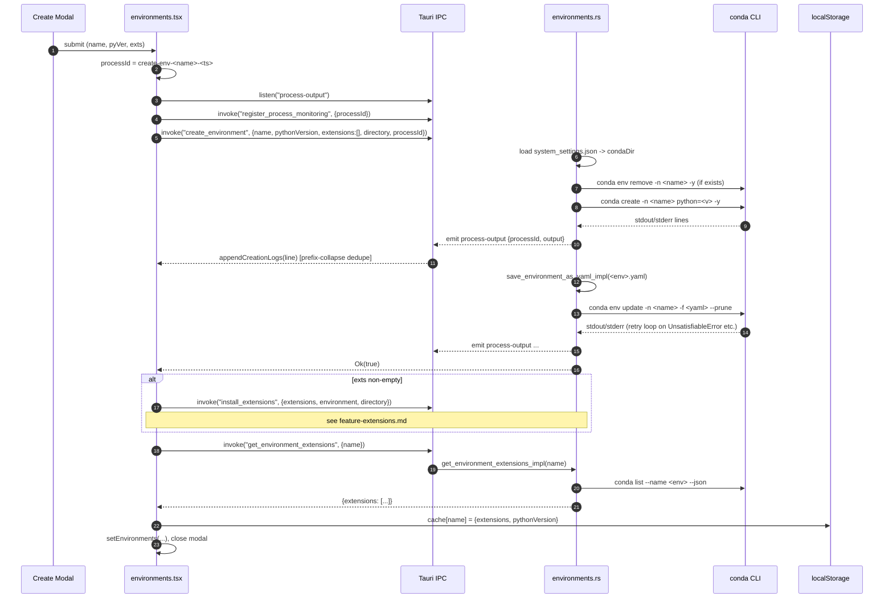

# Feature: Conda Environment Management

## Purpose

Lets the user create, list, update, and remove conda environments rooted under
`<install>/conda/envs/`, plus import an env from a `requirements.txt`,
`pyproject.toml`, `environment.yml`, or `environment.yaml` file. The page is the
only UI in the app where the user manages the Python runtimes the rest of the
product depends on (the API server, Jupyter, terminal sessions, CLI). It does
NOT manage packages inside an env — that's `feature-extensions.md` — and it does
NOT launch Jupyter — that's `feature-jupyter.md`.

## User flows

1. **Golden path — create env**: *New Environment* → 3-step modal (name → Python
   version → optional extension picker) → backend writes a per-env YAML, runs
   `conda create`, then `conda env update --prune`, optionally
   `install_extensions`. Output streams into a log box.
2. **List on mount** — read `localStorage["env-extensions-cache"]`, render
   immediately, then `invoke("list_conda_environments")` to reconcile.
3. **Refresh** — clears cache + reloads the page (full re-read on next mount).
4. **Update env** — `conda install` + `pip install --upgrade` for every pkg in
   the env's YAML.
5. **Remove env** — confirmation → `remove_environment` → cache evicted.
6. **Import from file** — `select_requirements_file` picker → name modal →
   `create_environment_from_requirements` parses file, generates YAML.
7. **Edge — cancel create** — tombstones env name in
   `deletedEnvironments.current`; create keeps running; `finally` fires
   `remove_environment`.
8. **Edge — env exists** — `create_environment` runs `conda env remove -n
   <name> -y` first (`environments.rs:199`).
9. **Edge — pyproject.toml import** — temp `.sh`/`.bat` runs `pip install -r
   <reqs>`; if `setup.py`/`pyproject.toml` in root, second script runs
   `pip install -e .`.

## UI surface

- `desktop/src/routes/environments.tsx:233` — `EnvironmentsPage` root.
- `EnvironmentActionButtons` (`environments.tsx:106`) — top-bar
  *New Environment*, *Import Environment*, *Refresh* (clears cache + reloads).
- Create modal — 3 steps:
  - Name: regex `^[a-z0-9-]+$`, duplicate-name check.
  - Python: `PythonVersionSelector` (`AddExtensionSelector.tsx:51-96`) offers
    `3.10`–`3.13`.
  - Extensions: `ExtensionSelector` from `InstallComponents.tsx` — handed off
    to `feature-extensions.md`.
- Import modal (`environments.tsx:2942-3099`) — env-name regex `^[a-z0-9-]+$`.
- Remove-confirmation modal (`:2466-2479`).
- Per-env card — Update / Remove buttons (Extensions / Actions cross-doc).
- Error banners: `creationWarning` (`:2349-2370`), `requirementsError` /
  `requirementsWarning` (`:2974-2988`), `updateEnvironmentError`
  (`:2754-2775`), `removeEnvironmentError` (`:2777-2789`).

## Data flow

Sequence for the env-create golden path:



## IPC contract

| Direction | Name | Payload | Returns | Used by |
|-----------|------|---------|---------|---------|
| invoke | `list_conda_environments` | `{ directory?: string }` | `{name, pythonVersion, path}[]` | mount, post-mutation reconcile |
| invoke | `create_environment` | `{ name, pythonVersion, extensions: string[], directory, processId }` | `bool` | 3-step modal submit |
| invoke | `create_environment_from_requirements` | `{ name, filePath, directory, processId }` | `bool` | Import modal submit |
| invoke | `remove_environment` | `{ name, directory }` | `bool` | Trash-can confirm |
| invoke | `update_environment` | `{ environment, directory }` | `bool` | Per-card refresh icon |
| invoke | `select_requirements_file` | `{}` | `string` (path or `""`) | *Import Environment* button |
| invoke | `register_process_monitoring` | `{ processId }` | `bool` | Before create / import |
| event ← Rust | `process-output` | `{ processId, output }` (no timestamp for env-create) | — | Create + import log box |

`get_environment_extensions` is invoked here only to seed the cache after a
successful create; the contract proper belongs to `feature-extensions.md`.

## State surfaces

- React state in `environments.tsx`:
  - `environments: Environment[]` (`:406-434`, `:451-486`).
  - `installDir` (`:694-739`) — URL `?directory=` then `get_installation_state`
    then `$HOME/OpenBB`.
  - `deletedEnvironments` ref (`:375`) — tombstone for in-flight deletes.
  - `envCreatedRef`, `creationWarningRef`, `createEnvironmentRef`,
    `hasLoadedEnvironments` (`:320, 376-377, 403`) — race-condition guards.
  - `isCreateModalOpen`, `creationLoading`, `creatingFromRequirements`,
    `creationLogs[]`.
- React context: `EnvironmentCreationContext.isCreatingEnvironment` — read only
  by `routes/__root.tsx` to disable nav.
- Rust state: none for env CRUD itself. (`ProcessLogState` is shared with
  streaming; `RunningProcesses` is unused by env ops.)
- Disk files: see *Persistence*.

## Persistence

| File | Writer | Format |
|---|---|---|
| `~/.openbb_platform/system_settings.json` | installer + `list_conda_environments` cleanup pass | JSON — `install_settings.installation_directory` is the source of truth for `<install>` |
| `~/.openbb_platform/environments/<env>.yaml` | `save_environment_as_yaml_impl` (`helpers.rs:436-503`); also `remove_environment` deletes | conda env YAML — `channels`, `dependencies`, nested `pip:` |
| `<install>/conda/envs/<env>/` | `conda create` / `conda env update --prune` | The conda env tree itself |
| `localStorage["env-extensions-cache"]` | `environments.tsx` 6 sites (see below) | See schema |

The `env-extensions-cache` schema is load-bearing for the port — it's the
read-through cache between mounts and is consumed by `backends.tsx` as well:

```ts
// Key: "env-extensions-cache" (environments.tsx:14)
type EnvExtensionsCache = {
  [envName: string]: {
    extensions: Array<{
      package: string;        // "openbb-yfinance" | "conda-forge:numpy"
      version: string;        // "1.2.3"
      install_method: "pip" | "conda";
      channel: string;        // "pypi" | "conda-forge" | ...
    }>;
    pythonVersion: string;    // "3.12"
    // NB: no `path`. backends.tsx reads `cache[name].path` and gets ""
    //     - harmless today; see Known bugs.
  };
};
```

No TTL. Invalidated by: the *Refresh* button (full wipe + reload), the success
path of `createEnvironmentFromRequirements` (full wipe at
`environments.tsx:654`), or per-env on `remove_environment`. Writers:
`updateCacheAfterBackendOperation` (`:510-535`), `refreshEnvironmentUIState`
(`:1071-1084`), `createEnvironment` success (`:1602-1608`), plus the
extension-mutation sites in `feature-extensions.md`.

## Error handling

- `setEnvironmentsError` + Retry button when `list_conda_environments` fails
  (`:2372-2398`).
- Create errors classified by:
  - `isFutureWarningOnly` (`environments.tsx:79-89`) — contains `FutureWarning:`
    and not `Error:`/`failed`/`Pip subprocess error:` → treated as success.
  - `isPipSubprocessError` (`:91-94`) — surfaces the pip log verbatim.
  - `extractStderr` (`:58-76`) — splits Rust-formatted strings of the form
    `"Stdout: ...\nStderr: ...\nExit code: ..."`.
- Cancel-during-create: 5s grace before modal closes (`:1712-1720`); backend
  continues; `finally` block fires `remove_environment` cleanup.
- Smart retry loop in `create_environment` (`environments.rs:305-401`) — regex
  matches `UnsatisfiableError`, `PackagesNotFoundError`, and pip
  `No matching distribution`; offending package stripped from YAML; YAML
  rewritten; `conda env update --prune` re-run. Loop is unbounded by count or
  time — see Known bugs.

## ▸ Interfaces with

- depends-on: `feature-installation.md` — every conda path resolves through
  `system_settings.json.install_settings.installation_directory` written by
  the installer; install seeds the `openbb` env this page later edits.
- depends-on: `feature-logs-streaming.md` — `process-output` event + the
  `process_monitor.rs` log buffer carry all `conda`/`pip` output to the create
  log box.
- depended-on-by: `feature-extensions.md` — extension install/update/remove
  flows live there; this doc covers only env CRUD. Cross-reference contract:
  this feature emits the env name into the cache key; extensions read/write the
  `extensions[]` value inside that key.
- depended-on-by: `feature-jupyter.md` — Jupyter selects an env from the list
  produced here and spawns inside it.
- depended-on-by: `feature-backend-services.md` — `backends.tsx` reads
  `list_conda_environments` and `env-extensions-cache` to populate the
  backend-create form's env dropdown.
- shares-state-with: `feature-app-shell.md` via `EnvironmentCreationContext`
  (nav lock in `__root.tsx`). Only consumer of the context.
- shares-state-with: `feature-platform-rest-api.md` — both read
  `system_settings.json`; env mutations don't trigger
  `update_openbb_settings` (see Known bugs).

## TS port mapping

| Tauri call | TS equivalent | Notes |
|---|---|---|
| `list_conda_environments` | `GET /environments` | FS scan of `<install>/conda/envs/`. **Make read-only** (move YAML cleanup behind a separate `POST /environments/cleanup`). |
| `create_environment` | `POST /environments` + SSE/WS stream | Spawn `conda` via `child_process.spawn`. Must replicate `new_conda_command` env vars (see below). Stream output over WebSocket keyed by `processId`. |
| `create_environment_from_requirements` | `POST /environments/from-file` + stream | Server reads the file (server-side path) or accepts an upload. Branch on extension: `.toml`/`.txt`/`.yaml`. |
| `remove_environment` | `DELETE /environments/:name` | Drop the `directory` arg (Rust ignores it; frontend lies). |
| `update_environment` | `POST /environments/:name/update` | Add the missing 5-min timeout to the pip step (Rust only times out conda). |
| `select_requirements_file` | Browser `<input type="file">` | The native-dialog shellouts (osascript / PowerShell / zenity) disappear in a web port. |
| `process-output` event | WebSocket `/ws/processes/:processId` | Server filters; no global channel. |

### Why envs are the hardest thing to port

1. **`conda` shell-out semantics.** Every spawn must clear
   `CONDA_DEFAULT_ENV`, `CONDA_PREFIX`, `CONDA_SHLVL` from the parent's
   environment and set `CONDA_ROOT`, `CONDA_ENVS_PATH`, `CONDA_PKGS_DIRS`,
   `CONDARC` (`helpers.rs:154-165`). If the desktop is launched from a shell
   with conda already activated, the inherited vars confuse conda's own
   activation stack and writes land in the wrong env's `conda-meta/history`.
2. **Activation script generation.** For terminal/python/ipython/cli launches
   and for the pyproject.toml import path, the Rust code writes a temp
   `.bat` (Windows) or `.sh` (Unix) that sets every `CONDA_*` var inline and
   sources `<conda>/bin/activate <env>` (or `condabin/conda.bat`). The TS port
   needs the same templating logic — Node's `child_process` can't inherit a
   conda activation, you have to bake it into the script.
3. **Output streaming.** Rust's `clean_output_line` (`environments.rs:14-34`)
   strips ANSI escapes, processes backspaces, and collapses everything after
   the last `\r` (so pip's `\r`-driven progress redraws don't become 200 log
   lines). The TS port must reproduce this exactly, or the create log box
   floods.
4. **The prefix-collapse dedupe on the frontend** (`environments.tsx:604-621`
   and `:1525-1544`) — if the previous log starts with `prefix:` and the new
   one starts with the same `prefix:`, the new one overwrites the last line.
   This is what makes "Collecting numpy" not appear 80 times.

## Known bugs and port-time fixes

> ⚠️ BUG — `list_conda_environments` is destructive. The handler at
> `environments.rs:1746-1792` deletes every `~/.openbb_platform/environments/
> <x>.yaml` whose stem isn't currently a directory under `<conda>/envs/`.
> Listing should be a pure read; cleanup should be a separate, explicit op.
> Currently a YAML copied from another machine vanishes silently on first
> page load.

> ⚠️ BUG — `directory` is silently ignored by `remove_environment` and
> `install_extensions`. Rust signatures take only the names they care about,
> and Tauri drops the extra fields without warning. The frontend sends
> `directory` from three sites for `install_extensions`
> (`environments.tsx:1378, 1577`; `installation-progress.tsx:1155`) and one
> for `remove_environment` (`environments.tsx:1316-1319`). Drop the
> parameters in the port.

> ⚠️ BUG — `removeEnvironment` doesn't consult `backends.json` or
> `ACTIVE_JUPYTER_SERVERS`. A running backend or Jupyter bound to the env
> being deleted keeps its now-orphaned binary alive (the kernel holds the
> inode open after `conda env remove`) and any restart attempt then errors
> with "Conda executable not found". Port must cascade-stop these services
> first.

> ⚠️ BUG — Smart retry loop is unbounded. Each iteration of the retry loop
> at `environments.rs:305-401` re-runs `conda env update --prune` (~30s);
> with `--prune` semantics a cascade of removals can leave the user with a
> Python-only env that the UI treats as "success". Cap iterations to
> `min(8, len(packages))` and surface "could not resolve X, Y, Z" instead.

> ⚠️ BUG — `env-extensions-cache` consumer mismatch. `backends.tsx:2156-2168`
> reads `cache[name].path`, which is never written by `environments.tsx`.
> Harmless today (the field is unused after build), but a schema lie. Either
> add `path` to the writers or drop it from the reader's `Environment`
> interface.

> ⚠️ BUG — `update_environment` pip step has no timeout. The conda step at
> `environments.rs:2876` is wrapped in a 5-minute `tokio::time::timeout`; the
> pip step at `:2971-2975` uses `.output()` and hangs indefinitely if PyPI
> stalls. Port should wrap both.

> ⚠️ BUG — Env-create with concurrent `install_extensions` against the
> not-yet-created env errors out with `"Environment '{name}' does not exist
> - Python executable not found"` (`environments.rs:2379-2383`). The
> frontend prevents this on the current mount via `envCreatedRef`, but a
> second window has no guard. A coarse per-env mutex at the IPC layer
> closes the hole — see v2 §8.

> ⚠️ BUG — `EnvironmentCreationContext` only locks the three `NavLink`s in
> `__root.tsx`. The tray menu's *Environments* item, `window.eval`-driven
> redirects from `navigate_to_page` (`main.rs:393-410`), and child Tauri
> windows are unaffected. The "lock" is UI sugar, not a real mutex.

> ⚠️ BUG — No `update_openbb_settings` after env mutations. The wizard
> calls it once at install (`startup.rs:1293` and twice from
> `installation-progress.tsx:1162, 1207`). The Environments page never
> calls it. New `system_settings.json` defaults shipped with a newer
> `openbb-core` therefore never appear after a manual env create.

## Open questions

1. Should `list_conda_environments` be split into a pure-read `GET` and an
   explicit `POST .../cleanup`? The destructive YAML sweep on every list is
   the single biggest mismatch with REST semantics.
2. Should the port keep `create_environment` as one atomic call, or break it
   into `POST /environments` (just `conda create`) + `POST /environments/:n/
   yaml` (write YAML) + `POST /environments/:n/install` (run `env update`)?
   The current monolith is what forces the smart-retry loop to live inside a
   single Rust function.
3. Where should the conda env-var prelude live? Six inline copies today
   (`new_conda_command`, two in `update_openbb_settings_impl`, two in
   `start_backend_service_impl`, two in `execute_in_environment_impl`).
   A single `condaEnv(condaDir)` helper in the port would prevent drift.
4. Re-decide cancellation. The current "tombstone + `finally` runs
   `remove_environment`" pattern relies on the create handler eventually
   returning. A first-class cancellation token plumbed through the conda
   spawn would let the user actually stop a 10-minute install.
5. Should the cache live in localStorage at all? IndexedDB with a versioned
   schema and a TTL would make the consumer-mismatch bug above expressible
   as a migration instead of a silent lie.
6. Where does `update_openbb_settings` belong in the port? It's currently
   wedged inside installation, but every env mutation logically wants it.
