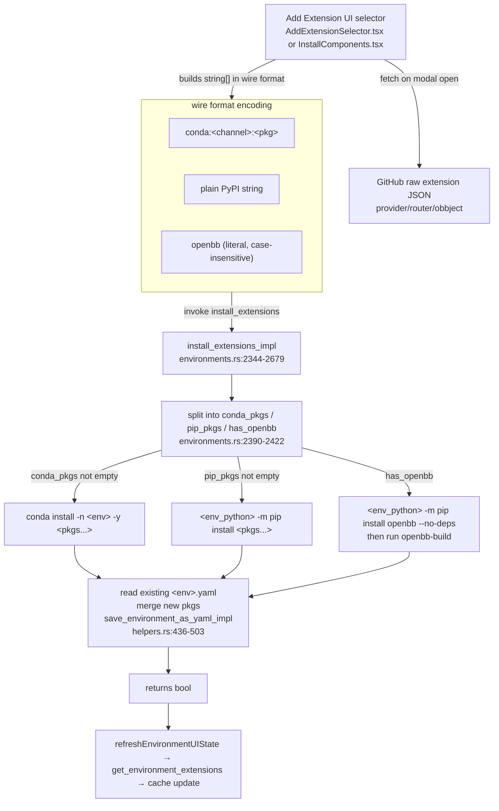

# Feature: Extensions

> Owns: install / update / remove Python packages ("extensions") into an existing
> conda env. Does NOT own env creation (see `feature-environments.md`) or the
> Python REST server that consumes them (see `feature-platform-rest-api.md`).

## Purpose

The desktop installs and curates a curated set of Python packages inside each
managed conda environment so the embedded OpenBB Platform server can expose
their FastAPI routes. The user needs a UI to (a) discover what extensions exist,
(b) install them into a chosen env, (c) update or remove them, all without
touching a shell. This feature is the pip/conda glue between the catalog JSON,
the env-on-disk, and the per-env `<env>.yaml` manifest that drives later
operations (update, list, re-create).

## User flows

1. **Golden path — add extension to existing env.** User clicks "Extensions" on
   an env card → "Add Extension" tab opens (`AddExtensionSelector.tsx`) → picks
   categories (provider/router/other-openbb checklists, or free-text PyPI /
   conda fields) → "Install". `handleInstallExtensions` (`environments.tsx:1361-1427`)
   fires `install_extensions`. On success `refreshEnvironmentUIState` re-fetches
   the package list via `get_environment_extensions`. Modal closes.

2. **Wizard Step 3 — first install.** Same handler family, different selector
   component (`InstallComponents.tsx` `ExtensionSelector`), called by the
   installer's `handleInstallExtensions` (`installation-progress.tsx:1137-1184`).
   This is the very first `install_extensions` call against the freshly created
   `openbb` env. See `feature-installation.md` §5 for the wizard wrapper.

3. **Remove single extension.** Trash icon on `ExtensionRow` → confirmation
   modal → `handleRemoveExtension` (`environments.tsx:1430-1459`) →
   `invoke("remove_extension", ...)`. YAML is mutated to drop the matching
   entry.

4. **Update single extension.** Refresh icon on `ExtensionRow` →
   `handleUpdateExtension` (`environments.tsx:1461-1507`) →
   `invoke("update_extension", ...)`. Tries pip upgrade first, falls back to
   conda. YAML is NOT touched on update.

5. **Edge — concurrent install / install during update.** Frontend only guards
   via the `installExtensionsLoading` boolean (disables the button). A second
   tab or a fast Enter+click could fire two installs; conda's own lockfile
   prevents corruption but the YAML merge is racy (see Known Bugs).

6. **Edge — cancel mid-install.** `handleCancelExtensionInstall`
   (`environments.tsx:1726-1728`) only hides the modal; the backend keeps going
   to completion. No abort signal.

## UI surface

| Surface | Component / file:line | Notes |
|---|---|---|
| Add Extension modal (existing env) | `components/AddExtensionSelector.tsx:1-360` | Loaded from `environments.tsx:2576-2581` |
| Extension selector (wizard step 3) | `components/InstallComponents.tsx` (`ExtensionSelector`) | Loaded from the create-env modal step 3 |
| Tabs | `conda`, `extras`, `provider`, `router`, `other-openbb` | First two have free-text input; rest are checklists |
| Conda channel input | `AddExtensionSelector.tsx:203-213` (`addCondaPackage`) | Builds `${channel}:${pkg}` |
| Extension row (existing) | `components/ExtensionRow.tsx` (called at `environments.tsx:213-227`) | Trash + refresh icons |
| Install button busy state | `installExtensionsLoading` boolean (`environments.tsx:282`) | Disables the button only |
| Errors / warnings | `extensionsError`, `extensionRemoveError`, `updateExtensionError` banners (`environments.tsx:2617-2682`) | Rendered inside Extensions panel |

### The catalog (frontend-only fetch, no Tauri)

Both selectors call `fetch()` directly against the public OpenBB GitHub raw URLs
on every modal open (no localStorage caching):

- `https://raw.githubusercontent.com/OpenBB-finance/OpenBB/refs/heads/main/assets/extensions/provider.json`
- `https://raw.githubusercontent.com/OpenBB-finance/OpenBB/refs/heads/main/assets/extensions/router.json`
- `https://raw.githubusercontent.com/OpenBB-finance/OpenBB/refs/heads/main/assets/extensions/obbject.json`

Entry shape (`installation-progress.tsx:23-29`):
`{ packageName, reprName?, description?, credentials?: string[], instructions?: string|null }`.

Four UI categories are derived from these plus hard-coded constants:

| Category | Source | Wire format on install |
|---|---|---|
| `conda` | Free-text user input + channel dropdown | `conda:<channel>:<pkg>` |
| `extras` | Hard-coded `extrasExtensions`: `openbb-mcp-server`, `pywry`, `openbb-cli`, `openbb-cookiecutter` (last one only in `InstallComponents.tsx`) | plain `<pkg>` (PyPI) |
| `provider` | `provider.json` | plain `<pkg>` (PyPI) |
| `router` | `router.json` + `obbject.json` | plain `<pkg>` (PyPI) |
| `other-openbb` | leftover entries / hard-coded | plain `<pkg>` (PyPI) |

The literal string `openbb` (case-insensitive) is intercepted by the Rust
handler and uses the special `--no-deps + openbb-build` path (see §"openbb
special case" below).

## Data flow



## IPC contract

| Direction | Name | Payload (TS) | Returns | Used by |
|---|---|---|---|---|
| TS → Rust | `install_extensions` | `{ extensions: string[], environment: string, directory: string }` | `boolean` | env page "Add Extension", wizard step 3 |
| TS → Rust | `remove_extension` | `{ package: string, environment: string, directory: string }` | `boolean` | env page extension row trash |
| TS → Rust | `update_extension` | `{ package: string, environment: string, directory: string }` | `boolean` | env page extension row refresh |
| TS → Rust | `get_environment_extensions` | `{ name: string }` | `{ extensions: Extension[] }` | post-mutation refresh; cache hydration |

`Extension = { package: string; version: string; install_method: "pip" \| "conda"; channel: string }`.

> ⚠️ BUG: `directory` is accepted by the frontend on all three mutating
> commands but the Rust signatures for `install_extensions`, `remove_extension`,
> and `update_extension` re-read the install dir from `system_settings.json`.
> Tauri silently drops the unknown `directory` arg
> (`environments.rs:2682-2687`, `installation.v2.md §6.8`).

### Wire-format encoding parser (Rust side)

`install_extensions_impl` (`environments.rs:2390-2422`):
- String starts with `conda:` → strip prefix, push **rest verbatim** to
  `conda_packages` (so the slice becomes e.g. `conda-forge:numpy`).
- String equals `openbb` (case-insensitive) → set `has_openbb=true`, do NOT
  push to either list.
- Anything else → push to `pip_packages`.

For `remove_extension` the mirror parser (`environments.rs:2059-2070`) splits
on first `:`:
- contains `:` → `("conda", &package[idx+1..])` (drops channel prefix when
  calling `conda remove`).
- no `:` → `("pip", package)`.

So the on-disk YAML stores `<channel>:<pkg>` for conda items, the frontend
shows them with the channel prefix, and the parser knows to strip it for the
actual `conda remove` invocation.

## State surfaces

- **React state** (in `environments.tsx`):
  - `extensions: Extension[]` — current panel's package list (`:267-269`).
  - `environmentPackages: { [env]: Set<string> }` — lower-cased name set used
    for `hasJupyterSupport`/`hasIPythonSupport`/`hasCliSupport` predicates
    (`:1100-1183`, `:2001-2014`).
  - `installExtensionsLoading: boolean`, `updatingExtension: string|null`,
    `removingExtension: string|null` (`:282-285`).
  - `extensionSelectorKey: number` (`:1385`) — incremented to force re-mount
    the selector after install.

- **Rust state**: none. All handlers are stateless and re-read disk every call.

- **Disk files**:
  - `~/.openbb_platform/system_settings.json` — read for `install_settings.installation_directory`.
  - `~/.openbb_platform/environments/<env>.yaml` — read, mutated, rewritten on install/remove.
  - `<install>/conda/envs/<env>/...` — the actual conda env; modified via the
    bundled conda binary.
  - `localStorage["env-extensions-cache"]` — frontend-only mirror;
    `{[env]: {extensions, pythonVersion}}` (no TTL).

## Persistence

The **`<env>.yaml`** file is the authoritative manifest the desktop uses to
later update, re-create, or list the env. Schema is conda-env-file format:

```yaml
name: <env>
channels: [defaults, conda-forge, <any others>]
dependencies:
  - python=3.12
  - numpy             # conda packages, optionally <channel>:<name>=<ver>
  - pip
  - pip:
    - openbb-yfinance
    - openbb-platform-api
    - <pip packages>
```

The rewrite is handled by `save_environment_as_yaml_impl`
(`helpers.rs:436-503`). On install:
1. Parse existing YAML; collect existing conda + pip lists.
2. For each new package: split on `=`/`<`/`>` to find the name-part, drop any
   existing entry with the same name, append the new entry.
3. Re-serialize. Last-writer-wins.

> ⚠️ BUG: the conda-version-split regex doesn't handle pip operators `~=`,
> `===`, `!=` (`environments.v2.md §3` & §6.8 derivations). A user-supplied
> `openbb-platform-api~=1.5` would create a duplicate entry rather than
> replacing the existing pinned line.

## The `openbb` special case (the only special handler)

When the extensions array contains the bare string `"openbb"` (case-insensitive):

1. The install for that one entry uses `--no-deps`:
   `<env_python> -m pip install openbb --no-deps` (`environments.rs:2480-2510`).
2. Immediately afterwards, run the helper binary:
   `<install>/conda/envs/<env>/bin/openbb-build` (or `Scripts/openbb-build.exe`
   on Windows) — `environments.rs:2516-2533`.

Why `--no-deps`: the `openbb` PyPI package is a meta-package whose own
dependency list pulls in every provider/router extension at the pinned version
from its release. The desktop wants to manage those choices itself, so it
suppresses the dep resolution and installs the meta package as a thin shell.

What `openbb-build` does (`openbb_platform/core/openbb_core/build.py`):
- Calls `<sys.executable> -c "import openbb"`, which triggers
  `openbb_core.app.static.package_builder.PackageBuilder.auto_build()`.
- That walks every registered router's command signature and synthesises a
  static Python module tree under `<openbb>/static/package/` so user code can
  `from openbb import obb` and get IDE completion.
- Acquires an exclusive `flock` on `<openbb>/static/.build.lock` — concurrent
  builds error with `BlockingIOError → RuntimeError`.
- Writes `<openbb>/static/assets/reference.json` snapshotting installed
  extensions (used by future `auto_build()` calls to short-circuit when no
  rebuild is needed).
- Takes 30-90 seconds on a fully-loaded extension set. **The frontend gets no
  streaming output** — the user sees a spinner until the invoke resolves
  (`installation.v2.md §11`).

> ⚠️ BUG / footgun: the wizard's step 3 `handleInstallExtensions` *also*
> invokes `execute_in_environment("openbb-build", ...)` after `install_extensions`
> returns (`installation-progress.tsx:1157-1161`). In the default wizard path
> the bare string `"openbb"` is NOT in the extensions array — so the `--no-deps`
> code path inside `install_extensions_impl` never runs, the `openbb-build`
> binary is never installed, and the subsequent `execute_in_environment` call
> fails. The frontend swallows the failure silently (treated as warning).
> See `installation.v2.md §4.3` and §11 for the full analysis. Port-time fix:
> always run the bare `openbb` + `openbb-build` finalization once after any
> install that touches OpenBB extensions, OR have `install_extensions_impl`
> always run `openbb-build` when any `openbb-*` pip package was installed.

## Error handling

Rust handlers return `Result<bool, String>` where the error string is
formatted as `"Failed to install pip packages: \nStdout: ...\nStderr: ..."`.
Frontend classifies:

- `isFutureWarningOnly(msg)` (`environments.tsx:79-89`) — contains
  `"FutureWarning:"` AND none of `"Error:"`, `"failed"`, `"Pip subprocess error:"`
  → treated as success, warning surfaced inline.
- `isPipSubprocessError(msg)` (`environments.tsx:91-94`) — contains
  `"Pip subprocess error:"` → surfaced verbatim so the user can see the pip log
  (pip writes the real error to stdout, not stderr — `extractStderr` knows this).
- Anything else → red banner with the raw string + Retry / Dismiss buttons.

Cancel is **modal-hide only**. No abort signal reaches the backend; the install
runs to completion or failure and the result is discarded.

## ▸ Interfaces with

- **depends-on** `feature-environments.md` — the env must already exist (the
  Rust handler errors with `"Environment '{env}' does not exist"` if
  `<install>/conda/envs/<env>/bin/python` is missing). Env page also owns the
  `env-extensions-cache` localStorage schema; this feature only writes through
  it.
- **depends-on** `feature-installation.md` — Step 3 of the wizard IS this
  feature, just invoked from a different UI (`InstallComponents.tsx` vs
  `AddExtensionSelector.tsx`). The wizard also runs an explicit
  `execute_in_environment("openbb-build")` after `install_extensions` (footgun
  documented above).
- **depended-on-by** `feature-platform-rest-api.md` — the Python REST server
  imports the installed providers / routers at boot. If install fails silently
  the server will start but expose only the routes whose extensions actually
  loaded.
- **depended-on-by** `feature-jupyter.md` — Jupyter is started in the same
  env; presence of `notebook`/`jupyter`/`jupyterlab` in the installed list
  enables the "Open in Jupyter" button.
- **shares-state-with** `feature-environments.md` via
  `~/.openbb_platform/environments/<env>.yaml` (this feature reads + rewrites;
  `feature-environments.md` reads on env update and on re-create).
- **shares-state-with** `feature-environments.md` via the global
  `process-output` Tauri event — but only loosely, because the install
  handlers do NOT emit streaming output (no `processId` is wired through —
  see `installation.v2.md §4.2`).

## TS port mapping

| Tauri call | TS-server equivalent | Notes |
|---|---|---|
| `install_extensions` | `POST /environments/:env/extensions` (body: `{ extensions: string[] }`) | Long-running; stream via WS/SSE keyed by a server-generated `installId`. Must enforce per-env serialization (see Open Questions). Re-read install dir from `system_settings.json`; ignore client-supplied dir. |
| `remove_extension` | `DELETE /environments/:env/extensions/:pkg` | `:pkg` must be URL-encoded since conda packages contain `:` in the channel prefix. |
| `update_extension` | `PATCH /environments/:env/extensions/:pkg` | Pip first, fall back to conda; mirror current behaviour. |
| `get_environment_extensions` | `GET /environments/:env/extensions` | Read `<env>.yaml` + `conda list --name <env> --json`; merge. |
| (frontend) catalog fetch | unchanged — direct fetch to GitHub raw | CORS works today; no need to proxy through the server. Cache in IndexedDB with a TTL (current impl re-fetches every modal open). |

### Wire-format parser (port-critical)

The parser is small but load-bearing. TS sketch:

```ts
type ExtensionSpec =
  | { kind: "conda"; channel: string; pkg: string }
  | { kind: "openbb" }                       // bare "openbb" — runs --no-deps + build
  | { kind: "pip"; pkg: string };

function parseExtensionString(s: string): ExtensionSpec {
  if (s.startsWith("conda:")) {
    const rest = s.slice("conda:".length);
    const idx = rest.indexOf(":");
    if (idx < 0) return { kind: "conda", channel: "conda-forge", pkg: rest };
    return { kind: "conda", channel: rest.slice(0, idx), pkg: rest.slice(idx + 1) };
  }
  if (s.toLowerCase() === "openbb") return { kind: "openbb" };
  return { kind: "pip", pkg: s };
}
```

### Shell-out reproduction

The port is mostly a shell-out reproduction. Required commands (all run with
the same env-var preamble as `new_conda_command`, see `environments.md §0.3`):

- `<conda>/bin/conda install -n <env> -y <pkgs...>` (or `install -y <pkgs>` for `base`).
- `<env_python> -m pip install <pkgs...>`.
- `<env_python> -m pip install openbb --no-deps` (only when bare `openbb` requested).
- `<env>/bin/openbb-build` (after the `--no-deps` install).
- `<conda>/bin/conda remove -n <env> <pkg> -y` (single remove).
- `<env_python> -m pip uninstall <pkg> -y` (single remove, pip side).
- `<env_python> -m pip install --upgrade <pkg>` (update — pip first).
- `<conda>/bin/conda install -n <env> <pkg> -y` (update — conda fallback).
- `<conda>/bin/conda list --name <env> --json` (for `get_environment_extensions`).

Every spawn must:
1. Use the conda env-var preamble (`CONDA_ROOT`, `CONDA_ENVS_PATH`,
   `CONDA_PKGS_DIRS`, `CONDARC` set; `CONDA_DEFAULT_ENV`, `CONDA_PREFIX`,
   `CONDA_SHLVL` unset — see `environments.v2.md §12` for the why).
2. On Windows, set `CREATE_NO_WINDOW (0x08000000)` to suppress console pop-ups.
3. Capture both stdout AND stderr — pip writes errors to stdout (`extractStderr`
   compensates).

## Known bugs and port-time fixes

> ⚠️ BUG 1: `install_extensions` ignores the `directory` payload. Frontend
> sends it from three sites but Rust re-reads from `system_settings.json`
> (`environments.v2.md §6.8`). Port: either honour the payload OR remove it
> from the request body.

> ⚠️ BUG 2: Concurrent `install_extensions` calls race on the YAML rewrite.
> Conda's lockfile protects the env directory but `<env>.yaml` mutations are
> last-writer-wins (`environments.md §6.5`, `environments.v2.md §8`). Port:
> add a per-env coarse lock at the handler level (e.g. `Map<envName, Mutex>`
> or async queue).

> ⚠️ BUG 3: If `<env>.yaml` is missing when `install_extensions` runs, the
> install succeeds but the YAML merge is **silently skipped** with a `log::warn!`
> (`environments.rs:2673-2675`). Later `update_environment` then hard-fails
> with "Environment YAML file not found" (`environments.v2.md §4`,
> `installation.v2.md §6.8`). Port: synthesise a minimal YAML if missing.

> ⚠️ BUG 4: Wizard step 3 runs `execute_in_environment("openbb-build")`
> after `install_extensions`, but the default extension set never includes
> bare `"openbb"`, so `openbb-build` is never installed and the explicit
> invocation fails silently (`installation.v2.md §4.3` & §11). Port: always
> run the `openbb` finalization once when any `openbb-*` extension was
> installed.

> ⚠️ BUG 5: Cancel button only hides the modal; backend keeps running
> (`environments.tsx:1726-1728`). Port: support real cancellation by tracking
> the spawned child PID per install request and signalling on cancel.

> ⚠️ BUG 6: Catalog JSON is re-fetched on every modal open (no caching at the
> JS layer — `installation-progress.tsx:186-275` and the equivalent inside the
> two selectors). Port: cache with TTL (5-10 min) in IndexedDB.

> ⚠️ BUG 7: Version-pin parser in the YAML merge handles `=`, `<`, `>` but
> not `~=`, `===`, `!=` (`environments.v2.md §3`). Custom packages with those
> operators duplicate-insert into the pip list. Port: parse with a proper PEP
> 440 specifier parser.

> ⚠️ BUG 8: `install_extensions` does NOT emit `process-output` events
> (no `processId` is passed through — `installation.v2.md §4.2`). The user
> sees only a spinner for what can be a 5-10 minute install on a full
> extension set. Port: stream pip/conda output via a per-request streaming
> channel.

## Open questions

1. **Should the `<env>.yaml` rewrite be transactional?** Today: read → mutate
   in-memory → write back. A crash or concurrent writer in the middle leaves
   the env in a state where conda has the new packages but YAML is stale (or
   vice versa). Options: (a) write to `.yaml.tmp` + atomic rename; (b) keep a
   journal in `~/.openbb_platform/environments/.journal/`; (c) treat `conda
   list --json` as the source of truth and demote YAML to a cache regenerated
   on demand. Option (c) is the cleanest but breaks YAML's role as the seed
   for `update_environment` and `create_environment_from_requirements`.

2. **Should the port serialize concurrent installs per env?** Today there's
   no serialization beyond conda's own lockfile. A coarse per-env lock at the
   IPC handler level (`Map<env, AsyncMutex>` or queue) is the minimum;
   `environments.v2.md §8` lays out the full race matrix. Open: do we reject
   the second request with a 409 "busy", or queue it? Queuing is friendlier
   but allows the user to stack up confusing operations; rejecting forces the
   UI to surface the busy state explicitly.

3. **Catalog source of truth.** Today the frontend fetches three JSON files
   from `raw.githubusercontent.com`. Should the port:
   - Keep frontend-direct fetching (CORS works, lowest infra)?
   - Proxy through the TS server (lets us cache server-side, survives offline)?
   - Bundle the catalog as static assets, refresh on app update?

4. **Should `install_extensions` always run `openbb-build`?** Currently only
   if bare `"openbb"` is in the list. But every install that touches an
   `openbb-*` extension changes what `auto_build()` would generate. Running
   it unconditionally costs 30-90s but eliminates the wizard-step-3 footgun
   (Bug 4). Cheap alternative: detect any `openbb-*` package in the install
   list and run the build then.

5. **Encoding ambiguity for conda packages with `:` in the version string.**
   `package = "<channel>:<name>"` is the wire format from
   `get_environment_extensions`. But conda spec strings can include `:` in
   build strings (e.g. `numpy=1.24.3=py311h*`). Today this works because the
   YAML stores `<channel>:<name>=<ver>` and the parser splits only on the
   first `:`. A version string with `:` would break. Should we use a structured
   wire format (`{kind: "conda", channel, name, version}`) instead?

6. **Should the port keep the dual-selector code?** `AddExtensionSelector.tsx`
   and `InstallComponents.tsx`'s `ExtensionSelector` are near-duplicates of
   each other (`environments.md §6.2`). Consolidate to one component used by
   both flows.

## Cross-feature dependencies

- **depends-on** `feature-environments.md` — env must exist on disk; YAML
  manifest lives in env's namespace.
- **depends-on** `feature-installation.md` — bundles the conda binary that
  every command shells out to; seeds the first `openbb` env that this feature
  then populates.
- **depended-on-by** `feature-platform-rest-api.md` — the installed packages
  are what the REST server imports at boot.
- **depended-on-by** `feature-jupyter.md` — kernel comes from the env, with
  packages installed via this feature.
- **shares-state-with** `feature-environments.md` via
  `~/.openbb_platform/environments/<env>.yaml` (read + rewrite here; read on
  env update / list there) and via `localStorage["env-extensions-cache"]`
  (the env page owns the schema; this feature triggers refresh).
