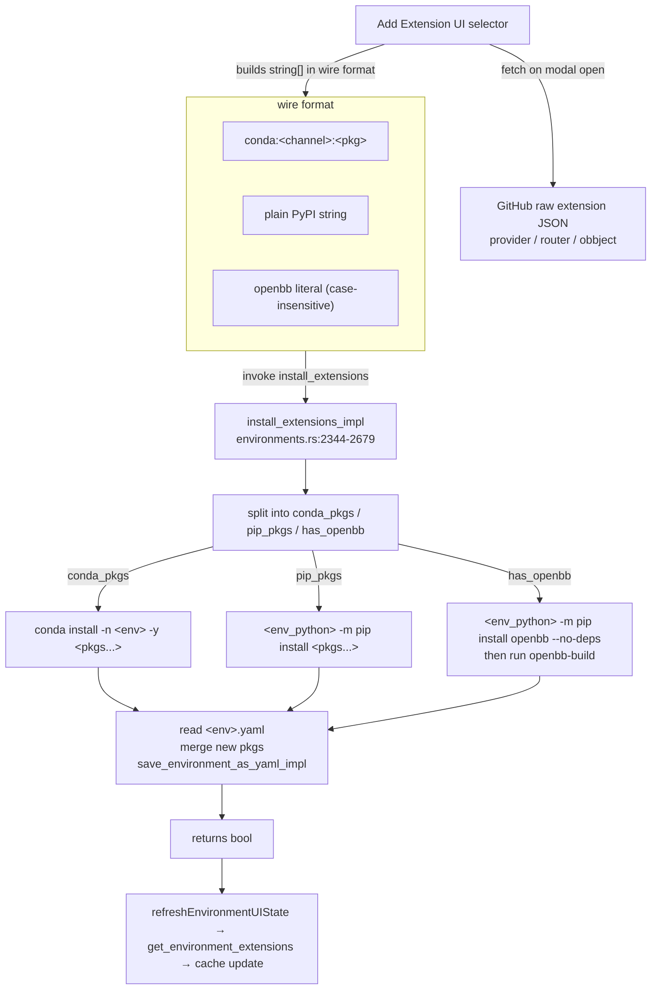

# Feature: Extensions

> Owns: install / update / remove Python packages ("extensions") into an
> existing conda env. Does NOT own env creation (see `feature-environments.md`)
> or the Python REST server that consumes them (see `feature-platform-rest-api.md`).

## Purpose

The desktop curates a set of Python packages inside each managed conda env so
the embedded OpenBB Platform server can expose their FastAPI routes. The user
needs a UI to install, update, and remove these packages without touching a
shell. This feature is the pip/conda glue between the catalog JSON, the
env-on-disk, and the per-env `<env>.yaml` manifest used by later operations.

## User flows

1. **Golden — add to existing env.** "Extensions" on env card → "Add Extension"
   tab (`AddExtensionSelector.tsx`) → pick categories / type free-text → "Install".
   `handleInstallExtensions` (`environments.tsx:1361-1427`) fires
   `install_extensions`. On success `refreshEnvironmentUIState` re-fetches via
   `get_environment_extensions`.
2. **Wizard Step 3 — first install.** Same handler family, different selector
   (`InstallComponents.tsx::ExtensionSelector`), called by
   `installation-progress.tsx:1137-1184`. Targets the freshly-created `openbb` env.
3. **Remove single / Update single.** Trash / refresh icons →
   `handleRemoveExtension` (`environments.tsx:1430-1459`) /
   `handleUpdateExtension` (`environments.tsx:1461-1507`). Update tries pip
   upgrade then falls back to conda. YAML is mutated on remove, untouched on update.
4. **Edge — concurrent install.** Only guard is `installExtensionsLoading`
   button-disable. Conda's lockfile protects env data; YAML merge is racy.
5. **Edge — cancel mid-install.** `handleCancelExtensionInstall`
   (`environments.tsx:1726-1728`) hides the modal only; backend runs to
   completion.

## UI surface

| Surface | File:line | Notes |
|---|---|---|
| Add Extension modal (existing env) | `components/AddExtensionSelector.tsx` | Loaded from `environments.tsx:2576-2581` |
| Extension selector (wizard) | `components/InstallComponents.tsx::ExtensionSelector` | Loaded from create-env modal step 3 |
| Tabs | `conda`, `extras`, `provider`, `router`, `other-openbb` | First two free-text; rest checklists |
| Conda channel field | `AddExtensionSelector.tsx:203-213` | Builds `${channel}:${pkg}` |
| Extension row | `components/ExtensionRow.tsx` (used at `environments.tsx:213-227`) | Trash + refresh icons |
| Install button state | `installExtensionsLoading` (`environments.tsx:282`) | Disables button only |
| Error banners | `extensionsError`, `extensionRemoveError`, `updateExtensionError` (`environments.tsx:2617-2682`) | Inline in panel |

### The catalog (frontend-only, no Tauri, no caching)

Both selectors `fetch()` on every modal open from public OpenBB GitHub raw URLs:

- `https://raw.githubusercontent.com/OpenBB-finance/OpenBB/refs/heads/main/assets/extensions/provider.json`
- `https://raw.githubusercontent.com/OpenBB-finance/OpenBB/refs/heads/main/assets/extensions/router.json`
- `https://raw.githubusercontent.com/OpenBB-finance/OpenBB/refs/heads/main/assets/extensions/obbject.json`

Entry shape (`installation-progress.tsx:23-29`):
`{ packageName, reprName?, description?, credentials?: string[], instructions?: string|null }`.

Four UI categories plus hard-coded `extrasExtensions`:

| Category | Source | Wire format on install |
|---|---|---|
| `conda` | Free-text user input + channel dropdown | `conda:<channel>:<pkg>` |
| `extras` | Hard-coded: `openbb-mcp-server`, `pywry`, `openbb-cli`, `openbb-cookiecutter` (last only in `InstallComponents.tsx`) | plain `<pkg>` (PyPI) |
| `provider` | `provider.json` | plain `<pkg>` (PyPI) |
| `router` | `router.json` + `obbject.json` | plain `<pkg>` (PyPI) |
| `other-openbb` | leftover / hard-coded | plain `<pkg>` (PyPI) |

The literal `openbb` (case-insensitive) is intercepted by Rust and uses the
special `--no-deps + openbb-build` path (see below).

## Data flow



## IPC contract

| Direction | Name | Payload (TS) | Returns | Used by |
|---|---|---|---|---|
| TS → Rust | `install_extensions` | `{ extensions: string[], environment: string, directory: string }` | `boolean` | env page "Add Extension", wizard step 3 |
| TS → Rust | `remove_extension` | `{ package: string, environment: string, directory: string }` | `boolean` | env page row trash |
| TS → Rust | `update_extension` | `{ package: string, environment: string, directory: string }` | `boolean` | env page row refresh |
| TS → Rust | `get_environment_extensions` | `{ name: string }` | `{ extensions: Extension[] }` | post-mutation refresh; cache hydrate |

`Extension = { package: string; version: string; install_method: "pip" \| "conda"; channel: string }`.

> ⚠️ BUG: `directory` is accepted by the frontend on all three mutating
> commands but the Rust signatures ignore it and re-read the install dir from
> `system_settings.json` (`environments.rs:2682-2687`).

### Wire-format encoding parser (Rust side)

`install_extensions_impl` (`environments.rs:2390-2422`):
- starts with `conda:` → strip prefix, push **verbatim rest** to `conda_packages`
  (e.g. `conda-forge:numpy`).
- equals `openbb` (case-insensitive) → set `has_openbb=true`, skip both lists.
- otherwise → push to `pip_packages`.

`remove_extension` mirror parser (`environments.rs:2059-2070`) splits on
first `:`:
- contains `:` → `("conda", &package[idx+1..])` (drops channel for `conda remove`).
- no `:` → `("pip", package)`.

So on-disk YAML stores `<channel>:<pkg>` for conda items, frontend renders with
the prefix, and the parser strips it for the actual `conda remove` call.

## State surfaces

- **React state** (in `environments.tsx`): `extensions`, `environmentPackages`,
  `installExtensionsLoading`, `updatingExtension`, `removingExtension`,
  `extensionSelectorKey` (incremented to remount the selector after install).
- **Rust state**: none. Handlers are stateless; every call re-reads disk.
- **Disk files**:
  - `~/.openbb_platform/system_settings.json` — read for installation dir.
  - `~/.openbb_platform/environments/<env>.yaml` — read, mutated, rewritten.
  - `<install>/conda/envs/<env>/...` — modified via bundled conda binary.
  - `localStorage["env-extensions-cache"]` — frontend mirror;
    `{[env]: {extensions, pythonVersion}}` (no TTL; owned by `feature-environments.md`).

## Persistence — the `<env>.yaml` rewrite

`save_environment_as_yaml_impl` (`helpers.rs:436-503`) writes a conda-env file:

```yaml
name: <env>
channels: [defaults, conda-forge, ...]
dependencies:
  - python=3.12
  - numpy              # conda; optionally <channel>:<name>=<ver>
  - pip
  - pip:
    - openbb-yfinance
    - openbb-platform-api
```

On install (`environments.rs:2620-2648`): parse existing YAML, split each new
package on `=`/`<`/`>` for its name-part, drop existing entries matching that
name, append the new entries. Last-writer-wins.

> ⚠️ BUG: the version-pin splitter handles `=`, `<`, `>` but not `~=`, `===`,
> `!=` (`environments.v2.md §3`). A user-supplied `openbb-platform-api~=1.5`
> creates a duplicate entry in the pip list.

> ⚠️ BUG: if `<env>.yaml` is missing when `install_extensions` runs, the
> install succeeds but the YAML merge is silently skipped with `log::warn!`
> (`environments.rs:2673-2675`). Subsequent `update_environment` then hard-fails
> with "Environment YAML file not found" (`environments.v2.md §4`).

## The `openbb` special case — the only special handler

When the extensions array contains the bare string `"openbb"` (case-insensitive),
the Rust handler runs **two** extra commands (`environments.rs:2480-2533`):

1. `<env_python> -m pip install openbb --no-deps` — the `openbb` PyPI package is
   a meta-package that would pull in every provider at a pinned version; the
   desktop wants to manage those itself.
2. `<install>/conda/envs/<env>/bin/openbb-build` (or `Scripts/openbb-build.exe`).

What `openbb-build` does (`openbb_platform/core/openbb_core/build.py`):
- Runs `<sys.executable> -c "import openbb"`, triggering
  `PackageBuilder.auto_build()`.
- That walks every registered router's command signature and generates a static
  Python module tree under `<openbb>/static/package/` so user code can
  `from openbb import obb` with IDE completion.
- Acquires `flock` on `<openbb>/static/.build.lock` — concurrent calls error.
- Writes `<openbb>/static/assets/reference.json` (used by future `auto_build()`
  to short-circuit when no rebuild is needed).
- Takes 30-90s on a full extension set. Frontend gets **no streaming** — just a
  spinner.

> ⚠️ BUG: wizard step 3 invokes `execute_in_environment("openbb-build")` after
> `install_extensions` (`installation-progress.tsx:1157-1161`), but the default
> extension set never includes bare `"openbb"`, so the `--no-deps` path never
> runs, `openbb-build` is never installed in the env, and the subsequent
> standalone invocation fails. The frontend swallows it as a warning
> (`installation.v2.md §4.3` & §11). Port-time fix: detect any `openbb-*`
> package in the install list and run `openbb-build` then.

## Error handling

Rust returns `Result<bool, String>` formatted as
`"Failed to install pip packages: \nStdout: ...\nStderr: ..."`. Frontend:

- `isFutureWarningOnly` (`environments.tsx:79-89`) — contains `"FutureWarning:"`
  AND none of `"Error:"` / `"failed"` / `"Pip subprocess error:"` → treated as
  success, warning surfaced.
- `isPipSubprocessError` (`environments.tsx:91-94`) — contains
  `"Pip subprocess error:"` → surfaces verbatim (pip writes errors to stdout;
  `extractStderr` knows this).
- Else → red banner with raw string + Retry / Dismiss.

Cancel is modal-hide only; no abort signal reaches the backend.

## ▸ Interfaces with

- **depends-on** `feature-environments.md` — env must exist (`install_extensions`
  errors with `"Environment '{env}' does not exist"` if
  `<install>/conda/envs/<env>/bin/python` is missing). Env page owns the
  `env-extensions-cache` localStorage schema and the `<env>.yaml` location.
- **depends-on** `feature-installation.md` — Step 3 of the wizard IS this
  feature, just called from `InstallComponents.tsx` instead of
  `AddExtensionSelector.tsx`. The wizard also runs the explicit
  `execute_in_environment("openbb-build")` (footgun above).
- **depended-on-by** `feature-platform-rest-api.md` — installed packages are
  what the REST server imports at boot.
- **depended-on-by** `feature-jupyter.md` — presence of `notebook`/`jupyter`/
  `jupyterlab` enables the "Open in Jupyter" button.
- **shares-state-with** `feature-environments.md` via
  `~/.openbb_platform/environments/<env>.yaml` and via
  `localStorage["env-extensions-cache"]`.

## TS port mapping

| Tauri call | TS-server equivalent | Notes |
|---|---|---|
| `install_extensions` | `POST /environments/:env/extensions` (body: `{ extensions: string[] }`) | Long-running; stream via WS/SSE keyed by server-generated `installId`. Per-env serialization (see Open Q's). Re-read install dir from `system_settings.json`; ignore client-supplied dir. |
| `remove_extension` | `DELETE /environments/:env/extensions/:pkg` | URL-encode `:pkg` — conda packages contain `:`. |
| `update_extension` | `PATCH /environments/:env/extensions/:pkg` | Pip first, conda fallback. |
| `get_environment_extensions` | `GET /environments/:env/extensions` | Read `<env>.yaml` + `conda list --name <env> --json`; merge. |
| catalog fetch (frontend) | unchanged — direct `fetch()` to GitHub raw | CORS works; cache in IndexedDB with TTL. |

### Wire-format parser (port-critical)

```ts
type ExtensionSpec =
  | { kind: "conda"; channel: string; pkg: string }
  | { kind: "openbb" }                       // bare "openbb": --no-deps + build
  | { kind: "pip"; pkg: string };

function parseExtensionString(s: string): ExtensionSpec {
  if (s.startsWith("conda:")) {
    const rest = s.slice("conda:".length);
    const idx = rest.indexOf(":");
    if (idx < 0) return { kind: "conda", channel: "conda-forge", pkg: rest };
    return { kind: "conda", channel: rest.slice(0, idx), pkg: rest.slice(idx + 1) };
  }
  if (s.toLowerCase() === "openbb") return { kind: "openbb" };
  return { kind: "pip", pkg: s };
}
```

### Shell-out reproduction

Every spawn must use the conda env-var preamble (`CONDA_ROOT`, `CONDA_ENVS_PATH`,
`CONDA_PKGS_DIRS`, `CONDARC` set; `CONDA_DEFAULT_ENV`, `CONDA_PREFIX`,
`CONDA_SHLVL` unset — see `environments.v2.md §12`). On Windows, set
`CREATE_NO_WINDOW (0x08000000)`. Capture both stdout AND stderr — pip errors go
to stdout. Commands:

- `<conda>/bin/conda install -n <env> -y <pkgs...>` (or `install -y` for `base`)
- `<env_python> -m pip install <pkgs...>`
- `<env_python> -m pip install openbb --no-deps` (only when bare `openbb`)
- `<env>/bin/openbb-build` (after the `--no-deps` install)
- `<conda>/bin/conda remove -n <env> <pkg> -y`
- `<env_python> -m pip uninstall <pkg> -y`
- `<env_python> -m pip install --upgrade <pkg>` (update; pip first)
- `<conda>/bin/conda install -n <env> <pkg> -y` (update; conda fallback)
- `<conda>/bin/conda list --name <env> --json` (for `get_environment_extensions`)

## Known bugs and port-time fixes

> ⚠️ BUG 1: `install_extensions` / `remove_extension` / `update_extension`
> ignore the `directory` payload (`environments.v2.md §6.8`). Port: drop the
> param or honour it.

> ⚠️ BUG 2: Concurrent `install_extensions` calls race on the YAML rewrite
> (`environments.md §6.5`, `environments.v2.md §8`). Port: per-env coarse
> lock at the handler level.

> ⚠️ BUG 3: Missing `<env>.yaml` causes the install to succeed but YAML merge
> to be silently skipped; later `update_environment` hard-fails. Port:
> synthesise a minimal YAML if absent.

> ⚠️ BUG 4: Wizard step 3's standalone `openbb-build` call fails by default
> because `install_extensions` never installs the binary (bare `"openbb"`
> isn't in the default set). Port: detect any `openbb-*` package and run
> `openbb-build` then.

> ⚠️ BUG 5: Cancel only hides the modal; backend keeps running. Port: track
> the spawned child PID per install request and signal on cancel.

> ⚠️ BUG 6: Catalog re-fetches on every modal open. Port: cache in IndexedDB
> with 5-10 min TTL.

> ⚠️ BUG 7: Version-pin parser doesn't handle `~=`, `===`, `!=` — duplicate
> YAML entries on custom packages using those operators
> (`environments.v2.md §3`). Port: PEP 440 specifier parser.

> ⚠️ BUG 8: `install_extensions` emits no `process-output` stream (no
> `processId` is plumbed — `installation.v2.md §4.2`). User sees only a
> spinner for a potentially 5-10 min install. Port: stream pip/conda output
> via a per-request channel.

## Open questions

1. **Should the `<env>.yaml` rewrite be transactional?** Today: read → mutate
   in-memory → write back. A crash or concurrent writer leaves YAML out of sync
   with conda. Options: (a) atomic `.tmp` + rename; (b) journal under
   `~/.openbb_platform/environments/.journal/`; (c) treat `conda list --json`
   as source of truth and demote YAML to a regen-on-demand cache. (c) breaks
   YAML's role as seed for `update_environment` / `create_environment_from_requirements`.

2. **Should the port serialize concurrent installs per env?** No serialization
   beyond conda's own lockfile today. A per-env `AsyncMutex` (or queue) is the
   minimum. Reject the second request with 409 "busy", or queue it? Queuing is
   friendlier but lets the user stack confusing operations.

3. **Catalog source of truth.** Keep frontend-direct fetching, proxy through
   the TS server (for caching + offline), or bundle as static assets refreshed
   on app update?

4. **Always run `openbb-build` after any `openbb-*` install?** Eliminates Bug 4
   at the cost of 30-90s extra time per install touching OpenBB packages.

5. **Encoding ambiguity.** `<channel>:<name>` wire format breaks if a conda
   version string ever contains `:`. Switch to structured
   `{kind, channel, name, version}` over JSON?

6. **Consolidate the dual selector?** `AddExtensionSelector.tsx` and
   `InstallComponents.tsx::ExtensionSelector` are near-duplicates
   (`environments.md §6.2`).

## Cross-feature dependencies

- **depends-on** `feature-environments.md` — env must exist; YAML manifest
  lives in env's namespace.
- **depends-on** `feature-installation.md` — bundles the conda binary; seeds
  the first `openbb` env this feature then populates.
- **depended-on-by** `feature-platform-rest-api.md` — installed packages are
  what the REST server imports.
- **depended-on-by** `feature-jupyter.md` — kernel ships from the env;
  notebook deps installed via this feature.
- **shares-state-with** `feature-environments.md` via
  `~/.openbb_platform/environments/<env>.yaml` and
  `localStorage["env-extensions-cache"]`.
