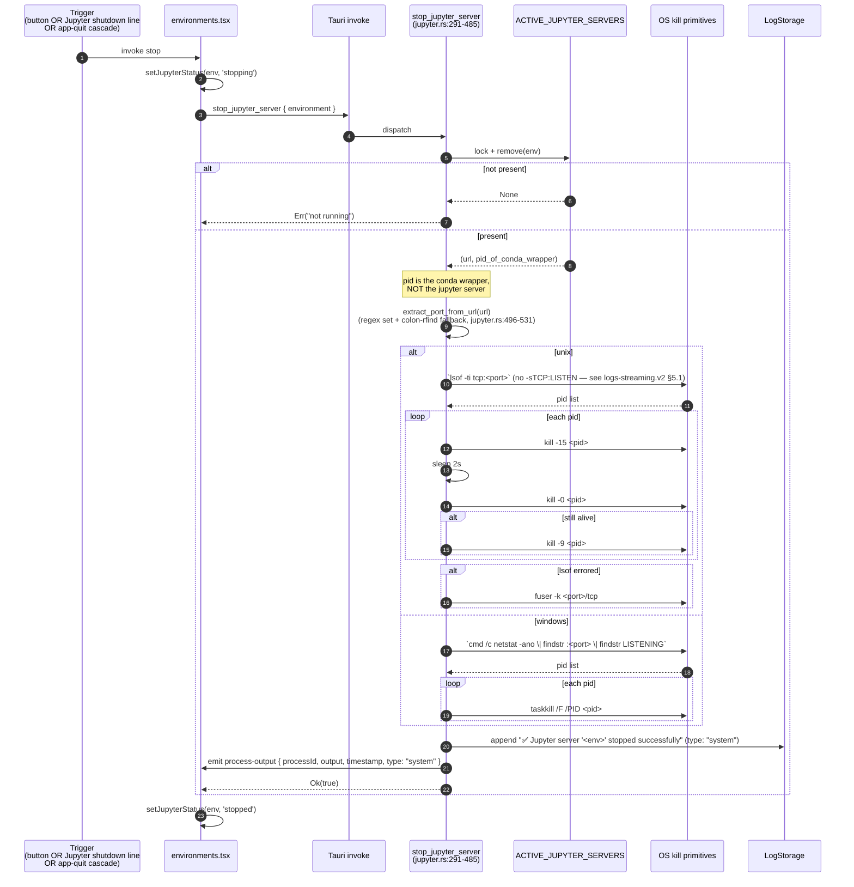

# Feature: Jupyter

## Purpose
Let a user launch, observe, and stop a per-conda-environment JupyterLab server from
the Environments page. The desktop app does not pick the port or token — `jupyter
lab` does — so the feature's real job is **lifecycle bookkeeping**: spawn the
process under `conda run`, scrape its URL out of stdout, expose start/stop/status
across all webview windows, and tear it down by **port** at quit time. Log
streaming for the spawned process is owned by `feature-logs-streaming.md`; this
doc covers only the Jupyter-specific glue.

## User flows
1. **Start (golden).** Click "Start Jupyter" → UI shows `starting`, server spawns, URL is scraped, webview window opens, status flips to `running`.
2. **Already running.** Re-click "Open Jupyter" → backend short-circuits via `ACTIVE_JUPYTER_SERVERS` and returns `{ already_running: true, url }`.
3. **Stop from main window.** Click Stop → port-based kill, map entry removed, `"✅ Jupyter server stopped"` system log line.
4. **Stop from inside Jupyter UI.** User picks Jupyter's "Shut Down" menu. Jupyter writes `"Shutting down on /api/shutdown request"` to stderr; the open Logs window (if any) writes a localStorage key; the main window's storage listener flips UI status to `stopped`.
5. **App quit.** `cleanup_all_processes` calls `stop_all_jupyter_servers` with a 3s timeout (`feature-app-shell.md` §7); on overrun any stragglers leak.
6. **Edge — URL too slow.** 30s with no parseable URL → child is killed, start returns `Err` (`jupyter.rs:198, 247-249`).
7. **Edge — env removed while running.** `remove_environment` does NOT consult `ACTIVE_JUPYTER_SERVERS`; the process orphans (`environments.v2.md §1`).

## UI surface
- Env card in `routes/environments.tsx`: Start/Stop at `:1890-1969`, "Logs" at `:1981-1990`, `openJupyterWindow(url)` nearby.
- Status pill driven by `jupyterStatus[envName]` ∈ `{undefined, 'starting', 'stopping', 'running', 'stopped', 'error'}` (`:1791-1870`).
- Start disabled unless `hasJupyterSupport(env)` — cached package set contains `notebook` / `jupyter` / `jupyterlab` (`:1195-1295`). No form fields.

## Data flow

### Start sequence

```mermaid
sequenceDiagram
    autonumber
    participant U as User
    participant EC as Env card<br/>(environments.tsx)
    participant T as Tauri invoke
    participant J as start_jupyter_server<br/>(jupyter.rs:36-261)
    participant M as ACTIVE_JUPYTER_SERVERS<br/>(static Mutex)
    participant P as conda run jupyter lab<br/>(child process)
    participant L as LogStorage<br/>(feature-logs-streaming)

    U->>EC: click Start
    EC->>EC: setJupyterStatus(env, 'starting')
    EC->>T: register_process_monitoring("jupyter-<env>")
    EC->>T: start_jupyter_server { environment, directory, working }
    T->>J: dispatch
    J->>M: lock + check entry
    alt entry exists
        M-->>J: (url, pid)
        J-->>EC: { url, already_running: true, status: "running" }
    else not present
        J->>P: spawn `<conda>/bin/conda run -n <env> --no-capture-output jupyter lab --no-browser --notebook-dir <working>`<br/>env: JUPYTER_CONFIG_DIR/DATA_DIR/RUNTIME_DIR
        J->>L: register_process("jupyter-<env>")
        par stdout reader
            P-->>J: line N
            J->>L: append LogEntry
            J->>EC: emit process-output { processId, output, timestamp }
            J->>J: mpsc send line (URL detector)
        and stderr reader
            P-->>J: line M
            J->>L: append LogEntry
            J->>EC: emit process-output
            J->>J: mpsc send line
        end
        J->>J: await URL via Promise.race(regex match, 30s timeout)
        alt URL matched in time
            J->>M: insert env → (url, pid_of_conda_wrapper)
            J-->>EC: { url, already_running: false, status: "running", process_id }
        else 30s timeout
            J->>P: child.kill()
            J-->>EC: Err("Failed to extract URL")
        end
    end
    EC->>EC: setJupyterStatus(env, 'running'); jupyterUrlRef[env] = url
    EC->>T: open_url_in_window { url: url + "?token=launcher" }
```

URL detector tries three regexes, in order, against every line received on the
mpsc channel (`jupyter.rs:13-34`):

1. `https?://[^\s]+token=[^\s]+` — preferred (URL with token).
2. `https?://(?:localhost|127\.0\.0\.1):[0-9]+[^\s]*`.
3. `http://[^:\s]+:[0-9]+[^\s]*`.

Plus a fallback substring scan for `http://...localhost...lab|8888`
(`jupyter.rs:213-226`). Trailing punctuation in `., ) ] }` is stripped from the
match (`jupyter.rs:27-29`). Port is **not** chosen by the desktop — `jupyter lab`
picks 8888 or next free.

### Stop sequence



> Critical insight: stop kills by **port**, not by the stored PID. `conda run`
> spawns the actual `jupyter lab` as a grandchild; the PID written into
> `ACTIVE_JUPYTER_SERVERS` is the conda wrapper, which often exits or detaches
> before stop runs. The port (parsed back out of the URL string we scraped at
> start) is the only durable handle to the real server.

## IPC contract

| Direction | Name | Payload | Returns | Used by |
|---|---|---|---|---|
| invoke | `start_jupyter_server` | `{ environment, directory, working }` | `{ url, already_running, status, process_id? }` | `environments.tsx:1890-1942` |
| invoke | `stop_jupyter_server` | `{ environment }` | `bool` | `environments.tsx:1945-1969`, also from log-window shutdown observer |
| invoke | `check_jupyter_server` | `{ environment }` | `{ running, url?, status, environment, process_id? }` | 3s polling effect `environments.tsx:1791-1870` |
| invoke | `list_jupyter_servers` | `{}` | `{ servers: [...] }` | (optional admin) |
| invoke | `update_jupyter_status` | `{ environment, status }` | `()` | manual status emitter `jupyter.rs:645` |
| invoke | `open_jupyter_logs_window` | `{ environment }` | `()` | `environments.tsx:1984` (delegates to logs-streaming) |
| invoke | `open_url_in_window` | `{ url }` | `()` | `openJupyterWindow` (`helpers.rs:958-1020`) |
| event | `process-output` | `{ processId: "jupyter-<env>", output, timestamp, type?: "system" }` | — | All listeners; the only Jupyter-emitted payload with `type:"system"` is the stop-completion banner (`jupyter.rs:476-482`) |
| event | `jupyter-status-update` | `{ environmentName, status }` | — | Emitted by `update_jupyter_status` (`jupyter.rs:651-658`); main window listens at `environments.tsx:2089-2099` |

## State surfaces

- **React (`environments.tsx`):** `jupyterStatus[env]` (`:1791-1870`); `jupyterUrlRef.current[env]` ref (`:300`); 3s polling setInterval that only ticks envs in `{starting, stopping, undefined}` and self-clears (`:1862`); 30s starting→error wall (`:1832`).
- **Rust static:** `ACTIVE_JUPYTER_SERVERS: Lazy<Mutex<HashMap<String, (String, u32)>>>` (`jupyter.rs:9-10`). Schema **env-name → (jupyter_url, pid_of_conda_wrapper)** — sole truth for "is it running and where". Never reconciled against the OS; entries leak if env is removed without stopping (`environments.v2.md §1`). Jupyter **never** registers in `RunningProcesses` (`logs-streaming.md §7.4`).
- **Cross-window:** localStorage keys `jupyter-shutdown-<env>` with `Date.now()` timestamps; 60s freshness check (see below).
- **Disk:** none of ours. Jupyter itself reads `<install>/Jupyter/jupyter_config|jupyter_data|jupyter_runtime` because those paths are exported as env vars at spawn (`jupyter.rs:88-93`).

## Cross-window status propagation

Three nominal channels exist; only two actually work in Tauri builds:

| Channel | Mechanism | Status |
|---|---|---|
| Tauri `process-output` event | `app_handle.emit` from Rust → frontend `listen` in main window watches for the `"Shutting down on /api/shutdown request"` substring (`environments.tsx:2046-2076`) | **Works.** Most reliable. |
| `window.postMessage` to `window.opener` | `JupyterLogsPage.tsx:217-224` calls `window.opener.postMessage(...)` if opener is non-null | **Dead in Tauri.** `WebviewWindowBuilder` does not establish an opener relationship — `window.opener` is always `null` (`logs-streaming.v2.md §J`). Branch silently no-ops in production. |
| `localStorage` write + `storage` event | Logs window writes `localStorage[jupyter-shutdown-<env>] = Date.now().toString()` (`JupyterLogsPage.tsx:229`); main window's `handleStorage` listener at `environments.tsx:2107-2126` and mount-time scan at `:2137-2153` consume it | **Works** but uses localStorage as IPC. |

Freshness rule: storage events / on-mount scan honor a `jupyter-shutdown-<env>`
key only if `Date.now() - storedTimestamp < 60000`. After consumption the key is
removed (`environments.tsx:2124` and `:2156`). Idempotent — `setJupyterStatus`
only updates if previous state is `'running'` (`:2114`).

## Persistence
Nothing in this feature persists across app restarts. `ACTIVE_JUPYTER_SERVERS` is
in-memory; logs are in `LOG_STORAGE` (also in-memory); the on-disk Jupyter
config/data/runtime dirs are Jupyter's own, not ours.

## Error handling
- **30s URL timeout** → kill child, return `Err`; UI flips status to `error` (`environments.tsx:1934`).
- **Port not extractable from URL** → stop returns `Err`; map entry already removed, so Start spawns a fresh server (`jupyter.rs:516-528`).
- **`lsof` errored / missing** → fallback to `fuser -k <port>/tcp` (`jupyter.rs:432-451`).
- **Stop called for unknown env** → `Err("Jupyter server not running for env X")`.
- **Stale `already_running` short-circuit** when the real server died without going through stop: Start returns a dead URL, Open fails. Recovery today: restart the app.

## ▸ Interfaces with
- **depends-on** `feature-environments.md` — env must exist and have `jupyterlab`/`notebook`/`jupyter` installed (`hasJupyterSupport` predicate). Working dir comes from env-page state.
- **depends-on** `feature-extensions.md` — `install_extensions` is what gets those packages into the env.
- **depends-on** `feature-logs-streaming.md` — `process-output` channel, `LOG_STORAGE` buffer under key `jupyter-<env>`, `open_jupyter_logs_window`, `JupyterLogsPage` rendering, log-window shutdown observer.
- **depends-on** `feature-app-shell.md` — quit-time cleanup cascade calls `stop_all_jupyter_servers` inside a 3s `tokio::time::timeout` (`app-shell.md §7`, lines 426-435). On overrun, Jupyter children outlive the app.
- **depended-on-by** `feature-uninstall.md` (stop everything before removing files).
- **shares-state-with** `feature-environments.md` via `jupyterStatus` / `jupyterUrlRef` (both live on the Environments page).

## TS port mapping

| Tauri call | TS equivalent | Notes |
|---|---|---|
| `invoke("start_jupyter_server", {environment, directory, working})` | `POST /jupyter/:env/start` body `{directory, working}` → returns `{url, alreadyRunning, status, processId}` | Server-side: `child_process.spawn("<conda>/bin/conda", ["run", "-n", env, "--no-capture-output", "jupyter", "lab", "--no-browser", "--notebook-dir", working], {env: {...process.env, JUPYTER_CONFIG_DIR, JUPYTER_DATA_DIR, JUPYTER_RUNTIME_DIR}})`. Pipe stdout/stderr through line-readers that (a) write to LogBuffer, (b) emit on the WS, (c) feed an async iterator the URL extractor consumes. |
| `invoke("stop_jupyter_server", {environment})` | `POST /jupyter/:env/stop` → `bool` | Look up URL in `ACTIVE_JUPYTER_SERVERS` (Map<string, {url, pid}>). Run `extractPortFromUrl(url)`. Use Node `child_process.execFile("lsof", ["-ti", `tcp:${port}`])` → `process.kill(pid, 'SIGTERM')` → `setTimeout(2000)` → try `process.kill(pid, 0)` → if alive `process.kill(pid, 'SIGKILL')`. Fallback `execFile("fuser", ["-k", `${port}/tcp`])`. Windows: `netstat -ano \| findstr :${port} \| findstr LISTENING` → `taskkill /F /PID`. Or use `fkill` npm package. |
| `invoke("check_jupyter_server", {environment})` | `GET /jupyter/:env/status` | Pure read of the in-memory map plus an optional liveness ping (`fetch(url, {signal: AbortSignal.timeout(500)})`). |
| `invoke("list_jupyter_servers", {})` | `GET /jupyter` | Iterate the Map. |
| `invoke("open_jupyter_logs_window", {environment})` | Electron: `new BrowserWindow(...)` keyed on label `jupyter-logs-${env}`; reuse if exists. Browser-only: `window.open('/jupyter-logs?env=' + encodeURIComponent(env), 'jupyter-logs-' + env)`. | See `feature-logs-streaming.md`. |
| `invoke("open_url_in_window", {url})` | `new BrowserWindow().loadURL(url)` or `window.open(url)`. |
| URL extraction regex set | Port verbatim from `jupyter.rs:14-19`. Use `Promise.race([urlPromise, sleep(30_000).then(() => Promise.reject(new TimeoutError()))])`. |
| Port extraction regexes | Port verbatim from `jupyter.rs:498-502` plus the `url.lastIndexOf(':')` colon-rfind fallback at `:514-528`. |
| 60s storage freshness | `if (Date.now() - parseInt(localStorage.getItem(key), 10) < 60_000) ...` — or replace with `BroadcastChannel('jupyter-status')` for a clean port. |
| Cross-window status (3 channels) | Pick one: Electron `webContents.send` from main to all windows, or `BroadcastChannel('jupyter-status')` across renderers. Drop the dead `window.opener` branch entirely. |
| Cleanup cascade | `app.on('before-quit', async e => { e.preventDefault(); await Promise.race([Promise.all([stopAllJupyter(), stopAllBackends()]), wait(10_000)]); app.exit(0); })`. |

## Known bugs and port-time fixes

> ⚠️ BUG (`logs-streaming.v2.md §J`): `window.postMessage(window.opener, ...)` in
> `JupyterLogsPage.tsx:217-224` is unreachable in Tauri — `window.opener` is
> `null` for `WebviewWindowBuilder` webviews. The branch silently no-ops. Port
> should drop it.

> ⚠️ BUG (30s URL extraction timeout): hard-coded `Duration::from_secs(30)` at
> `jupyter.rs:198`. On a slow first import (e.g. cold filesystem cache, AV scan,
> or a `jupyterlab` build step on first run) the URL line can appear at 31s and
> we kill a server that was actually starting fine. Port should make the timeout
> configurable, or extend it to ~60-90s, or watch for the `"is running at:"`
> banner separately from URL match.

> ⚠️ BUG (port collision): we don't choose the port — Jupyter does, and Jupyter
> picks "8888 or next free". If a non-Jupyter process is on 8888 and Jupyter
> rolls to 8889, fine; if **two of our envs** race to start at the same time
> they may both bind successive ports correctly but our URL extractor only sees
> the first match per stream. Port should serialize starts per-host, or assign
> the port ourselves with `--port <chosen>` after a `getPort` probe so we
> control collision behavior.

> ⚠️ BUG (`environments.v2.md §1`): `remove_environment` does not consult
> `ACTIVE_JUPYTER_SERVERS`. Deleting a running env leaves an orphan process
> with no UI handle. Port should call `stop_jupyter_server(env)` first.

> ⚠️ BUG (3-channel cross-window status with window.opener dead): only the
> Tauri event + localStorage paths fire; postMessage is dead. Port should
> collapse to a single typed event bus.

> ⚠️ BUG (`logs-streaming.v2.md §5.1`): `lsof -ti tcp:<port>` (no `-sTCP:LISTEN`)
> for Jupyter targets ALL connections on the port, not just listeners. A stale
> browser tab holding a websocket to localhost:<port> shows up in `lsof -ti`
> too. Killing those PIDs is usually harmless (they're our own webview),
> but the **set of returned pids includes more than the server**. The backend
> handler at `backends.rs:380` does include `-sTCP:LISTEN` — the divergence is
> almost certainly an oversight.

## Open questions
1. **Replace port-based stop with PID-tree tracking?** If the port drops `conda run` (invoke `<env>/bin/jupyter` via the env's interpreter directly), the grandchild layer disappears and `process.kill(pid, ...)` becomes sufficient. Avoids the "what's listening on this port" ambiguity but loses one Jupyter quirk-tolerance: a server that re-binds to a new port after a crash is no longer findable.
2. **Configurable URL-extraction timeout** vs. content-based readiness probe (poll `GET <candidate>/api` until 200) — avoids the 30s wall.
3. **Assign the port ourselves** via `net.createServer().listen(0)` probe + `jupyter lab --port <n>`? Deterministic URL before spawn; handles EADDRINUSE up front.
4. **Drop localStorage-as-IPC** for a `BroadcastChannel('openbb-jupyter')`? Typed messages, no 60s freshness hack.
5. **Periodic reaper for `ACTIVE_JUPYTER_SERVERS`?** Today the map can hold dead entries forever (`already_running` then serves stale URLs). A 30s sweep pinging each URL and evicting on 4xx/timeout would self-heal.

---

## Cross-feature dependencies
- **depends-on** `feature-environments.md`, `feature-logs-streaming.md`,
  `feature-app-shell.md`.
- **shares-state-with** `feature-environments.md` via React `jupyterStatus`,
  `jupyterUrlRef`; the env page is the sole UI for Jupyter.
- **shares-state-with** `feature-logs-streaming.md` via the `jupyter-<env>`
  LogBuffer key and the `process-output` event channel.

### Files referenced
- `/home/user/OpenBBPort/desktop/src-tauri/src/tauri_handlers/jupyter.rs`
- `/home/user/OpenBBPort/desktop/src-tauri/src/utils/process_monitor.rs`
- `/home/user/OpenBBPort/desktop/src-tauri/src/tauri_handlers/helpers.rs`
- `/home/user/OpenBBPort/desktop/src-tauri/src/main.rs` (cleanup cascade)
- `/home/user/OpenBBPort/desktop/src/routes/environments.tsx`
- `/home/user/OpenBBPort/desktop/src/routes/jupyter-logs.tsx`
- `/home/user/OpenBBPort/desktop/src/components/JupyterLogsPage.tsx`
