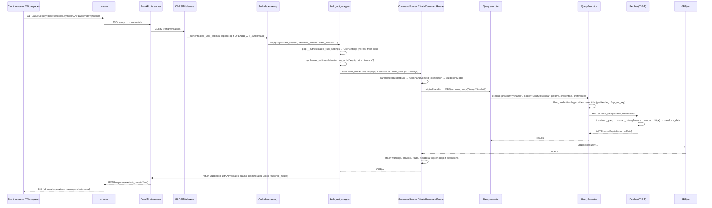

# Feature: Platform REST API (the `openbb-api` server)

## Purpose

The data plane. Every chart, table, and widget the desktop app renders ultimately
asks a Python FastAPI server — `openbb-api` — for an `OBBject` JSON document.
This feature documents the server itself: how it boots, what it serves, the
wire format, the auth modes, and the env-var contract. It is the thing the
desktop's **Backend services** feature spawns (`feature-backend-services.md`)
and the thing whose credentials the **API Keys** UI writes
(`feature-api-keys.md`). For the port team it is also the single largest open
question: reimplement in TS (Strategy A) or wrap as a subprocess (Strategy B).
That decision lives in `30-port/port-strategy.md`; this doc just lays out the
ground truth.

## User flows

Headless. "User" here is the **desktop renderer** fetching
`http://127.0.0.1:6900/api/v1/...` or **OpenBB Workspace** polling
`/widgets.json` / `/apps.json`. Golden path:

1. Desktop **Backend services** UI spawns `openbb-api` inside the `openbb`
   conda env that `feature-installation.md` created.
2. Launcher imports `openbb_platform_api.main` → `openbb_core.api.rest_api`
   → walks every `openbb_*` extension entry point → builds Pydantic
   dataclasses for every provider/route pair → eagerly serializes the
   OpenAPI schema → builds the `widgets.json` catalogue. **8-15 s on a full
   install** (see §Cold start).
3. uvicorn binds `127.0.0.1:6900` (auto-incrementing if busy) and emits
   "Application startup complete." + the bound URL on stdout.
4. Workspace / desktop renderer polls `/widgets.json` and `/apps.json` to
   populate the widget palette, then fires data calls.
5. API Keys UI rewrites `~/.openbb_platform/user_settings.json`; the **next**
   request picks it up (settings re-read per request).

Edge cases:
- **Port collision**: silently incremented by `check_port`; bound port only
  shows in stdout (desktop's `backends.json` keeps the requested port).
- **Missing credential**: `OpenBBError("Missing credential 'fmp_api_key'.")`
  → HTTP 400.
- **Empty result**: `EmptyDataError` → bare `204 No Content`, not `200 []`.
- **`OPENBB_DEBUG_MODE=true`**: uncaught exceptions re-raise (full traceback
  to stdout) instead of being JSON-encoded.

## UI surface

**N/A (headless server).** The server has no UI of its own. Its consumers are:

- **OpenBB Workspace** — polls `GET /widgets.json` (the widget palette) and
  `GET /apps.json` (saved layouts). The desktop's frontend proxies these
  through to embedded Workspace iframes.
- **Desktop renderer** — issues direct `fetch('http://127.0.0.1:6900/api/v1/...')`
  for any widget that wants OpenBB data.
- **Third-party MCP/agent clients** — read `/openapi.json` or `/widgets.json`
  for tool discovery.

There is a single landing HTML at `GET /` (`extensions/platform_api/openbb_platform_api/main.py:124-130`)
showing version + links; not used by the desktop.

## Data flow



Source: `core/openbb_core/api/router/commands.py:212-342`,
`core/openbb_core/app/command_runner.py:430-535`,
`core/openbb_core/app/query.py:66-80`,
`core/openbb_core/provider/query_executor.py:65-97`,
`core/openbb_core/provider/abstract/fetcher.py:73-85`.

## OBBject wire shape

The default success body for any `OBBject`-returning command after
`response_model_exclude_unset=True`:

```jsonc
{
  "id": "01963f7a-7f8c-7c84-bff2-...",       // UUID v7 (time-ordered); regenerated per response, NOT a cache key
  "results": [
    { "date": "2024-01-02", "open": 187.15, "high": 188.44, "low": 183.89,
      "close": 185.64, "volume": 82488700, "vwap": null,
      "split_ratio": null, "dividend": null }
  ],
  "provider": "yfinance",                     // the resolved provider name
  "warnings": [
    { "category": "OpenBBWarning", "message": "Parameter 'foo' not found." }
  ],
  "chart": null,                              // or { "content": "<plotly JSON>", "format": "plotly" }
  "extra": {
    "metadata": {                             // only if user_settings.preferences.metadata=true
      "arguments": { "standard_params": {...}, "extra_params": {...}, "provider_choices": {"provider": "yfinance"} },
      "duration": 482103120,                  // ns
      "route": "/equity/price/historical",
      "timestamp": "2026-05-15T..."
    },
    "results_metadata": { /* present iff Fetcher returned AnnotatedResult */ }
  }
}
```

Notes:
- `results` is **always a list of dicts (or a single dict), never a DataFrame**
  — the Fetcher already converted via Pandas `to_dict("records")` and
  instantiated Pydantic models server-side. `OBBject.to_df/to_polars/to_dict/to_llm`
  are **client-side only** (Python SDK), never run in the server.
- `chart.fig` (the live Plotly figure) is stripped before serialisation
  (`commands.py:152-209`); only `chart.content` (raw Plotly JSON) plus
  `chart.format` are sent. Plotly.js can render `chart.content` directly.
- `EmptyDataError` → bare **204** with no body, not 200 + empty list
  (`exception_handlers.py:122-125`).
- The OpenAPI response model is a **discriminated union** keyed on each
  provider's `_provider` attribute. The discriminator field is **not** in the
  serialised JSON (it lives on `obbject.provider` instead) — codegen
  consumers may need to strip it from generated types.

## IPC contract

| Direction | Name | Payload | Returns | Used by |
|-----------|------|---------|---------|---------|
| HTTP GET | `/api/v1/{ext}/{...}` | query params (provider, standard, extra) | `OBBject` JSON | desktop renderer, Workspace, third-party MCP |
| HTTP GET | `/widgets.json` | none | `{ <widget_id>: <widget_config>, ... }` | Workspace, desktop widget renderer |
| HTTP GET | `/apps.json` | none | `[<app_template>, ...]` | Workspace |
| HTTP GET | `/agents.json` | none | `{}` or merged map | third-party agents |
| HTTP GET | `/openapi.json` | none | OpenAPI 3 doc | codegen, MCP bridge |
| HTTP GET | `/coverage/{providers,commands,command_model}` | none | dicts | codegen (DEV_MODE only) |
| HTTP GET | `/user/me` | none | `UserSettings` | DEV_MODE only |
| HTTP GET | `/system` | none | `SystemSettings` | DEV_MODE only |

There is **no in-process IPC** — every consumer talks HTTP, including the
parallel `openbb-mcp` server (see below).

## State surfaces

Per-process singletons (Python, in-memory, set once at module import):

| Singleton | Reloads? | Source |
|---|---|---|
| `Env()` | No (frozen `os.environ` snapshot) | `~/.openbb_platform/.env` |
| `SystemService().system_settings` | No (explicit `refresh_*` exists but never called) | `system_settings.json` |
| `ProviderInterface()` (`SingletonMeta`) | No | walks `openbb_*` entry points |
| `widgets_json` dict | No (unless `--editable`) | derived from OpenAPI at boot |

Per-request reloads:

- `UserSettings` (credentials/preferences/defaults) — read from
  `~/.openbb_platform/user_settings.json` on **every** request. The default
  value of the hidden `__authenticated_user_settings` param is
  `UserSettings()`, whose `__init__` does `json.load(open(USER_SETTINGS_PATH))`
  (`model/user_settings.py:22-41`, `commands.py:244`).
- `default_apps.json` + `~/OpenBBUserData/workspace_apps.json` — read on
  every `GET /apps.json`.
- `--agents-json PATH` file — read on every `GET /agents.json`.

## Persistence

The server is a **reader** for almost everything. It writes only one file:

- `~/OpenBBUserData/workspace_apps.json` — auto-created as `[]` on the FIRST
  `GET /apps.json` if it doesn't exist (`main.py:183-189`). This is a **side
  effect of the GET**; a port must preserve it to avoid breaking Workspace
  startup.

Credentials, preferences, and defaults are written by the **API Keys UI**
(`feature-api-keys.md`), not by the server.

## Error handling

| Exception | HTTP | Body | Source |
|---|---|---|---|
| `EmptyDataError` | **204** | _empty_ | `exception_handlers.py:122-125` |
| `OpenBBError` | **400** | `{"detail": str(error.original)}` | `:113-120` |
| `ValidationError` (Pydantic) | **422** | `{"detail": [{type, loc, msg, input}]}` | `:64-111` |
| `ResponseValidationError` | **422** | same | `:74-86` |
| `UnauthorizedError` (provider 401/403 upstream) | **502** | `{"detail": str(error.original)}` | `:127-134` |
| Bare `ValueError` inside handler | **422** | `{"detail": error.args}` | `:42-47` |
| `HTTPException(401)` from auth | **401** | `{"detail": "Incorrect ..."}` + `WWW-Authenticate: Basic` | FastAPI built-in |
| Anything else | **500** | `{"detail": "Unexpected Error -> ClassName -> message"}` | `:57-61` |

If `OPENBB_DEBUG_MODE=true`, handlers re-raise instead of catching, so
uvicorn prints the full traceback (`exception_handlers.py:25-27`).

The route decorator pre-declares OpenAPI `responses` for 204/400/404/500/502
with `OpenBBErrorResponse(detail, error_kind)` (`app/router.py:137-156`), but
`error_kind` is **never populated by any handler** — it's documented in the
schema but always absent on the wire (see Known bugs).

## Auth modes

Three mutually-exclusive modes, controlled by env vars read on the
process's `Env()` singleton (boot-time only — changing them requires a
restart):

| Mode | Trigger | Behaviour |
|---|---|---|
| **None (default)** | `OPENBB_API_AUTH=false` | `security = lambda: None`. The `__authenticated_user_settings` dependency is NOT injected; routes are open. `UserSettings()` is still re-read on every request (the `UserSettings()` default constructor parses the file). |
| **HTTP Basic** | `OPENBB_API_AUTH=true` + `OPENBB_API_USERNAME` + `OPENBB_API_PASSWORD` | `authenticate_user` (`auth/user.py:15-43`) compares with `secrets.compare_digest`. Mismatch → 401 with `WWW-Authenticate: Basic`. `coverage/system/user` routers also gate behind this. |
| **Extension** | `OPENBB_API_AUTH_EXTENSION=<name>` | `AuthService` looks up entry-point in `openbb_core_extension` group named `<name>` and reads `router`, `auth_hook`, `user_settings_hook` attributes (`service/auth_service.py:31-76`). This is how JWT/OAuth is delivered (no first-party example ships in this repo). The extension's `user_settings_hook` can return a **per-user** `UserSettings` — required for multi-tenant deployments. |

There is no global middleware enforcing auth; the check is a **FastAPI
dependency** added per-route by `build_new_signature` (`commands.py:132-144`).
Set `OPENBB_DEV_MODE=true` to mount the `/user`, `/system`, and `/coverage`
routers (default install hides them).

## Env var contract

Read by `core/openbb_core/env.py` after `dotenv.load_dotenv("~/.openbb_platform/.env")`:

| Var | Default | Effect |
|---|---|---|
| `OPENBB_API_AUTH` | `false` | Inject HTTP Basic / extension auth dependency on every command route |
| `OPENBB_API_USERNAME` | _none_ | Basic-auth username |
| `OPENBB_API_PASSWORD` | _none_ | Basic-auth password |
| `OPENBB_API_AUTH_EXTENSION` | _none_ | Replace auth router/hooks with named extension |
| `OPENBB_DEBUG_MODE` | `false` | Re-raise exceptions instead of JSON-encoding (full traceback to stdout) |
| `OPENBB_DEV_MODE` | `false` | Mount `/user`, `/system`, `/coverage` routers (hidden by default) |
| `OPENBB_ALLOW_MUTABLE_EXTENSIONS` | `false` | Allow obbject extensions to mutate the output OBBject |
| `OPENBB_ALLOW_ON_COMMAND_OUTPUT` | `false` | Gate on-command-output extensions |
| `OPENBB_AUTO_BUILD` | `true` | Triggers static SDK rebuild — **read only by `openbb.__init__`, NOT by `openbb-core` or `openbb-api`**. Setting it has zero effect on REST server boot |

Read directly from `os.environ` in the launcher (not via `Env()`):

| Var | Default | Effect |
|---|---|---|
| `OPENBB_API_HOST` | `127.0.0.1` | uvicorn bind host |
| `OPENBB_API_PORT` | `6900` | uvicorn bind port; auto-incremented if busy |
| `HOME` / `USERPROFILE` | _required_ | Locates `~/.openbb_platform/*` |

Precedence (CLI > env > `system_settings.json:python_settings.uvicorn` > default):
`extensions/platform_api/openbb_platform_api/main.py:71-73`.

## Workspace integration: `/widgets.json` and `/apps.json`

**`GET /widgets.json`** — generated at boot via
`build_json(openapi, widget_exclude_filter)`
(`utils/widgets.py:233-741`). Dict shape `{widget_id: widget_config}`,
where `widget_id` = `<route_with_slashes_as_underscores>_<provider>_obb`
(e.g. `equity_price_historical_yfinance_obb`). **One route × N providers =
N widget entries** with provider-specific params and a hidden `provider`
param fixed. Each entry has `name`, `description`, `category`,
`subCategory`, `type` (`table` | `markdown` | `chart` | `metric` | `pdf` |
`form` | `omni` | `ssrm_table` | `multi_file_viewer`), `endpoint`,
`params[]`, `gridData`, `data.columnsDefs` (AG-Grid), `mcp_tool` linking to
a named MCP tool, and `source` (pretty provider name from a hard-coded map
at `utils/widgets.py:559-575`).

**`GET /apps.json`** — merges bundled `default_apps.json`,
router-contributed apps, and `~/OpenBBUserData/workspace_apps.json`
(`main.py:174-249`). Order: **user apps first, defaults after**. Apps
referencing an unknown `widget_id` are silently dropped (except `rich_note*`
which is allowlisted) — major foot-gun on provider uninstall.

**`GET /agents.json`** — `--agents-json PATH` content, router-aggregated
agents, or `{}` (`main.py:252-285`).

All three carry a custom `X-Backend-Type: OpenBB Platform` header.

## The dual `openbb-api` / `openbb-mcp` architecture

The default desktop install seeds **two** backend services
(`desktop/src-tauri/src/tauri_handlers/startup.rs:1428-1480`):

| Backend | Default command | Port |
|---|---|---|
| OpenBB Platform API | `openbb-api` | `6900` |
| OpenBB MCP | `openbb-mcp --transport streamable-http --host 127.0.0.1 --port 8001` | `8001` |

`openbb-mcp` (`extensions/mcp_server/openbb_mcp_server/app/app.py`) is **not
a separate FastAPI app**. It imports `from openbb_core.api.rest_api import
app` and wraps via `FastMCP.from_fastapi(app=fastapi_app, ...)`. So every
boot-time singleton runs **again** in the MCP process — the two servers
don't share memory.

Per-tool config via `@router.command(mcp_config={...})` (name override,
enable flag, tags, `describe_responses`, mime, inline `prompts`). Tools are
renamed `{category}_{subcategory}_{tool}` and schemas are
`compress_schema`-flattened for LLM context.

Transports: `streamable-http` (default, HTTP+SSE chunking), `stdio` (JSON-RPC
over stdin/stdout for Claude Desktop / Cursor), `sse` (legacy). Auth via
`OPENBB_MCP_SERVER_AUTH=user,pass` (Bearer of base64(user:pass), **not JWT**).

> ⚠️ Critical: when an MCP tool fires, the MCP server makes an outbound HTTP
> call **back to the REST server** at `http://...:6900/api/v1/...`. If REST
> is stopped or its port drifted (auto-increment), every MCP tool call
> 502s with `ConnectError`. The desktop UI does NOT couple their lifecycles.

The port team must decide: keep both processes (matches Python), share one
HTTP host that speaks both protocols (Strategy A — easy), or drop MCP if
Workspace + desktop are the only consumers.

## Cold start cost

`openbb-api` invocation → listening socket is typically **8-15 s** on a full
openbb install. Dominated by, in order:

1. Entry-point discovery for `openbb_core_extension`, `openbb_provider_extension`,
   `openbb_obbject_extension`.
2. Each extension's `__init__.py` runs every `Router.command(model="X")`,
   each call triggers `SignatureInspector.complete` which initialises the
   `ProviderInterface()` singleton — `RegistryMap` walks every fetcher in
   every provider.
3. `ProviderInterface._generate_return_annotations` runs `create_model(...)`
   per model — Pydantic dynamic-model creation + validator compilation, the
   slowest single step.
4. `app.openapi()` called eagerly at `main.py:107` — walks every route's
   discriminated-union response_model. Several seconds on its own.
5. `get_widgets_json(...)` — iterates `routes × providers` and recursively
   walks OpenAPI components. **2-5 s.**

This runs **before uvicorn binds the listen socket**. The desktop's "backend
starting" spinner has a multi-second window with no port reachable;
`feature-backend-services.md` detects readiness by stdout URL parsing.

For a TS rewrite (Strategy A), construct per-route Zod schemas and
discriminated unions at **TS build time** — generated code in the bundle, not
reflective work at process start. Boot then <500 ms.

## ▸ Interfaces with

- **depends-on** `feature-installation.md` — the Python env that ships
  `openbb-platform-api` and `openbb-mcp-server` is created by the installer
  Steps 2+3.
- **depends-on** `feature-environments.md` — must run from a conda env that
  has both packages installed; environment management is the layer that
  guarantees this.
- **depends-on** `feature-api-keys.md` for the **content of
  `user_settings.json`** that this server reads on every request. The
  desktop's API Keys UI is the writer; this server is a read-only consumer.
- **depended-on-by** `feature-backend-services.md` — the entire backends UI
  exists to start/stop this server (and `openbb-mcp`). Default seed services
  are exactly these two.
- **depended-on-by** `feature-cli-repl.md` — the planned CLI/REPL feature
  (Python SDK in-process or remote) uses the same `OBBject` JSON shape.
- **shares-state-with** `feature-api-keys.md` via
  `~/.openbb_platform/user_settings.json` (server reads, UI writes — no
  reload required since the read is per-request).
- **independent-of** `feature-logs-streaming.md` and
  `feature-jupyter.md` (those are about HOW the desktop runs subprocesses,
  not WHAT the subprocesses do).

## TS port mapping

The decision tree lives in `30-port/port-strategy.md`. The per-feature
synopsis:

| Concern | Strategy A (TS rewrite) | Strategy B (Python subprocess wrap) | Notes |
|---|---|---|---|
| HTTP shell + routing | Hono/Express + zod-validators | Spawn `openbb-api`, proxy `fetch` | A is trivial; B is what desktop already does |
| `Router.command(model=...)` decorator + dependency injection | Build-time codegen of route registry | n/a (Python handles) | A requires regenerating types whenever a provider changes |
| `ProviderInterface` / `RegistryMap` (~700 LOC of metaclass-driven Pydantic generation) | Generate Zod schemas at TS build time from `/openapi.json` | n/a | A: must run a one-time `openbb-api` to dump `/openapi.json`, then `openapi-zod-client` codegen |
| Discriminated-union response model | Zod `discriminatedUnion` | n/a | A: drop the `_provider` discriminator field in the generated types |
| Per-provider Fetcher (T-E-T pipeline) | Reimplement each in TS | n/a — Python runs as-is | **The killer for Strategy A.** Easy bucket (FMP/Polygon/Intrinio/Tiingo/Alpha Vantage/FRED/IMF/OECD) ports cleanly. Hard bucket (yfinance, multpl, tmx, seeking_alpha) needs TLS impersonation or non-trivial HTML scrapers |
| `openbb-charting` (server-side chart construction) | Skip; emit raw results, render with Plotly.js (`react-plotly.js`) | Keep; `chart.content` is Plotly JSON either way | The rendering is portable; only chart **construction** is Python-only |
| `openbb-econometrics`/`-quantitative`/`-technical` | Skip or proxy to Python sidecar | Free | Data-processing extensions are numpy/scipy/statsmodels |
| `OBBject.to_df/to_polars/to_dict/to_llm` | Skip — return JSON, let consumers use `arquero`/raw arrays. `to_llm` reproducible as `JSON.stringify(results.map(...))` | n/a (client-side Python only) | These never run server-side; only matters for an in-renderer SDK |
| MCP server | Reimplement against same FastAPI-equivalent OR drop | Keep; spawn `openbb-mcp` too | The desktop already runs both — keeping is no extra work |
| `/widgets.json` and `/apps.json` | Reimplement from local route registry | Proxy from Python | If A is partial, can generate `widgets.json` from the TS-served subset |
| Auth modes | Reimplement (None / Basic) trivially; extension contract is Python-only | Use as-is | Custom extension auth must stay Python (entry-point lookup) |
| `user_settings.json` read | TS reads same file at request time | Python reads | Both are file-backed so the desktop's API Keys UI works unchanged |

**Mixed (most realistic):** B for everything provider-shaped (Python
sidecar handles `/api/v1/*`), A for things the TS UI actually owns
(settings persistence, credential vault UI, the agent layer, codegen
client types). A thin TS `OBBject` type generated from `/openapi.json` at
build time gives the renderer type-safe access without re-porting fetchers.

## Known bugs and port-time fixes

> ⚠️ BUG: **Port auto-increment hides the bound port from the caller.**
> `check_port` (`extensions/platform_api/openbb_platform_api/utils/api.py:82-93`)
> silently increments the requested port until one is free. The desktop's
> `backends.json` records the *requested* port; the actually-bound port
> appears only in the uvicorn log line. The port should either fail loudly
> on conflict or report the chosen port back through a structured channel
> (file, IPC, env var written by the child).

> ⚠️ BUG: **`UserSettings` is re-read from disk on every request.** Even with
> auth disabled, the default value of the hidden `__authenticated_user_settings`
> dependency is `UserSettings()` whose `__init__` does
> `json.load(open(USER_SETTINGS_PATH))` (`model/user_settings.py:22-41`,
> `commands.py:244`). On a hot path this is a per-request disk read. The
> port should cache the parsed settings with an `mtime` check.

> ⚠️ BUG: **Cold start is 8-15 s on a full install** before the listen
> socket binds. Caused by eager `ProviderInterface` build, `app.openapi()`,
> and `get_widgets_json()` at import. The desktop "Start" button shows a
> spinner the whole time with no progress signal.

> ⚠️ BUG: **`OpenBBErrorResponse.error_kind` is documented but never
> populated.** The route decorator pre-declares it in OpenAPI
> (`app/router.py:137-156`); no exception handler writes to it
> (`exception_handlers.py`). Clients that branch on `error_kind` get
> `undefined`.

> ⚠️ BUG: **`/apps.json` silently drops apps whose widgets aren't installed.**
> If a user uninstalls FMP, every saved app referencing `*_fmp_obb` widgets
> disappears with no log line (`main.py:220-244`). The port should surface
> a warning per-app, not just drop them.

> ⚠️ BUG: **`/apps.json` GET has a write side effect** — it auto-creates
> `~/OpenBBUserData/workspace_apps.json` as `[]` if missing (`main.py:183-189`).
> A GET that writes a file is surprising; a port should either keep the
> behaviour for Workspace compat or initialise the file at install time.

> ⚠️ BUG: **`maybe_coroutine` runs sync user code on the event loop.** No
> thread-pool wrapping (`provider/utils/helpers.py:581-588`). A blocking
> `requests.get(...)` inside a sync `extract_data` blocks the entire
> uvicorn worker for the duration of the upstream call.

> ⚠️ BUG: **`merge_agents.py:49` typos `startwith` for `startswith`.** The
> prefix-rewrite branch raises `AttributeError` if ever taken. Effectively
> dead code for additional agents. The port should not re-emulate.

> ⚠️ BUG: **`.env` changes require a server restart.** `Env()` snapshots
> `os.environ` at module import; the API Keys file allow-list lets users
> edit `.env` but no restart is triggered. The desktop UI should wire an
> `.env`-mtime watcher to a restart prompt.

> ⚠️ BUG: **MCP↔REST coupling is implicit.** The MCP server's tools call
> back into the REST server via HTTP. If REST is down or its port drifted,
> every MCP tool 502s. The desktop backends UI shows them as independent.

## Open questions

1. **Provider portability scope (Strategy A).** Which subset is "in"? The
   Easy bucket (FMP/Polygon/Intrinio/Tiingo/Alpha Vantage/FRED/IMF/OECD/BLS/
   Tradier/Nasdaq) covers ~70% of Workspace's day-to-day data needs. The
   Hard bucket (yfinance, multpl, tmx, seeking_alpha, stockgrid) needs TLS
   impersonation or HTML scraping and is a maintenance treadmill — Yahoo
   periodically breaks scrapers. Drop or proxy?
2. **SDK codegen — build-time vs runtime.** If we go A or mixed: do we run
   `openbb-api` once at TS build time to dump `/openapi.json` and codegen
   Zod schemas + types into the bundle? Or accept a one-time dump per
   release? Or fetch `/openapi.json` at runtime in the renderer and trust
   it? Build-time gives static types; runtime adapts to the user's
   installed provider set.
3. **One MCP, one REST, or merged?** The Python install runs two processes
   each with a full `ProviderInterface` singleton. A TS rewrite could
   trivially host both protocols from one HTTP server. Drop MCP entirely
   if Workspace + desktop are the only consumers?
4. **Per-tenant `UserSettings`.** The extension auth contract supports
   per-user settings (each request returns a different `UserSettings`).
   Desktop is single-user — do we need this generality at all, or strip it
   for simplicity?
5. **Chart construction.** `chart.content` is Plotly JSON either way, so
   rendering ports cleanly. But the `openbb-charting` extension can
   construct figures server-side from raw results. Do we re-host this in
   Python (Strategy B) or assume the renderer always builds figures
   client-side with Plotly.js?
6. **Pandas-flavoured `OBBject` methods.** `to_df/to_polars/to_numpy/to_dict/to_llm`
   are client-side and never run on the server. If the TS port exposes an
   `obb` SDK to user JS code, what abstraction stands in? `arquero`?
   `tinyframe`? Just raw arrays?

## Cross-feature dependencies

This feature is the **convergence point** for everything:
- ▸ Spawned by `feature-backend-services.md`.
- ▸ Reads credentials written by `feature-api-keys.md` (file-backed, no
  IPC).
- ▸ Runs inside the env created by `feature-installation.md` /
  `feature-environments.md`.
- ▸ Its stdout feeds `feature-logs-streaming.md` (URL extraction, readiness).
- ▸ Its widgets/apps feed the renderer / Workspace iframes.

### Key file references (absolute)

Launcher / MCP:
- `/home/user/OpenBBPort/openbb_platform/extensions/platform_api/openbb_platform_api/main.py` — launcher, mounts `/widgets.json`, `/apps.json`, `/agents.json`, runs uvicorn.
- `/home/user/OpenBBPort/openbb_platform/extensions/platform_api/openbb_platform_api/utils/{api,widgets}.py` — argparse, port check, widget catalogue generator.
- `/home/user/OpenBBPort/openbb_platform/extensions/mcp_server/openbb_mcp_server/app/app.py` — `openbb-mcp` FastMCP bridge.

Core FastAPI app:
- `/home/user/OpenBBPort/openbb_platform/core/openbb_core/api/{rest_api,app_loader,exception_handlers}.py` — app construction, route mounting, error handling.
- `/home/user/OpenBBPort/openbb_platform/core/openbb_core/api/router/{commands,coverage,system,user}.py` — route wrappers, DEV_MODE-only routers.
- `/home/user/OpenBBPort/openbb_platform/core/openbb_core/api/auth/user.py` — HTTP Basic.

Command pipeline:
- `/home/user/OpenBBPort/openbb_platform/core/openbb_core/app/{command_runner,router,query,provider_interface,extension_loader}.py`
- `/home/user/OpenBBPort/openbb_platform/core/openbb_core/app/service/{auth_service,system_service}.py`
- `/home/user/OpenBBPort/openbb_platform/core/openbb_core/app/model/{obbject,user_settings,api_settings,defaults}.py`
- `/home/user/OpenBBPort/openbb_platform/core/openbb_core/env.py` — `OPENBB_*` env-var properties.

Provider pipeline:
- `/home/user/OpenBBPort/openbb_platform/core/openbb_core/provider/{registry_map,query_executor}.py`
- `/home/user/OpenBBPort/openbb_platform/core/openbb_core/provider/abstract/fetcher.py` — T-E-T pipeline.
- `/home/user/OpenBBPort/openbb_platform/core/openbb_core/provider/utils/errors.py` — `EmptyDataError`, `UnauthorizedError`.

Desktop integration:
- `/home/user/OpenBBPort/desktop/src-tauri/src/tauri_handlers/startup.rs` — default seed-backends (both `openbb-api` and `openbb-mcp`).
