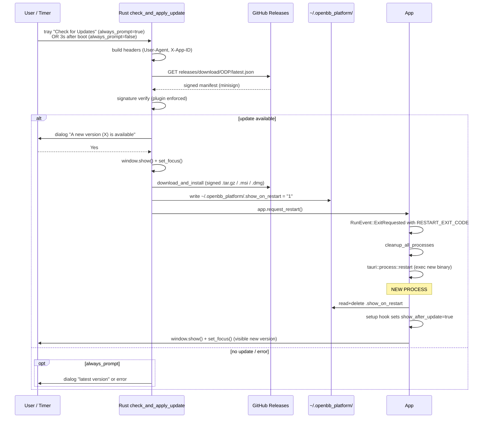

# Feature: Tray, Autostart, Updater, and Shutdown Cleanup

## Purpose
The OpenBB desktop app is meant to run as a long-lived background service that the user opens occasionally to manage environments, API keys, and backends. This feature bundle gives it the operating-system surfaces that make that work: a system-tray menu that survives the main window being closed, per-OS "launch at login" wiring, an in-app updater that pulls signed releases from GitHub, a close-to-tray window behavior, and a graceful Ctrl-C / app-termination cleanup cascade that stops every child process before the host process exits.

## User flows
1. **Close-to-tray (golden path).** User clicks the window X / hits Cmd-W. `WindowEvent::CloseRequested` calls `window.hide()` + `api.prevent_close()`, so the process stays alive and the tray icon stays in the menubar/system tray (`main.rs:744-760`).
2. **Re-open from tray.** User clicks tray icon → "Open Window". Handler runs `window.show() + set_focus()` (`main.rs:652-657`). On macOS, clicking the dock icon does the same via `RunEvent::Reopen` (`main.rs:844-848`).
3. **Tray nav to feature page.** User clicks Backends / Environments / API Keys in the tray. Rust runs `navigate_to_page(handle, "/<page>")` which `window.eval`s a `location.href` assignment, gated by a localStorage flag (see §"Tray nav mechanism").
4. **Toggle autostart.** User clicks "Start at Login in Background". Rust reads current per-OS autostart state, flips it via OS-specific call, and `set_checked()`s the menu item (`main.rs:680-735`).
5. **Check for updates manually.** User clicks "Check for Updates". `trigger_update_dialog` runs `check_and_apply_update(app, always_prompt=true)` — user sees a dialog whether or not an update exists (`main.rs:662-667`).
6. **Background update (automatic).** 3 s after boot, installed users get a silent `check_and_apply_update(app, false)` (`main.rs:792-796`). Dialog only appears if an update is found.
7. **Apply update.** User clicks Yes → `download_and_install` runs → `.show_on_restart` flag is written → `app.request_restart()` is called → cleanup cascade runs → process re-execs and window is shown (`main.rs:204-214`, `main.rs:554-567`).
8. **Quit (golden path).** User clicks tray Quit. Handler builds a fresh Tokio runtime, blocks on `cleanup_all_processes`, then `app.exit(0)` (`main.rs:642-651`).
9. **Quit via Ctrl-C / SIGTERM.** Same cleanup cascade via `ctrlc::set_handler` (`main.rs:762-771`) or, on macOS, the Obj-C `applicationWillTerminate` observer (`utils/app_termination.rs:33-37`).

Edge cases:
- Tray nav clicked before the install wizard has finished → silently ignored (gate flag not yet set).
- Update download fails → dialog shows error; `.show_on_restart` is NOT written; no restart.
- Cleanup hangs → outer 10 s `tokio::time::timeout` forces `app.exit(0)` regardless.

## UI surface
- **Tray icon** built at `main.rs:635-742` via `TrayIconBuilder` with the default window icon and tooltip `"Open Data Platform - By OpenBB"`. No `on_tray_icon_event` handler — left-click and right-click both just open the menu.
- **Tray menu** (9 items, built `main.rs:602-631`) — see table below.
- **Updater dialogs** (`main.rs:139-188`): "A new version (X) is available…" Yes/No; "You are already running the latest version" (manual check only); error dialog (manual check only).
- **Window chrome**: window is created with `"visible": false` (`tauri.conf.json:17`), `backgroundThrottling: "disabled"` (line 15 — load-bearing so tray-only operation stays responsive), `titleBarStyle: "Transparent"`, Mica blur on Win11.
- **No menubar / app menu**: `window.set_menu(Menu::new(handle))` installs an empty menu (`main.rs:582`). This kills the default macOS Cmd-Q (see Known bugs).

### Tray menu items

| ID | Label | Handler | Action |
|---|---|---|---|
| `open` | "Open Window" | `main.rs:652-657` | `window.show() + set_focus()` |
| `open_workspace` | "Go to Workspace" | `main.rs:658` | `open_workspace_in_browser()` — shells `open`/`xdg-open`/`cmd /c start` against `https://pro.openbb.co` (system browser, not embedded) |
| `open_backends` | "Backends" | `main.rs:661` | `navigate_to_page(handle, "/backends")` |
| `open_environments` | "Environments" | `main.rs:659` | `navigate_to_page(handle, "/environments")` |
| `open_api_keys` | "API Keys" | `main.rs:660` | `navigate_to_page(handle, "/api-keys")` |
| `start_at_login` | "Start at Login in Background" (CheckMenuItem) | `main.rs:680-735` | Reads per-OS state, calls `enable_autostart`/`disable_autostart`, `set_checked()` |
| `check_updates` | "Check for Updates" | `main.rs:662-667` | Spawns `trigger_update_dialog(handle)` → `check_and_apply_update(app, true)` |
| `uninstall` | "Uninstall" | `main.rs:668-679` | If `!is_installed` show error dialog; else `window.eval("window.location.href = '/uninstall'")` (bypasses the localStorage gate) |
| `quit` | "Quit" | `main.rs:642-651` | Fresh Tokio runtime → `cleanup_all_processes` → `app.exit(0)` |

## Data flow

### Cleanup cascade on quit

```mermaid
sequenceDiagram
    participant U as User / OS
    participant T as Tray Quit handler
    participant C as cleanup_all_processes
    participant J as stop_all_jupyter_servers
    participant B as stop_all_backend_services
    participant A as App

    U->>T: Click Quit (or Ctrl-C, or applicationWillTerminate)
    T->>T: build fresh tokio::runtime::Runtime
    T->>C: rt.block_on(cleanup_all_processes(handle))
    C->>C: tokio::time::timeout(10s, async { ... })
    C->>J: tokio::time::timeout(3s, stop_all_jupyter_servers)
    J-->>C: Ok / Err / timed-out
    C->>B: tokio::time::timeout(3s, stop_all_backend_services)
    B-->>C: Ok / Err / timed-out
    C-->>T: returns (or 10s outer timeout fires)
    Note over T: Windows-only: tokio::sleep(500ms) for GDI cleanup
    T->>A: app.exit(0)
    A->>A: RunEvent::ExitRequested fires
    Note over A: cleanup runs *again* (defensive); is_restart_requested=false<br/>so process::exit(0) instead of restart
```

The inner steps run sequentially; both 3 s inner timeouts can fire and the outer 10 s wrapper still has 4 s of unused headroom (`main.rs:419-467`).

## IPC contract

| Direction | Name | Payload | Returns | Used by |
|---|---|---|---|---|
| FE → Rust | `quit_application` | `()` | `()` | (currently unused by FE; available for future use, `main.rs:412-417`) |
| FE → Rust | `get_installation_state` | `()` | `InstallationState { is_installed, installation_directory }` | Gates tray nav indirectly (tray reads it directly in handlers) |
| Rust → FE | `window.eval("window.location.href = '/<page>'")` | raw JS string | n/a | All tray nav (`main.rs:393-410`) and Uninstall tray item (`main.rs:676`) |
| External | `tauri-plugin-updater` HTTPS GET `https://github.com/OpenBB-finance/OpenBB/releases/download/ODP/latest.json` | minisign-signed manifest | update metadata | `check_and_apply_update` |
| Rust → FE | (none for autostart toggle) | — | — | Tray reads OS state directly per-click |

No Tauri events are emitted by this feature; everything is direct Rust → webview JS injection. The dead `installation-status` listener at `index.tsx:15` is the only event the tray-adjacent code touches and it is never emitted.

## State surfaces
- **React state:** `localStorage["environments-first-load-done"]` — string `"true"` / unset. Written by boot setup hook (`main.rs:799`) and by `installation-progress.tsx:1224/1241`. Cleared by Try-Again wipe at `installation-progress.tsx:1248`.
- **React state:** `localStorage["installationDirectory"]` — set by the dead-listener `index.tsx:27` when the `installation-directory` event fires (rare path).
- **Rust state (managed):** `InstallationState` — populated at boot (`main.rs:491`) and re-computed inside `setup()` (`main.rs:552`) (the two reads are redundant in practice).
- **Rust state (managed):** `RunningProcesses` — shared with backends/jupyter; the cleanup cascade drains it.
- **Rust state (closure-local):** `is_restart_requested: Arc<AtomicBool>` inside the `.run()` closure (`main.rs:817`) — **recreated per event**, so the `Arc` is pointless (see Known bugs).
- **OS state (autostart):** the OS itself is the source of truth — no shared file. Per-OS, see below.
- **Disk flag:** `~/.openbb_platform/.show_on_restart` — exists ⇒ show window after restart. Read+deleted at boot (`main.rs:554-567`).

## Persistence

### Per-OS autostart

| OS | Mechanism | Path | File creator | Reference |
|---|---|---|---|---|
| **macOS** | `osascript` → System Events → login items | (no file — kernel/launchd state) | AppleScript `make new login item at end with properties {path:…, hidden:false, name:"OpenBB Platform"}` | `utils/autostart/macos_autostart.rs:46-108` |
| **Windows** | `.lnk` shortcut in Startup folder | `%APPDATA%\Microsoft\Windows\Start Menu\Programs\Startup\openbb-platform.lnk` | Raw COM: `CoCreateInstance(CLSID_ShellLink)` → `IShellLinkW::SetPath` → `IPersistFile::Save` | `utils/autostart/windows_autostart.rs:15-148` |
| **Linux** | XDG autostart desktop entry | `~/.config/autostart/openbb-platform.desktop` (via `dirs::config_dir()`) | `fs::write` of a `[Desktop Entry]` block with `Type=Application`, `Exec="<exe>"`, `Terminal=false`, `X-GNOME-Autostart-enabled=true`; chmod 0o755 | `utils/autostart/linux_autostart.rs:32-94` |

The disable paths invert each (AppleScript `delete login item`; `fs::remove_file` on the `.lnk`; `fs::remove_file` on the `.desktop`).

### Updater
- **Endpoint:** hard-coded twice — `tauri.conf.json:60-63` and `main.rs:108`. The Rust-side `.endpoints(vec![url])` builder call overrides the conf value.
- **Pubkey:** minisign public key embedded in `tauri.conf.json:63`. The updater plugin enforces signature verification automatically; unsigned or wrong-signed artifacts are rejected.
- **App-id header:** every update request sends `X-App-ID: <uuid>` (`helpers.rs:1598-1655` — UUIDv4 persisted in the app data dir).

## Tray nav mechanism (`window.eval` + localStorage gate)

This is the load-bearing wart of the feature. **No Tauri events. No deep links. No `webContents.send`.** Every tray nav item except Open Window / Open Workspace / Quit goes through `navigate_to_page` (`main.rs:393-410`):

```rust
window.show(); window.set_focus();
window.eval(format!(r#"
  if (localStorage.getItem('environments-first-load-done') === 'true') {{
      window.location.href = '{page}';
  }} else {{
      console.log('Navigation prevented: environments-first-load-done not set');
  }}
"#));
```

Two consequences:
1. **Hard navigation, not router-internal.** `location.href = …` triggers a full document reload; TanStack Router is reconstructed on every tray click. The 2 s `index.tsx` timeout doesn't fire here because the URL goes straight to the target.
2. **localStorage gate prevents click-during-bootstrap.** The flag is set by `main.rs:799` (cold-boot installed path) and by the install wizard's "Continue" handler (`installation-progress.tsx:1224`). There is a brief (~100 ms) dead zone after install completion where the flag isn't set yet and the tray silently logs `"Navigation prevented"`. The Uninstall tray item bypasses the gate because it is always allowed (`main.rs:676`).

The "Open Window" handler is unconditional — it works during the bootstrap dead zone.

## Updater flow (GitHub releases + minisign + `.show_on_restart`)



Notes:
- `request_restart()` produces `ExitRequested { code: Some(i32::MIN+1) }` — detected at `main.rs:820` to differentiate from normal quit.
- `.show_on_restart` writes use `let _ = fs::write(...)`, so a missing `~/.openbb_platform/` dir silently swallows the write — the post-update window then stays hidden.
- Concurrent "Check for Updates" clicks: both writes to `.show_on_restart` truncate-and-replace; no duplication. The second `request_restart()` hits an already-quitting app and silently fails.

## Error handling
- **Cleanup hang:** inner 3 s timeouts log "timed out"; outer 10 s timeout logs `"Cleanup process timed out after 10 seconds"`. App exits regardless.
- **Autostart toggle failure:** error logged, menu item check state is rolled back to current OS state.
- **Updater errors:** caught and logged; user dialog only if `always_prompt=true`.
- **Tray nav during bootstrap:** silent — only `console.log` in the webview.
- **`navigate_to_page` window not found:** Tauri returns `Err`, ignored.
- **macOS observer race:** if `cleanup_all_processes` already ran via tray Quit, the `applicationWillTerminate` re-run finds an empty `RunningProcesses` map and is effectively a no-op.

## ▸ Interfaces with

- **depends-on:** `feature-installation.md` for `InstallationState` (boot-time read of `~/.openbb_platform/system_settings.json` + conda binary existence check; gates the install/setup vs. environments routing decision and the Uninstall tray item).
- **depends-on:** `feature-backend-services.md` and `feature-jupyter.md` — the cleanup cascade calls their `stop_all_*` functions; their child PIDs live in `RunningProcesses`.
- **depended-on-by:** `feature-uninstall.md` — Uninstall tray item navigates to `/uninstall` via `window.eval`, bypassing the localStorage gate (`main.rs:676`).
- **depended-on-by:** `feature-api-keys.md` and `feature-environments.md` — tray "API Keys" / "Environments" entries call `navigate_to_page` against their routes.
- **shares-state-with:** `feature-installation.md` via `localStorage["environments-first-load-done"]` (install wizard sets it; tray nav gate reads it).
- **shares-state-with:** every long-lived process feature via `RunningProcesses` Mutex.

## TS port mapping

| Tauri call | TS equivalent | Notes |
|---|---|---|
| `TrayIconBuilder::new()` + `MenuItemBuilder` + `CheckMenuItemBuilder` | `new Tray(iconPath)` + `Menu.buildFromTemplate([...])` + `tray.setContextMenu(menu)` | Use `{type: 'checkbox', checked}` for the Start-at-Login item. |
| `window.eval("window.location.href = '/x'")` | `mainWindow.webContents.send('navigate', '/x')` + `ipcRenderer.on('navigate', (_, p) => router.navigate({to: p}))` | Strongly recommended over `executeJavaScript`. Keep the bootstrap-ready gate as a Rust→TS-side `AtomicBool` flipped by the install completion handler. |
| `WindowEvent::CloseRequested` + `api.prevent_close()` + `window.hide()` | `mainWindow.on('close', e => { if (!app.isQuitting) { e.preventDefault(); mainWindow.hide(); } })` | Set `app.isQuitting = true` inside the tray Quit handler before calling `app.quit()`. |
| `tauri-plugin-updater` + GitHub `latest.json` + minisign | `electron-updater` with `provider: 'github'` + code-signing certs | Minisign has no Electron equivalent; rely on platform code-signing + `app-update.yml` SHA512. Listen for `update-available` / `update-downloaded`. Keep `.show_on_restart` pattern in `app.getPath('userData')`. |
| macOS `osascript` login items | `app.setLoginItemSettings({ openAtLogin: true, openAsHidden: true })` | Electron wraps `SMLoginItemSetEnabled`. Drop the AppleScript dance entirely. |
| Windows `.lnk` via raw COM | `app.setLoginItemSettings({ openAtLogin: true, path: process.execPath, args: ['--hidden'] })` | Uses the registry under the hood. If you want the explicit Startup-folder `.lnk` keep `windows-shortcuts` npm. |
| Linux XDG `.desktop` | Manual `fs.writeFileSync('~/.config/autostart/openbb-platform.desktop', body, {mode: 0o755})` | `setLoginItemSettings` is unsupported on Linux. Reuse the existing `[Desktop Entry]` body verbatim. |
| `cleanup_all_processes` (nested `tokio::time::timeout` 3s/3s/10s) | `app.on('before-quit', async e => { e.preventDefault(); await Promise.race([Promise.allSettled([stopJupyter(), stopBackends()]), wait(10_000)]); app.exit(0) })` | Single 10 s outer timeout is enough; the nested 3 s inners are redundant in practice. |
| `ctrlc::set_handler` building fresh runtime | `process.on('SIGINT', async () => { await cleanup(); app.exit(0) })` | Node has native signal handling — no runtime construction needed. |
| macOS Obj-C `applicationWillTerminate` observer | `app.on('will-quit', async e => { e.preventDefault(); await cleanup(); app.exit(0) })` | Electron exposes this directly; no FFI needed. |
| `RunEvent::Reopen` | `app.on('activate', () => mainWindow.show())` | Same semantics. |
| `Menu::new(handle)` (empty) | Don't repeat this — build a real app menu with macOS Cmd-Q | See Known bugs. |
| `backgroundThrottling: "disabled"` | `new BrowserWindow({ webPreferences: { backgroundThrottling: false } })` | Load-bearing for tray-only operation; do copy. |

## Known bugs and port-time fixes

> ⚠️ BUG: `installation-status` event handler at `index.tsx:15` is dead — Rust never emits it; the 2 s invoke fallback is what decides routing. Drop the listener in the port.

> ⚠️ BUG: `is_restart_requested: Arc<AtomicBool>` (`main.rs:817`) is constructed fresh inside the `.run()` closure on every event, so the `Arc` never persists. The logic accidentally works because the store at line 820 and the load at line 833 are inside the same event arm. Port should use a plain `bool` local — or, better, a module-level `AtomicBool` if anything outside the closure needs to read it.

> ⚠️ BUG: Single-instance plugin's `argv` callback parameter is `_` — discarded (`main.rs:476-481`). The first instance also never reads `std::env::args()`. So `--autostart` (and any other CLI flag) is functionally a no-op everywhere — macOS login items, the Windows `.lnk`, and the Linux `.desktop` Exec= line all omit args anyway. The "Start at Login in **Background**" promise (window stays hidden) is therefore broken: every autostart launch shows the window like a manual launch. Port should pass `--hidden` via `setLoginItemSettings({args})` and read it in Electron `main.ts`.

> ⚠️ BUG: macOS autostart uses pure `osascript` against System Events login items with no `~/Library/LaunchAgents/com.openbb.platform.plist`, despite `uninstall.rs:697-704` referencing exactly that plist. The plist is defensive cleanup of legacy installs that never get created. Port should switch to `app.setLoginItemSettings` and drop the cleanup.

> ⚠️ BUG (silent): `~/Library/LaunchAgents/com.openbb.platform.plist`, 20 Windows registry `Run`/`RunOnce` key×name combos (`uninstall.rs:646-672`), and `~/.config/systemd/user/openbb-platform.service` (`uninstall.rs:707-725`) are all uninstall-cleanup-only paths — they were never created by current autostart code. Defensive cleanup is fine to keep; the port should not implement creation of these.

> ⚠️ BUG (note): `backgroundThrottling: "disabled"` in `tauri.conf.json:15` is undocumented in the codebase. The reason it's load-bearing: when the window is hidden to tray, polling in `installation-progress.tsx`, `environments.tsx`, and `backends.tsx` would otherwise throttle to 1 Hz, making tray-mode stale by tens of seconds. Port must mirror with `webPreferences.backgroundThrottling: false`.

> ⚠️ BUG: macOS `Cmd+Q` is a no-op because `main.rs:582` installs an empty `Menu::new(handle)` as the app menu. The only quit paths are tray Quit and Ctrl-C from a terminal. Port should construct a real macOS app menu with a `role: 'quit'` item that calls the cleanup-then-exit pipeline.

> ⚠️ BUG: tray icon left-click does nothing (no `on_tray_icon_event` registered, `main.rs:635-742`). Users have to open the menu then click "Open Window". Port should add `tray.on('click', () => toggleMainWindow())` on Win/Linux while keeping the context menu on right-click.

> ⚠️ BUG: hidden log windows (`backend-logs-{id}`, `jupyter-logs-{env}`) and the main window all accumulate as `hide()` rather than `destroy()`. Long sessions can leak N webview processes. Port should either destroy logs windows on close or LRU-cap them.

> ⚠️ BUG (UX): brief route flash to `/` then to `/setup` on slow machines during fresh-install boot — `window.show()` (`main.rs:782`) precedes the `window.eval("location.href = '/setup'")` (line 785). Port should defer `show()` until after `webContents.once('did-finish-load')` or pass the target route as a query param.

## Open questions
- **Should tray nav use IPC + router.navigate instead of `window.eval` + `location.href` hard navigation?** Probably yes — keeps router state, no rebuild on each tray click, and removes the localStorage gate in favor of a `bootReady` zustand/redux flag. The Uninstall route stays "always allowed" via the same mechanism, just typed.
- **Should `.show_on_restart` support a multi-update queue?** Today it's a single flag overwritten by any subsequent write. The port could grow it into a JSON queue if multiple updaters need to coordinate, but realistically Tauri/Electron only support one updater pipeline at a time, so the simple flag is fine.
- **Should tray icon left-click toggle the main window?** Most apps do; current code doesn't (§15 of v2 addendum). The port can add this trivially in Electron.
- **Should we keep the duplicate `check_installation_on_startup()` call (`.manage` + `setup`)?** v2 confirms no observable timing window where the results differ. Port can compute once and share.
- **Should the cleanup cascade collapse to a single 10 s timeout instead of nested 3 s/3 s/10 s?** v2 §13 — yes, the inner timeouts are redundant in practice; a single `Promise.race([Promise.allSettled([...]), wait(10_000)])` is cleaner.
- **Should macOS get a real app menu so Cmd-Q works?** Strongly recommended for the port — current empty-menu approach is a UX bug.

## Cross-feature dependencies
- **State shared:** `InstallationState` (managed Rust state, read by tray Uninstall handler and `get_installation_state` command) — shared with `feature-installation.md`.
- **State shared:** `localStorage["environments-first-load-done"]` (gate flag) — written by `feature-installation.md`, read by this feature's `navigate_to_page`.
- **State shared:** `RunningProcesses` Mutex (Rust managed state) — written by `feature-backend-services.md` and `feature-jupyter.md`, drained by this feature's cleanup cascade.
- **Files shared:** `~/.openbb_platform/.show_on_restart` (updater flag) — exclusively owned here, but lives in the directory managed by `feature-installation.md`.
- **Processes shared:** every backend service and jupyter server — this feature's quit path is the only authoritative way to stop them gracefully.
- **Routes invoked:** `/environments`, `/backends`, `/api-keys`, `/uninstall` — owned by `feature-environments.md`, `feature-backend-services.md`, `feature-api-keys.md`, `feature-uninstall.md` respectively.
