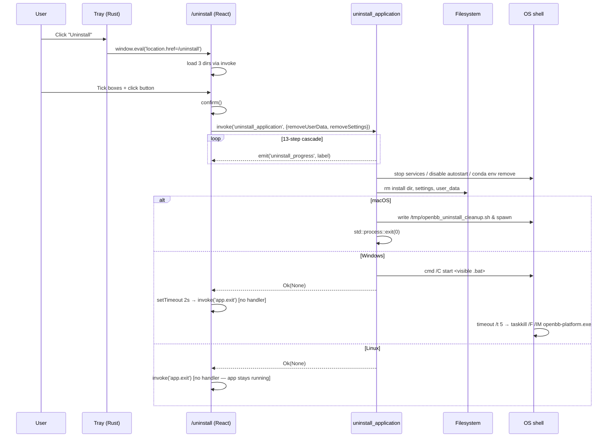
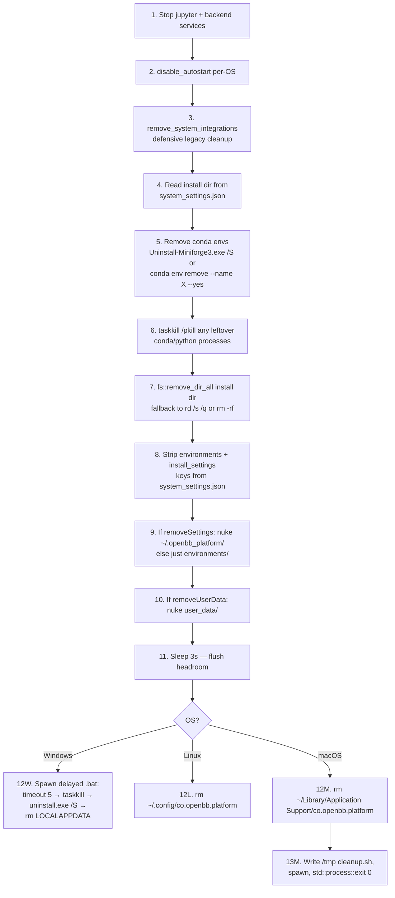

# Feature: Uninstall

## Purpose
One-click full removal of OpenBB Platform plus (optionally) its data and
settings. The cascade stops every child process, undoes every system
integration, deletes conda envs and the install directory, then arranges
OS-specific post-mortem cleanup of the app bundle/binary itself. Uninstall is
the inverse of `feature-installation.md` — every artifact installation creates
has a deletion step here.

## User flows
1. **Golden path.** User opens tray → clicks `Uninstall` → `/uninstall` page
   loads → reviews three checkboxes (Conda required, user data optional,
   settings optional) → clicks the button → confirm dialog → progress modal
   streams `uninstall_progress` strings → app exits (macOS) / batch window
   appears (Windows) / **app keeps running** (Linux, see bugs).
2. **Not installed.** Tray `Uninstall` is only routable when
   `is_installed = true` — otherwise the menu handler shows an error dialog
   instead of navigating (`main.rs:668-679`).
3. **User cancels confirm.** `confirm()` returns false → nothing happens, page
   stays mounted.
4. **Mid-uninstall failure.** Any step in the cascade returns `Err`; the JS
   promise rejects, the progress modal stays on the last label, the half-deleted
   state on disk is **not rolled back** (see bugs).
5. **Windows: user dismisses the `.bat` window early.** All file deletions
   already ran before the `pause`; closing the window just skips the
   "Press any key" confirmation (`uninstall.rs:801`, `app-shell.v2.md` §11b).

## UI surface
`desktop/src/routes/uninstall.tsx`:
- State (lines 11-19): `isUninstalling`, `removeUserData`, `removeSettings`,
  `uninstallProgress` (string), three displayed dirs, `showProgressDialog`,
  `isModalOpen`.
- On mount (lines 22-37): invokes `get_installation_directory`,
  `get_userdata_directory`, `get_settings_directory` purely for display.
- Event listener (lines 42-50): subscribes to `uninstall_progress` only while
  `isUninstalling`; payload string drives the spinner label.
- `handleUninstall` (lines 59-96): `confirm()` → set state → invoke →
  `setTimeout(2000)` → `invoke('app.exit')` (broken — see bugs).
- Three checkboxes:
  1. **Remove Conda and Environments** — always checked, read-only, required.
  2. **Remove user data** (`removeUserData`) — defaults false.
  3. **Remove application settings** (`removeSettings`) — defaults false.

## Data flow

### The 13-step cascade (`uninstall.rs:14-403`)

## IPC contract
| Direction | Name | Payload | Returns | Used by |
|---|---|---|---|---|
| invoke | `uninstall_application` | `{ removeUserData: bool, removeSettings: bool }` | `Result<(), String>` (returns `Ok(None)` on Win/Linux; never returns on macOS) | `uninstall.tsx:74` |
| invoke | `get_installation_directory` | — | `string` | `uninstall.tsx:24` |
| invoke | `get_userdata_directory` | — | `string` | `uninstall.tsx:28` |
| invoke | `get_settings_directory` | — | `string` | `uninstall.tsx:32` |
| invoke | `app.exit` | — | **No handler — silent failure** | `uninstall.tsx:84` (typo) |
| event (Rust→JS) | `uninstall_progress` | `string` label | — | `uninstall.tsx:43-49`; emitted at `uninstall.rs:25-26, 450, 470, 535` and others |

## State surfaces
- **React state:** `uninstall.tsx` local state only — no global store. Progress
  label is the only mid-flight UI signal.
- **Rust state:** none persistent; the handler is one-shot and exits the
  process at the end (macOS) or returns and lets a spawned shell script finish
  the job (Windows/Linux/macOS post-mortem).
- **Disk files (all targeted for deletion):**
  - `~/.openbb_platform/` (full tree, conditional on `removeSettings`)
  - `~/.openbb_platform/environments/` (always)
  - `~/.openbb_platform/user_data/` (conditional on `removeUserData`)
  - `~/.openbb_platform/system_settings.json` (read first, then mutated, then deleted with the tree)
  - `<installation_directory>/` (whatever was in `install_settings.installation_directory`)
  - OS-specific app data + bundle (see matrix below).

## Persistence
Nothing is written *to keep*; everything is removed. The only files **written**
during uninstall are throw-away scripts:
- macOS: `/tmp/openbb_uninstall_cleanup.sh` (`uninstall.rs:296-400`)
- Windows: `%TEMP%\openbb_uninstall.bat` (`uninstall.rs:730-835`)

Both delete themselves at the end.

### What gets removed when (matrix)

Rows are user choices; columns are operating systems. Cells list paths
unconditionally removed in addition to the always-removed install dir and
conda envs.

| User choice | macOS extras | Windows extras | Linux extras |
|---|---|---|---|
| **Always (regardless of checkboxes)** | `~/Library/Application Support/co.openbb.platform`, `~/Library/Logs/co.openbb.platform`, `~/Library/Caches/co.openbb.platform`, `~/Library/WebKit/co.openbb.platform`, `~/Library/WebKit/openbb-platform`, `~/Library/Application Scripts/group.co.openbb.platform`, the `.app` bundle, `~/.openbb_platform/environments/` | `%LOCALAPPDATA%\OpenBB Platform`, `%LOCALAPPDATA%\co.openbb.platform`, app binary via `uninstall.exe /S`, `~/.openbb_platform/environments/` | `~/.config/co.openbb.platform`, `~/.openbb_platform/environments/` |
| **+ Remove user data** | `~/.openbb_platform/user_data/` | `~/.openbb_platform/user_data/` | `~/.openbb_platform/user_data/` |
| **+ Remove application settings** | entire `~/.openbb_platform/` (supersedes user_data branch) | entire `~/.openbb_platform/` | entire `~/.openbb_platform/` |

Conda envs and the install dir are removed in every scenario (the "Remove
Conda" checkbox is hard-locked on).

## Error handling
- Each cascade step returns `Result<(), String>`; the first error short-circuits
  the rest of the function and propagates to JS as a rejected promise.
- No try/rollback wrapping — partial state on disk is the user's problem.
- Service-stop calls (step 1) have **no timeout** — a wedged backend blocks the
  cascade indefinitely. Compare to `cleanup_all_processes` in
  `feature-tray-and-autostart.md` which uses 3s+3s/10s nested timeouts.
- Conda env removal (step 5) catches per-env errors and logs them but continues
  through the loop, so one broken env doesn't block uninstall.
- `fs::remove_dir_all` has a retry loop (`uninstall.rs:584-639`) that falls back
  to `rd /s /q` / `rm -rf` if the Rust path fails (typically Windows file locks).
- UX shows the progress label that was last emitted; on error there's no toast
  or recovery — the user is stuck on a half-spinning dialog.

## ▸ Interfaces with
- **depends-on** `feature-tray-and-autostart.md` for the entry point (tray
  `Uninstall` item at `main.rs:668-679`) and for **step 2** of the cascade
  (`disable_autostart` per-OS).
- **depends-on** `feature-backend-services.md` for **step 1**
  (`stop_all_backend_services` + `stop_all_jupyter_servers`) — uninstall is one
  of three call-sites that gracefully stops services.
- **depends-on** `feature-environments.md` for **step 4** — conda env enumeration
  and removal use the same `<install>/conda/envs/*` layout the environments
  feature creates.
- **inverse-of** `feature-installation.md` — every artifact installation
  creates (`~/.openbb_platform/`, conda envs, `system_settings.json`,
  `install_settings.installation_directory`) has a deletion step here. The
  port should keep these two features paired so additions on one side get
  matching teardown on the other.
- **shares-state-with** all features via the cleanup of `~/.openbb_platform/`
  and shutdown of every spawned process.

## TS port mapping
| Tauri call | TS equivalent | Notes |
|---|---|---|
| `invoke('uninstall_application', …)` | `ipcMain.handle('uninstall:run', …)` | Same shape; resolve once OS-specific cleanup is queued. |
| `window.emit('uninstall_progress', s)` | `webContents.send('uninstall:progress', s)` | `ipcRenderer.on` on FE. |
| `disable_autostart` (per-OS) | `app.setLoginItemSettings({openAtLogin:false})` + Linux `.desktop` rm | See `feature-tray-and-autostart.md`. |
| `taskkill /F /IM …` / `pkill -f …` | `child_process.exec(...)` or `process.kill(pid)` | Keep shell-out for leftover sweep; track PIDs for graceful kill first. |
| `reg delete HKCU\…\Run` (4×5 sweep) | `child_process.exec('reg delete …')` or `winreg` | Defensive — port as-is. |
| `launchctl unload …LaunchAgents/…` | `child_process.exec('launchctl unload …')` | Defensive legacy cleanup. |
| `fs::remove_dir_all` w/ retry + `rd /s /q` / `rm -rf` fallback | `fs.rm(p, {recursive:true, force:true, maxRetries:5, retryDelay:200})` | Node retry handles Windows locks. |
| `Uninstall-Miniforge3.exe /S` | `child_process.spawn(...)` after existence check | — |
| `cmd /C start "title" <bat>` | `child_process.spawn('cmd', ['/C','start',…], {detached:true})` | Keep visible window unless redesigned. |
| `osascript -e 'display notification …'` | Electron `new Notification(...)` | No shell-out needed. |
| `std::process::exit(0)` inside handler | `app.exit(0)` after enqueueing cleanup script | macOS path. |
| `invoke('app.exit')` (typo) | **Drop**; use `invoke('quit_application')` or main-process kill. | See bugs. |

## Known bugs and port-time fixes

> ⚠️ **`invoke('app.exit')` typo (`uninstall.tsx:84`).** No matching Rust
> handler. Silent failure on Linux (app keeps running after uninstall) and
> Windows (masked only because the `.bat` runs `taskkill`). Works on macOS
> only because `uninstall.rs:399` `std::process::exit(0)` runs first inside
> the handler. **Port fix:** rename to `quit_application` and unify the exit
> path across all three OSes; do not rely on a side-effect of the Rust process
> dying mid-IPC.

> ⚠️ **Defensive cleanup of artifacts that current code never creates.** macOS
> `~/Library/LaunchAgents/com.openbb.platform.plist`, Windows registry
> `Run`/`RunOnce` keys (4 paths × 5 entry names = 20 combinations), and Linux
> `~/.config/systemd/user/openbb-platform.service` are all swept by
> `remove_system_integrations` (`uninstall.rs:642-725`) but **never written by
> current autostart code** (which uses AppleScript login items, `.lnk` in
> Startup folder, and XDG `.desktop` file respectively — see
> `feature-tray-and-autostart.md`). **Port decision:** keep these as legacy-detect
> sweeps if shipping as an upgrade for existing users; otherwise drop them.

> ⚠️ **Windows `.bat` opens a visible console window** (`uninstall.rs:815-824`,
> comment says "Do NOT hide this window"). The user can dismiss it mid-uninstall
> by clicking X; this skips only the final `pause` — all destructive operations
> already completed. **Port decision:** either keep visible (current intent) or
> hide it (`windowsHide: true` on `spawn`) and replace the `pause` with a
> notification.

> ⚠️ **No rollback if any step fails.** The cascade is fail-fast and leaves
> the disk in whatever state the failing step produced. **Port fix:** either
> wrap each step in a recovery transaction with a journal of completed steps,
> or accept the same semantics and surface a clearer "Uninstall incomplete"
> error.

> ⚠️ **Step 1 has no timeout** when calling `stop_all_*_services`. A wedged
> child process blocks the whole flow. **Port fix:** add a 3-5 s timeout
> matching the shutdown cascade in `feature-tray-and-autostart.md`, then fall
> through to `taskkill`/`pkill` regardless.

## Open questions
- **Dry-run mode?** Preview live conda env names, target paths, and disk size
  per branch before committing. Currently no preview — only this matrix.
- **Back up settings first?** "Remove application settings" is destructive and
  irreversible. Port could write `~/.openbb_platform.bak.<ts>.tar.gz` before
  nuking, at least for API keys and the env catalog.
- **Why a checkbox for required Conda removal?** Drop it (show as text) or
  make it actually optional so conda envs can survive for re-use.
- **Reachable outside the tray?** Currently tray-only. A help-page link or
  command-palette entry would help users who haven't learned quit-to-tray.

## Cross-feature dependencies
- **depends-on** `feature-installation.md` — reads
  `install_settings.installation_directory` (step 3) and deletes
  `system_settings.json` (steps 7-8).
- **depends-on** `feature-backend-services.md` and `feature-jupyter.md` —
  step 1 stops both stacks.
- **depends-on** `feature-environments.md` — step 4 walks
  `<install>/conda/envs/*`.
- **depends-on** `feature-tray-and-autostart.md` — tray is the entry point
  and step 2 calls `disable_autostart`.
- **shares-state-with** every feature via `~/.openbb_platform/` removal.

---

### Sources
- `desktop/src-tauri/src/uninstall.rs` (lines 14-403 = main handler; 296-400
  = macOS post-mortem; 642-725 = system integrations; 730-835 = Windows .bat).
- `desktop/src/routes/uninstall.tsx` (lines 11-96).
- `desktop/src-tauri/src/main.rs:668-679` (tray entry point).
- `docs/typescript-port/raw-deep-dives/app-shell.md` §8.
- `docs/typescript-port/raw-deep-dives/app-shell.v2.md` §11, §12.
