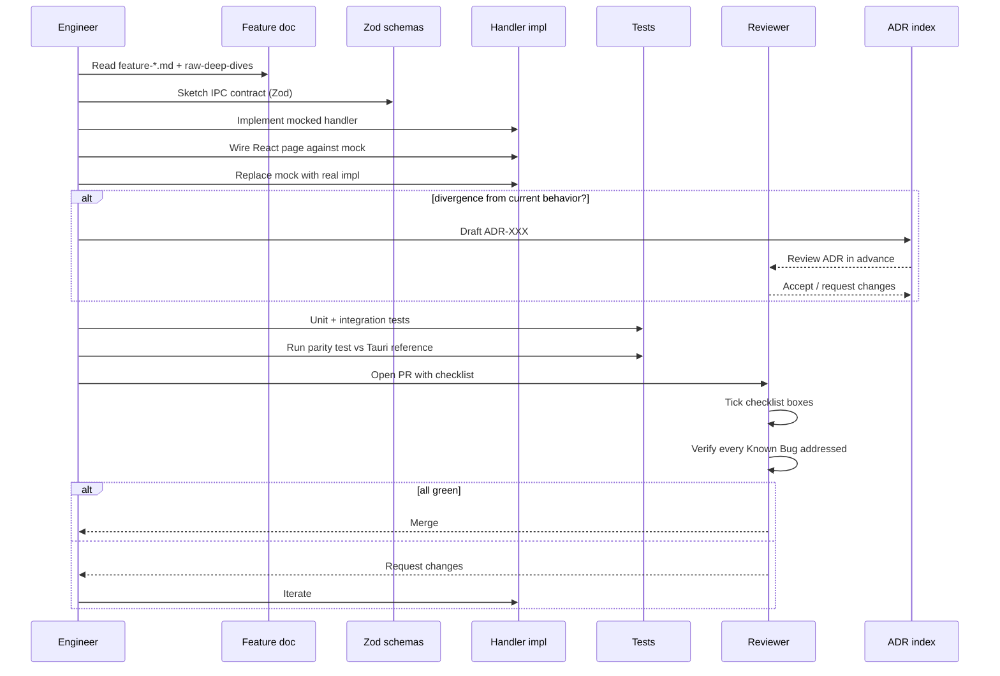

# Port Design Process

> How we do the work of porting. This is a process doc, not a technical reference
> — for the per-feature technical detail see `20-features/feature-*.md`, and for
> the phased plan see `port-roadmap.md`.

## Methodology

The port is a **transcription**, not a redesign. The current implementation works
(with known bugs documented across the feature docs). The port follows three
ordered priorities:

1. **Replicate behavior first.** Match the current user-observable behavior
   exactly, even when the implementation is awkward.
2. **Fix known bugs second**, with each fix logged as an ADR so the change is
   explicit and reversible. The eleven feature docs together call out roughly
   60-80 known bugs (`> ⚠️ BUG:` blockquotes) — every single one is a discrete
   decision to make.
3. **Add improvements only after parity.** New features, refactors, and UX
   polish belong in v1.1+, not in the port itself. A team that takes detours
   during the port ships in 12 months instead of 6.

A "fix" that isn't in the feature docs' Known Bugs sections is by default
out-of-scope for the port. If a reviewer believes something must change, the
process is: file an ADR proposing the change, link it from the relevant feature
doc, then ship.

## Per-feature design loop

Every feature listed in `20-features/feature-*.md` goes through the same six
steps:

1. **Read** the feature doc end-to-end, plus the linked
   `raw-deep-dives/*.md` (v1 and v2) it cites. Time-box: 1-2 hours per feature.
2. **Sketch** the TS API surface before writing impl. Two artifacts:
   - The IPC commands the feature exposes (names, args, returns) in
     `packages/ipc-schemas/src/<feature>.ts` as Zod schemas.
   - The disk/file types it owns in the same package.
3. **Implement the IPC contract first** with mocked handlers (just enough to
   return shaped fake data). Wire up the React page; verify the UI renders
   against the mock. This catches type errors before any subprocess work.
4. **Implement the handler** — the equivalent of the Rust code path. Use the
   feature doc's "TS port mapping" table as the line-by-line guide.
5. **Verify against the parity checklist** (see Testing strategy below):
   - UI flows match the User flows section.
   - File changes match the Persistence section.
   - Processes spawned match the Data flow section.
   - Events emitted match the IPC contract section.
   - Edge cases from User flows and Error handling are reproduced.
6. **Document any divergences** as ADRs in `docs/typescript-port/40-adrs/`.

The loop is **per feature, not per phase** — a single phase of the roadmap can
span 2-3 features (e.g., Phase 4 covers `feature-backend-services.md` partially
and dips into `feature-logs-streaming.md`).

## Decision logging (ADRs)

Use ADRs (Architecture Decision Records) for every non-trivial divergence from
current behavior. Format:

```
ADR-XXX: <title>
Date: YYYY-MM-DD
Status: Proposed | Accepted | Superseded by ADR-YYY

## Context
What is the current behavior. Link to the relevant feature doc and file:line.

## Decision
What we are doing differently.

## Consequences
- Positive: ...
- Negative: ...
- Migration impact for existing users of the Tauri version: ...
```

Example decisions that must be logged:

- **ADR-001: Lowercase credentials keys at IPC boundary** (vs preserving user
  casing as Tauri does). Aligns with Python `_normalize_credential_map`. See
  `feature-api-keys.md` Known Bugs §UX correctness.
- **ADR-002: SIGTERM-then-SIGKILL for backends** (vs SIGKILL-only). Adds ~2s
  per stop, gives backends a chance to flush state. See
  `feature-backend-services.md` Open Questions §1.
- **ADR-003: Drop `installation-status` event entirely.** Never emitted by
  current Rust; dead listener in `index.tsx`. See `feature-installation.md`
  Known Bug §1.
- **ADR-004: Drop `taurpc` dependency.** Use plain `invoke` + Zod on both
  sides (`ipc-bridge.md`).
- **ADR-005: Atomic writes everywhere, not just where current Rust does.**
  Standardize on `tmp + rename + chmod 0600 + flock` for all settings files.
- **ADR-006: Lift the cleanup cascade to a single 10s outer timeout** instead
  of nested 3s/3s/10s. See `feature-tray-and-autostart.md` Open Questions §5.
- **ADR-007: Use `electron-updater` with platform code-signing instead of
  minisign.** Minisign has no Electron equivalent; this is forced.
- **ADR-008: Drop the destructive YAML cleanup from
  `list_conda_environments`.** Move to opt-in `cleanup_orphan_yamls` action.
  See `feature-environments.md` first ⚠️ BUG.

The bar for an ADR: any change that a future engineer might revert without
realizing it was deliberate.

## Bug tracking

Every `> ⚠️ BUG:` blockquote in the feature docs maps to a fix decision:

- **(a) fix in port** — the default for security and correctness bugs.
- **(b) preserve buggy behavior for compat** — when fixing would break existing
  users' on-disk state or muscle memory.
- **(c) defer to v2** — when fixing requires architectural work beyond the
  port's scope.

The 60-80 bugs across the eleven feature docs categorize roughly as:

| Category | Approximate count | Default disposition |
|---|---|---|
| Security (path traversal, non-atomic write, missing chmod, missing flock, XSS, command injection) | ~10 | (a) fix in port |
| Process-lifecycle (SIGKILL-only, missing tree-kill, PID race, port-kill no listen filter, missing cascade-stop) | ~12 | (a) fix in port |
| Event channel / IPC (dead listeners, casing inconsistency, unused payload fields, snake/camel split, dead invoke calls) | ~10 | (a) fix or (c) drop |
| Subprocess cleanup (no timeout, unbounded retry, no crash detection, mutex leak on abort, no cancel propagation) | ~10 | (a) fix in port |
| UX correctness (modal closes before await, no FS watcher, hard-coded timeout too tight, no virtualization) | ~12 | (a) fix in port |
| Cosmetic / defensive (dead code, redundant calls, vestigial fields, comment typos) | ~10 | (c) drop or leave |
| Cross-platform (Linux folder picker, macOS LaunchAgents, Windows .bat visible window) | ~6 | (a) replace with platform-native APIs |

Each bug gets a row in a tracking spreadsheet keyed by `feature-doc:line` so
the tally is auditable. A reviewer for any phase PR is expected to check that
every bug in the affected feature's Known Bugs list has been addressed (fixed,
deferred, or explicitly preserved) before approving.

## Testing strategy

Four layers, applied per feature:

- **Unit tests** — per-handler tests with mocked filesystem. Use
  [`memfs`](https://github.com/streamich/memfs) to back `fs` with an in-memory
  tree; assert on file contents after each handler runs. Fast, hermetic, runs
  on every commit.
- **Integration tests** — per-feature, with a real temp
  `~/.openbb_platform/` directory under `os.tmpdir()`. Spawn real `conda` if
  available (skip in CI sans conda); otherwise stub the conda path with a
  predictable shell script that emits known stdout. Runs nightly.
- **E2E tests** — Playwright against the packaged Electron app. Golden paths
  only (install wizard, add API key, start backend, stop backend, create env,
  uninstall). Runs pre-release.
- **Parity tests** — alongside the current Tauri app, capture file diffs after
  the same user action. Example: "create env `test-1` with python 3.12 + numpy"
  against both apps, then `diff -r ~/.openbb_platform/` between two clean
  starts. Catches behavioral drift the feature docs missed.

The Wave 2 docs were written from a snapshot of the Tauri repo at a fixed
commit hash. Parity tests run against that same hash. When the Tauri repo
moves on, parity tests rebase to the new hash via an ADR documenting any
intentional drift.

## Code review checklist

Per PR, reviewers verify:

- [ ] No `dangerouslySetInnerHTML` without an explicit HTML-escaping wrapper
      (XSS surface from log content — see `feature-logs-streaming.md` §Bug 2).
- [ ] All file writes are atomic: `fs.writeFile(tmp)` → `fs.rename(tmp, dst)`,
      never `fs.writeFile(dst)` directly for files that exist.
- [ ] All secret writes (anything touching `user_settings.json`,
      `mcp_settings.json`, `.env`) are `chmod 0o600` on Unix.
- [ ] All `invoke` args are validated with Zod **on the handler side**,
      regardless of TS types. The renderer can be compromised; the main
      process cannot trust its input.
- [ ] All long-running operations support cancellation via an `AbortSignal`
      threaded through to the spawned child.
- [ ] All spawned subprocesses are tracked in the equivalent of
      `RunningProcesses` so the cleanup cascade can drain them.
- [ ] No `process-output` listeners without a cleanup function (use
      `useEffect` return values).
- [ ] No new IPC command without a Zod schema for args + return value in
      `packages/ipc-schemas`.
- [ ] No new disk file format without a version field at the top level and a
      migration path in `packages/test-fixtures/migrations/`.
- [ ] No new event without a corresponding entry in
      `10-architecture/ipc-bridge.md`'s event catalog.

The checklist is a Markdown template attached to the PR template; reviewers
literally tick boxes.

## Sequence diagram for the design loop



## Tools we need

- **ADR tool** — [`adr-tools`](https://github.com/npryce/adr-tools) (`adr new
  "<title>"` creates the next-numbered file). Stored under
  `docs/typescript-port/40-adrs/`.
- **Type generation from `/openapi.json`** — if Strategy B (Python wrap), use
  [`openapi-typescript`](https://github.com/drwpow/openapi-typescript) at
  build-time, vendored into `packages/api-types`. Rebuild on every Python
  release.
- **Parity diff tool** — custom Node script
  `tools/parity-diff/run.ts` that snapshots
  `~/.openbb_platform/` before + after a scripted user action against both
  the Tauri app and the TS app, then prints a unified diff. Run pre-merge for
  any handler touching disk state.
- **Test fixture generator** — `tools/fixtures/snapshot.ts` writes
  representative `~/.openbb_platform/` trees (fresh-install, single-env,
  multi-env, with-credentials, broken-yaml) into
  `packages/test-fixtures/snapshots/`.
- **Schema validator** — `tools/schema-check/run.ts` walks every Zod schema in
  `packages/ipc-schemas` and validates it against every fixture in
  `packages/test-fixtures` on every commit (catches drift between schema and
  real on-disk format).

## Working agreements

These are non-negotiable team conventions for the duration of the port:

- **Every new IPC command has a Zod schema** for args + return value, named
  matching the command, exported from `packages/ipc-schemas`.
- **Every disk file format has a versioned schema** with a `$schemaVersion`
  field at the top level, plus a migration path in
  `packages/test-fixtures/migrations/` if the format changes during the port.
- **No silent arg-drops.** Rust currently silently drops `directory` on three
  invokes (`feature-installation.md` §port-time gotcha #5,
  `feature-extensions.md` §Bug 1); the port has zero silent drops. Either
  honor the field uniformly or remove it from the command signature.
- **Every long-running operation reports progress via events**, not
  poll-based status getters. The Tauri impl has both
  `get_installation_status` (poll) and `install-progress` (event) for the same
  flow (`feature-installation.md` IPC table); the port has only events.
- **Every long-running operation accepts an `AbortSignal`**. Cancellation is
  a first-class API contract, not a tombstone-and-pray pattern.
- **Snake_case stays on disk; camelCase on the wire.** The Tauri impl mixes
  both at the IPC boundary (`feature-installation.md` §11). The port picks
  camelCase for IPC, preserves snake_case in JSON files for backward compat
  with Python tools, and uses a single boundary normalizer.
- **No new dependencies without a 3-line justification** in the PR. The
  current Tauri stack pulled in `taurpc`, `tauri-plugin-clipboard-manager`,
  and `fs2` — two of which were never used or barely used. We don't repeat
  that.

## What "done" looks like for the port

A bulleted checklist that gates the v1.0 release:

- [ ] **Behavioral parity** — every user flow listed in every feature doc
      reproduces the same observable behavior. Parity-test diffs are empty
      (or have an ADR explaining the diff).
- [ ] **No regressions** in the feature docs' known-bug lists — every
      `> ⚠️ BUG:` is either fixed, explicitly preserved with an ADR, or
      deferred with a v2 issue link.
- [ ] **All secret writes hardened** — `chmod 0o600`, atomic, flocked. CI
      check enforces this with a static analyzer pass over `packages/handlers`.
- [ ] **Full E2E green** on macOS (Intel + Apple Silicon), Windows 11, Ubuntu
      22.04, Fedora 40. Playwright suite passes on every release candidate.
- [ ] **Install → use → uninstall demo** on a clean VM passes for each of
      mac / win / linux. Recorded video stored alongside the release tag.
- [ ] **Migration script** for users coming from the Tauri version preserves
      `~/.openbb_platform/` byte-for-byte (modulo the documented
      `installation_date` timezone shift).
- [ ] **Cold-start performance** — installed-user boot under 1s on a 2019
      MacBook Pro; uninstalled-user boot (with wizard) under 1.5s to the
      `/setup` form.
- [ ] **Signed installers** — Apple Developer ID notarized DMG, EV-signed
      Windows MSI, deb + rpm + AppImage for Linux.
- [ ] **Documentation** — user-facing changelog ("what changed vs Tauri"),
      ADR index, troubleshooting guide for the top-5 install failures.

When every box is ticked, the port is GA. Until then, it's a beta with a
clear backlog rather than a vague aspiration.
