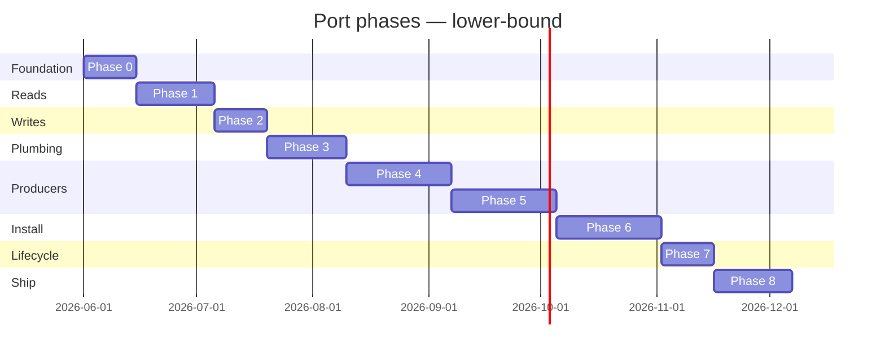

# Port Roadmap

> Phased plan for transcribing the current Tauri + Rust desktop app into a TypeScript
> stack. The phases are layer-by-layer, not all-at-once: each phase produces a
> shippable artifact even if later phases are unstarted. Read alongside
> `port-strategy.md` (Rust→TS bridge decisions) and `port-tech-stack.md` (concrete
> framework picks).

## Phasing principle

The current desktop is a stack of layers — installer, settings vault, subprocess
runtime, env manager, full lifecycle — and every layer rests on the one below. The
port follows the same shape **bottom-up**:

1. Foundation (Phase 0) → can launch and render.
2. Read paths (Phase 1) → can show what's already on disk.
3. Settings writes (Phase 2) → can edit credentials safely.
4. Process plumbing (Phase 3) → can spawn and stream output.
5. Producers (Phases 4-5) → backends, then envs use the plumbing.
6. Heavy install (Phase 6) → the wizard that depends on everything above.
7. Lifecycle (Phase 7) → uninstall, autostart, updater.
8. Parity + polish (Phase 8) → ship.

Each phase has an explicit **deliverable** that can be demoed to a stakeholder. A
half-finished phase should never block the next one if its deliverable is met.

## Phase 0: Foundation (1-2 weeks)

- Set up the TS workspace per `port-tech-stack.md` (single pnpm workspace with
  `apps/desktop`, `apps/agent`, `packages/ipc-schemas`, `packages/test-fixtures`).
- Decide the top-level framework — Electron vs Tauri-v2-with-TS-handlers vs
  Electron-with-REST-agent — using the Strategy A / B / Mixed decision from
  `port-strategy.md`.
- Bootstrap the `main.rs` equivalent boot sequence:
  - Process entry (`apps/desktop/src/main.ts`).
  - Single-instance lock (Electron `app.requestSingleInstanceLock()` or Tauri
    single-instance plugin).
  - Main `BrowserWindow` with `backgroundThrottling: false` (load-bearing — see
    `feature-tray-and-autostart.md`).
  - Tray icon with the 9-item menu from `main.rs:602-631`.
- Port `~/.openbb_platform/` schemas to Zod (`packages/ipc-schemas/src/disk.ts`):
  `system_settings.json`, `user_settings.json`, `backends.json`, env-YAML.
- Set up IPC bridge skeleton: a typed `invoke(name, args)` wrapper with Zod
  validation on both ends, and an event channel (`webContents.send` or WS) with
  symmetric typing.

**Deliverable:** empty shell that launches, single-instances, shows a tray menu
(with disabled items), opens a blank main window, and reads (without parsing) the
`~/.openbb_platform/` tree.

## Phase 1: Read-only views (2-3 weeks)

Port the read paths first — no spawning, no state changes. These are the lowest-
risk handlers and they let the team validate the Zod schemas against real on-disk
data from existing users:

- `get_installation_state` / `is_installed` boot check (`feature-installation.md`
  IPC table; both casing variants documented).
- `list_conda_environments` — FS scan only, **without** the destructive YAML
  cleanup (split off as opt-in `cleanup_orphan_yamls` per
  `feature-environments.md` Known Bug).
- `list_backend_services` — pure JSON read.
- `get_user_credentials` — pure JSON read; lowercase keys at boundary.
- `get_process_logs_history` — returns empty `[]` since no spawns yet.
- `open_credentials_file` — strict allow-list of the 5 literal filenames; no
  auto-create.

Wire these into stub pages (`/environments`, `/backends`, `/api-keys`) using the
existing React component tree from the current desktop as a visual reference.

**Deliverable:** app opens, shows the env list + backend list + API-key list
(read-only) pulled from an existing user's `~/.openbb_platform/`. Nothing yet
writes.

## Phase 2: Settings writes (1-2 weeks)

Port the disk writes that don't spawn anything — safe and self-contained:

- `update_user_credentials` with **atomic write** (`tmp + rename`),
  `chmod 0o600` on Unix, exclusive `flock` for the read-modify-write window. See
  `feature-api-keys.md` Known Bugs §Security.
- `save_working_directory` (preferences write — preserves the rest of the tree).
- `toggle_theme` — already takes a flock; preserve the lock semantics.
- `open_credentials_file` with strict allow-list (allow only the 5 names; never
  auto-create `.condarc` or `mcp_settings.json`).
- File-watch + "external edit detected" banner (fixes
  `feature-api-keys.md` Known Bug §UX correctness).

**Deliverable:** API Keys page is fully functional. User can edit settings, the
file survives crashes mid-write, and the page warns if another process changed
the file. No subprocess work yet.

## Phase 3: Process monitoring infrastructure (2-3 weeks)

Port the LogStorage ring + `process-output` event channel. This is the
**shared substrate** for everything else (`feature-logs-streaming.md`):

- WebSocket or `webContents.send` broadcast (decide per
  `port-tech-stack.md`; multiplexed channel + client-side filter, or per-process
  WS).
- `LogBuffer` class with 10,000-line cap, ring-pop-front semantics, in-memory.
- Idempotent `register_process_monitoring` (returns `true` if already registered).
- `get_process_logs_history` with **`?since=<ts>` cursor** to deterministically
  close the backlog/live-stream gap (fix for `feature-logs-streaming.md`
  Known Bug §1).
- Logs window (`/logs/:processId`) with `react-window` virtualization (fix
  for §9). JSX-escaped rendering, not `dangerouslySetInnerHTML` (fix for §2).
- Single canonical ANSI stripper (fix for §4).
- Wire `unregister_process_monitoring` into env/backend delete (fix for §3).
- "Buffer truncated, oldest N lines dropped" banner (fix for §8).

**Deliverable:** logs window opens for an arbitrary `processId`, virtualizes
correctly with 10k+ lines, and renders untrusted content safely. A toy script
spawn (e.g., `bash -c 'for i in $(seq 1 50000); do echo "line $i"; done'`) shows
end-to-end.

## Phase 4: Subprocess management — backends (3-4 weeks)

Port the backend services feature first; it's the simpler producer (envs already
exist on disk, so this phase is just "start what's already there"):

- `start_backend_service` / `stop_backend_service` end-to-end (`feature-backend-
  services.md` IPC table).
- Shell wrapper script generation with **per-invocation random suffix** in the
  filename (fix for §wrapper script keyed by id).
- Wrapper-PID vs server-PID tracking — trust the log-reader's overwrite, do
  not re-overwrite from the spawn side (fix for §Wrapper-PID race).
- URL discovery from logs (regex set, `select_best_url` with the MCP-suffix-
  append bug fixed — track the line that mentioned "MCP server", not last URL).
- Port-based kill **with `-sTCP:LISTEN` filter on Unix** (fix for §macOS/Linux
  port-kill lacks listen filter).
- **SIGTERM-then-SIGKILL** with 2s poll between (replaces SIGKILL-only).
- `child.on('exit')` listener that flips `status=error` on unexpected exit
  (fix for §No proactive crash detection).
- Default seed services (`create_default_backend_services`) from a fresh-install
  perspective — idempotent on name collision.

**Deliverable:** user can start/stop the existing Python `openbb-api` from the
TS desktop UI. URL pill appears. Stop kills both the wrapper and the server.

## Phase 5: Environment management (3-4 weeks)

Build on the now-working subprocess substrate to port env CRUD
(`feature-environments.md`):

- `list_conda_environments` — pure read-only FS scan. The destructive YAML
  cleanup moves to a separate opt-in `POST /environments/cleanup` action (fix
  for §destructive list).
- `create_environment` + streaming via the Phase 3 channel. Replicate the
  conda env-var preamble (`CONDA_ROOT`, `CONDA_ENVS_PATH`, `CONDA_PKGS_DIRS`,
  `CONDARC` set; `CONDA_DEFAULT_ENV`/`CONDA_PREFIX`/`CONDA_SHLVL` unset).
- `install_extensions` — port the wire-format parser
  (`feature-extensions.md` §Wire-format) verbatim. Stream pip/conda output
  (fix for §Bug 8). Per-env handler-level lock (fix for §Bug 2).
- `remove_environment` with **cascade-stop**: stop any running backend in this
  env AND any active Jupyter (fix for `feature-environments.md` §removal does
  not consult backends or ACTIVE_JUPYTER_SERVERS).
- `update_environment` with timeout on **both** conda and pip (fix for §pip
  has no timeout).
- Smart retry loop **bounded** at `min(8, n_pkgs)` (fix for §unbounded retry).
- Jupyter start/stop, port-based stop with `-sTCP:LISTEN`,
  configurable URL-extraction timeout (default 60s, not 30s — fix for
  `feature-jupyter.md` §URL timeout).

**Deliverable:** full env CRUD parity with the current desktop. User can create
an env, add extensions, start Jupyter, stop everything, delete the env.

## Phase 6: Installation pipeline (3-4 weeks)

The hardest phase — a multi-step download + install with progress events. By now,
the substrate it needs (FS schemas, atomic writes, subprocess channel) is solid:

- Miniforge installer fetch from GitHub Releases (10 MB sanity check, Apple-
  Silicon detection via `sysctl` not `os.arch()`).
- `install_to_directory` + permission probe (test write of
  `.permission_test_file` + `.permission_test_dir`).
- `install_conda` — port the lock semantics, but **release the lock on abort**
  (fix for `feature-installation.md` §INSTALLATION_IN_PROGRESS leak).
- `setup_python_environment` + YAML generation (canonical bootstrap content
  from `feature-installation.md` §Persistence).
- Extension catalog fetch (cache in IndexedDB with TTL — fix for
  `feature-extensions.md` §Bug 6).
- `install_extensions` for Step 3, **gating `openbb-build` on actually
  installing `openbb`** (fix for `feature-installation.md` §Bug 3).
- Cancel + rollback: abort kills child procs, releases lock, `rm -rf`s install
  dir.
- Reduce three redundant `update_openbb_settings` calls to **one** (fix for
  `feature-installation.md` §Bug 4).
- Setup form retry pre-fills from existing `system_settings.json` (fix for §Bug
  7).
- Snake_case-vs-camelCase IPC inconsistency resolved by picking one convention
  (typically camelCase at the wire boundary).

**Deliverable:** clean install on a fresh VM (mac/win/linux) reaches the
Environments page with a working `openbb` env and the two seed backends.

## Phase 7: Uninstall + autostart + updater (2 weeks)

- `uninstall_application` cascade (`feature-uninstall.md` §13-step cascade).
  Stop services with **3-5s timeouts** (fix for §Step 1 has no timeout).
  Unified `quit_application` exit path on all three OSes (fix for §`app.exit`
  typo).
- Per-OS autostart: `app.setLoginItemSettings` on mac/win;
  `~/.config/autostart/openbb-platform.desktop` on Linux. Pass `--hidden` to
  honor "Start at Login in Background" (fix for `feature-tray-and-autostart.md`
  §single-instance argv).
- Updater via `electron-updater` (GitHub provider) — minisign has no Electron
  equivalent; rely on platform code-signing + SHA512. Preserve the
  `.show_on_restart` flag pattern.
- Cleanup cascade collapsed to a single 10s outer timeout (`Promise.race([
  Promise.allSettled([...]), wait(10_000)])`) instead of nested 3s/3s/10s
  (fix for `feature-tray-and-autostart.md` §nested timeouts).
- Real macOS app menu with `role: 'quit'` (fix for §Cmd+Q is a no-op).
- Tray icon left-click toggles main window on Win/Linux (fix for §tray
  left-click).
- Hide-vs-destroy decision for logs windows (LRU cap or destroy-on-close — fix
  for §hidden window leak).

**Deliverable:** full lifecycle parity. Install → use → uninstall demo works
end-to-end on each of mac/win/linux.

## Phase 8: Polish + parity tests (2-3 weeks)

- Visual parity audit vs current desktop: side-by-side screenshots, every
  page, every modal, every error banner.
- E2E tests with Playwright for the golden paths
  (`port-design-process.md` §Testing strategy).
- Migration script for users on the current Tauri version (copy
  `~/.openbb_platform/` as-is; the format is shared, but **`installation_date`
  becomes UTC** — see `feature-installation.md` Open Question §6).
- Performance pass: cold start under 1s for the shell, under 500ms for an
  installed boot.
- Accessibility audit (modal focus traps, keyboard nav, screen reader labels).
- Documentation: user-facing changelog ("what's different from the Tauri
  version"), and the ADR index from `port-design-process.md` §Decision logging.

**Deliverable:** GA-ready build. Signed installers for mac (Intel + Apple
Silicon), Windows (x64), Linux (deb + rpm + AppImage).

## Out of scope for v1

These are deferred deliberately. Adding any of them mid-port will multiply the
schedule:

- **Rewriting the Python REST server** in TS (Strategy A in
  `feature-platform-rest-api.md` §TS port mapping). The port wraps `openbb-api`
  as a subprocess — Strategy B / Mixed.
- **CLI rewrite.** Per `feature-cli-repl.md` §TS port mapping, the recommended
  v1 stance is "skip — keep using the existing Python `openbb` command, spawned
  by the desktop." A REST-shim TS REPL can come in v2 if user demand exists.
- **Workspace integration changes.** The desktop's embedded Workspace iframes
  continue to talk to the Python `openbb-api` exactly as today.
- **Provider portability.** No fetcher rewrites. Yfinance, FMP, Polygon, etc.
  remain Python.

## Risks per phase

| Phase | Top risk | Mitigation |
|---|---|---|
| 0 | Wrong framework pick locks in months of effort | Spike Electron vs Tauri-v2-TS for 3 days each before committing |
| 1 | Zod schemas drift from on-disk reality | Snapshot 5 real users' `~/.openbb_platform/` trees, write tests that parse all of them |
| 2 | Atomic-write semantics differ on Windows | Use `proper-lockfile` + `fs.rename` (Windows guarantees `MoveFileExW` semantics); test on NTFS in CI |
| 3 | Multiplexed event channel can't keep up with burst loads | Batch-emit per 50ms window if profile shows React re-render storms |
| 4 | Wrapper-PID race + missing kill paths leak subprocesses | Always kill the process tree (`pkill -P <wrapper>` / `taskkill /T /PID`) plus port-kill plus tracked-child kill |
| 5 | Conda activation env vars get inherited wrong | Centralize `condaEnv(condaDir)` helper; six inline copies today is the bug source (`feature-environments.md` Open Q §3) |
| 6 | Miniforge installer download fails on corp networks | Allow `OPENBB_INSTALLER_URL` override; bundle no installer to keep app size down; clear retry UX |
| 7 | electron-updater requires code-signing certs | Procure mac Developer ID + Windows EV cert in Phase 0; do not wait until Phase 7 |
| 8 | "Parity" is a moving target if current Tauri keeps changing | Pick a fixed commit hash of the Tauri repo as the parity reference; document it in the ADR index |

## Estimated timeline

Lower bound (everything goes smoothly, no spec changes): **18 weeks** ≈ 4.5
months.
Upper bound (typical drift, one risk hits per phase): **27 weeks** ≈ 6.5 months.

Assumes one team of 2-3 engineers full-time. With one engineer, multiply by
~1.7; with four, no significant speedup because the phases are sequential by
dependency.

