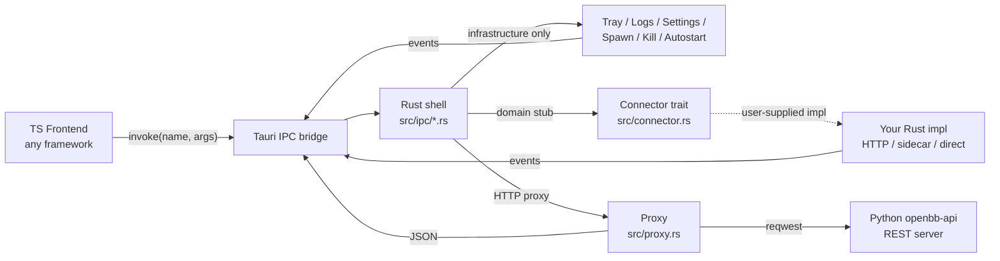

# tauri-shell

A clean Tauri 2.x desktop shell with **fully-implemented infrastructure** and **open-ended connectors** for any TypeScript frontend + Python/TS backend.

## What this is

This crate is a desktop application shell. It does the OS-level work that's painful to do well in TypeScript:

- Window lifecycle (close-to-tray, single-instance, focus restore)
- System tray menu (cross-platform)
- Auto-launch at login (macOS/Windows/Linux)
- Auto-updater (Tauri plugin, GitHub releases + minisign by default)
- Bounded cleanup cascade on quit / Ctrl-C / system shutdown
- Subprocess management with a 10000-line in-memory ring log buffer per process
- Global `process-output` broadcast channel for log streaming to renderer windows
- Per-process log windows (deep-link via URL pattern)
- Atomic JSON file writes with file-lock + `chmod 0600` (settings/credentials helpers)
- Port-based and PID-based process kill on macOS/Linux/Windows
- All the boilerplate around `#[tauri::command]`, `tauri::generate_handler!`, plugin init, RunEvent loop

It does **not** include your domain logic. Install pipelines, environment management, backend service config, credential schemas, Jupyter integration, REST API spawning — all that is left as **typed stubs** with a clear `// TODO: wire to your backend` extension point. Bring your own Python/TS backend; this shell handles the desktop wrapper.

---

## Quick start

The shell builds out of the box, but ships with placeholder icons and points at an empty `dist/` folder. Five steps take you from clone to a signed bundle.

### 1. Install Rust + Tauri CLI

```bash
# Stable Rust toolchain (1.75 or newer — see Cargo.toml `rust-version`)
curl --proto '=https' --tlsv1.2 -sSf https://sh.rustup.rs | sh
rustup install stable

# Tauri command-line tool (handles bundle/sign/notarize)
cargo install tauri-cli --version "^2"
```

### 2. Install Linux system dependencies

If you're building on macOS or Windows, skip this step. On any modern Linux distribution you need the WebKitGTK 4.1 stack and a couple of GTK / desktop-integration libraries.

Debian / Ubuntu:

```bash
sudo apt update
sudo apt install -y \
    libwebkit2gtk-4.1-dev \
    libgtk-3-dev \
    libayatana-appindicator3-dev \
    librsvg2-dev \
    libssl-dev \
    libsoup-3.0-dev \
    pkg-config \
    build-essential \
    curl wget file
```

Fedora:

```bash
sudo dnf install -y \
    webkit2gtk4.1-devel \
    gtk3-devel \
    libappindicator-gtk3-devel \
    librsvg2-devel \
    openssl-devel \
    libsoup3-devel
```

Arch:

```bash
sudo pacman -S --needed webkit2gtk-4.1 gtk3 libappindicator-gtk3 librsvg openssl libsoup3
```

> Missing one of these is the #1 first-build failure on Linux — see [Troubleshooting](#troubleshooting) below.

### 3. Replace the placeholder icons

The shell ships with 8×8 transparent placeholder PNGs so `cargo build` succeeds out of the box. **Replace these before you ship anything:**

```bash
cd tauri-shell/icons
# Drop in your real assets:
#   32x32.png         — Linux tray
#   128x128.png       — Linux app
#   128x128@2x.png    — macOS Retina
#   icon.icns         — macOS bundle
#   icon.ico          — Windows bundle
#   icon.png          — Tray fallback
```

The Tauri CLI ships an icon generator that takes one 1024×1024 PNG and produces every format:

```bash
cd tauri-shell
cargo tauri icon path/to/your-1024x1024.png
```

### 4. Point at your TypeScript frontend

Edit `tauri.conf.json`:

```jsonc
{
  "build": {
    "frontendDist": "../my-frontend/dist",   // <- where `npm run build` writes
    "devUrl": "http://localhost:5173",       // <- where `npm run dev` listens
    "beforeDevCommand": "npm --prefix ../my-frontend run dev",
    "beforeBuildCommand": "npm --prefix ../my-frontend run build"
  }
}
```

There's a tiny `dist/index.html` checked in so the binary launches without a frontend; rip that out when you have your own.

### 5. Build and bundle

```bash
# Development run — opens the dev URL with hot-reload
cargo tauri dev

# Production bundle — produces .app/.dmg/.exe/.msi/.AppImage/.deb depending on host OS
cargo tauri build
```

The bundle lands in `target/release/bundle/<target>/`. If you've configured an updater endpoint in `tauri.conf.json` (see [Configuration reference](#configuration-reference)), Tauri also writes a `.sig` next to each bundle.

---

## Architecture overview

The shell is organised in three concentric layers, each with a very different "real vs. stub" balance.

**Infrastructure layer (Rust, fully real).** The lowest layer is OS-native code: process spawning, port discovery, tray menus, autostart, atomic settings writes, the in-memory log ring buffer, the cleanup cascade. Everything here is production-quality and works without any wiring on the consumer's part. See `src/state.rs`, `src/process_spawn.rs`, `src/process_kill.rs`, `src/cleanup.rs`, `src/settings.rs`, `src/autostart/`, `src/tray.rs`. The infrastructure layer never imports from `src/ipc/`; it can be reused in non-Tauri contexts.

**Domain layer (Rust, mostly stubs).** The middle layer is `src/ipc/*.rs` — one module per domain (installation, environments, backends, jupyter, credentials, certs, uninstall, etc.). Functions here are decorated with `#[tauri::command]` and return `Result<T, IpcError>`. Roughly half of them are real (the ones that only touch the infrastructure layer — settings files, log windows, route introspection) and half are stubs that delegate to a `Connector` trait the consumer registers. See `src/connector.rs`. The point of the stubs is *not* that the domain logic is missing; it's that there is no single right answer (curl-bash installers vs. pyinstaller vs. uv vs. system Python) and the shell refuses to pick.

**Proxy layer (Rust, fully real).** The third layer is `src/proxy.rs` plus `src/ipc/obb.rs`, `obb_routes.rs`, `obb_routes_extended.rs`, `openbb_meta.rs`, `provider.rs`. This wraps a `reqwest`-based HTTP client that talks to a Python OpenBB Platform REST server. It's the bridge between the renderer and any HTTP backend you're running locally — typed wrappers for the 88 most-used routes, a catch-all `obb_call(route, params)`, route discovery from `/openapi.json`, and a provider catalog. This layer is fully real and has no stubs.

The data-flow when the renderer issues a command:



The renderer talks to exactly one surface — `invoke()` and `listen()` from `@tauri-apps/api/core`. The shell decides per-command whether to answer locally (infrastructure), delegate to your `Connector` (domain), or forward to the Python server (proxy). All three answer in the same `Result<T, IpcError>` envelope, so the renderer doesn't need to know which lane it landed in.

---

## Full command catalog

**162 commands** total, grouped by module. Status legend: ✅ = real, fully implemented in the shell. 🪝 = stub returning `Err(NotImplemented)` until a `Connector` impl supplies the body.

### `app` — top-level shell controls (5)

| Command | Args | Returns | Status | Description |
|---|---|---|---|---|
| `get_installation_state` | — | `InstallationSnapshot` | ✅ | Reads the boot-time snapshot of `InstallationState`. Renderer hits this on first paint to decide whether to show the onboarding flow or jump straight to the main app. |
| `navigate_to_page` | `path: String` | `()` | ✅ | Emits the `navigate` event with `{ path }`. The renderer subscribes once and routes accordingly. Used by tray menu clicks to drive in-app routing without `webContents.eval`. |
| `quit_application` | — | `()` | ✅ | Triggers the bounded cleanup cascade (`cleanup::cleanup_all_processes`) then calls `app.exit(0)`. Safe to call from anywhere — re-entrant. |
| `get_app_version` | — | `String` | ✅ | Returns the version string from `Cargo.toml`. Useful for "About" panels and bug-report metadata. |
| `toggle_theme` | `theme: String` | `bool` | 🪝 | Persists the renderer's preferred theme. Stub — wire to your settings store; the shell does no theme-bound styling itself. |

### `infrastructure` — process log ring buffer (4)

| Command | Args | Returns | Status | Description |
|---|---|---|---|---|
| `register_process_monitoring` | `process_id: String` | `bool` | ✅ | Creates a 10000-line ring buffer for `process_id` in the global `LogStorage`. Returns `false` if it already existed. Call before spawning. |
| `unregister_process_monitoring` | `process_id: String` | `bool` | ✅ | Drops the ring buffer for `process_id`. Returns `false` if it didn't exist. Call after the subprocess exits. |
| `get_process_logs_history` | `process_id: String, count?: usize` | `Vec<LogEntry>` | ✅ | Returns the last `count` entries (or the whole buffer if `count` is `None`). Used by log windows to backfill on mount before the live `process-output` stream takes over. |
| `clear_process_logs_history` | `process_id: String` | `bool` | ✅ | Truncates the buffer for `process_id`. Useful for "Clear logs" buttons. |

### `helpers` — paths, pickers, windows (11)

| Command | Args | Returns | Status | Description |
|---|---|---|---|---|
| `get_home_directory` | — | `String` | ✅ | OS home directory, resolved via `path_utils::home_dir`. |
| `get_settings_directory` | — | `String` | ✅ | The shell's settings directory — `$XDG_CONFIG_HOME/<app>/` on Linux, `~/Library/Application Support/<app>/` on macOS, `%APPDATA%\<app>\` on Windows. Override the leaf name via the `TAURI_SHELL_DATA_DIR_NAME` env var. |
| `select_directory` | `prompt?: String` | `String` | ✅ | Native directory picker via `tauri-plugin-dialog`. Returns the selected path. |
| `select_file` | `filter?: Vec<FileFilter>` | `String` | ✅ | Native file picker with optional extension filters. |
| `check_directory_exists` | `path: String` | `bool` | ✅ | Convenience over `std::fs::metadata` — lets the renderer probe paths without an explicit `fs` capability. |
| `check_file_exists` | `path: String` | `bool` | ✅ | As above, for files. |
| `open_url_in_window` | `url: String, title?: String` | `()` | ✅ | Spawns a new webview window pointing at `url`. **Never put a secret in the URL** — the OS may expose the window title to accessibility APIs. |
| `open_workspace_in_browser` | `url?: String` | `()` | ✅ | Opens the configured OpenBB Workspace URL in the user's default external browser via `tauri-plugin-opener`. |
| `open_logs_window` | `label_prefix: String, id: String, route: String, id_key?: String, title?: String` | `()` | ✅ | Spawns the per-process log window. The renderer's route at `route?<id_key>=<id>` is responsible for subscribing to `process-output`. |
| `get_working_directory` | `default_dir?: String` | `String` | 🪝 | Reads the connector's persisted CWD. Stub. |
| `save_working_directory` | `path: String` | `bool` | 🪝 | Persists the connector's CWD. Stub. |

### `installation` — install pipeline (9)

| Command | Args | Returns | Status | Description |
|---|---|---|---|---|
| `install_to_directory` | `directory: String, user_data_directory: String` | `bool` | 🪝 | Top-level installer entry. Stub. The connector typically streams `install-progress` events for each step. |
| `install_conda` | `directory: String` | `bool` | 🪝 | Downloads + installs Miniforge (or your Python runtime of choice) under `directory`. Stub. |
| `setup_python_environment` | `directory: String, python_version: String` | `bool` | 🪝 | Creates the default conda env and pip-installs the OpenBB Platform. Stub. |
| `abort_installation` | `directory: String` | `()` | 🪝 | Signals the in-flight installer to roll back. Stub. Should use the `CancellationRegistry`. |
| `get_installation_status` | — | `InstallationProgress` | ✅ | Returns the live install phase mirror from the global `INSTALLATION_PROGRESS`. Real — driven by `install-progress` events. |
| `create_default_backend_services` | — | `()` | 🪝 | Seeds the backend service list with the OpenBB API and MCP defaults. Stub. |
| `update_openbb_settings` | `conda_dir: String, environment: String` | `()` | 🪝 | Writes the resolved conda paths into `user_settings.json`. Stub. |
| `get_installation_directory` | — | `String` | 🪝 | Reads `<settings>/system_settings.json:installation_directory`. Stub until your schema lands. |
| `get_userdata_directory` | — | `String` | 🪝 | Reads `<settings>/system_settings.json:user_data_directory`. Stub. |

### `environments` — conda / venv CRUD (11)

| Command | Args | Returns | Status | Description |
|---|---|---|---|---|
| `list_conda_environments` | `directory?: String` | `Vec<CondaEnvironment>` | 🪝 | Shells out to `conda env list --json` and parses. Stub. |
| `create_environment` | `name, py_version, exts, processId` | `bool` | 🪝 | `conda create -n <name> python=<v> && pip install <exts>`. Streams output through `processId`. Stub. |
| `create_environment_from_requirements` | `name, filePath, dir, processId` | `bool` | 🪝 | As above but seeded from a `requirements.txt`. Stub. |
| `select_requirements_file` | — | `String` | 🪝 | Native file picker scoped to `.txt`/`.in`/`.yaml`. Stub. |
| `get_environment_extensions` | `name: String` | `Value` | 🪝 | Calls `pip list --format=json` inside the env. Stub. |
| `install_extensions` | `extensions: Vec<Extension>, environment: String` | `bool` | 🪝 | Batch `pip install`. Stub. |
| `update_extension` | `package, environment, directory` | `bool` | 🪝 | `pip install --upgrade`. Stub. |
| `update_environment` | `environment, directory` | `bool` | 🪝 | `pip install --upgrade -r requirements.txt`. Stub. |
| `remove_extension` | `package, environment, directory` | `bool` | 🪝 | `pip uninstall -y`. Stub. |
| `remove_environment` | `name: String` | `bool` | 🪝 | `conda env remove -n <name>`. Stub. |
| `execute_in_environment` | `command, environment, directory` | `ExecResult` | 🪝 | One-shot `conda run -n <env> <cmd>`. Stub. |

### `backends` — long-running service CRUD (7)

| Command | Args | Returns | Status | Description |
|---|---|---|---|---|
| `list_backend_services` | — | `Vec<BackendService>` | 🪝 | Returns the connector-owned service registry. Stub. |
| `create_backend_service` | `backend: BackendService` | `BackendService` | 🪝 | Adds a service (does NOT spawn). Stub. |
| `update_backend_service` | `backend: BackendService` | `BackendService` | 🪝 | In-place edit. Stub. |
| `delete_backend_service` | `id: String` | `()` | 🪝 | Removes (and stops, if running). Stub. |
| `start_backend_service` | `id: String` | `BackendService` | 🪝 | Spawns via `process_spawn::spawn_with_streaming` with `processId = backend-<id>`. Stub. |
| `stop_backend_service` | `id: String` | `()` | 🪝 | Tracked-kill via `RunningProcesses`. Stub. |
| `open_backend_logs_window` | `id: String` | `()` | ✅ | Real — opens `logs?backendId=<id>` in a new webview using the shared logs-window helper. |

### `jupyter` — JupyterLab lifecycle (6)

| Command | Args | Returns | Status | Description |
|---|---|---|---|---|
| `start_jupyter_server` | `environment, directory, working` | `JupyterStatus` | 🪝 | `conda run -n <env> jupyter lab --no-browser --port=auto`. Extracts URL with token from stdout and emits `backend-url-discovered`. Stub. |
| `stop_jupyter_server` | `environment: String` | `bool` | 🪝 | Tracked-kill of `jupyter-<env>`. Stub. |
| `check_jupyter_server` | `environment: String` | `JupyterStatus` | 🪝 | Polls the URL for liveness. Stub. |
| `list_jupyter_servers` | — | `Value` | 🪝 | Returns every running Jupyter status. Stub. |
| `open_jupyter_logs_window` | `environment: String` | `()` | ✅ | Real — opens `logs?environment=<env>`. |
| `update_jupyter_status` | `environment_name, status` | `()` | ✅ | Real — emits `jupyter-status-update`. Pure event hop; no state mutation. |

### `credentials` — API key vault (3)

| Command | Args | Returns | Status | Description |
|---|---|---|---|---|
| `get_user_credentials` | — | `Value` | ✅ | Reads `<settings>/user_settings.json`'s `credentials` object. Returns `{}` if the file is missing. |
| `update_user_credentials` | `credentials: Value` | `bool` | ✅ | Merges into `credentials` and atomic-writes (`.tmp` + flock + chmod 0600 + rename). Concurrent writers are serialized via the flock. |
| `open_credentials_file` | `file_name: String` | `bool` | ✅ | Opens the file in the OS default editor. Allow-list enforced to `{user_settings.json, system_settings.json, mcp_settings.json, .env, .condarc}` — defense-in-depth against path-traversal. |

### `certs` — self-signed certificate generation (1)

| Command | Args | Returns | Status | Description |
|---|---|---|---|---|
| `generate_self_signed_cert` | `GenerateCertArgs` | `Value` | 🪝 | Produces `cert.pem` + `key.pem` (+ `cert.pfx` on request) under `output_dir`. Wire to `rcgen`, `openssl`, or your TS connector. Stub. |

### `uninstall` (1)

| Command | Args | Returns | Status | Description |
|---|---|---|---|---|
| `uninstall_application` | `remove_user_data: bool, remove_settings: bool` | `Option<String>` | 🪝 | Runs the uninstall cascade (stop services → disable autostart → remove envs → remove dirs). Emits `uninstall-progress` strings. Stub. |

### `obb` — generic Python REST proxy (16)

| Command | Args | Returns | Status | Description |
|---|---|---|---|---|
| `obb_call` | `route: String, params?: Value, method?: String` | `Value` | ✅ | The workhorse. Hits `<base_url>/api/v1<route>` (the `/api/v1` prefix is optional in `route`). Forwards `params` as query string for GET, JSON body for POST. |
| `obb_set_base_url` | `url: String` | `()` | ✅ | Mutates the managed `Proxy` to point at a new server. Used after `server_attach` or after the user edits the base URL in settings. |
| `obb_get_base_url` | — | `String` | ✅ | Current base URL. |
| `obb_set_basic_auth` | `username, password: String` | `()` | ✅ | Configures HTTP Basic auth on every subsequent request. Cleared by `obb_clear_auth`. |
| `obb_set_bearer` | `token: String` | `()` | ✅ | Configures bearer-token auth (`Authorization: Bearer <token>`). |
| `obb_clear_auth` | — | `()` | ✅ | Drops any configured auth. |
| `obb_health` | — | `Value` | ✅ | `GET /health` — useful as a server-up smoke test. |
| `obb_openapi` | — | `Value` | ✅ | `GET /openapi.json` — the full Swagger doc. |
| `obb_widgets` | — | `Value` | ✅ | `GET /widgets.json` — OpenBB Workspace widget registry. |
| `obb_apps` | — | `Value` | ✅ | `GET /apps.json` — OpenBB Workspace app registry. |
| `obb_agents` | — | `Value` | ✅ | `GET /agents.json`. |
| `obb_coverage_commands` | — | `Value` | ✅ | `GET /coverage/commands` (requires `OPENBB_DEV_MODE=true` on the server). |
| `obb_coverage_providers` | — | `Value` | ✅ | `GET /coverage/providers`. |
| `obb_coverage_command_model` | — | `Value` | ✅ | `GET /coverage/command_model`. |
| `obb_user_me` | — | `Value` | ✅ | `GET /user/me`. |
| `obb_system` | — | `Value` | ✅ | `GET /system`. |

### `obb_routes` — typed convenience wrappers (60)

The full list of typed wrappers lives in `src/ipc/obb_routes.rs`. Every command takes `params: Option<Map<String, Value>>` and returns `Value`. They exist so the renderer can autocomplete `equity_price_historical({symbol: "AAPL"})` instead of stringly-typing the route. Coverage of 60 of the 184 documented OpenBB routes, plus another tranche in `obb_routes_extended.rs`.

| Group | Commands |
|---|---|
| Equity (28) | `equity_search`, `equity_screener`, `equity_profile`, `equity_market_snapshots`, `equity_historical_market_cap`, `equity_price_historical`, `equity_price_quote`, `equity_price_nbbo`, `equity_price_performance`, `equity_fundamental_balance`, `equity_fundamental_income`, `equity_fundamental_cash`, `equity_fundamental_ratios`, `equity_fundamental_metrics`, `equity_fundamental_dividends`, `equity_fundamental_filings`, `equity_calendar_earnings`, `equity_calendar_dividends`, `equity_calendar_splits`, `equity_calendar_ipo`, `equity_calendar_events`, `equity_discovery_gainers`, `equity_discovery_losers`, `equity_discovery_active`, `equity_ownership_insider_trading`, `equity_ownership_institutional`, `equity_estimates_price_target`, `equity_estimates_consensus` |
| Crypto (2) | `crypto_search`, `crypto_price_historical` |
| Currency (5) | `currency_search`, `currency_pairs`, `currency_snapshots`, `currency_reference_rates`, `currency_price_historical` |
| Derivatives (7) | `derivatives_options_chains`, `derivatives_options_unusual`, `derivatives_options_snapshots`, `derivatives_futures_historical`, `derivatives_futures_curve`, `derivatives_futures_info`, `derivatives_futures_instruments` |
| ETF (6) | `etf_search`, `etf_info`, `etf_historical`, `etf_holdings`, `etf_sectors`, `etf_countries` |
| Index (5) | `index_search`, `index_historical`, `index_constituents`, `index_snapshots`, `index_available` |
| Economy (9) | `economy_cpi`, `economy_calendar`, `economy_indicators`, `economy_gdp_real`, `economy_gdp_nominal`, `economy_gdp_forecast`, `economy_unemployment`, `economy_fred_search`, `economy_fred_series` |
| Fixed income (5) | `fixedincome_government_yield_curve`, `fixedincome_government_treasury_rates`, `fixedincome_corporate_bond_indices`, `fixedincome_rate_sofr`, `fixedincome_rate_fed_funds` |
| News (2) | `news_world`, `news_company` |
| Regulators (3) | `regulators_sec_filings`, `regulators_sec_company_filings`, `regulators_cftc_cot` |
| Commodity (3) | `commodity_price_spot`, `commodity_petroleum_status`, `commodity_weather` |
| Technical (5) | `technical_sma`, `technical_ema`, `technical_rsi`, `technical_macd`, `technical_bbands` |
| Quantitative (5) | `quantitative_summary`, `quantitative_normality`, `quantitative_unit_root`, `quantitative_performance_omega`, `quantitative_performance_sharpe` |
| Econometrics (3) | `econometrics_correlation`, `econometrics_ols`, `econometrics_granger` |

### `openbb_meta` — route introspection (3)

| Command | Args | Returns | Status | Description |
|---|---|---|---|---|
| `list_all_routes` | — | `Vec<RouteInfo>` | ✅ | Walks `/openapi.json` and returns one entry per endpoint with `{path, method, model, category}`. |
| `search_routes` | `query: String` | `Vec<RouteInfo>` | ✅ | Case-insensitive substring search across `path` and `model`. |
| `route_parameters` | `path: String, method?: String` | `Value` | ✅ | The JSON Schema for one endpoint's parameters — useful for rendering dynamic forms. |

### `provider` — data provider catalog (4)

| Command | Args | Returns | Status | Description |
|---|---|---|---|---|
| `provider_list` | — | `Value` | ✅ | Returns the array of providers (yfinance, fmp, polygon, ...) from `/coverage/providers`. |
| `provider_routes` | `provider: String` | `Vec<String>` | ✅ | Which routes the provider can answer. |
| `provider_credentials` | `provider: String` | `Vec<String>` | ✅ | Which `credentials.*` keys the provider needs. |
| `provider_validate` | `provider, probe_route, probe_params?` | `bool` | ✅ | Issues a low-cost probe (`equity_price_quote(AAPL)` is typical) using the configured credential and returns whether it succeeded. |

### `settings_files` — JSON / text config files (5)

| Command | Args | Returns | Status | Description |
|---|---|---|---|---|
| `read_settings_json` | `file_name: String` | `Option<Value>` | ✅ | Reads one of the 5 allow-listed JSON files. Returns `None` if missing. |
| `write_settings_json` | `file_name, content: Value` | `bool` | ✅ | Atomic write (`.tmp` + flock + chmod 0600 + rename). |
| `read_settings_text` | `file_name: String` | `Option<String>` | ✅ | Same as `read_settings_json` but returns raw text — for `.condarc` / `.env`. |
| `write_settings_text` | `file_name, content: String` | `bool` | ✅ | Atomic write for text. |
| `list_settings_files` | — | `Vec<String>` | ✅ | Returns the static allow-list. |

### `server` — OpenBB API REST server lifecycle (6)

| Command | Args | Returns | Status | Description |
|---|---|---|---|---|
| `server_spawn` | `spec: ServerSpec` | `ServerStatus` | 🪝 | Spawns the Python REST server (`uvicorn openbb_platform_api:app`) under a managed subprocess. Stub. |
| `server_stop` | `id: String` | `()` | 🪝 | Tracked-kill. Stub. |
| `server_status` | `id: String` | `ServerStatus` | 🪝 | Polls liveness + returns current spec. Stub. |
| `server_list` | — | `Vec<ServerStatus>` | 🪝 | Every running server. Stub. |
| `server_attach` | `url: String` | `()` | ✅ | Sets the proxy's base URL without spawning — for when the user runs the Python server out-of-band. Real. |
| `server_health` | — | `Value` | ✅ | `GET /health` on the configured base URL. Real. |

### `mcp` — Model Context Protocol server lifecycle (5)

| Command | Args | Returns | Status | Description |
|---|---|---|---|---|
| `mcp_spawn` | `spec: McpSpec` | `McpStatus` | 🪝 | Spawns `openbb-mcp` with one of three transports (streamable-http / sse / stdio). Stub. |
| `mcp_stop` | `id: String` | `()` | 🪝 | Tracked-kill. Stub. |
| `mcp_status` | `id: String` | `McpStatus` | 🪝 | Liveness. Stub. |
| `mcp_list` | — | `Vec<McpStatus>` | 🪝 | Every running MCP server. Stub. |
| `mcp_list_tools` | `id: String` | `Value` | 🪝 | `tools/list` JSON-RPC request via the MCP transport. Stub. |

### `routines` — `.openbb` file CRUD (5)

| Command | Args | Returns | Status | Description |
|---|---|---|---|---|
| `routines_list` | — | `Vec<RoutineMetadata>` | ✅ | Returns every `.openbb` file under `<settings>/routines/` with parsed frontmatter (`title`, `tags`, `description`, `mtime`). |
| `routines_read` | `name: String` | `Option<String>` | ✅ | Returns the raw file contents. |
| `routines_save` | `name, content: String` | `bool` | ✅ | Atomic write into `<settings>/routines/<name>.openbb`. |
| `routines_delete` | `name: String` | `bool` | ✅ | Removes the file. |
| `routines_rename` | `old_name, new_name: String` | `bool` | ✅ | Renames in place. |

---

## Cookbook

Ten worked examples covering the most common renderer ↔ shell interactions. All TypeScript snippets assume `@tauri-apps/api ^2` is installed in your frontend.

### Recipe 1 — Basic data fetch via `obb_call`

The simplest end-to-end interaction. The renderer issues a generic REST call, the shell proxies it to the Python server.

```ts
import { invoke } from "@tauri-apps/api/core";

interface ObbResponse<T> { results: T[]; provider: string; warnings: string[]; }

async function fetchSpyHistorical() {
  return invoke<ObbResponse<{ date: string; close: number }>>("obb_call", {
    route: "/equity/price/historical",
    params: { symbol: "SPY", provider: "yfinance", interval: "1d" },
    method: "GET",
  });
}
```

**What happens:** The shell forwards `GET <base_url>/api/v1/equity/price/historical?symbol=SPY&provider=yfinance&interval=1d`. On success the renderer gets the deserialized JSON; on any error (network, 4xx, 5xx) it gets a tagged `IpcError`.

**Side effects:** None. This command is read-only and stateless.

### Recipe 2 — Typed wrapper for equity historical

Same call but using one of the 60 typed wrappers. Saves a few bytes of network traffic (no route string) and gives you autocomplete on the function name.

```ts
import { invoke } from "@tauri-apps/api/core";

async function fetchAaplDaily() {
  return invoke<{ results: Array<{ date: string; close: number }> }>(
    "equity_price_historical",
    { params: { symbol: "AAPL", provider: "yfinance", interval: "1d" } }
  );
}
```

**What happens:** The shell knows the route and HTTP method at compile time (it's hard-coded in `obb_routes.rs`) and skips the route-parsing branch in `obb_call`. The wire format is identical.

### Recipe 3 — Read + write `user_settings.json`

The atomic-write codepath. Read, mutate locally, write back. The shell takes care of the `.tmp` + flock + chmod 0600 + rename dance.

```ts
import { invoke } from "@tauri-apps/api/core";

async function setPolygonKey(apiKey: string) {
  // Read existing settings
  const settings = (await invoke<Record<string, unknown> | null>(
    "read_settings_json",
    { fileName: "user_settings.json" }
  )) ?? {};

  // Mutate
  const credentials = (settings.credentials as Record<string, string>) ?? {};
  credentials.polygon_api_key = apiKey;
  settings.credentials = credentials;

  // Write back atomically
  await invoke<boolean>("write_settings_json", {
    fileName: "user_settings.json",
    content: settings,
  });
}
```

**What happens:** The shell writes `<settings>/user_settings.json.tmp`, acquires an exclusive `flock` on it, `chmod 0600` (Unix), then `rename(2)` over the target. Concurrent calls are serialized by the lock; a crash mid-write leaves the original file intact.

**Security note:** The `credentials` object contains secrets. Never `console.log` it, never put it on the clipboard, never include it in an event payload broadcast through `Emitter::emit`. See [Security](#security) below.

### Recipe 4 — Spawn a backend and stream logs to a new window

The full subprocess lifecycle: register the ring buffer → spawn → open a per-service log window → subscribe to `process-output`.

```ts
import { invoke } from "@tauri-apps/api/core";
import { listen } from "@tauri-apps/api/event";

interface ProcessOutputEvent {
  processId: string;
  output: string;
  timestamp: number;
  type: "stdout" | "stderr" | "system";
}

async function startBackend(backend: { id: string; name: string; command: string }) {
  // 1. Ensure the ring buffer exists
  await invoke<boolean>("register_process_monitoring", { processId: `backend-${backend.id}` });

  // 2. Tell the connector to spawn
  const created = await invoke("start_backend_service", { id: backend.id });

  // 3. Open the per-service log window
  await invoke("open_backend_logs_window", { id: backend.id });

  // 4. (Optional) Subscribe in the main window for a status badge
  const unlisten = await listen<ProcessOutputEvent>("process-output", (e) => {
    if (e.payload.processId === `backend-${backend.id}` && e.payload.type === "stderr") {
      // Bump an "errors" badge
    }
  });

  return { created, unlisten };
}
```

**What happens:** `start_backend_service` is a stub in the default shell; once you wire a `Connector` impl it calls `process_spawn::spawn_with_streaming(...)`, which starts the subprocess, attaches two reader threads (stdout / stderr) that push every line into the ring buffer for `processId` AND emit `process-output` to every listening window.

**What the user sees:** Their main window stays responsive; a new log window pops up, backfills history, then streams new lines as they arrive.

### Recipe 5 — Generate a self-signed cert

A one-shot stub that the connector wires to `rcgen` or `openssl`.

```ts
import { invoke } from "@tauri-apps/api/core";

await invoke<{ certPath: string; keyPath: string }>("generate_self_signed_cert", {
  args: {
    commonName: "localhost",
    orgName: "OpenBB Local",
    altNames: ["localhost", "127.0.0.1", "::1"],
    outputDir: "/Users/me/.openbb_platform/certs",
    daysValid: 365,
    password: null,
    installInTrustStore: false,
  },
});
```

**What happens (once wired):** The connector shells out to `openssl req -x509 ...` (or invokes `rcgen` directly) under `outputDir`, produces `cert.pem` + `key.pem`, optionally drops the cert into the user's trust store via `security add-trusted-cert` (macOS) / `certutil -addstore` (Windows) / `update-ca-certificates` (Linux).

### Recipe 6 — Enable auto-launch at login

The shell wraps three per-OS implementations behind a single trait. No IPC command — the tray menu calls into `crate::autostart` directly. If you want to expose it to the renderer:

```rust
// In your IPC module:
#[tauri::command]
pub fn set_autostart(enabled: bool) -> Result<bool, IpcError> {
    if enabled {
        tauri_shell::autostart::enable().map_err(IpcError::from)?;
    } else {
        tauri_shell::autostart::disable().map_err(IpcError::from)?;
    }
    Ok(enabled)
}
```

Then from the renderer:

```ts
await invoke<boolean>("set_autostart", { enabled: true });
```

**What happens per OS:**
- **macOS** — `osascript -e 'tell application "System Events" to make login item ...'` adds an entry. The user's session restores the app on next login.
- **Windows** — Creates `<startup>\<AppName>.lnk` via COM `IShellLink` with the absolute path to the bundled `.exe`.
- **Linux** — Writes `~/.config/autostart/<app>.desktop` with `Exec=<absolute_binary_path>` and `X-GNOME-Autostart-enabled=true`.

### Recipe 7 — React to navigate events from the tray

The tray menu can't directly invoke renderer routes; it has to emit a `navigate` event the renderer listens for.

```ts
import { listen } from "@tauri-apps/api/event";
import { useNavigate } from "react-router-dom"; // or whatever your router exposes

function useTrayNav() {
  const navigate = useNavigate();
  useEffect(() => {
    const promise = listen<{ path: string }>("navigate", (e) => {
      navigate(e.payload.path);
    });
    return () => { promise.then((un) => un()); };
  }, [navigate]);
}
```

**What happens:** Clicking "Open Environments" in the tray → `tray.rs` calls `app.emit("navigate", NavigateEvent { path: "/environments" })` → every webview receives it → only the main one acts on it (because the others don't have a router mounted).

### Recipe 8 — Save + load a `.openbb` routine

The shell ships a real `.openbb` file CRUD under `<settings>/routines/`. Useful for "saved query" features.

```ts
import { invoke } from "@tauri-apps/api/core";

async function saveRoutine(title: string, body: string) {
  const content = [
    "---",
    `title: ${title}`,
    `description: Saved from the desktop UI`,
    "---",
    body,
  ].join("\n");

  await invoke<boolean>("routines_save", { name: title.toLowerCase().replace(/\s+/g, "-"), content });
}

async function listRoutines() {
  return invoke<Array<{ name: string; title: string; tags: string[]; mtime: number }>>("routines_list");
}
```

**What happens:** `routines_save` runs the same atomic-write codepath as the settings files (`.tmp` + flock + chmod 0600 + rename). `routines_list` walks the directory, parses the YAML frontmatter, and returns metadata sorted by mtime descending.

### Recipe 9 — Drive a connector validation probe

After the user enters an API key, call `provider_validate` with a low-cost probe to confirm it works before persisting it as "verified".

```ts
import { invoke } from "@tauri-apps/api/core";

async function verifyPolygon() {
  return invoke<boolean>("provider_validate", {
    provider: "polygon",
    probeRoute: "/equity/price/quote",
    probeParams: { symbol: "AAPL" },
  });
}
```

**What happens:** The shell looks up the credential the provider needs (via `provider_credentials`), reads it from `user_settings.json`, sets the proxy auth header, issues the probe, and returns `true` if the response status is 200 and contains no `error` envelope.

### Recipe 10 — Install pipeline with `install-progress` listener

Long-running installations emit structured `install-progress` events. The renderer drives a progress bar from them and uses the dedicated `installation` command to abort.

```ts
import { invoke } from "@tauri-apps/api/core";
import { listen } from "@tauri-apps/api/event";

interface InstallProgressEvent { step: string; progress: number; message: string; }

async function runInstall(directory: string, userDataDirectory: string) {
  const unlisten = await listen<InstallProgressEvent>("install-progress", (e) => {
    console.log(`[${e.payload.step}] ${(e.payload.progress * 100).toFixed(0)}% — ${e.payload.message}`);
    // Update your progress bar here.
  });

  try {
    await invoke<boolean>("install_to_directory", { directory, userDataDirectory });
  } finally {
    unlisten();
  }
}

async function abort(directory: string) {
  await invoke("abort_installation", { directory });
}
```

**What the user sees:** A progress bar that moves through the connector-defined phases (`download` → `extract` → `install` → `configure` → `complete`), with a "Cancel" button that calls `abort_installation`. On success the renderer reads `get_installation_state` to update `InstallationState::installed = true`.

---

## Connector patterns

The shell deliberately leaves domain logic open-ended. Three concrete strategies cover almost every real-world setup. Each is a one-method-at-a-time decision; mix and match per command if your backend is heterogeneous.

### Pattern A — HTTP proxy to an existing Python REST server

For when your domain logic already lives in `openbb-api` (or any other HTTP service). The connector translates Tauri command args into an HTTP request and unwraps the response.

```rust
use async_trait::async_trait;
use reqwest::Client;
use tauri_shell::connector::{Connector, ConnectorError};

pub struct HttpProxyConnector { client: Client, base: String }

#[async_trait]
impl Connector for HttpProxyConnector {
    async fn install_to_directory(
        &self,
        args: tauri_shell::ipc::installation::InstallArgs,
    ) -> Result<bool, ConnectorError> {
        self.client.post(format!("{}/install", self.base))
            .json(&args)
            .send().await.map_err(|e| ConnectorError::Io(e.to_string()))?
            .error_for_status().map_err(|e| ConnectorError::Io(e.to_string()))?;
        Ok(true)
    }
    // ... ~35 more methods, mostly the same shape
}
```

The `obb*` commands already use exactly this pattern via `crate::proxy::Proxy` — for any command that maps to a single HTTP call, this is the path of least resistance.

### Pattern B — Node sidecar over Tauri's `sidecar`

When the domain logic is already implemented in TypeScript / Node and you'd rather not re-port it. The connector spawns a long-running Node process and communicates over its stdio (JSON-RPC, line-delimited JSON, whatever).

```rust
use tauri_shell::connector::{Connector, ConnectorError};
use tauri_shell::process_spawn::spawn_with_streaming;
use tauri::AppHandle;

pub struct NodeSidecarConnector { process_id: String }

#[async_trait::async_trait]
impl Connector for NodeSidecarConnector {
    async fn install_runtime(
        &self,
        args: tauri_shell::ipc::installation::InstallRuntimeArgs,
        app: AppHandle,
    ) -> Result<bool, ConnectorError> {
        spawn_with_streaming(
            &app, &self.process_id,
            "node", &["scripts/install-runtime.mjs", &serde_json::to_string(&args).unwrap()],
        ).map_err(|e| ConnectorError::Io(e.to_string()))?;
        // Block on a "done" sentinel emitted by the Node script
        Ok(true)
    }
    // ...
}
```

The infrastructure layer carries all the heavy lifting (log streaming, kill registry); your sidecar only needs to print lines and exit.

### Pattern C — Pure Rust implementation

When the domain logic is small and you want zero runtime surface area. Implement each method inline.

```rust
use async_trait::async_trait;
use tauri_shell::connector::{Connector, ConnectorError};

pub struct RcgenCertConnector;

#[async_trait]
impl Connector for RcgenCertConnector {
    async fn generate_self_signed_cert(
        &self,
        args: tauri_shell::ipc::certs::GenerateCertArgs,
    ) -> Result<serde_json::Value, ConnectorError> {
        use rcgen::{Certificate, CertificateParams};
        let mut params = CertificateParams::new(args.alt_names);
        params.distinguished_name.push(rcgen::DnType::CommonName, args.common_name);
        let cert = Certificate::from_params(params).map_err(|e| ConnectorError::Internal(e.to_string()))?;
        // ... write pem/key into args.output_dir, return paths ...
        Ok(serde_json::json!({ "certPath": "...", "keyPath": "..." }))
    }
}
```

---

## Security

The shell handles secrets — API keys, OAuth tokens, certs. Read this before changing anything in `credentials.rs`, `settings_files.rs`, or `helpers.rs`. These bullets are ported from `docs/typescript-port/raw-deep-dives/api-keys.md` §11.

- **Atomic writes.** Every settings file is written via `<path>.tmp` → `flock` → `chmod 0600` → `rename(2)`. A crash mid-write leaves the original file intact. Never call `std::fs::write` on a settings file directly; use `crate::settings::write_json_atomic`.
- **File permissions.** After every write, Unix code paths call `chmod 0o600` on the renamed file. NTFS doesn't have an exact equivalent; document the limitation. Don't rely on umask — many distros leave it at `0022`, which would produce `0644`.
- **File lock.** All writes acquire an exclusive `flock` for the read-modify-write cycle, so concurrent writers (the desktop UI and a running Python `openbb-api`) won't race.
- **Path-traversal allow-list.** `read_settings_*` / `write_settings_*` / `open_credentials_file` accept a `fileName` arg from the renderer; the shell rejects any string not in `{user_settings.json, system_settings.json, mcp_settings.json, .env, .condarc}`. Defense in depth — even though the renderer already restricts.
- **Missing-file auto-create.** `read_settings_json` returns `Option<Value>`, not an error, when the file is missing. Auto-create only happens on the *write* path, and only inside the allow-listed names — combined with the allow-list this is safe.
- **No secrets in events.** The shell never broadcasts credentials via `tauri::Event` / `webContents.send`. If you add a "credentials updated" event, send only the **key names**, never the values. The renderer can re-read `get_user_credentials` if it needs the values.
- **No secrets in logs.** Never `log::debug!` a credentials object, a `user_settings.json` content, or an `Authorization` header. The `tauri-plugin-log` writes to disk by default and is read by the auto-update telemetry. The shell's `proxy.rs` strips `Authorization` from any debug print.
- **No secrets in window titles or labels.** `open_url_in_window` constructs window labels like `url-<timestamp>`; never put a key value in a label, title, or URL fragment. OS accessibility APIs, Spotlight, Mission Control, and AltTab can all read window titles.
- **Clipboard exfiltration.** "Copy to clipboard" buttons should call `navigator.clipboard.writeText` *then schedule a clear* via `setTimeout(() => clipboard.writeText(""), 30_000)`. macOS Universal Clipboard syncs across iCloud devices; Windows clipboard history (Win+V) retains entries for up to 24h.
- **Case normalisation.** Lower-case all credential keys at the IPC boundary; the OpenBB Python core does the same, and a casing mismatch silently breaks auth.
- **FS watcher debounce.** If you add a watcher on `user_settings.json` to detect external edits, debounce (≥500ms) and diff before re-rendering — a naive re-read races with concurrent writes.
- **Modal closes after await.** Renderer-side "Save" dialogs should keep the modal open until the IPC `await` resolves; closing first and losing user input on failure is a foot-gun.
- **No `eval` from the tray.** Tray menu clicks emit `navigate` events; they NEVER call `webContents.eval` or `window.eval`. Eval-from-Rust is a CSP bypass.
- **Updater signature.** The `tauri-plugin-updater` checks a minisign signature against the configured `pubkey` before applying any update bundle. Don't disable this. The private half lives on your release machine; never check it into the repo.
- **CSP.** The shipped `tauri.conf.json` has `"csp": null` because the dist directory is a placeholder. Set this to a strict policy (`default-src 'self' tauri:; ...`) before shipping. Tauri's IPC bridge does NOT require unsafe-eval / unsafe-inline.

---

## Configuration reference

### Environment variables

| Variable | Default | Purpose |
|---|---|---|
| `TAURI_SHELL_DATA_DIR_NAME` | `tauri-shell` | Leaf name of the settings directory. Set to `openbb_platform` (or whatever) to share a directory with an existing Python install. Read by `path_utils::settings_dir`. |
| `RUST_LOG` | `info` | Standard `env_logger`-compatible filter. The shell wires `tauri-plugin-log` to honour this for its file target. |
| `RUST_BACKTRACE` | `0` | Standard Rust panic backtrace control. |
| `WEBKIT_DISABLE_DMABUF_RENDERER` | unset | Linux only. Set to `1` to work around tearing or blank-window issues on some NVIDIA + Wayland combinations. Has no effect on macOS / Windows. |

The HTTP proxy layer respects auth set at runtime via `obb_set_basic_auth` / `obb_set_bearer`; there's no `OPENBB_API_AUTH` env var the shell consumes directly. The Python server may consume one independently.

### `tauri.conf.json` fields

The shell respects the standard Tauri 2.x config surface. The fields that materially affect shell behaviour:

| Field | Type | Description |
|---|---|---|
| `productName` | string | Used as the default window title and the bundled product name. Also seeds the autostart entry's display name. |
| `version` | string | Returned by `get_app_version`. Compared against the updater feed's `version` field. |
| `identifier` | string | Bundle / app id (reverse DNS). Used by `tauri-plugin-single-instance` to namespace the lock file, and by macOS / Windows to name the autostart entry. |
| `build.frontendDist` | path | Where the renderer's static assets live in release builds. Must contain an `index.html`. |
| `build.devUrl` | URL | Where Tauri's dev mode points the webview. |
| `build.beforeDevCommand` / `beforeBuildCommand` | string | Shell commands Tauri runs before launching dev / build. Use these to invoke your bundler. |
| `app.windows[].label` | string | The main window's label must be `"main"` — the shell's tray + close-to-tray logic looks it up by this label. |
| `app.windows[].title` | string | Initial title. Visible in the OS task switcher; **don't put runtime data here**. |
| `app.windows[].visible` | bool | Set `false` for a tray-only boot, `true` for a normal launch. The shell can re-show via the tray menu. |
| `app.windows[].titleBarStyle` | enum | macOS only. `Transparent` is the recommended starting point. |
| `app.windows[].windowEffects` | array | Window vibrancy / Mica. Optional. |
| `app.trayIcon.iconPath` | path | Path to the tray icon. Should be a 16×16 or 32×32 monochrome PNG with alpha. |
| `app.trayIcon.iconAsTemplate` | bool | macOS only. `true` enables auto-inversion in dark mode. |
| `app.security.csp` | string \| null | Content Security Policy. Override with a strict policy before shipping. |
| `bundle.active` | bool | Whether `cargo tauri build` produces installers. |
| `bundle.targets` | string \| array | `"all"` builds every installer Tauri supports on the host; can be narrowed to e.g. `["dmg", "deb"]`. |
| `bundle.icon` | array | Source files for the bundled installer icons. |
| `plugins.updater.endpoints` | array | URLs the updater polls. The shell ships with a placeholder. |
| `plugins.updater.pubkey` | string | Base64 minisign public key. The placeholder `REPLACE_WITH_YOUR_MINISIGN_PUBKEY` will cause every update to fail signature verification — that's intentional, replace before shipping. |
| `plugins.updater.dialog` | bool | Whether the plugin shows its built-in update prompt or you handle the UI yourself. |

### Capability files

`capabilities/default.json` is granted to the `main` window. `capabilities/logs-window.json` to every window whose label starts with `logs-`. Edit these to add/remove plugin permissions (`fs:allow-read-file`, `dialog:allow-open`, etc.); the shell ships only the permissions the included commands need.

---

## Troubleshooting

### 1. Linux build fails with `Package webkit2gtk-4.1 was not found`

You haven't installed the WebKitGTK 4.1 stack. See [Quick start step 2](#2-install-linux-system-dependencies). On older Ubuntu LTS that only ships `webkit2gtk-4.0`, add the [Tauri PPA](https://launchpad.net/~tauri-apps/+archive/ubuntu/stable) or upgrade to 22.04+.

### 2. App icon is the placeholder square / installer rejects the icon

You forgot to replace `icons/*`. The shipped 8×8 transparent PNGs are valid PNGs but produce squashed icons in the dock / taskbar. Run `cargo tauri icon <source>.png` with a 1024×1024 source. Also re-check `bundle.icon` in `tauri.conf.json` references the new files.

### 3. `webview2` capability errors at runtime (e.g. `"the application did not authorize this command"`)

Every plugin permission the renderer uses must be granted via a capability file. The error message names the offending permission (e.g. `dialog:default`). Add it to `capabilities/default.json`:

```jsonc
{
  "$schema": "../gen/schemas/desktop-schema.json",
  "identifier": "default",
  "windows": ["main"],
  "permissions": [
    "core:default",
    "dialog:allow-open",      // <- add this
    "opener:allow-open-url",
    "fs:allow-read-file"
  ]
}
```

Restart the dev server after editing capabilities; they're compiled into the binary.

### 4. Port already in use when spawning a backend

The `process_spawn` helper does NOT auto-discover free ports. If `BackendService.port` collides with a running process, the spawn fails with `EADDRINUSE`. Two fixes:

- Run `process_kill::kill_port(port)` first (works on all three OSes).
- Use port `0` if your spawned process supports auto-binding; capture the actual port from the spawned process's first log line (`spawn_with_streaming`'s `url_pattern` arg is built for exactly this).

### 5. Updater fails immediately with `signature verification failed`

The `pubkey` in `tauri.conf.json:plugins.updater.pubkey` doesn't match the minisign signature embedded in your update bundle. The default value `REPLACE_WITH_YOUR_MINISIGN_PUBKEY` will always fail. Generate a key pair:

```bash
cargo install minisign
minisign -G -p ./updater.pub -s ./updater.key
```

Paste the contents of `updater.pub` (base64, single line) into `tauri.conf.json`. Keep `updater.key` off the repo — it's the signing private half.

---

## Status

This is the live state of the parallel build effort. See `SPEC.md` for the canonical slice list.

- Slice A — TS type bindings — see `SPEC.md` §2.A
- Slice B — Connector trait — see `SPEC.md` §2.B
- Slice C — Extended typed wrappers — see `SPEC.md` §2.C
- Slice D — Integration tests — see `SPEC.md` §2.D
- **Slice E — Docs + cookbook — this document**
- Slice F — TS frontend example — see `SPEC.md` §2.F
- Slice G — CLI binary — see `SPEC.md` §2.G
- Slice H — Connector reference impls — see `SPEC.md` §2.H

For the full status table, see `SPEC.md` §8.
