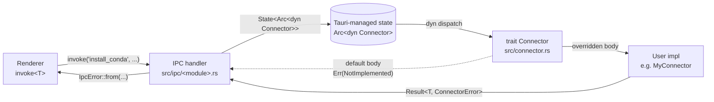

# Slice B — Connector trait abstraction

Status: shipped. Source of truth: `tauri-shell/src/connector.rs`,
the eight stub IPC modules under `tauri-shell/src/ipc/`, and the
override demo in `tauri-shell/tests/connector.rs` (10 passing tests).

---

## 1. Purpose

Before this slice, every domain command that needed to talk to a real
backend was a separate `#[tauri::command]` returning
`Err(IpcError::NotImplemented(...))` with a `// TODO: connect to your
backend` comment. Forty-something such stubs were scattered across eight
files. A user who wanted to wire the shell to (say) a Python REST
service had to:

1. Find every `// TODO` comment by grep.
2. Re-implement the body of every command in-place.
3. Re-derive how the command threads `AppHandle`, `State<RunningProcesses>`,
   etc. — every stub was its own little dialect.
4. Keep that fork in sync with upstream as new stubs got added.

The Connector trait replaces all of that with a single seam:

- **The shell decides UX.** Window management, log streaming, the tray,
  shutdown cascade, dialog pickers, file-system writes — all of these
  stay in the shell because they're inherently coupled to Tauri APIs
  and the renderer event bus.
- **The connector decides behavior.** Anything that requires choosing
  *what* to do (install conda? hit an HTTP endpoint? spawn a Node
  sidecar?) is on the trait. The connector author implements the methods
  they care about; everything else inherits a `NotImplemented` default.

This split lets users swap entire backends without forking `ipc/*.rs`
and lets us add new domain commands without re-asking every connector
author to write a stub.

Practical consequences:

- `cargo check` passes on a fresh clone (the default `NoopConnector` is
  not a build-time blocker).
- A real connector is one file with one `impl Connector for MyConnector`
  block — and the author overrides only what they need.
- Domain modules in `src/ipc/` are now nearly identical four-liners
  (`connector.method(args).await.map_err(IpcError::from)`), so adding a
  new command means adding a trait method and a thin handler — not a
  bespoke implementation.

---

## 2. Architecture



Layering rules:

- `src/connector.rs` is the only file in the crate that names the trait
  publicly. Domain modules import the trait and a small set of arg
  structs (e.g. `crate::connector::{Connector, InstallToDirectoryArgs}`)
  but never name a concrete impl.
- The default `NoopConnector` is registered as Tauri-managed state in
  `src/main.rs:71` — users override by replacing exactly that one line.
- `ConnectorError` (defined alongside the trait at
  `src/connector.rs:50`) is the only error type the trait can return.
  The `From<ConnectorError> for IpcError` impl at
  `src/ipc/mod.rs:79` preserves the variant so the renderer sees a
  faithful `kind` tag.

---

## 3. The trait

Full signature lives at `src/connector.rs:209-499`. The shape:

```rust
#[async_trait]
pub trait Connector: Send + Sync + 'static {
    // Each method has a default body that returns
    // Err(ConnectorError::NotImplemented("<method name>")).

    async fn toggle_theme(&self, _theme: String) -> Result<bool, ConnectorError> { ... }
    async fn install_to_directory(&self, _args: InstallToDirectoryArgs) -> Result<bool, ConnectorError> { ... }
    async fn install_conda(&self, _directory: String, _app: AppHandle) -> Result<bool, ConnectorError> { ... }
    // ... 35 methods total
}
```

Method count: **35**, grouped into seven feature areas:

| Group | Count | First / last method | Where defined |
|---|---|---|---|
| app | 1 | `toggle_theme` | `src/connector.rs:214` |
| helpers (prefs-backed) | 2 | `get_working_directory` / `save_working_directory` | `src/connector.rs:221-231` |
| installation | 8 | `install_to_directory` / `get_userdata_directory` | `src/connector.rs:235-281` |
| environments | 11 | `list_conda_environments` / `execute_in_environment` | `src/connector.rs:285-358` |
| backends | 6 | `list_backend_services` / `stop_backend_service` | `src/connector.rs:362-402` |
| jupyter | 4 | `start_jupyter_server` / `list_jupyter_servers` | `src/connector.rs:406-431` |
| certs | 1 | `generate_self_signed_cert` | `src/connector.rs:435` |
| uninstall | 1 | `uninstall_application` | `src/connector.rs:444` |
| server | 4 | `server_spawn` / `server_list` | `src/connector.rs:454-472` |
| mcp | 5 | `mcp_spawn` / `mcp_list_tools` | `src/connector.rs:476-498` |

`ConnectorError` variants at `src/connector.rs:50-71`:

- `NotImplemented(&'static str)` — default body for every method; the
  `&'static str` is the method name (matches the IPC command name).
- `Io(String)` — filesystem / subprocess / network failure.
- `InvalidArgument(String)` — caller passed garbage.
- `Unauthorized(String)` — caller isn't allowed.
- `Conflict(String)` — already running / name collision / etc.
- `Internal(String)` — unclassified.

Each non-`NotImplemented` variant has a constructor (`ConnectorError::io`,
`::invalid`, `::unauthorized`, `::conflict`, `::internal`) at
`src/connector.rs:74-88` so connector code stays terse.

**AppHandle parameter convention.** Methods that need to emit lifecycle
events (install progress, process output, status updates) take a final
`AppHandle` parameter. Methods that don't, don't. Examples:

- `install_conda(&self, _directory: String, _app: AppHandle)` — emits
  `INSTALL_PROGRESS` events, so `AppHandle` is required.
- `list_conda_environments(&self, _directory: Option<String>)` — pure
  read, no events, no `AppHandle`.

This keeps trait method signatures as close to "the data they actually
need" as possible while leaving an obvious escape hatch where a
connector needs to call `app.emit(...)`.

---

## 4. NoopConnector

Defined at `src/connector.rs:508-512`:

```rust
#[derive(Debug, Default, Clone, Copy)]
pub struct NoopConnector;

#[async_trait]
impl Connector for NoopConnector {}
```

That's the entire impl — the trait's defaults supply every method body,
so `NoopConnector` returns `Err(ConnectorError::NotImplemented(...))`
for every call.

**Purpose:** keep the shell buildable and runnable without any backend
wired. `cargo run --bin tauri-shell` on a fresh clone produces a working
desktop app where the stubbed commands return a structured error the
renderer can recognise (`IpcError::NotImplemented`).

**When to use:**

- During shell development, before you've written your real connector.
- In integration tests that exercise non-stub commands (REST proxy,
  routines, settings files) without needing a backend.
- As the explicit "I haven't wired anything" reference behavior — useful
  when documenting the override surface.

**Why it's the default:** `main.rs:71` registers
`Arc::new(NoopConnector)` so a forked repo that hasn't replaced the
managed state still compiles and runs. The test
`noop_connector_returns_not_implemented_for_every_method` at
`tests/connector.rs:189-230` probes 20 methods across every domain to
guarantee this contract.

---

## 5. Implementing your own connector

Concrete walkthrough:

**Step 1.** Add the trait dependencies to your `Cargo.toml`:

```toml
[dependencies]
tauri-shell = { path = "../tauri-shell" }   # or git/version
async-trait = "0.1"
```

**Step 2.** Declare the struct (typically in `connectors/mine/src/lib.rs`
or directly in `src/main.rs` for a single-binary fork):

```rust
use tauri_shell::connector::{Connector, ConnectorError};
use async_trait::async_trait;

pub struct MyConnector {
    // Any state you need: HTTP client, settings handle, channel, etc.
    http: reqwest::Client,
    base_url: String,
}

impl MyConnector {
    pub fn new(base_url: String) -> Self {
        Self { http: reqwest::Client::new(), base_url }
    }
}
```

**Step 3.** Implement only the methods you care about. Every method you
don't override inherits the default `NotImplemented` body — see
`tests/connector.rs:29-68` for a four-method override and
`tests/connector.rs:157-169` for a regression test that proves
un-overridden methods still fall through:

```rust
#[async_trait]
impl Connector for MyConnector {
    async fn toggle_theme(&self, theme: String) -> Result<bool, ConnectorError> {
        // Persist to your prefs store, then succeed.
        Ok(matches!(theme.as_str(), "light" | "dark" | "system"))
    }

    // ... add only the methods you implement; leave the rest defaulted.
}
```

**Step 4.** Replace the registration line in `main.rs:71`:

```rust
// Before
.manage::<Arc<dyn Connector>>(Arc::new(NoopConnector))

// After
.manage::<Arc<dyn Connector>>(Arc::new(MyConnector::new("http://localhost:6900".into())))
```

The `Arc<dyn Connector>` turbofish is load-bearing: without it Tauri
would store the value under the concrete type's `TypeId` and the
`State<'_, Arc<dyn Connector>>` extractor in the IPC handlers wouldn't
find it.

**Step 5.** Run `cargo check` (or `cargo build`) and that's the wiring
complete. Every IPC command whose trait method you overrode now hits
your code; every command you didn't override returns
`IpcError::NotImplemented("<method>")` to the renderer.

---

## 6. Three implementation patterns

### 6a. HTTP-proxy connector

Forward every method to a localhost service the user runs separately.
Useful when the real backend is a Python/Node/Go process and you want
the shell to be a thin Tauri-over-HTTP shim.

```rust
pub struct HttpProxyConnector { base: String, http: reqwest::Client }

#[async_trait]
impl Connector for HttpProxyConnector {
    async fn install_to_directory(&self, args: InstallToDirectoryArgs)
        -> Result<bool, ConnectorError>
    {
        let r = self.http.post(format!("{}/install_to_directory", self.base))
            .json(&args).send().await
            .map_err(|e| ConnectorError::io(e.to_string()))?;
        if !r.status().is_success() {
            return Err(ConnectorError::internal(format!("status {}", r.status())));
        }
        r.json().await.map_err(|e| ConnectorError::internal(e.to_string()))
    }
    // ...repeat for every method you want to expose
}
```

Trade-off: each method is ~10 lines of boilerplate. A macro
(`forward_to_http!(install_to_directory, InstallToDirectoryArgs, bool)`)
would collapse this to one line per method — left as a follow-up for
the `connectors/http-proxy/` package described in Slice H of SPEC.md.

### 6b. Subprocess-sidecar connector

Spawn a Node (or Python) sidecar at startup and talk to it over stdio
with JSON-RPC. The shell already streams subprocess output; the
connector just owns the JSON-RPC envelope.

```rust
pub struct NodeSidecarConnector { tx: mpsc::Sender<RpcCall> }

#[async_trait]
impl Connector for NodeSidecarConnector {
    async fn list_conda_environments(&self, dir: Option<String>)
        -> Result<Vec<CondaEnvironment>, ConnectorError>
    {
        let (reply_tx, reply_rx) = oneshot::channel();
        self.tx.send(RpcCall::ListEnvs { dir, reply: reply_tx }).await
            .map_err(|e| ConnectorError::internal(e.to_string()))?;
        reply_rx.await.map_err(|e| ConnectorError::io(e.to_string()))?
    }
    // ...
}
```

Sidecar starts up in `tauri::Builder::setup` (next to the existing
tray/updater setup at `src/main.rs:452`); the connector holds the
sender end of the channel and the reader/writer threads handle the
stdio protocol.

### 6c. Pure-Rust connector

Direct OS calls. This is the OpenBB reference implementation that Slice
H will ship under `connectors/openbb-platform/`. Re-uses the shared
helpers in `tauri-shell` (`process_spawn::spawn_with_streaming`,
`state::RunningProcesses`, `cleanup::cleanup_all_processes`).

```rust
pub struct OpenBbConnector { /* paths, settings handle, etc. */ }

#[async_trait]
impl Connector for OpenBbConnector {
    async fn install_conda(&self, directory: String, app: AppHandle)
        -> Result<bool, ConnectorError>
    {
        tauri_shell::ipc::installation::report_install_progress(
            &app, "download", 0.0, "fetching miniforge"
        );
        let url = miniforge_url_for_host();
        let dest = self.cache_dir().join("miniforge.sh");
        download(&url, &dest).await
            .map_err(|e| ConnectorError::io(e.to_string()))?;
        run_bash(&dest, &["-b", "-p", &directory]).await
            .map_err(|e| ConnectorError::internal(e.to_string()))?;
        Ok(true)
    }
    // ...
}
```

The shell's `report_install_progress` helper at
`src/ipc/installation.rs:26` is re-exported precisely so connectors can
emit the canonical event shape without re-declaring `InstallProgressEvent`.

---

## 7. Public API surface

Every method on the trait, with its arg type / return / file:line.
All methods are `async`. All return `Result<T, ConnectorError>` unless
otherwise noted.

### app

| Method | Args | Returns | Location |
|---|---|---|---|
| `toggle_theme` | `theme: String` | `bool` | `src/connector.rs:214` |

### helpers (prefs-backed)

| Method | Args | Returns | Location |
|---|---|---|---|
| `get_working_directory` | `default_dir: Option<String>` | `String` | `src/connector.rs:221` |
| `save_working_directory` | `path: String` | `bool` | `src/connector.rs:229` |

### installation

| Method | Args | Returns | Location |
|---|---|---|---|
| `install_to_directory` | `InstallToDirectoryArgs` | `bool` | `src/connector.rs:235` |
| `install_conda` | `directory: String, app: AppHandle` | `bool` | `src/connector.rs:242` |
| `setup_python_environment` | `SetupPythonEnvironmentArgs, app: AppHandle` | `bool` | `src/connector.rs:250` |
| `abort_installation` | `directory: String` | `()` | `src/connector.rs:258` |
| `create_default_backend_services` | — | `()` | `src/connector.rs:262` |
| `update_openbb_settings` | `UpdateOpenbbSettingsArgs` | `()` | `src/connector.rs:268` |
| `get_installation_directory` | — | `String` | `src/connector.rs:275` |
| `get_userdata_directory` | — | `String` | `src/connector.rs:279` |

### environments

| Method | Args | Returns | Location |
|---|---|---|---|
| `list_conda_environments` | `directory: Option<String>` | `Vec<CondaEnvironment>` | `src/connector.rs:285` |
| `create_environment` | `CreateEnvironmentArgs, app: AppHandle` | `bool` | `src/connector.rs:292` |
| `create_environment_from_requirements` | `CreateEnvironmentFromRequirementsArgs, app: AppHandle` | `bool` | `src/connector.rs:300` |
| `select_requirements_file` | — | `String` | `src/connector.rs:310` |
| `get_environment_extensions` | `name: String` | `serde_json::Value` | `src/connector.rs:314` |
| `install_extensions` | `InstallExtensionsArgs` | `bool` | `src/connector.rs:321` |
| `update_extension` | `UpdateExtensionArgs` | `bool` | `src/connector.rs:328` |
| `update_environment` | `UpdateEnvironmentArgs` | `bool` | `src/connector.rs:335` |
| `remove_extension` | `RemoveExtensionArgs` | `bool` | `src/connector.rs:342` |
| `remove_environment` | `name: String` | `bool` | `src/connector.rs:349` |
| `execute_in_environment` | `ExecuteInEnvironmentArgs` | `ExecResult` | `src/connector.rs:353` |

### backends

| Method | Args | Returns | Location |
|---|---|---|---|
| `list_backend_services` | — | `Vec<BackendService>` | `src/connector.rs:362` |
| `create_backend_service` | `backend: BackendService` | `BackendService` | `src/connector.rs:366` |
| `update_backend_service` | `backend: BackendService` | `BackendService` | `src/connector.rs:373` |
| `delete_backend_service` | `id: String, app: AppHandle` | `()` | `src/connector.rs:380` |
| `start_backend_service` | `id: String, app: AppHandle` | `BackendService` | `src/connector.rs:388` |
| `stop_backend_service` | `id: String, app: AppHandle` | `()` | `src/connector.rs:396` |

### jupyter

| Method | Args | Returns | Location |
|---|---|---|---|
| `start_jupyter_server` | `StartJupyterArgs, app: AppHandle` | `JupyterStatus` | `src/connector.rs:406` |
| `stop_jupyter_server` | `environment: String, app: AppHandle` | `bool` | `src/connector.rs:414` |
| `check_jupyter_server` | `environment: String` | `JupyterStatus` | `src/connector.rs:422` |
| `list_jupyter_servers` | — | `serde_json::Value` | `src/connector.rs:429` |

### certs / uninstall

| Method | Args | Returns | Location |
|---|---|---|---|
| `generate_self_signed_cert` | `GenerateCertArgs` | `serde_json::Value` | `src/connector.rs:435` |
| `uninstall_application` | `UninstallArgs, app: AppHandle` | `Option<String>` | `src/connector.rs:444` |

### server (openbb-api)

| Method | Args | Returns | Location |
|---|---|---|---|
| `server_spawn` | `ServerSpec, app: AppHandle` | `ServerStatus` | `src/connector.rs:454` |
| `server_stop` | `id: String, app: AppHandle` | `()` | `src/connector.rs:462` |
| `server_status` | `id: String` | `ServerStatus` | `src/connector.rs:466` |
| `server_list` | — | `Vec<ServerStatus>` | `src/connector.rs:470` |

### mcp

| Method | Args | Returns | Location |
|---|---|---|---|
| `mcp_spawn` | `McpSpec, app: AppHandle` | `McpStatus` | `src/connector.rs:476` |
| `mcp_stop` | `id: String, app: AppHandle` | `()` | `src/connector.rs:484` |
| `mcp_status` | `id: String` | `McpStatus` | `src/connector.rs:488` |
| `mcp_list` | — | `Vec<McpStatus>` | `src/connector.rs:492` |
| `mcp_list_tools` | `id: String` | `serde_json::Value` | `src/connector.rs:496` |

Arg structs (all `Serialize`+`Deserialize`, all `camelCase` on the wire)
live at `src/connector.rs:95-197`: `InstallToDirectoryArgs`,
`SetupPythonEnvironmentArgs`, `UpdateOpenbbSettingsArgs`,
`CreateEnvironmentArgs`, `CreateEnvironmentFromRequirementsArgs`,
`InstallExtensionsArgs`, `UpdateExtensionArgs`,
`UpdateEnvironmentArgs`, `RemoveExtensionArgs`,
`ExecuteInEnvironmentArgs`, `StartJupyterArgs`, `UninstallArgs`.

---

## 8. Cleanup integration

The cleanup cascade is a separate parallel trait, `ShutdownHook`,
defined at `src/cleanup.rs:37-42`:

```rust
#[async_trait::async_trait]
pub trait ShutdownHook<R: Runtime = tauri::Wry>: Send + Sync {
    async fn shutdown(&self, app: AppHandle<R>);
}
```

Why a separate trait rather than another method on `Connector`?

1. **Different lifetime.** `Connector` methods are called per-invoke
   from inside Tauri's IPC worker. `ShutdownHook::shutdown` runs once
   inside the bounded cleanup cascade (`OUTER_TIMEOUT = 10s`,
   `HOOK_TIMEOUT = 3s` at `src/cleanup.rs:27-29`), from the SIGINT/
   `ExitRequested`/tray-quit code paths.
2. **Different ownership.** `ShutdownHook` needs to be `Runtime`-generic
   so tests can register it on a `MockRuntime` app handle (see
   `src/cleanup.rs:37`). Making `Connector` runtime-generic would force
   every IPC command's `State<'_, Arc<dyn Connector<R>>>` extractor to
   spell out the runtime parameter, and Tauri's `generate_handler!`
   macro doesn't handle that cleanly.
3. **Different default.** `NoopShutdownHook` at `src/cleanup.rs:45-50`
   is a real, callable no-op — there's no error to surface from a
   shutdown that "did nothing". `NoopConnector` returns
   `NotImplemented` because *not having a body* is the error state for
   a normal trait method.

Why a connector author might want to implement both:

```rust
impl Connector for MyConnector { /* IPC delegation */ }

#[async_trait::async_trait]
impl ShutdownHook for MyConnector {
    async fn shutdown(&self, app: AppHandle) {
        // Gracefully stop everything I spawned: backend processes,
        // Jupyter servers, MCP servers. The cleanup cascade gives me
        // 3 seconds; whatever I don't stop here gets SIGKILLed by the
        // tracked-process kill step (src/cleanup.rs:66-75).
        for status in self.list_jupyter_servers_inner().await {
            let _ = self.stop_jupyter_server_inner(&status.id, &app).await;
        }
    }
}
```

Then register both in `main.rs`:

```rust
let connector = Arc::new(MyConnector::new(...));
builder
    .manage::<Arc<dyn ShutdownHook>>(connector.clone())
    .manage::<Arc<dyn Connector>>(connector)
```

Same `Arc`, two different `dyn` views. The `Arc::clone` is essentially
free, and the connector now governs both the "do work on demand"
surface and the "stop cleanly at exit" surface.

`main.rs:67` currently registers `NoopShutdownHook` for the same
default-it-works reason as `NoopConnector` — the shell exits cleanly on
a fresh clone even though the hook is a no-op.

---

## 9. Verification

From the repo root:

```bash
cd tauri-shell

# Type-check the whole crate (fast).
cargo check

# Release build (slow; what CI runs).
cargo build --release

# Run the override demo + every other test.
cargo test

# Just the connector tests (10 of them).
cargo test --test connector

# Inline unit test inside src/connector.rs.
cargo test --lib connector::tests
```

Expected output for `cargo test --test connector`:

```
running 10 tests
test override_toggle_theme_accepts_known_value ... ok
test override_toggle_theme_rejects_unknown_value ... ok
test override_get_working_directory_uses_default ... ok
test override_list_conda_environments_returns_seeded_list ... ok
test override_execute_in_environment_round_trips_args ... ok
test override_execute_in_environment_rejects_empty_command ... ok
test unoverridden_method_returns_not_implemented ... ok
test unoverridden_server_spawn_returns_not_implemented ... ok
test noop_connector_returns_not_implemented_for_every_method ... ok
test connector_error_maps_to_ipc_error ... ok

test result: ok. 10 passed; 0 failed
```

For clippy hygiene (not enforced in CI yet per SPEC §3):

```bash
cargo clippy -- -D warnings
```

---

## 10. Integration with other slices

- **Slice A (TS bindings).** The trait itself isn't exported; the arg
  structs at `src/connector.rs:95-197` are. `IpcError` (which surfaces
  `ConnectorError` to the renderer at `src/ipc/mod.rs:79-91`) is
  ts-rs-exported via the `bindings` cargo feature — see the
  `#[cfg_attr(feature = "bindings", ...)]` decorators at
  `src/ipc/mod.rs:35-36`. The renderer matches on `kind` to recognise a
  `not-implemented` failure from a connector that hasn't overridden a
  given method.
- **Slice C (extended typed wrappers).** Wrappers in
  `src/ipc/obb_routes_extended.rs` do **not** touch the Connector
  trait. They call `proxy.get_raw(...)` directly because the OpenBB
  Python REST proxy is a shell-level concern — it's stateless HTTP that
  doesn't depend on whether the user installed conda or not. Connector
  swap and route catalog are orthogonal.
- **Slice D (integration tests).** `tests/connector.rs` is the
  canonical override demo — 10 tests, all passing, covering trait
  override, fall-through, `NoopConnector`, and `IpcError` conversion.
  Other slice-D tests (`tests/process_monitor.rs`, `tests/settings.rs`,
  etc., when they land) don't need to wire up a connector because they
  exercise the infrastructure modules directly.
- **Slice E (README).** README has a dedicated "Connector patterns"
  section pulling from §6 of this handoff; the worked snippets there
  point back to `tests/connector.rs:29-68` as the executable reference.
- **Slice F (TS frontend).** The example frontend's `package.json` /
  `vite.config.ts` aren't affected. Where the example invokes a stub
  command (e.g. `invoke("install_to_directory", ...)`) it gets the
  `not-implemented` error envelope and the page displays a
  "Connector not wired" affordance.
- **Slice G (CLI binary).** `src/bin/cli.rs` instantiates the same
  managed state the GUI does — including `Arc::new(NoopConnector)` —
  so `tauri-shell-cli install conda /tmp/x` returns the same
  `NotImplemented` until a real connector is in place. The CLI is
  therefore an immediate smoke-test for a freshly-written Connector
  impl.
- **Slice H (reference connectors).** Two impls planned:
  `connectors/http-proxy/` (pattern §6a) and `connectors/openbb-platform/`
  (pattern §6c). Both are Cargo workspace members so users can pick one
  and point their forked `main.rs` at it.

---

## 11. Known gaps + next steps

What's still `NotImplemented`:

- Every method on `NoopConnector`. That's by design — the question is
  what to *replace* it with. Until a Slice-H reference impl lands, any
  real shell deployment writes its own connector.
- The trait does not yet cover **`get_installation_state`** /
  **`get_installation_status`**. Both stay non-trait because they read
  the boot snapshot from `crate::state::InstallationState` and the
  global `INSTALLATION_PROGRESS` mirror — the shell owns that state,
  the connector merely writes into it.
- **Cancellation propagation.** Long-running connector calls
  (`install_conda`, `setup_python_environment`,
  `create_environment_from_requirements`) don't accept a cancellation
  token. The shell has `CancellationRegistry` state and an
  `abort_installation(directory)` trait method, but the convention for
  threading a `tokio_util::sync::CancellationToken` into the call site
  isn't decided. Open question: pass a token via args, or have the
  connector look it up by `process_id` from the registry?
- **Streaming returns.** `mcp_list_tools` returns a single
  `serde_json::Value`. If a future MCP tool catalog is large enough to
  benefit from streaming, we'd need either a typed channel return or an
  event-based pattern. Currently event-based is the rule (see
  `process-output`, `backend-url-discovered`, etc. in `events.rs`).

Recommended next refactor waves:

1. **Macro to collapse domain delegation handlers.** Every command
   handler is now an identical four-liner
   (`connector.method(args).await.map_err(IpcError::from)`). A
   `delegate!(install_to_directory, InstallToDirectoryArgs)` macro
   would drop ~400 lines from `src/ipc/`. Wait until Slice A's
   ts-rs annotations stabilise so we know the macro doesn't need to
   re-emit the structs.
2. **`forward_to_http!` macro for the HTTP-proxy connector.** Pattern
   §6a is currently ~10 lines per method × 35 methods = 350 lines of
   nearly-identical boilerplate. A `forward!(install_to_directory POST
   args -> bool)` macro brings that to ~35 lines, one per route.
3. **Decide cancellation convention.** Pick a pattern (token in args
   vs. registry lookup) and document it. Until then, the connector
   author has to invent their own.
4. **Promote `ServerSpec` / `McpSpec` / `BackendService` out of `ipc/`
   and into a `domain/` module.** Right now the trait reaches across
   `crate::ipc::backends::BackendService` etc., which is fine but
   slightly odd layering. A `crate::domain::*` module would make it
   clearer that these are connector-facing types, not handler-internal.
5. **`Connector` builder helper.** Encapsulate
   `.manage::<Arc<dyn ShutdownHook>>(...)` + `.manage::<Arc<dyn
   Connector>>(...)` into a single
   `tauri_shell::register(builder, my_connector)` call so users can't
   forget either side.

When Slice H lands, this handoff should be updated with a "reference
implementations" section pointing at `connectors/http-proxy/src/lib.rs`
and `connectors/openbb-platform/src/lib.rs`.
